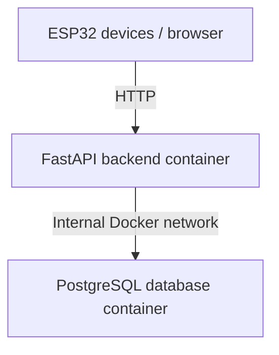
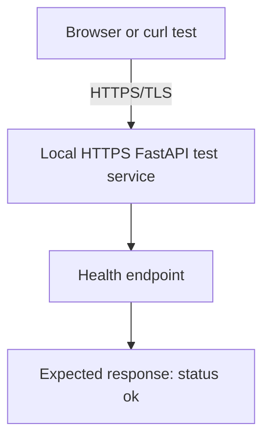

# Design Report — HTTPS/TLS Implementation Design for the City Sim Backend

| Document information | |
|---|---|
| Title | Design Report — Improving the City Sim Backend Deployment with Docker Containers and HTTPS/TLS |
| Author | Betül Aydin |
| Date | 3 June 2026 |
| Version | 2 |
| Classification | Internal |
| Mayor | Mats |
| Company | Amsterdam University of Applied Sciences |
| Learning outcome | Design |
| Sprint | Sprint 4 |


## Table of Contents

1. [Introduction](#1-introduction)  
2. [Design Question](#2-design-question-and-subquestions)  
3. [Design Requirements](#3-design-requirements)  
4. [Current Backend Situation](#4-current-backend-situation)  
5. [Proposed Security Design](#5-proposed-security-design)  
6. [HTTPSTLS Design](#6-implementation-design-for-the-realisation-phase)  
7. [Supporting Reliability Design Choices](#7-supporting-reliability-considerations)  
8. [Scope and Limitations](#8-scope-and-limitations)  
9. [Conclusion](#9-conclusion)  
10. [References](#10-references)


## 1. Introduction

This design report explains how HTTPS/TLS can be added to the existing City Sim backend to improve secure communication between clients and the backend. The report focuses on the design of HTTPS/TLS implementation, not on redesigning the full Docker environment.

The City Sim backend already runs with a FastAPI backend and PostgreSQL database. The Analysis report showed that unencrypted HTTP communication can create security risks, such as eavesdropping and Man-in-the-Middle attacks. Based on those findings, this Design report translates the security requirements into a practical HTTPS/TLS implementation design.

## 2. Design Question and Sub-Questions

This section defines the focus of the design. The main question is about the HTTPS/TLS implementation approach, while the sub-questions divide the design into security improvement, required components and testing.

### Main Question

How should HTTPS/TLS be implemented for the existing City Sim backend to improve secure communication without disrupting the current backend deployment?


### Sub-Questions

1. How can HTTPS/TLS improve communication security for the existing City Sim backend?
2. Which components are needed to test HTTPS/TLS locally?
3. How should the HTTPS/TLS design be tested during the Realisation phase?


## 3. Design Requirements

The requirements below are based on the risks identified in the Analysis report. The Analysis showed that secure communication, safe handling of secrets and reliable backend access are important for the City Sim backend. This Design report uses those findings to define practical requirements for the HTTPS/TLS implementation.

| ID | Requirement | Priority | Design response |
| --- | --- | --- | --- |
| R1 | Transport encryption | Must | Design an HTTPS/TLS setup for the backend so data can be sent over an encrypted connection. |
| R2 | Secret management | Must | Keep credentials and certificate-related values out of source code. |
| R3 | Safe test approach | Must | Test HTTPS/TLS locally without replacing or breaking the current HTTP backend. |
| R4 | Backend availability check | Should | Use the existing health endpoint to verify whether the backend responds correctly. |
| R5 | Future deployment compatibility | Should | Keep the design compatible with a future NGINX or reverse proxy setup. |
| R6 | Clear documentation | Should | Document the setup clearly so another student can understand and reproduce the test. |

## 4. Current Backend Situation

The current City Sim backend already has a working backend structure. The backend uses FastAPI for the API and PostgreSQL for data storage. These services run in a Docker-based environment. This existing setup provides a useful base for testing HTTPS/TLS, but Docker itself is not the main design focus of this document.

The current simplified communication flow is shown below:



This setup is functional, but the external communication still uses HTTP. HTTP does not encrypt data in transit. For a smart city system, this is a risk because sensor data, status information or future control commands could be intercepted or modified. The design therefore focuses on adding HTTPS/TLS to protect communication between clients and the backend.


## 5. Proposed Security Design

The proposed design is to test HTTPS/TLS locally first, without changing the shared Raspberry Pi deployment. This is safer because the shared backend is used by the team, ESP32 devices and dashboard. A local test allows HTTPS/TLS to be validated without disrupting the active project environment.

The target test flow is shown below:



For the local prototype, HTTPS/TLS will be tested directly with Uvicorn SSL options. This approach keeps the implementation small and focused, while still testing the most important design goal: checking whether the FastAPI backend can respond correctly through HTTPS (Uvicorn, z.d.).

The prototype will use a self-signed certificate, a private key and a separate HTTPS test service. A self-signed certificate is suitable for local testing, but it is not a final production certificate because it is not trusted by browsers or devices by default (Kirkland, 2026). By running the HTTPS test service separately, the existing HTTP backend does not need to be replaced during testing.

A reverse proxy such as NGINX could be considered for a later shared deployment, because it separates certificate handling from the FastAPI application (NGINX, 2026). However, this design focuses on the local HTTPS/TLS prototype for the Realisation phase. The reverse proxy option is only mentioned as a possible future improvement and is further evaluated in the Advise document.

## 6. Implementation Design for the Realisation Phase

This chapter describes the planned implementation design. It does not describe what was already done; that belongs in the Realisation document. The purpose of this chapter is to make clear which components must be prepared, what configuration changes are needed, and how the design should be tested.

### 6.1 Direct HTTPS/TLS Option

The local HTTPS/TLS prototype needs the following components:

| Component | Purpose |
| --- | --- |
| FastAPI backend | The backend application that will respond to requests. |
| Uvicorn SSL options | Used to start the FastAPI backend with a certificate and private key. |
| Self-signed certificate | Used to test HTTPS/TLS locally without an official certificate authority. |
| Private key | Required together with the certificate to enable HTTPS/TLS. |
| Separate HTTPS test service | Allows HTTPS/TLS to be tested without replacing the normal HTTP backend. |
| `.gitignore` rule | Prevents certificate and key files from being committed to Git. |
| Health endpoint | Used to test whether the backend responds correctly over HTTPS. |

### 6.2 Planned File and Configuration Changes
The Realisation phase should add a local certificate folder for the HTTPS/TLS test:

```text
certs/
  cert.pem
  key.pem
```

The private key and certificate files should not be committed to Git. Therefore, the following rule should be added to `.gitignore`:

```gitignore
certs/*.pem
```

A separate HTTPS test service should be added to the local Docker Compose test setup. This service should start the FastAPI backend with Uvicorn SSL options:

```bash
--ssl-keyfile /certs/key.pem
--ssl-certfile /certs/cert.pem
```

The HTTPS test service should use a separate port, for example:

```text
https://127.0.0.1:8443
```

The existing HTTP backend should remain available during the test. This is important because the HTTPS/TLS prototype should not replace or break the current backend flow.

### 6.3 Test Design

The HTTPS/TLS design should be tested with the existing health endpoint. The main test is:

```powershell
curl.exe -k https://127.0.0.1:8443/health
```

The expected response is:

```json
{"status":"ok"}
```

The -k option is needed because the prototype uses a self-signed certificate. The browser may also show a certificate warning. This is expected during local testing because the certificate is not signed by a trusted certificate authority (Kirkland, 2026).

The original HTTP backend should also be tested to confirm that it still works:

```powershell
curl.exe http://localhost:80/health
```

If both tests succeed, the Realisation phase can show that HTTPS/TLS was added as a safe local prototype and that the existing backend was not replaced or broken.

## 7. Supporting Reliability Considerations

The main focus of this design is HTTPS/TLS. However, reliability still matters because secure communication is only useful if the backend remains available and maintainable.

The existing health endpoint should be used to check whether the backend is reachable. Persistent storage should be verified so database data is not lost when containers are recreated. Restart behaviour should be checked or recommended so backend services can recover after simple failures or reboots.

Secrets should also be managed safely. Database passwords, API tokens, certificate files and private keys should not be hardcoded or committed to Git. Real values should be stored locally or in deployment-specific environment files, while safe templates such as `.env.example` can be shared in the repository.

These reliability points support the HTTPS/TLS design, but they are not the main implementation focus of this document.

## 8. Scope and Limitations

This design focuses on the HTTPS/TLS implementation approach for the existing City Sim backend. It does not redesign the full Docker deployment.

### In Scope

- designing a local HTTPS/TLS prototype;
- using a self-signed certificate for local testing;
- keeping the existing HTTP backend available during the test;
- defining the required certificate files and Uvicorn SSL options;
- testing the HTTPS endpoint with the health endpoint;
- documenting NGINX as the preferred future shared deployment approach.

### Out of Scope

- replacing the shared Raspberry Pi deployment directly;
- creating a production-ready certificate setup;
- fully configuring NGINX for the shared deployment;
- redesigning the Docker Compose structure from scratch;
- implementing Kubernetes, cloud fallback or a full monitoring stack.

## 9. Conclusion

This Design report focuses on how HTTPS/TLS can be implemented for the existing City Sim backend. The title and structure make clear that HTTPS/TLS is the main design focus, while Docker is only the existing deployment context.

The design proposes a local HTTPS/TLS prototype using a self-signed certificate, Uvicorn SSL options and a separate HTTPS test service. This allows encrypted communication to be tested without replacing or breaking the current HTTP backend.

The Realisation phase should therefore focus on creating the local certificate files, excluding private keys from Git, starting a separate HTTPS test service and testing the /health endpoint over HTTPS. If the test succeeds, the result can be used as evidence that HTTPS/TLS is technically feasible. For a future shared deployment, HTTPS/TLS should preferably be implemented through an NGINX reverse proxy.

## 10. References

[My Analyse report](Analyse.md)

Kirkland, W. (2026, 1 mei). The essential guide to SSL/TLS security & certificate automation (2026). Urllo. https://www.urllo.com/resources/learn/ssl-tls-security-guide

Pasemko, S. (2026, 1 mei). Redirect HTTP to HTTPS: complete setup guide. Urllo. https://www.urllo.com/resources/learn/redirect-http-to-https

NGINX. (2026, 4 mei). NGINX reverse proxy. NGINX Documentation. https://docs.nginx.com/nginx/admin-guide/web-server/reverse-proxy/

Uvicorn. (z.d.). Deployment - Uvicorn. https://uvicorn.dev/deployment/