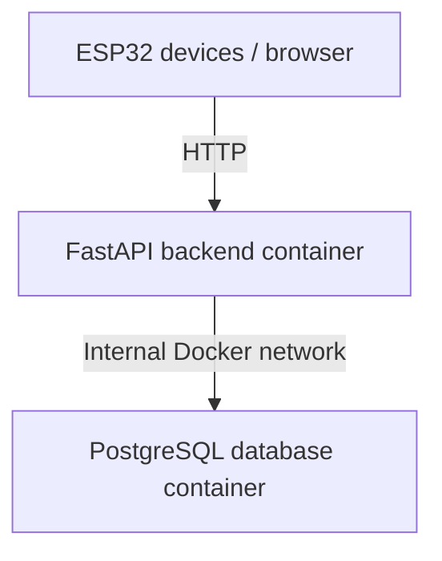
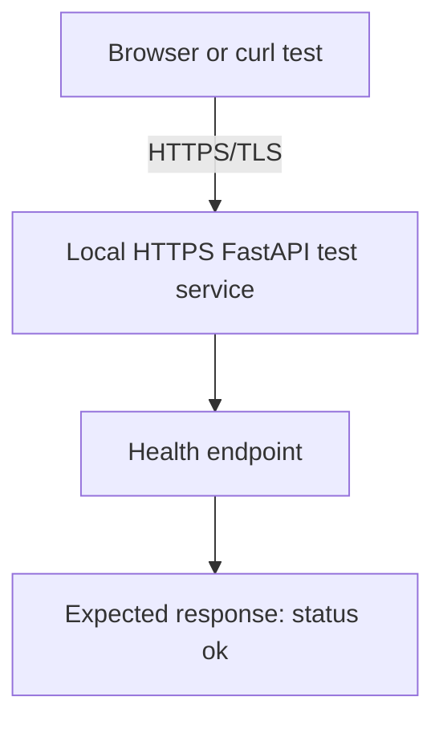

# Design Report — HTTPS/TLS Implementation Design for the City Sim Backend

| Document information | |
|---|---|
| Title | Design Report — Improving the City Sim Backend Deployment with Docker Containers and HTTPS/TLS |
| Author | Betül Aydin |
| Date | 3 June 2026 |
| Version | 2 |
| Classification | Internal |
| Mayor | Mats |
| Company | Amsterdam University of Applied Sciences |
| Learning outcome | Design |
| Sprint | Sprint 4 |

## Table of Contents

1. [Introduction](#1-introduction)  
2. [Design Question](#2-design-question-and-subquestions)  
3. [Design Requirements](#3-design-requirements)  
4. [Current Backend Situation](#4-current-backend-situation)  
5. [Proposed Security Design](#5-proposed-security-design)  
6. [HTTPSTLS Design](#6-implementation-design-for-the-realisation-phase)  
7. [Supporting Reliability Design Choices](#7-supporting-reliability-considerations)  
8. [Scope and Limitations](#8-scope-and-limitations)  
9. [Conclusion](#9-conclusion)  
10. [References](#10-references)

## 1. Introduction

This design report explains how HTTPS/TLS can be added to the existing City Sim backend to improve secure communication between clients and the backend. The report focuses on the design of HTTPS/TLS implementation, not on redesigning the full Docker environment.

The City Sim backend already runs with a FastAPI backend and PostgreSQL database. The Analysis report showed that unencrypted HTTP communication can create security risks, such as eavesdropping and Man-in-the-Middle attacks. Based on those findings, this Design report translates the security requirements into a practical HTTPS/TLS implementation design.

## 2. Design Question and Sub-Questions

This section defines the focus of the design. The main question is about the HTTPS/TLS implementation approach, while the sub-questions divide the design into security improvement, required components and testing.

### Main Question

How should HTTPS/TLS be implemented for the existing City Sim backend to improve secure communication without disrupting the current backend deployment?

### Sub-Questions

1. How can HTTPS/TLS improve communication security for the existing City Sim backend?
2. Which components are needed to test HTTPS/TLS locally?
3. How should the HTTPS/TLS design be tested during the Realisation phase?

## 3. Design Requirements

The requirements below are based on the risks identified in the Analysis report. The Analysis showed that secure communication, safe handling of secrets and reliable backend access are important for the City Sim backend. This Design report uses those findings to define practical requirements for the HTTPS/TLS implementation.

| ID | Requirement | Priority | Design response |
| --- | --- | --- | --- |
| R1 | Transport encryption | Must | Design an HTTPS/TLS setup for the backend so data can be sent over an encrypted connection. |
| R2 | Secret management | Must | Keep credentials and certificate-related values out of source code. |
| R3 | Safe test approach | Must | Test HTTPS/TLS locally without replacing or breaking the current HTTP backend. |
| R4 | Backend availability check | Should | Use the existing health endpoint to verify whether the backend responds correctly. |
| R5 | Future deployment compatibility | Should | Keep the design compatible with a future NGINX or reverse proxy setup. |
| R6 | Clear documentation | Should | Document the setup clearly so another student can understand and reproduce the test. |

## 4. Current Backend Situation

The current City Sim backend already has a working backend structure. The backend uses FastAPI for the API and PostgreSQL for data storage. These services run in a Docker-based environment. This existing setup provides a useful base for testing HTTPS/TLS, but Docker itself is not the main design focus of this document.

The current simplified communication flow is shown below:

This setup is functional, but the external communication still uses HTTP. HTTP does not encrypt data in transit. For a smart city system, this is a risk because sensor data, status information or future control commands could be intercepted or modified. The design therefore focuses on adding HTTPS/TLS to protect communication between clients and the backend.

## 5. Proposed Security Design

The proposed design is to test HTTPS/TLS locally first, without changing the shared Raspberry Pi deployment. This is safer because the shared backend is used by the team, ESP32 devices and dashboard. A local test allows HTTPS/TLS to be validated without disrupting the active project environment.

The target test flow is shown below:

For the local prototype, HTTPS/TLS will be tested directly with Uvicorn SSL options. This approach keeps the implementation small and focused, while still testing the most important design goal: checking whether the FastAPI backend can respond correctly through HTTPS (Uvicorn, z.d.).

The prototype will use a self-signed certificate, a private key and a separate HTTPS test service. A self-signed certificate is suitable for local testing, but it is not a final production certificate because it is not trusted by browsers or devices by default (Kirkland, 2026). By running the HTTPS test service separately, the existing HTTP backend does not need to be replaced during testing.

A reverse proxy such as NGINX could be considered for a later shared deployment, because it separates certificate handling from the FastAPI application (NGINX, 2026). However, this design focuses on the local HTTPS/TLS prototype for the Realisation phase. The reverse proxy option is only mentioned as a possible future improvement and is further evaluated in the Advise document.
