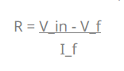
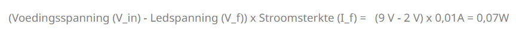
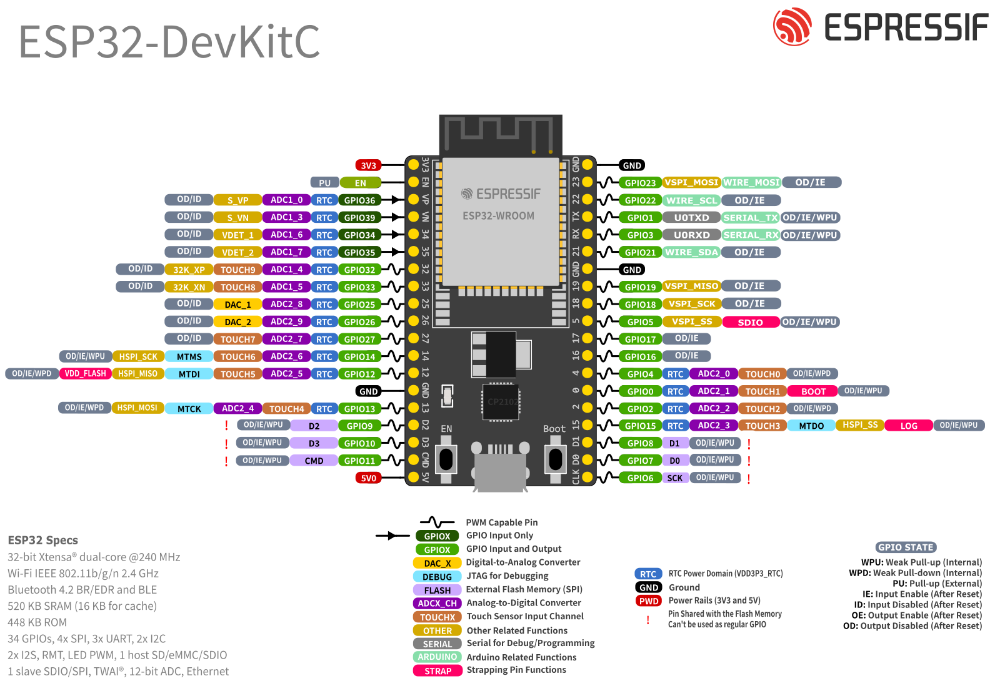
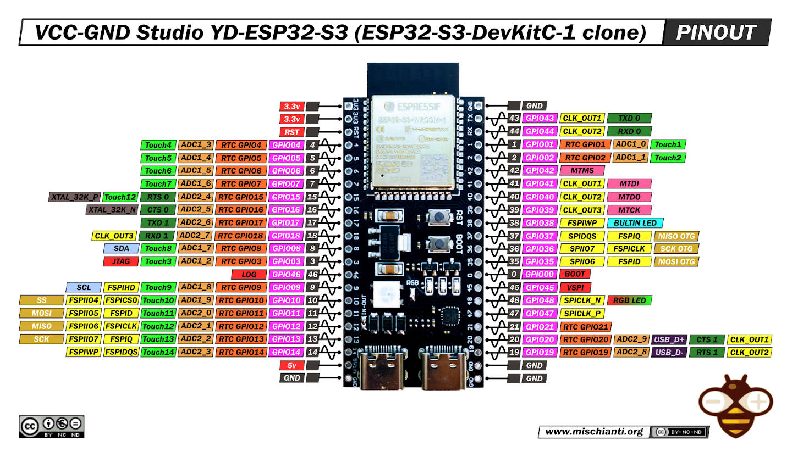
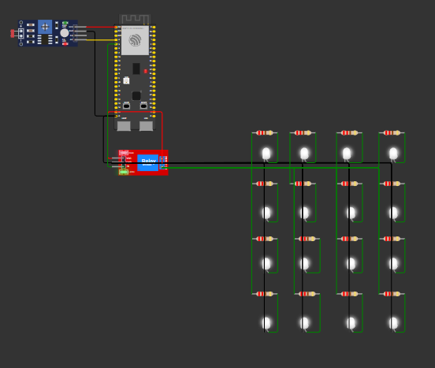
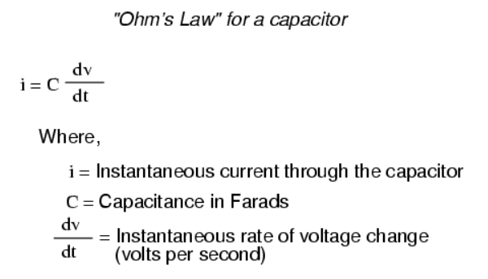

# Smart cities learning group goal: Analysis

- Name: Gurpreet Singh
- Date: 11-02-2026

## Table of Contents
- [1. Introduction](#1-introduction)
- [2. Methodology](#2-methodology)
- [3. Working method](#3-working-method)
- [4. Main research question and subquestions](#4-main-research-question-and-subquestions)
- [5 Tools used](#5-tools-used)
- [6. Smart streetlight context and project goal](#6-smart-streetlight-context-and-project-goal)
  - [6.1 Smart streetlight](#61-smart-streetlight)
  - [6.2 Project goal: Automatic smart streetlight](#62-project-goal-automatic-smart-streetlight)
  - [6.3 Functional requirements](#63-functional-requirements)
  - [6.4 Non functional requirements](#64-non-functional-requirements)
  - [6.5 Subconclusion](#65-subconclusion)
- [7. Needed components and their function](#7-needed-components-and-their-function)
  - [7.1 Orientation phase](#71-orientation-phase)
  - [7.2 LDR module](#72-ldr-module)
  - [7.3 LED and resistor](#73-led-and-resistor)
  - [7.4 Relay module](#74-relay-module)
  - [7.5 Required components for the prototype](#75-required-components-for-the-prototype)
  - [7.6 Subconclusion](#76-subconclusion)
- [8. Suitable GPIO connections for the ESP32-S3](#8-suitable-gpio-connections-for-the-esp32-s3)
  - [8.1 Difference between tutorial examples and the ESP32-S3 used in this project](#81-difference-between-tutorial-examples-and-the-esp32-s3-used-in-this-project)
  - [8.2 Choosing a GPIO for the LDR module](#82-choosing-a-gpio-for-the-ldr-module)
  - [8.3 Choosing a GPIO for the relay module](#83-choosing-a-gpio-for-the-relay-module)
  - [8.4 Subconclusion](#84-subconclusion)
- [9. Estimated total current consumption of the prototype](#9-estimated-total-current-consumption-of-the-prototype)
  - [9.1 Importance of power consumption analysis](#91-importance-of-power-consumption-analysis)
  - [9.2 LEDs](#92-leds)
  - [9.3 Relay module](#93-relay-module)
  - [9.4 LDR module](#94-ldr-module)
  - [9.5 ESP32-S3](#95-esp32-s3)
  - [9.6 Total current estimate (without Wi-Fi and with 20 LEDs)](#96-total-current-estimate-without-wi-fi-and-with-20-leds)
  - [9.7 Subconclusion](#97-subconclusion)
- [10. Power Supply and Protection Design](#10-power-supply-and-protection-design)
  - [10.1 First idea: separate 5V battery](#101-first-idea-separate-5v-battery)
  - [10.2 Feedback from Gerald](#102-feedback-from-gerald)
  - [10.3 Breadboard power supply](#103-breadboard-power-supply)
  - [10.4 External 5V 1A adapter](#104-external-5v-1a-adapter)
  - [10.5 Fuse for overcurrent protection](#105-fuse-for-overcurrent-protection)
  - [10.6 Diode for reverse polarity protection](#106-diode-for-reverse-polarity-protection)
  - [10.7 Capacitor for voltage stability](#107-capacitor-for-voltage-stability)
  - [10.8 Final power supply choice](#108-final-power-supply-choice)
  - [10.9 Subconclusion](#109-subconclusion)
- [11. Final conclusion](#11-final-conclusion)
- [12. Recommendations](#12-recommendations)
- [13. Sources](#13-sources)

## 1. Introduction

This analysis is part of the Smart Cities Learning Group project. In Sprint 1, the project focuses on developing a prototype of an automatic smart streetlight. The purpose of this prototype is to demonstrate a simple smart city application in which lighting responds automatically to changes in the environment based on the ambient light level.

At the start of the project, it was not yet clear which components were needed, which GPIO connections on the ESP32-S3 were suitable, and how the power supply should be designed in a safe, reliable, and scalable way. At first sight, building an automatic streetlight seemed relatively simple, but during the orientation it became clear that several technical choices had to be made. It was necessary to investigate how the LDR module works, why a relay module is needed, how much current the full prototype is expected to consume, and which power supply configuration is the most appropriate.

Another important point was that the tutorial examples that were reviewed could not be copied directly, because they often used a different ESP32 board than the ESP32-S3 available for this project. In addition, the design had to be not only functional for Sprint 1, but also electrically correct, reliable, reproducible between team members, and suitable for future expansion.

The purpose of this analysis is therefore to determine which components, GPIO connections, and power supply configuration are most suitable for building a safe, reliable, and scalable automatic smart streetlight prototype with the ESP32-S3. The outcome of this analysis provides the foundation for the design and implementation of the Sprint 1 prototype.

## 2. Methodology

For this analysis, several methods were used:

- Orientation on existing examples: tutorial videos and example projects were reviewed to identify which components and circuit logic are commonly used in automatic smart streetlight systems;
- Source and documentation analysis: datasheets, technical documentation, and other reliable sources were studied for the ESP32-S3, LDR modules, relay modules, LEDs, resistors, and power supply components;
- Technical analysis: the GPIO options, current consumption, and possible power supply solutions were analysed to determine which technical choices are most suitable for the prototype;
- Calculations: electrical calculations were made for LED current, total estimated current consumption, and the required safety margin in the power design;
- Feedback moments: feedback from Gerald on the schematic and power design was used as practical input to improve and validate the design choices.

This combination of methods was chosen because the prototype must not only be theoretically correct, but also practically workable within the Smart Cities Learning Group project. The analysis therefore focuses on both technical correctness and practical applicability in a learning environment.

## 3. Working method

The analysis was carried out step by step. First, the concept of a smart streetlight and the specific goal of the Sprint 1 prototype were defined. After that, the functional and non-functional requirements were established in order to clarify what the prototype must achieve.

Next, the required com in the circuit was explained. After that, the GPIO options of the ESP32-S3 were examined, because the GPIO connections used in tutorial examples could not be directly applied to the ESP32-S3 board used in this project.

Once the component and GPIO analysis  of the prototype was estimated. For this, the current consumption of the LEDs, relay module, LDR module, and ESP32-S3 was analysed separately and then combined into one total estimate.

Finally, different power supply options were compared, including a separate 5 V battery, a breadboard power supply, and an external 5 V 1 A adapter with additional protection and stability components such as a fuse, diode, and capacitor.

By following this working method, the analysis was built up from orientation to technical evaluation and finally to a justified design choice for the Sprint 1 prototype.

## 4. Main research question and subquestions

The main research question of this analysis is:

Which components, GPIO connections, and power supply configuration are most suitable for building a safe, reliable, and scalable automatic smart streetlight prototype with the ESP32-S3 for Sprint 1?

To answer this main research question, the following subquestions were formulated:

1. What is a smart streetlight, and what is the goal of the automatic smart streetlight prototype in this project?
2. Which functional and non-functional requirements must the prototype meet?
3. Which components are needed for the prototype, and what is the function of each component?
4. Which GPIO connections are suitable for connecting the LDR module and relay module to the ESP32-S3?
5. What is the estimated total current consumption of the prototype?
6. Which power supply configuration is most suitable for the prototype, including the use of an external 5 V 1 A adapter and supporting protection or stability components such as a fuse, diode, and capacitor?
7. How does the chosen design support safety, reproducibility, and scalability for use in later sprints or on multiple team tiles?

## 5 Tools used

For this analysis, the following tools were used:

- all sources included in the reference list;
- Scribbr for formatting references correctly;
- ChatGPT for support with language use, phrasing, spelling, and grammar.

## 6. Smart streetlight context and project goal

Before analysing the technical choices of the prototype, it is first important to explain the context of the project. This chapter describes what a smart streetlight is, what the goal of this Sprint 1 prototype is, and which functional and non-functional requirements the prototype must meet. These points form the basis for the technical choices made in the next chapters.

### 6.1 Smart streetlight

A smart streetlight is a street lamp that does more than only provide light. It can respond to its surroundings by using sensors and, in some cases, network connectivity. Instead of always being switched on according to a fixed schedule, a smart streetlight can automatically adjust its behavior based on conditions such as daylight, traffic, or the presence of pedestrians. This helps reduce unnecessary energy consumption because the lamp does not always need to operate at full intensity [(D66jeroen, 2026)](https://d66.nl/goes/nieuws/3-slimme-straatverlichting-licht-op-maat/).

Smart streetlights can also be part of a broader smart city system. In more advanced applications, they may include remote monitoring, communication modules, or additional functions such as measuring air quality, monitoring noise, or providing Wi-Fi. This turns the streetlight into a multifunctional part of the city infrastructure [(AAA ECO B.V., 2024)](https://aaaeco.nl/slimme-led-lantaarnpalen-en-5g-innovatie-of-inbreuk-op-privacy/). However, for this Sprint 1 prototype, the focus is limited to a basic automatic switching function based on ambient light.

### 6.2 Project goal: Automatic smart streetlight

In this Smart Cities Learning Group project, the goal is to develop a prototype of an automatic smart streetlight that switches on when it becomes dark and switches off again when it becomes light. The prototype is based on an ESP32-S3 and is intended as a simple Sprint 1 demonstration of automatic light-based switching.

Because the prototype is developed within an introductory Embedded Systems and Robotics context, the first version is intentionally kept simple and understandable. At the start of the orientation phase, a search was carried out for “ESP32-S3 smart streetlight” because visual examples support the understanding of a new topic. During the orientation phase, the following YouTube videos were reviewed:

- [(sm Tronics, 2025)](https://www.youtube.com/watch?v=V28G_EmqRHg)
- [(Arduino Titan, 2024)](https://www.youtube.com/watch?v=mHjWOMrVsTE&t=1008s)
- [(Arduino Titan, 2024a)](https://www.youtube.com/watch?v=YhuIzQ6_liw&t=815s)
- [(hash include electronics, 2021)](https://www.youtube.com/watch?v=YNVfPrFtTno)

From these videos, it was observed that an LDR module was used in all examples, while some examples also used a relay module together with LEDs and jumper wires. This indicated that the role of these components and the logic behind their use first had to be understood before design choices for the prototype could be made.

The purpose of the prototype is not to reproduce a full commercial smart streetlight system, but to create a clear, working, and reproducible prototype for Sprint 1 that can also support further development in later sprints or on multiple team tiles.

### 6.3 Functional requirements

The prototype must meet the following functional requirements:

1. Automatic switching: The streetlight must switch on when the measured light value falls below a defined threshold during darkness and switch off again when the light value rises above that threshold.
2. Adjustable threshold: The light threshold must be adjustable, for example through a variable in the code, so that the switching moment can be tuned.
3. Testable behavior: The system must respond clearly to differences between light and dark and should not show unstable switching or flickering during normal testing.

### 6.4 Non functional requirements

The prototype must also meet the following non-functional requirements:

1. Electrical correctness: Each LED must have its own resistor to reduce the risk of overheating or damage.
2. Reliability: The system must switch on and off without unwanted resets or unstable behavior.
3. Beginner friendliness: The components, wiring, and code should remain simple enough to understand and reproduce as a beginner.
4. Clarity and reproducibility: The wiring must be logical and consistent so that the same structure can be used on multiple team tiles, making troubleshooting and future expansion easier.
5. Scalability: The design should support later improvement or extension in future sprints without requiring a completely different setup.

### 6.5 Subconclusion

A smart streetlight is a streetlight that can respond to its surroundings instead of only working in a fixed way. In this project, the goal is to build a simplified automatic smart streetlight prototype that switches on and off based on ambient light. The prototype must therefore combine automatic behavior with practical design requirements such as electrical correctness, reliability, simplicity, reproducibility, and scalability. These requirements define the basis for the component choices and design decisions in the following chapters.

## 7. Needed components and their function

Before building the prototype, it is first necessary to determine which components are required and what role each component has in the system. This chapter describes the results of the orientation phase and explains the function of the main components used in the automatic smart streetlight prototype. The focus is on the LDR module, the LEDs with resistors, and the relay module, because these components form the basis of the input, output, and switching logic of the system.

### 7.1 Orientation phase

During the orientation phase, several examples of smart streetlight projects were explored by searching for “ESP32-S3 smart streetlight” and related terms. These examples showed that certain components appeared repeatedly, especially an LDR module, LEDs, jumper wires, and in some cases a relay module. In all reviewed examples, an LDR module was used, while some examples also included a relay module together with LEDs and jumper wires. This indicated that these components form the basis of a simple automatic smart streetlight prototype.

Because the prototype is developed in an introductory learning context, the first step was not to immediately copy an existing example, but to understand the role of the main components. For that reason, the analysis first focused on the function of the LDR module, the LED with resistor, and the relay module before moving on to design choices.

### 7.2 LDR module

The LDR module is used to detect the ambient light level. LDR stands for Light Dependent Resistor. According to [(Arduino - LDR Module | Arduino Getting Started, n.d.-b)](https://arduinogetstarted.com/tutorials/arduino-ldr-module#google_vignette), the LDR sensor module has four pins: 

- VCC: positive power supply voltage
- GND: ground connection
- DO: digital output, based on an adjustable threshold
- AO: analog output, which changes according to the measured light level

For this prototype, the analog output is the most important, because the system must measure the light level and use that value to decide whether the streetlight should switch on or off. This makes the LDR module the main input component of the prototype.

### 7.3 LED and resistor

The LED is used as the light output of the prototype. LED stands for Light Emitting Diode. According to [(Arduino - LED - Fade | Arduino Getting Started, n.d.-b)](https://arduinogetstarted.com/tutorials/arduino-led-fade), an LED has two pins:

- Cathode (-): connected to GND
- Anode (+): connected to the powered side of the circuit

A resistor must be used together with each LED. According to [(Gotron | LED’s Beschermen: Zo Bereken Je De Juiste Serieweerstand! | Elektronicaspecialist, n.d.-b)](https://www.gotron.be/leds), an LED does not limit current by itself. If too much current flows through it, the LED can overheat or become permanently damaged. For that reason, a resistor is placed in series with the LED to limit the current.

Important electrical values for this are:

- Forward voltage (V_f): the voltage needed by the LED
- Forward current (I_f): the operating current of the LED
- Supply voltage (V_in): the voltage provided by the source

These values can be used with Ohm’s law to calculate a suitable resistor value.

  
*Formula for calculating LED series resistance. Source: [(Gotron | LED’s Beschermen: Zo Bereken Je De Juiste Serieweerstand! | Elektronicaspecialist, n.d.-b)](https://www.gotron.be/leds), Viewed on: 13 February 2026.*

  
*Parallel LED wiring with one resistor per LED. Source: [(Gotron | LED’s Beschermen: Zo Bereken Je De Juiste Serieweerstand! | Elektronicaspecialist, n.d.-b)](https://www.gotron.be/leds), Viewed on: 13 February 2026.*

To estimate resistor power dissipation, the following formula can be used:

  
*Formula for resistor power calculation. Source: [(Gotron | LED’s Beschermen: Zo Bereken Je De Juiste Serieweerstand! | Elektronicaspecialist, n.d.-b)](https://www.gotron.be/leds), Viewed on: 13 February 2026.*

If multiple LEDs are connected in series, another formula is needed:

  
*Formula for resistor calculation with LEDs in series. Source: [(Gotron | LED’s Beschermen: Zo Bereken Je De Juiste Serieweerstand! | Elektronicaspecialist, n.d.-b)](https://www.gotron.be/leds), Viewed on: 13 February 2026.*

An important design consideration is that multiple LEDs should not share one resistor in parallel, because this can lead to uneven current distribution and brightness differences. Therefore, the prototype uses one resistor per LED.

### 7.4 Relay module

The relay module functions as an electrically controlled switch. According to [(Instructables, 2025)](https://www.instructables.com/5V-4-Channel-Relay-Module-With-Arduino/), a relay allows a microcontroller such as the ESP32 to switch another circuit on or off by using a digital control signal. 

The relay module has two groups of connections:

Control side

- VCC: power supply
- GND: ground
- IN: control signal from the ESP32

Switching side

- COM: common terminal
- NO: normally open terminal
- NC: normally closed terminal

In this prototype, the relay module is used to switch the lighting circuit. This is necessary because the total LED load is higher than what should be powered directly from a single GPIO pin. The relay therefore acts as the switching component between the ESP32-S3 control logic and the LED circuit.

### 7.5 Required components for the prototype

Based on the orientation and component analysis, the following components are required for the prototype:

- 1x ESP32-S3 microcontroller
- 1x LDR module
- 1x relay module
- 20x white LEDs
- 20x 220 ohm resistors
- jumper wires (M2F and M2M)
- breadboard
- power supply and protection components for the chosen setup

These components together provide the basic input, control, switching, and output functions needed for the automatic smart streetlight prototype.

### 7.6 Subconclusion

The prototype requires a limited number of core components. The LDR module is needed to measure ambient light, the LEDs and resistors are needed to create the lighting output safely, and the relay module is needed to switch the LED circuit by means of the ESP32-S3. Together, these components form the functional basis of the Sprint 1 automatic smart streetlight prototype.

## 8. Suitable GPIO connections for the ESP32-S3

After determining which components are needed for the prototype, the next step is to identify which GPIO connections on the ESP32-S3 are suitable for those components. This chapter explains why the GPIO connections shown in tutorial examples could not be copied directly and how appropriate GPIO pins were selected for the LDR module and the relay module. The focus is on choosing connections that are technically correct and suitable for the ESP32-S3 used in this project.

### 8.1 Difference between tutorial examples and the ESP32-S3 used in this project

During the orientation phase, it became clear that the tutorial examples could not be copied directly, because they used a different ESP32 microcontroller than the ESP32-S3 used in this project. For example, in one of the reviewed tutorials, the analog output of the LDR module was connected to GPIO34 and the relay input to GPIO12. These pins are not available in the same way on the ESP32-S3 microcontroller used for this prototype.

For that reason, the GPIO selection had to be checked against the actual microcontroller documentation instead of simply following tutorial examples. To do this, the official Espressif documentation for the ESP32 and ESP32-S3 microcontrollers was reviewed, together with the available documentation of the school-provided clone microcontroller.

  
*ESP32 DevKitC pin layout. Source: [(ESP32-DevKitC V4 - ESP32 -  — Esp-dev-kits Latest Documentation, z.d.)](https://docs.espressif.com/projects/esp-dev-kits/en/latest/esp32/esp32-devkitc/user_guide.html#what-you-need). Viewed on: 11 February 2026.*

  
*ESP32-S3-DevKitC-1 pin layout. Source: [(ESP32-S3-DevKitC-1 v1.1 - ESP32-S3 -  — Esp-dev-kits Latest Documentation, z.d.)](https://docs.espressif.com/projects/esp-dev-kits/en/latest/esp32s3/esp32-s3-devkitc-1/user_guide_v1.1.html#getting-started). Viewed on: 10 February 2026.*

  
*ESP32-S3 clone microcontroller reference. Source: [Rtek (n.d.)](https://github.com/rtek1000/YD-ESP32-23?tab=readme-ov-file). Viewed on: 17 February 2026.*

This comparison showed that GPIO selection for the prototype must be based on the actual ESP32-S3 microctroller layout and not on the GPIO numbering used in other ESP32 tutorial examples.

### 8.2 Choosing a GPIO for the LDR module

The LDR module provides both a digital output and an analog output. For this prototype, the analog output is the most relevant, because the system must read the measured light level and decide whether the streetlight should switch on or off based on that value.

Because the AO pin provides an analog voltage, it must be connected to a GPIO pin that supports analog-to-digital conversion (ADC). ADC stands for Analog-to-Digital Converter. This means that the analog voltage from the LDR module can be converted into a digital value that the ESP32-S3 can read and process. A similar explanation is also given in the source by Instructables, where the analog output of the LDR circuit is connected to an analog input pin so that the microcontroller can convert the voltage into a readable digital value [(Instructables, 2018)](https://www.instructables.com/Using-an-LDR-Sensor-With-Arduino/).

In the ESP32-S3 documentation, ADC-related channels are indicated accordingly. This means that the selected pin must be suitable for analog input.

For this prototype, GPIO4 was selected for the AO pin of the LDR module. This allows the ESP32-S3 to read the light value as an analog signal and use it in the control logic of the smart streetlight.

### 8.3 Choosing a GPIO for the relay module

The relay module requires a digital control signal through its IN pin. Unlike the AO pin of the LDR module, this signal does not require analog input functionality. Instead, the relay input must be connected to a GPIO pin that can be configured as a digital output.

As explained by [(Santos & Santos, 2020)](https://randomnerdtutorials.com/esp32-digital-inputs-outputs-arduino/#:~:text=ESP32%20Control%20Digital%20Outputs,GPIOs:%20ESP32%20GPIO%20Reference%20Guide), a GPIO used for digital output must first be configured as an output with `pinMode(GPIO, OUTPUT)`. After that, the state of the pin can be controlled with `digitalWrite(GPIO, HIGH)` or `digitalWrite(GPIO, LOW)`. This makes such a GPIO suitable for sending the switching signal required by the relay module.

Because GPIO4 was already selected for the LDR module, GPIO5 was selected for the relay module input. This allows the ESP32-S3 to send a HIGH or LOW control signal to switch the relay on or off.

The remaining connections of both modules follow their normal power and ground wiring. The most important difference compared with the tutorial examples is therefore not the logic of the circuit itself, but the GPIO selection required by the ESP32-S3 microcontroller used in this project.

### 8.4 Subconclusion

The GPIO connections used in tutorial examples could not be copied directly, because the ESP32-S3 used in this project has a different microcontroller layout and different available pins. The LDR module requires an ADC-capable GPIO because its AO pin provides an analog signal, while the relay module requires a GPIO that can function as a digital output. Based on the ESP32-S3 documentation, GPIO4 is a suitable choice for the LDR module and GPIO5 is a suitable choice for the relay module.

## 9. Estimated total current consumption of the prototype

After determining the required components and the suitable GPIO connections, the next step is to estimate the total current consumption of the prototype. This chapter analyses how much current is expected to be used by the LEDs, relay module, LDR module, and ESP32-S3. The purpose of this analysis is to determine whether the chosen power supply is sufficient and to support a safe, reliable, and scalable design.

### 9.1 Importance of power consumption analysis

During feedback on the schematic, it was pointed out that selecting the right components is not enough by itself. It is also necessary to estimate the total current consumption of the prototype. This is important because the power supply must be able to support all components at the same time without overloading the system.

In this prototype, the total current consumption must be estimated for the complete Sprint 1 setup. The system uses 20 white LEDs, one relay module, one LDR module, and one ESP32-S3. Because all of these components draw current, the total load must be analysed before choosing a suitable power supply.

  
*Wokwi schematic of the smart streetlight prototype. Source: created by me.*

The importance of this analysis is also related to reliability and safety. If the current demand is underestimated, the selected power supply may become insufficient, which can lead to unstable behaviour, voltage drops, or resets of the ESP32-S3.

This is also relevant when distinguishing between the total available microcontroller's current and the current that can be supplied by a single GPIO pin. According to the [(Hardware Overview - SparkFun Thing Plus - ESP32-S3, z.d.)](https://docs.sparkfun.com/SparkFun_Thing_Plus_ESP32-S3/hardware_overview/#esp32-s3-module) documentation states that the 5V USB input is regulated down to 3.3V with a maximum current of 500 mA at 3.3V. This value relates to the microcontroller's power path as a whole, not to one GPIO pin. In addition, the Espressif datasheet states that, for the VDD3P3_CPU and VDD3P3_RTC power domains, the current sourced per pin can decrease from around 40 mA to around 29 mA as the number of current-source pins increases [(ESP32 Datasheet, z.d.)](https://documentation.espressif.com/esp32_datasheet_en.html). This shows that the total supply current of the microcontroller should not be confused with the output capability of a single GPIO pin.

For that reason, the power consumption of each main component is analysed separately below.

### 9.2 LEDs

The LEDs form the largest part of the expected current consumption. According to [(pro-SIGNAL, 2022)](https://www.farnell.com/datasheets/3811080.pdf), a 5 mm white LED typically has a forward voltage of 3.0 V to 3.4 V at a forward current of 20 mA.

If a 5 V supply is used, the resistor required for a current of 20 mA can be estimated as follows:

```text
5V - 3V = 2V
2V / 0.02A = 100 ohm
```

or:

```text
5V - 3.4V = 1.6V
1.6V / 0.02A = 80 ohm
```

This means that, with a 5 V supply, a resistor between 80 ohm and 100 ohm would be required for approximately 20 mA per LED. However, in this prototype, 220 ohm resistors are used because those are the resistors available in the school kit. This means that the current per LED is lower than 20 mA.

The current per LED with a 220 ohm resistor can be estimated as follows:

```text
5V - 3V = 2V
2V / 220 ohm = 0.009090909 A
0.009090909 A × 1000 = 9.09 mA
9.09 mA × 20 LEDs = 181.82 mA
```

or 

```text
5V - 3.4V = 1.6V
1.6V / 220 ohm = 0.007272727 A
0.007272727 A × 1000 = 7.27 mA
7.27 mA × 20 LEDs = 145.45 mA
```

Based on these calculations, the total current consumption of 20 white LEDs is estimated at approximately 145 mA to 182 mA.

### 9.3 Relay module

The relay module also contributes to the total current consumption. According to Components101 (n.d.), a 5 V single-channel relay module has a quiescent current of approximately 2 mA and a current of approximately 70 mA when the relay is active.

For the total power calculation, the active state is the most relevant, because this represents the higher load. A practical estimate for the relay module is therefore 70 mA To allow for variation between modules and a slightly more conservative estimate in the final total calculation, 80 mA can be used as a practical value, while 100 mA can be used as a higher estimate.

### 9.4 LDR module

According to [(Electronics, 2024)](https://www.phippselectronics.com/using-the-ldr-lm393-module-with-arduino/?__cf_chl_rt_tk=dj6yxwlYC_vHO7b1B5tYXHgOrSZuZwOOH_JMTnSM0UE-1771587936-1.0.1.1-2U_8fQk.f_ykkRFMf7Qpda17K8M.JYaOFH9WYIZYch8), the LM393-based LDR module used in this type of circuit consumes approximately 15 mA. Compared with the LEDs and relay module, this is a relatively small part of the total current consumption, but it still needs to be included in the total estimate.

### 9.5 ESP32-S3

The ESP32-S3 also contributes to the total current consumption of the prototype, and its current draw depends on the operating mode, clock frequency, and processing activity.

In the current Sprint 1 prototype, Wi-Fi and Bluetooth are not used. For that reason, the estimate is based on the values given in the [(ESP32-S3 Datasheet, n.d.)](https://documentation.espressif.com/esp32-s3_datasheet_en.pdf) for modem-sleep mode rather than the active Wi-Fi or Bluetooth modes.

According to the datasheet, current consumption in modem-sleep mode depends on the CPU frequency and workload. At 40 MHz, the listed values range from 13.2 mA to 28.8 mA, depending on whether the chip is idle or actively processing. At 80 MHz, the listed values range from 22.0 mA to 56.3 mA, again depending on the amount of processing activity and whether peripheral clocks are enabled.

Because this prototype continuously reads the light sensor and controls the relay logic, it is not realistic to assume the lowest idle value. At the same time, the Sprint 1 prototype does not perform heavy processing. For that reason, a practical estimate of 40 mA is used for the ESP32-S3 in the total current calculation. To include some margin, 50 mA is used as a higher estimate.

If Wi-Fi is enabled in later sprints, the current consumption would increase significantly. The datasheet shows peak current values of approximately 88 mA to 91 mA in Wi-Fi receive mode and 283 mA to 340 mA in Wi-Fi transmit mode, depending on the transmission mode.

### 9.6 Total current estimate (without Wi-Fi and with 20 LEDs)

The total current consumption of the prototype can now be estimated by combining the expected current of the LEDs, relay module, LDR module, and ESP32-S3.

Lower estimate:

- LEDs: 145 mA
- Relay module: 80 mA
- LDR module: 15 mA
- ESP32-S3: 40 mA

Total:
```text
145 + 80 + 15 + 40 = 280 mA
```
Higher estimate:

- LEDs: 182 mA
- Relay module: 100 mA
- LDR module: 15 mA
- ESP32-S3: 50 mA

Total:
```text
182 + 100 + 15 + 50 = 347 mA
```

Based on these calculations, the total current consumption of the Sprint 1 prototype is estimated at approximately 280 mA to 347 mA.

This estimate is based on the configuration without Wi-Fi and with 20 white LEDs. If Wi-Fi is enabled in later sprints, the total current consumption is expected to increase significantly. The same applies if additional modules are added.

### 9.7 Subconclusion

The estimated total current consumption of the Sprint 1 prototype is approximately 280 mA to 347 mA without Wi-Fi and with 20 white LEDs. The LEDs form the largest part of the total load, followed by the relay module. The ESP32-S3 also contributes a relevant share of the total current consumption, while the LDR module contributes the smallest amount. This shows that the total current demand must be considered carefully when choosing the power supply, especially if the prototype is extended in later sprints.

## 10. Power Supply and Protection Design

After estimating the total current consumption of the prototype, the next step is to determine which power supply configuration is the most suitable. This chapter compares different power supply options and analyses which protection and stability components are needed to make the prototype safe, reliable, and scalable. The focus is not only on making the current Sprint 1 setup work, but also on choosing a power design that remains useful for further development in later sprints.

### 10.1 First idea: separate 5V battery

In the first version of the design, the idea was to power the LED circuit with a separate 5 V battery.

  
*First schematic design in which the LEDs were powered by a separate 5 V battery. Source: created by me.*

At first, this seemed like a simple solution because it would provide the LEDs with their own power source. However, after further reflection and feedback, this option appeared less suitable for the Sprint 1 prototype. A separate battery adds extra wiring, makes the prototype less consistent between team members, and increases the risk of wiring mistakes.

For these reasons, the separate 5 V battery was treated as an initial idea rather than the final design choice.

### 10.2 Feedback from Gerald

During feedback on the schematic, Gerald advised against using a separate battery and recommended using the breadboard power supply provided by school instead.

This feedback was important because the prototype is developed in a beginner learning context, where not only functionality matters, but also simplicity, safety, and reproducibility. According to this feedback, a breadboard power supply is easier to integrate into a prototype setup because it provides a stable output directly to the breadboard rails and reduces unnecessary wiring complexity.

The feedback therefore shifted the analysis from a separate battery-based design towards a more power supply solution.

### 10.3 Breadboard power supply

After receiving this feedback, the specifications of the breadboard power supply were reviewed.

  
*Breadboard power supply specifications. Source: [Aliexpress](https://nl.aliexpress.com/item/1005010757622942.html?spm=a2g0o.detail.pcDetailTopMoreOtherSeller.1.44c9sXISsXISSR&gps-id=pcDetailTopMoreOtherSeller&scm=1007.40050.354490.0&scm_id=1007.40050.354490.0&scm-url=1007.40050.354490.0&pvid=7c34944d-f62a-46aa-a185-346484ad79d4&_t=gps-id:pcDetailTopMoreOtherSeller,scm-url:1007.40050.354490.0,pvid:7c34944d-f62a-46aa-a185-346484ad79d4,tpp_buckets:668%232846%238111%231996&pdp_ext_f=%7B%22order%22%3A%228%22%2C%22eval%22%3A%221%22%2C%22sceneId%22%3A%2230050%22%2C%22fromPage%22%3A%22recommend%22%7D&pdp_npi=6%40dis%21EUR%211.03%211.03%21%21%217.97%217.97%21%40211b430817733112662523588e2011%2112000053411876826%21rec%21NL%217707234761%21X%211%210%21n_tag%3A-29919%3Bd%3Ab29a0920%3Bm03_new_user%3A-29895&utparam-url=scene%3ApcDetailTopMoreOtherSeller%7Cquery_from%3A%7Cx_object_id%3A1005010757622942%7C_p_origin_prod%3A#nav-specification). Viewed on: 2 March 2026.*

The breadboard power supply supports both 3.3 V and 5 V output and is specified up to 500 mA. This makes it suitable for small prototype circuits and convenient for use directly on the breadboard rails.

Based on the current analysis in Chapter 6, the total current consumption of the Sprint 1 prototype is estimated at approximately 280 mA to 347 mA. This means that the breadboard power supply is sufficient for the current prototype in its present form.

However, the analysis also shows that the available margin is limited. If more modules are added in later sprints, the 500 mA limit may become restrictive. For that reason, the breadboard power supply is suitable for Sprint 1, but it may not be the most scalable option for later development.

### 10.4 External 5V 1A adapter

Because the breadboard power supply has a maximum output of 500 mA, an external 5 V 1 A adapter was also considered as a later power supply option.

An external adapter offers more current capacity than the breadboard power supply and therefore provides more room for future expansion. This makes it a more scalable option if the prototype is extended in later sprints with additional modules or increased load.

At the same time, using an external 5 V 1 A adapter introduces additional risks. If a wiring mistake or short circuit occurs, a higher current can flow through the circuit than with the smaller breadboard power supply. For that reason, an external adapter should not be used without additional protection measures.

Another important design consideration is that the 5 V Vin pin on the school-provided ESP32-S3 clone was found to function as a power input rather than as a power output for powering the breadboard rails or external components. This means that, if an external 5 V adapter is used, it should feed the circuit directly and should not be assumed to power the breadboard through the ESP32 board itself.

### 10.5 Fuse for overcurrent protection

To reduce the risk of excessive current in case of a wiring mistake or short circuit, a fuse is included in the planned power design.

A fuse is placed in series with the +5 V supply line so that it interrupts the circuit when the current becomes too high [(Wikipedia contributors, 2026a)](https://en.wikipedia.org/wiki/Fuse_(electrical)). This is important when using an external adapter, because a higher-current supply can otherwise continue delivering current during a fault condition.

For the current design, a 1 A fuse is the most logical choice when using a 5 V 1 A adapter, because the fuse rating then matches the intended supply limit [(Wikipedia contributors, 2026a)](https://en.wikipedia.org/wiki/Fuse_(electrical)). In the earlier exploration, a possible expansion to 2 A was also considered for future scaling, but for the current Sprint 1 setup the 1 A version is the most appropriate.

The fuse therefore functions as the primary overcurrent protection measure in the external power supply design [(Wikipedia contributors, 2026a)](https://en.wikipedia.org/wiki/Fuse_(electrical)).

### 10.6 Diode for reverse polarity protection

A diode is included in the design to reduce the risk of damage in case the power supply polarity is connected incorrectly.

If the positive and negative connections are accidentally reversed, the diode can block current in the wrong direction and thereby help protect the ESP32-S3 and other connected components. This is especially relevant in a prototype environment, where circuits are assembled and modified manually.

In the earlier design exploration, a 1N4007 diode (handles 1A, blocks 1000V, drops 1.1V) [(ON Semiconductor, 2019)](https://media.digikey.com/pdf/Data%20Sheets/Diodes%20PDFs/RL201-207.pdf) was considered for a 1 A setup, while a RL207 diode (handles 2A, blocks 1000V, drops 1.2V) [(Diodes Incorporated, z.d.)](https://media.digikey.com/pdf/Data%20Sheets/Diodes%20PDFs/RL201-207.pdf) was considered for a possible 2 A version. For the current Sprint 1 design with a 5 V 1 A adapter, the 1N4007 is the more relevant option.

The diode is therefore intended as a practical reverse polarity protection component in the external supply design.

### 10.7 Capacitor for voltage stability

A capacitor is also considered in the power design to improve voltage stability.

The reason for this is that switching events, especially from the relay module and the LED load, can cause short voltage dips or spikes in the supply line. If the supply voltage becomes unstable, this may lead to unwanted behaviour such as ESP32 resets or inconsistent switching.

To reduce this risk, a 1000 µF / 25 V electrolytic capacitor is considered across the 5 V and GND input rails.

When relay clicks or LEDs turn on/off, 5V voltage drops briefly. Electrolytic type (big belly) stores lots of current for slow relay/LED switching. Ceramic capacitors are too small for this [(Storr & Storr, 2024)](https://www.electronics-tutorials.ws/capacitor/cap_1.html).

Relay (100 mA) + LEDs (182 mA) = 282 mA dip × 20 ms = 11 µF needed using C = I × t / ΔV. 1000 µF = 90x safety margin (standard value) [(Storr & Storr, 2022)](https://www.electronics-tutorials.ws/capacitor/cap_4.html) [(Kuphaldt, 2021)](https://www.allaboutcircuits.com/textbook/direct-current/chpt-13/capacitors-and-calculus/).


*Formula for capacitor calculation. Source: [(Kuphaldt, 2021)](https://www.allaboutcircuits.com/textbook/direct-current/chpt-13/capacitors-and-calculus/). Viewed on: 12 March 2026.*

25 V strength: 5V adapter but 25V = 5x safety margin for spikes [(AnyPCBA, n.d.)](https://www.anypcba.com/knowledge/component-procurement/understanding-capacitor-voltage-a-practical-guide.html)

The capacitor can temporarily store charge and help smooth short fluctuations in the supply voltage.

At this stage, the use of such a capacitor is a practical design choice based on the expected switching behaviour. However, the exact capacitor choice may still require further validation in practice to confirm that it is the most suitable value for the final implementation.

### 10.8 Final power supply choice

Based on the analysis, the breadboard power supply is sufficient for the current Sprint 1 prototype in based on the estimated current consumption. However, this option offers only limited power because it is specified up to 500 mA. Since the design is  not only for the current prototype but also for future development, scalability must be kept in mind from the start.

For that reason, the preferred power supply choice is not the breadboard power supply, but an 5 V 1 A adapter combined with  protection and stability components. This solution provides more room than the breadboard power supply and is therefore more suitable for a design that must remain usable when the prototype is expanded in later sprints or applied consistently on multiple team tiles.

The preferred power supply design is therefore:

- 5 V 1 A adapter
- 1 A fuse for overcurrent protection
- 1N4007 diode for reverse polarity protection
- 1000 µF / 25 V electrolytic capacitor for voltage stability

This means that, although the breadboard power supply would be sufficient for the present Sprint 1 setup, the external adapter-based is selected as the better final choice because it is more solid, safer when properly protected, and more future-proof for further development..

### 10.9 Subconclusion

The first power supply idea, using a separate 5 V battery, was not the most suitable solution because it would make the prototype less stable. Based on the feedback and the further analysis, it became clear that the breadboard power supply is sufficient for the  Sprint 1 prototype based on current capacity, but that it is limited because it is specified up to 500 mA.

Because this design is not only intended for the present Sprint 1 setup but also for future expansion, the external 5 V 1 A adapter is the more suitable final choice. This option provides more room and is therefore more appropriate for a design that must remain usable in later sprints and on multiple team tiles.

At the same time, the analysis shows that an external adapter should not be used without additional protection and stability components. For that reason, the final power supply design includes a 1 A fuse for overcurrent protection, a 1N4007 diode for reverse polarity protection, and a 1000 µF / 25 V elco for voltage stability.

This shows that the final power supply design is not based only on what is sufficient for Sprint 1, but on what is also safer, more reliable, and more scalable for further development.

## 11. Final conclusion

This analysis examined which components, GPIO connections, and power supply configuration are most suitable for building a safe, reliable, and scalable automatic smart streetlight prototype with the ESP32-S3 for Sprint 1.

First, it was established that the prototype should function as a simplified smart streetlight that automatically switches on and off based on the ambient light level. To make this possible, the prototype must meet both functional and non-functional requirements. The system must be able to switch automatically based on a light threshold, while also remaining electrically correct, reliable, understandable for a beginner, reproducible across multiple team tiles, and scalable for later development.

Second, the analysis showed that the prototype requires a limited but clearly defined set of components. The LDR module is needed to measure the ambient light level, the LEDs and resistors are needed to create the light output safely, and the relay module is needed to switch the LED circuit without placing the full load directly on a GPIO pin of the ESP32-S3. Together, these components form the functional basis of the prototype.

Third, the GPIO selection could not be copied directly from tutorial examples, because those examples used a different ESP32 board. Based on the ESP32-S3 documentation, GPIO4 was selected for the analog output of the LDR module because this signal must be read through an ADC-capable pin. GPIO5 was selected for the relay module because the relay input requires a digital HIGH/LOW control signal. This means that the selected GPIO configuration is technically suitable for the ESP32-S3 used in this project.

Fourth, the total current consumption of the Sprint 1 prototype was estimated. Based on the calculations, the expected current consumption is approximately 280 mA to 347 mA without Wi-Fi and with 20 white LEDs. The LEDs form the largest part of the load, followed by the relay module, while the LDR module and ESP32-S3 contribute a smaller but still relevant share. This confirms that power consumption must be considered carefully in the design, especially in view of later expansion.

Finally, the analysis showed that the separate 5 V battery was not the most suitable power supply option, because it would make the prototype less simple and less reproducible. Although the breadboard power supply is sufficient for the current Sprint 1 setup, its 500 mA limit provides only limited margin. Because the design should also remain suitable for later sprints and broader team use, the preferred final power solution is a 5 V 1 A adapter combined with a 1 A fuse, a 1N4007 diode, and a 1000 µF / 25 V electrolytic capacitor. This configuration offers a better balance between safety, reliability, and scalability.

Based on the full analysis, it can be concluded that the most suitable design for the automatic smart streetlight prototype is an ESP32-S3 setup with an LDR module on GPIO4, a relay module on GPIO5, 20 white LEDs each with their own 220 ohm resistor, and a protected 5 V 1 A external power supply design. This configuration best supports the requirements of Sprint 1 while also providing a more future-proof basis for further development in later sprints.

## 12. Recommendations

Based on the results of this analysis, the following recommendations are made for the next phase of the project.

1. Use the analysis as the basis for the design phase  
The outcomes of this analysis should be used directly in the next product, namely the design phase. This means that the GPIO choices, component selection, current calculations, and power design should be translated into a clear Fritzing schematic and supporting design documentation.

2. Build and test the prototype with the selected configuration  
The first recommendation is to build the Sprint 1 prototype using the configuration chosen in this analysis: an ESP32-S3, an LDR module connected to GPIO4, a relay module connected to GPIO5, and 20 white LEDs each with their own 220 ohm resistor. This is necessary to verify in practice whether the analysed design also works as expected in a real setup.

3. Validate the switching threshold in practice  
Although the analysis shows that the LDR module can be used to measure ambient light and switch the streetlight automatically, the exact threshold value must still be tested in practice. It is recommended to determine through testing which threshold gives the most stable and realistic switching behaviour without flickering.

4. Test the reliability of the relay-based switching  
The relay module was selected as the switching component for the LED circuit. It is recommended to test whether the relay switches reliably under repeated light-to-dark and dark-to-light changes, and whether the ESP32-S3 remains stable during these switching moments.

5. Verify the power supply and protection design in practice  
The analysis shows that a 5 V 1 A adapter with a 1 A fuse, 1N4007 diode, and 1000 µF / 25 V electrolytic capacitor is the most future-proof power design. It is recommended to test this setup in practice to verify whether the protection components work as intended and whether the capacitor is sufficient to prevent voltage drops or unwanted resets.

## 13. Sources

*Reference formatting was made using [Scribbr](https://www.scribbr.nl/bronvermelding/generator/apa/) APA Generator.*

1. D66jeroen. (2026, 30 januari). 3. Slimme straatverlichting: licht waar je het nodig hebt. D66 Goes. [https://d66.nl/goes/nieuws/3-slimme-straatverlichting-licht-op-maat/](https://d66.nl/goes/nieuws/3-slimme-straatverlichting-licht-op-maat/) viewed on 13-02-2026

2. AAA ECO B.V. (2024, December 9). Slimme LED lantaarnpalen en 5G: innovatie of inbreuk op privacy? aaaeco.nl. [https://aaaeco.nl/slimme-led-lantaarnpalen-en-5g-innovatie-of-inbreuk-op-privacy/](https://aaaeco.nl/slimme-led-lantaarnpalen-en-5g-innovatie-of-inbreuk-op-privacy/) viewed on 13-02-2026

3. sm Tronics. (2025, 12 January). ESP32 Light Sensor Relay Control - Smart Automation with Wokwi! [Video]. YouTube. [https://www.youtube.com/watch?v=V28G_EmqRHg](https://www.youtube.com/watch?v=V28G_EmqRHg) viewed on 11 February 2026

4. Arduino Titan. (2024, 30 October). ESP32 Auto Light Control | Esp32 full tutorial [Video]. YouTube. [https://www.youtube.com/watch?v=mHjWOMrVsTE](https://www.youtube.com/watch?v=mHjWOMrVsTE) viewed on 11 February 2026

5. Arduino Titan. (2024a, October 28). ESP32 Light Sensor with LED Control | Smart Light Automation Tutorial [Video]. YouTube. [https://www.youtube.com/watch?v=YhuIzQ6_liw](https://www.youtube.com/watch?v=YhuIzQ6_liw) viewed on 11 February 2026

6. hash include electronics. (2021, 31 July). How to use LDR Sensor with Arduino | Make Automatic street light 💡 [Video]. YouTube. [https://www.youtube.com/watch?v=YNVfPrFtTno](https://www.youtube.com/watch?v=YNVfPrFtTno) viewed on 13 February 2026

7. Arduino - LDR Module | Arduino Getting Started. (n.d.-b). Arduino Getting Started. [https://arduinogetstarted.com/tutorials/arduino-ldr-module#google_vignette](https://arduinogetstarted.com/tutorials/arduino-ldr-module#google_vignette) viewed on 13 February 2026

8. Arduino - LED - Fade | Arduino Getting started. (n.d.-b). Arduino Getting Started. [https://arduinogetstarted.com/tutorials/arduino-led-fade](https://arduinogetstarted.com/tutorials/arduino-led-fade) viewed on 13 February 2026

9. Gotron | LED’s beschermen: zo bereken je de juiste serieweerstand! | Elektronicaspecialist. (n.d.-b). NL. [https://www.gotron.be/leds](https://www.gotron.be/leds) viewed on 13 February 2026

10. Instructables. (2025, 11 februari). 5V 4-Channel relay module with Arduino. Instructables. [https://www.instructables.com/5V-4-Channel-Relay-Module-With-Arduino/](https://www.instructables.com/5V-4-Channel-Relay-Module-With-Arduino/) viewed on 16 Februray 2026

11. ESP32-DevKitC V4 - ESP32 -  — esp-dev-kits latest documentation. (z.d.). [https://docs.espressif.com/projects/esp-dev-kits/en/latest/esp32/esp32-devkitc/user_guide.html#what-you-need](https://docs.espressif.com/projects/esp-dev-kits/en/latest/esp32/esp32-devkitc/user_guide.html#what-you-need) viewed on 11 Febraury 2026

12. ESP32-S3-DevKitC-1 v1.1 - ESP32-S3 -  — esp-dev-kits latest documentation. (z.d.). [https://docs.espressif.com/projects/esp-dev-kits/en/latest/esp32s3/esp32-s3-devkitc-1/user_guide_v1.1.html#getting-started](https://docs.espressif.com/projects/esp-dev-kits/en/latest/esp32s3/esp32-s3-devkitc-1/user_guide_v1.1.html#getting-started) viewed on 10 February 2025

13. Rtek. (z.d.). GitHub - rtek1000/YD-ESP32-23: The device uses the ESP32-S3 chip, which can be used for the test prototype of the Internet of Things application and can also be used for practical applications. It is equipped with two USBs, one is a hardware USB-to-serial port (CH343P WCH Qinheng), and the other is ESP32-S3 usb port. GitHub. [https://github.com/rtek1000/YD-ESP32-23?tab=readme-ov-file](https://github.com/rtek1000/YD-ESP32-23?tab=readme-ov-file)

14. Instructables. (2018, 8 april). Using an LDR Sensor With Arduino. Instructables. [https://www.instructables.com/Using-an-LDR-Sensor-With-Arduino/](https://www.instructables.com/Using-an-LDR-Sensor-With-Arduino/) viewed on 12 March 2026

15. Santos, S., & Santos, S. (2020, 27 maart). ESP32 Digital Inputs and Digital Outputs (Arduino IDE) | Random Nerd Tutorials. Random Nerd Tutorials. [https://randomnerdtutorials.com/esp32-digital-inputs-outputs-arduino/#:~:text=ESP32%20Control%20Digital%20Outputs,GPIOs:%20ESP32%20GPIO%20Reference%20Guide](https://randomnerdtutorials.com/esp32-digital-inputs-outputs-arduino/#:~:text=ESP32%20Control%20Digital%20Outputs,GPIOs:%20ESP32%20GPIO%20Reference%20Guide) viewed on 16 Febraury 2026

16. pro-SIGNAL. (2022). TECHNICAL DATA SHEET. [https://www.farnell.com/datasheets/3811080.pdf](https://www.farnell.com/datasheets/3811080.pdf) viewed on 18 February 2026

17. Electronics, P. (2024, April 9). Using The LDR LM393 Module with Arduino. Phipps Electronics. [https://www.phippselectronics.com/using-the-ldr-lm393-module-with-arduino/?__cf_chl_rt_tk=dj6yxwlYC_vHO7b1B5tYXHgOrSZuZwOOH_JMTnSM0UE-1771587936-1.0.1.1-2U_8fQk.f_ykkRFMf7Qpda17K8M.JYaOFH9WYIZYch8](https://www.phippselectronics.com/using-the-ldr-lm393-module-with-arduino/?__cf_chl_rt_tk=dj6yxwlYC_vHO7b1B5tYXHgOrSZuZwOOH_JMTnSM0UE-1771587936-1.0.1.1-2U_8fQk.f_ykkRFMf7Qpda17K8M.JYaOFH9WYIZYch8) viewed on 20 February 2026

18. Hardware Overview - SparkFun Thing Plus - ESP32-S3. (z.d.). [https://docs.sparkfun.com/SparkFun_Thing_Plus_ESP32-S3/hardware_overview/#esp32-s3-module](https://docs.sparkfun.com/SparkFun_Thing_Plus_ESP32-S3/hardware_overview/#esp32-s3-module) viewed on 18 February 2026

19. ESP32 datasheet. (z.d.). [https://documentation.espressif.com/esp32_datasheet_en.html](https://documentation.espressif.com/esp32_datasheet_en.html) viewed on 18 Febrauary 2026

20. 5V Single-Channel Relay Module. (z.d.). Components101. [https://components101.com/switches/5v-single-channel-relay-module-pinout-features-applications-working-datasheet](5V Single-Channel Relay Module. (z.d.). Components101. https://components101.com/switches/5v-single-channel-relay-module-pinout-features-applications-working-datasheet) viewed on 12 March 2026

21. ESP32-S3 datasheet. (n.d.). [https://documentation.espressif.com/esp32-s3_datasheet_en.pdf](https://documentation.espressif.com/esp32-s3_datasheet_en.pdf) viewed on 12 March 2026 

22. Wikipedia contributors. (2026a, februari 26). Fuse (electrical). Wikipedia. [https://en.wikipedia.org/wiki/Fuse_(electrical)](https://en.wikipedia.org/wiki/Fuse_(electrical)) viewed on 12 March 2026

23. ON Semiconductor. (2019). 1N4001-7 general purpose rectifier datasheet [PDF]. 
[https://www.onsemi.com/pdf/datasheet/1n4001-d.pdf](https://www.onsemi.com/pdf/datasheet/1n4001-d.pdf) viewed on 12 March 2026

24. Diodes Incorporated. (z.d.). RL201-RL207. In www.diodes.com. [https://media.digikey.com/pdf/Data%20Sheets/Diodes%20PDFs/RL201-207.pdf](https://media.digikey.com/pdf/Data%20Sheets/Diodes%20PDFs/RL201-207.pdf) viewed on 12 March 2026

25. Storr, W., & Storr, W. (2024, January 18). Introduction to capacitors. Basic Electronics Tutorials. [https://www.electronics-tutorials.ws/capacitor/cap_1.html](https://www.electronics-tutorials.ws/capacitor/cap_1.html) viewed on 12 March 2026

26. Storr, W., & Storr, W. (2022, August 7). Capacitance and charge. Basic Electronics Tutorials. [https://www.electronics-tutorials.ws/capacitor/cap_4.html](https://www.electronics-tutorials.ws/capacitor/cap_4.html) viewed on 12 March 2026

27. Kuphaldt, T. R. (2021, January 11). Capacitors and calculus. Capacitors | Electronics Textbook.[ https://www.allaboutcircuits.com/textbook/direct-current/chpt-13/capacitors-and-calculus/](https://www.allaboutcircuits.com/textbook/direct-current/chpt-13/capacitors-and-calculus/) viewed on 12 March 2026

28. AnyPCBA. (n.d.). Understanding capacitor Voltage: a Practical guide. AnyPCBA. [https://www.anypcba.com/knowledge/component-procurement/understanding-capacitor-voltage-a-practical-guide.html](https://www.anypcba.com/knowledge/component-procurement/understanding-capacitor-voltage-a-practical-guide.html) viewed on 12 March 2026