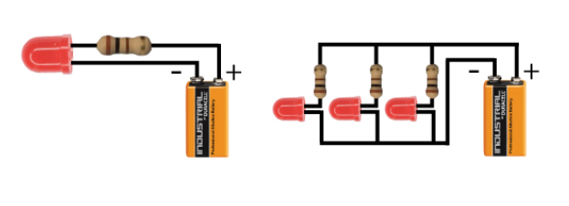
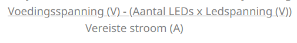
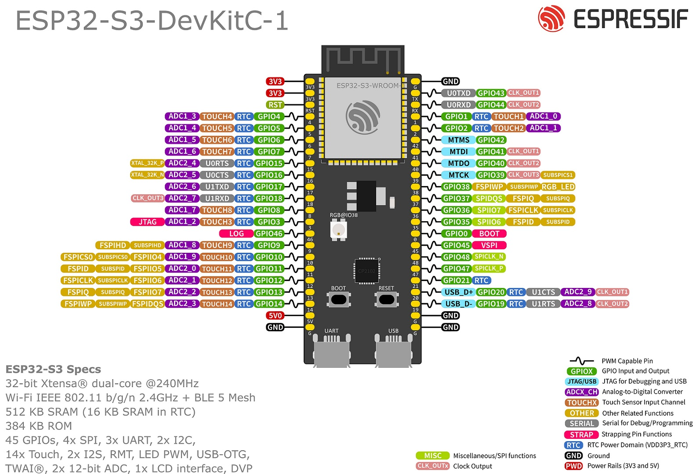

# Smart Cities Learning group goal: Analyse

Name: Gurpreet Singh

Date: 11-2-2026

Learning question: How can I analyse what is needed to turn a normal streetlight into a “smart” streetlight using an ESP32-S3 and simple sensors, while I am still learning how the ESP32 works?

## Smart Streetlight + ESP32-basis

Learning Question
How can I analyse what is needed to turn a normal streetlight into a “smart” streetlight using an ESP32-S3 and simple sensors, while I am still learning how the ESP32 works?

S - Situation
In the first sprint of the City Sim Learning Group I want to build a smart streetlight on my wooden city tile. The idea is that the light should react to the environment instead of always being on, for example by switching on when it is dark. I am new to Embedded & Robotics and I do not yet understand how the ESP32-S3 works or which pins and features I can use. At the same time, the ESP32-S3-DevKitC-1 is the microcontroller I must use in this project.

T - Task
My goal in this sprint is to analyse what “smart” should mean for this streetlight and what is needed to realise that with the ESP32-S3. I want to find out when and why the streetlight should turn on or off, which sensors and other components are needed for that behaviour, and which basic ESP32-S3 features and pins are relevant for connecting a light sensor and a lamp.

A - Action
To reach this goal I will first look at examples of smart streetlights and simple IoT lighting projects to understand typical functions such as turning on in the dark, dimming, or reacting to presence. I will then write down functional requirements, for example that the light turns on when a certain darkness level is reached, and simple non-functional requirements such as low energy use and reliability. In parallel, I will study the official Espressif documentation for the ESP32-S3-DevKitC-1 to understand which pins, voltages and features I can use for a light sensor and LED.

R - Result
The expected result is a short, clear problem-analysis document in which I describe what my smart streetlight must do, which components are realistic candidates, and which ESP32-S3 features I need to use for this first sprint. This document will show how the initial idea is translated into concrete technical needs that I can use in the design phase.

R - Reflection
After finishing this analysis I will reflect on how much my understanding of the problem has improved and where my lack of ESP32 knowledge still limits me. I will also look at how useful the ESP32 documentation was for me as a beginner and what I still find unclear or confusing.

T - Transfer
I will use the results of this analysis directly in the next phase, where I design the Fritzing schematic for the smart streetlight. The way I combined problem-analysis with studying the ESP32 documentation will serve as a template for later sprints, for example when I analyse the traffic light with a pressure sensor or the pedestrian crossing.

Appendix (optional)

Detailed logs
Additional figures/tables
Full code/artefacts

References (used scribbr)
- D66jeroen. (2026, January 30). 3. Slimme straatverlichting: licht waar je het nodig hebt. D66 Goes. https://d66.nl/goes/nieuws/3-slimme-straatverlichting-licht-op-maat/
- AAA ECO B.V. (2024, December 9). Slimme LED lantaarnpalen en 5G: innovatie of inbreuk op privacy? aaaeco.nl. https://aaaeco.nl/slimme-led-lantaarnpalen-en-5g-innovatie-of-inbreuk-op-privacy/
- sm Tronics. (2025, January 12). ESP32 Light Sensor Relay Control - Smart Automation with Wokwi! [Video]. YouTube. https://www.youtube.com/watch?v=V28G_EmqRHg
- Arduino Titan. (2024, October 30). ESP32 Auto Light Control | Esp32 full tutorial [Video]. YouTube. https://www.youtube.com/watch?v=mHjWOMrVsTE
- Arduino Titan. (2024a, October 28). ESP32 Light Sensor with LED Control | Smart Light Automation Tutorial [Video]. YouTube. https://www.youtube.com/watch?v=YhuIzQ6_liwy
- hash include electronics. (2021, July 31). How to use LDR Sensor with Arduino | Make Automatic street light 💡 [Video]. YouTube. https://www.youtube.com/watch?v=YNVfPrFtTno
- Arduino - LDR Module | Arduino Getting Started. (n.d.). Arduino Getting Started. https://arduinogetstarted.com/tutorials/arduino-ldr-module
- Arduino - LED - Fade | Arduino Getting started. (n.d.). Arduino Getting Started. https://arduinogetstarted.com/tutorials/arduino-led-fade
- Gotron | LED’s beschermen: zo bereken je de juiste serieweerstand! | Elektronicaspecialist. (n.d.). NL. https://www.gotron.be/leds
- Instructables. (2025, February 11). 5V 4-Channel relay module with Arduino. Instructables. https://www.instructables.com/5V-4-Channel-Relay-Module-With-Arduino

- esp32: https://docs.espressif.com/projects/esp-dev-kits/en/latest/esp32/esp32-devkitc/user_guide.html#what-you-need
- esp32 S3: https://docs.espressif.com/projects/esp-dev-kits/en/latest/esp32s3/esp32-s3-devkitc-1/user_guide_v1.1.html#getting-started
- https://documentation.espressif.com/esp32_datasheet_en.html#%5B52,%22XYZ%22,56.69,653.91,null%5D

List all sources you used. Use a consistent citation style (e.g., APA/IEEE). Include URLs with access dates for web resources.

Author, A. (Year). Title. Publisher. [https://link](https://link/) (accessed YYYY-MM-DD)
Organization. (Year). Title of webpage/report. [https://link](https://link/) (accessed YYYY-MM-DD)
Dataset/Tool. Version. Provider. [https://link](https://link/) (accessed YYYY-MM-DD)

# Feedback from Mats
Mats feedback is that I should think about the overall system and all the tiles, not just my own tile. He advises discussing this with my team to make sure everything connects properly. While developing this, I should also consider how I am going to set it up in a way that it works across the entire city as a whole. Additionally, Mats mentions that the “Result, Reflection and Transfer” section does not need to be filled in yet, and should only be completed after finishing the action. He also advises that I should clearly and concretely describe what I am going to deliver in the action section. Lastly, he emphasizes that I should keep updating this continuously.

# What I've done

# What is a smart streetlight?

A smart streetlight is a street lamp that not only provides light but can also automatically adjust its lighting and other functions to its surroundings via sensors or and  network connectivity. Instead of always being on according to a fixed schedule, a smart streetlight can dim or brighten its light based on factors such as sunset, presence of people or traffic, and weather conditions, saving energy by not burning brightly all the time. As described in (D66jeroen, 2026)

Many smart streetlights have additional technology, such as a remote management system and IoT modules, allowing each streetlight to be controlled and monitored remotely. They can also perform other functions, such as measuring air quality or noise, providing Wi-Fi, or even serving as a charging station for electric vehicles, turning the lamppost into a multifunctional data collector within the smart city as described in (AAA ECO B.V., 2024)

# My current goal: Automatic Smart Streetlight

In this Smart Cities: Learning Group team project, I'm going to develop a smart streetlight prototype that automatically switches on and off based on the ambient light level. Because I'm a beginner with not much experience in Embedded Systems & Robotics, so I'm keeping it simple.

During my research, I specifically started by searching for "ESP32-S3 smart streetlight." Because I find visual explanations easier and understand them better with little prior knowledge, I watched these YouTube videos:
- [(sm Tronics, 2025)](https://www.youtube.com/watch?v=V28G_EmqRHg)
- [(Arduino Titan, 2024)](https://www.youtube.com/watch?v=mHjWOMrVsTE&t=1008s) 
- [(Arduino Titan, 2024a)](https://www.youtube.com/watch?v=YhuIzQ6_liw&t=815s)
- [(hash include electronics, 2021)](https://www.youtube.com/watch?v=YNVfPrFtTno)

What I immediately saw was that all the videos used an LDR module, some also a relay module, and as is usually jumper wires and LEDs. This made me want to first understand what exactly an LDR module and a relay module do and the logic behind it.

## Functional requirements 

1. Automatic switching: The streetlight turns on when the measured light value falls below a threshold durning darknees and turns off when the value rises above the threshold durning light.
2. Adjustable threshold: The threshold must be easily adjustable, for example thru a variable in the code.
3. Testable behavior: The system must respond quickly to clear difference between light and dark and must not flicker

## Non-functional requirements

1. Electrical correct: Each LED has its own resistor to prevent overheating or damage.
2. Reliability: The system must switch on en and off without resets etc.
3. Beginner friendly: Coponents and code must be kepot simple for beginner knowledge. 
4. Clarity: Wiring must be logical and reproducible and must have the same structure for each tile, so that troubleshooting remains easy to solve and to expand it.

# Findings during research

As I mentioned before, I started my research by specifically searching for "ESP32-S3 smart streetlight." Because I find visual explanations easier and more enjoyable as a beginner with not much knowledge, I started watched YouTube videos. What I immediately saw was that all the videos used an LDR module, so my first priority was to understand what an LDR module is and what it does.

Next, I specifically searched for "Arduino LDR module" and found many websites. The source (Arduino - LDR Module | Arduino Getting Started, n.d.) was the clearest for me because it explains the connections step by step.

What I understood is that LDR stands for Light Dependent Resistor and is used to track the amount of light in other words to measure the ambient light level. Because the LDR module has several connections, I also needed to know what each pin does. This was also explained at (Arduino - LDR Module | Arduino Getting Started, n.d.). The LDR light sensor module has 4 pins:

- VCC: VCC stands for "Voltage at the Common Collector" and represents the positive power supply voltage. This should be connected to VCC (3.3V to 5V)
- GND: This should be connected to GND (0V)
- DO pin: This is the digital output pin. It is "High" when it is dark and "Low" when it is light. The threshold between dark and light can be adjusted using a potentiometer. You can also use the potentiometer to set the sensitivity.
- AO: This is an analog output pin. The output value decreases as the light becomes brighter and increases as the light becomes stronger.

Then I ofcource noticed that in every YouTube video a LED was used. I understood that LED stands for Light Emitting Diode. Because an LED has two connections, I also needed to know what each pin does. This was clearly explained at (Arduino - LED - Fade | Arduino Getting Started, n.d.). The LED has two pins:

- Cathode (-) short: Connects to GND (0V)
- Anode (+) long: Used to control the pin's state

What I also noticed when I scrolled down a bit is that most LEDs require a resistor between the anode and VCC; the value of the resistor depends on the LED.

Then I looked into why a resistor is necessary needed for LEDs. The source (Gotron | LED’s Beschermen: Zo Bereken Je De Juiste Serieweerstand! | Elektronicaspecialist, n.d.). explains this clearly. So, as soon as current flows through the LED, the current rises because an LED has no internal resistance. This can lead to overheating and permanent damage to the LED itself.

Also important to know:
- Forward voltage (Vf): This is the voltage the LED requires to operate and varies by LED type.
    
    Some typical values:
     
    - Red LED: approximately 2.0V
    - Green LED: approximately 2.2V to 3.0V
    - Blue and white LED: approximately 3.0V to 3.5V

- Current (If): This value can also be found in the LED's datasheet. Typical current values ​​for LEDs are between 10mA and 30mA (0.01A to 0.03A). 
- Supply voltage (V_in): This is the voltage of the source you're using to power the LED. For example, if you're using a 9V battery, then V_in=9V.

With this information, you can calculate the resistance using Ohm's Law. Ohm's law states that resistance is equal to the supply voltage (V in) minus the forward voltage (V f), divided by the current (I f).

  
  

To measure the resistor's power, you can use the following formula:

It is recommended to choose a resistor with a Power rating that is higher than the calculated power to prevent overheating. 

If you want to connect multiple LEDs in series, you must use the following formula:

At the bottom of the FAQ, there was also the question "Can I connect multiple LEDs in parallel to a single resistor?" and the answer was "That is possible, but we recommend using a series resistor per LED to avoid uneven currents and differences in brightness."

During my research, I noticed that all the YouTube videos also used a relay module. What I understand is that a relay module is a small electrical switch that allows the ESP32 to safely switch a lamp on and off with a higher voltage or current for example 12V. This was clearly explained in (Instructables, 2025).

The relay has two types of connections:

In my case power and control pins:

- VCC: This should be connected to VCC (5V)
- GND: GND: This should be connected to GND (0V)
- IN: Control signal that the ESP32 sets HIGH or LOW.

Relay Output Connections:

- COM (Common Terminal): The common contact for the relay, usually connected to the power source (for example 3V, 3V, 5V, or an external 12V battery).
- NO (Normally Open Terminal): When the relay is inactive, this terminal is disconnected from COM. When the relay is activated, it connects to COM.
- NC (Normally Closed Terminal): When the relay is inactive, this terminal remains connected to COM. When the relay is activated, it disconnects from COM.

For the team setup we use 4 streetlights per tile so 20 in total.

I didn't realize it at first, but the videos used a different ESP32 variant than my ESP32-S3. For example in (sm Tronics, 2025), the LDR's AO went to pin 34 and the relay's IN went to pin 12. I don't have these pins on my ESP32-S3.

So, I checked the official Espressif documentation and a GitHub repository:

- ESP32: https://docs.espressif.com/projects/esp-dev-kits/en/latest/esp32/esp32-devkitc/user_guide.html#what-you-need

- ESP32 S3: https://docs.espressif.com/projects/esp-dev-kits/en/latest/esp32s3/esp32-s3-devkitc-1/user_guide_v1.1.html#getting-started

- Github Repository: https://github.com/rtek1000/YD-ESP32-23?tab=readme-ov-file

I see that ADCX_CH means: “Analog to Digital Converter”.

Because the LDR module provides an analog voltages thru the AO pin, I connected it to an ADC pin on the ESP32-S3. In my setup, I selected GPIO4 for this so I could read the light value. For the relay module, I connected the IN pin to GPIO5 pin 5, because pin 4 was already being used for the LDR module. The relay's IN pin only expects a digital HIGH/LOW control signal, so it needs to be connected to a GPIO that I can set as an output. The other connections corresponded to their pins, though they were in different locations.

The necessary components to run everything are:
- 1x ESP32 S3 that we got from school in the box
- 1x LDR module from [AliExpress](https://www.aliexpress.com/item/1005006205379253.html?spm=a2g0o.order_list.order_list_main.11.21ef79d2wK6ViM) or just ask our teachers to borrow one
- 1x Relay module from [AliExpress](https://www.aliexpress.com/item/1005010329414583.html?spm=a2g0o.order_list.order_list_main.17.21ef79d2wK6ViM) or just ask our teachers to borrow one
- 20x 220ohm resistors that we got from school in the box
- 20x White LEDs that we got from school in the box
- Some jumper wires M2M and F2M that we got from school in the box
