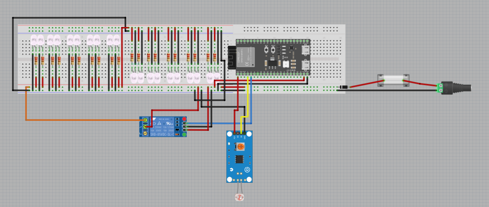

# Smart cities learning group goal: Design

- Name: Gurpreet Singh
- Date: 23-02-2026

## Table of Contents
- [1. Introduction](#1-introduction)
- [2. Methodology](#2-methodology)
- [3. Working method](#3-working-method)
- [4. Main design question and subquestions](#4-main-design-question-and-subquestions)
- [5. Tools used](#5-tools-used)
- [6. Design goal and design requirements](#6-design-goal-and-design-requirements)
  - [6.1 Design goal](#61-design-goal)
  - [6.2 Functional design requirements](#62-functional-design-requirements)
  - [6.3 Non-functional design requirements](#63-non-functional-design-requirements)
  - [6.4 Subconclusion](#64-subconclusion)
- [7. Breadboard and Fritzing as design tools](#7-breadboard-and-fritzing-as-design-tools)
  - [7.1 What is a breadboard?](#71-what-is-a-breadboard)
  - [7.2 What is Fritzing?](#72-what-is-fritzing)
  - [7.3 Why these tools fit this prototype](#73-why-these-tools-fit-this-prototype)
  - [7.4 Subconclusion](#74-subconclusion)
- [8. Design choices for the smart streetlight prototype](#8-design-choices-for-the-smart-streetlight-prototype)
  - [8.1 Translating the analysis into a design](#81-translating-the-analysis-into-a-design)
  - [8.2 Placement of the ESP32-S3](#82-placement-of-the-esp32-s3)
  - [8.3 Placement of the external power connection, fuse, diode, and capacitor](#83-placement-of-the-external-power-connection-fuse-diode-and-capacitor)
  - [8.4 Placement of the LDR module](#84-placement-of-the-ldr-module)
  - [8.5 Placement of the relay module](#85-placement-of-the-relay-module)
  - [8.6 Placement of the LEDs and resistors](#86-placement-of-the-leds-and-resistors)
  - [8.7 Power distribution in the design](#87-power-distribution-in-the-design)
  - [8.8 Subconclusion](#88-subconclusion)
- [9. Created Fritzing design](#9-created-fritzing-design)
  - [9.1 Breadboard view](#91-breadboard-view)
  - [9.2 What is visible in the design](#92-what-is-visible-in-the-design)
  - [9.3 Design limitations](#93-design-limitations)
  - [9.4 Reproducibility for the team](#94-reproducibility-for-the-team)
  - [9.5 Subconclusion](#95-subconclusion)
- [10. Final conclusion](#10-final-conclusion)
- [11. Recommendations](#11-recommendations)
- [12. Sources](#12-sources)

## 1. Introduction

This design report is part of the Smart Cities Learning Group project. In Sprint 1, the project focuses on developing a prototype of an automatic smart streetlight that switches on and off based on the ambient light level. After the analysis phase, it became clear which components, GPIO connections, and basic power supply direction are suitable for the prototype. The next step is to translate those outcomes into a clear and reproducible wiring design.

The purpose of this design phase is to create a practical breadboard design that shows how the ESP32-S3, the LDR module, the relay module, the LED circuit, and the power input section are connected. The design must not only be technically correct, but also understandable for a beginner and reproducible for the rest of the team.

This report therefore focuses on the visual and physical arrangement of the prototype on the breadboard. The final result is a Fritzing design that can be used as the basis for the realisation phase.

## 2. Methodology

For this design report, several methods were used:

- translating the results of the analysis phase into practical design choices;
- studying how breadboard connections work;
- studying Fritzing as a visual design tool;
- creating a digital wiring design in Fritzing;
- comparing the digital design with the intended physical prototype setup;
- improving the design based on feedback from Gerald.

This approach was chosen because the design phase must connect the analysis to the actual construction of the prototype. The design must therefore be both technically grounded and practically usable.

## 3. Working method

The design process was carried out step by step. First, the most important outcomes of the analysis phase were reviewed. These included the selected components, the GPIO choices, the decision to use the LDR module as input and the relay module as the switching component for the LED circuit, and the preferred direction for the external power design.

After that, the breadboard structure was studied to make sure that the ESP32-S3, LEDs, resistors, modules, and power input section could be placed in a logical way. Special attention was given to the power rails, the center gap of the breadboard, and the repeated LED-resistor structure.

Next, the circuit was recreated in Fritzing. During this process, the ESP32-S3 was placed on the breadboard, the LDR module and relay module were added, the LED circuit was built, and the power input path was arranged with the external connector, fuse, diode, and capacitor.

By working in this way, the design was developed from technical conclusions into a visual prototype layout that can be used in the next phase of the project.

## 4. Main design question and subquestions

The main design question of this report is:

How can the results of the analysis phase be translated into a clear, practical, and reproducible breadboard design for the automatic smart streetlight prototype with the ESP32-S3?

To answer this main design question, the following subquestions were formulated:

1. Which design requirements must the prototype meet?
2. Why are a breadboard and Fritzing suitable for this prototype?
3. How should the ESP32-S3, LDR module, relay module, LEDs, resistors, and power input section be placed in the design?
4. How should the LED circuit and the relay-based switching be represented in the design?
5. How can the design be made understandable and reproducible for the rest of the team?

## 5. Tools used

For this design report, the following tools were used:

- all sources included in the reference list;
- Fritzing for creating the breadboard design;
- Scribbr for formatting references correctly;
- ChatGPT for support with language use, phrasing, spelling, and grammar.

## 6. Design goal and design requirements

Before creating the wiring design, it is important to define what the design must achieve. This chapter describes the design goal and requirements that guided the design choices.

### 6.1 Design goal

The goal of this design phase is to create a clear breadboard design for the Sprint 1 automatic smart streetlight prototype. This design must visually show how the ESP32-S3, the LDR module, the relay module, the LED circuit, and the external power input section are connected.

The design should help with two things. First, it should support the actual construction of the prototype. Second, it should make the setup easier to understand and reproduce for the rest of the team.

### 6.2 Functional design requirements

The design must support the following functional requirements:

1. The LDR module must be connected so that the ESP32-S3 can read the light level.
2. The relay module must be connected so that the ESP32-S3 can switch the LED circuit on and off.
3. The LED circuit must be represented clearly.
4. Each LED must be combined with its own resistor.
5. The design must show how the prototype receives external power.
6. The design must show how the power input is protected and stabilised.

### 6.3 Non-functional design requirements

The design must also support the following non-functional requirements:

1. The design must be electrically correct.
2. The design must be visually clear.
3. The design must be understandable for a beginner.
4. The design must be reproducible by the team.
5. The design must be structured in a way that supports later testing and expansion.

### 6.4 Subconclusion

The design phase is aimed at creating a breadboard design that is not only functional, but also clear, structured, and reproducible. These requirements determine how the prototype is represented in the following chapters.

## 7. Breadboard and Fritzing as design tools

Before explaining the final design, it is necessary to clarify the tools used in this phase. This chapter explains what a breadboard is, what Fritzing is, and why both are suitable for this prototype.

### 7.1 What is a breadboard?

According to [(How To Use A Breadboard - SparkFun Learn, z.d.-a)](https://learn.sparkfun.com/tutorials/how-to-use-a-breadboard/all#introduction), a breadboard is a solderless prototyping board. This makes it useful for beginners, because components can be inserted, moved, and changed without soldering.

The most important point for this design is that the breadboard has connected rows and vertical power rails. These internal connections make it possible to distribute voltage and ground and to build repeated LED-resistor structures more clearly.

Because this prototype contains many LEDs, the breadboard is useful for creating a structured parallel output layout.

### 7.2 What is Fritzing?

According to [(Wikipedia contributors, 2026)](https://en.wikipedia.org/wiki/Fritzing), Fritzing is an open-source software tool for designing electronic circuits. It is especially suitable for hobbyists and beginners.

According to [(Instructables, 2017)](https://www.instructables.com/Fritzing-A-Tutorial/), Fritzing provides different views, including breadboard view and schematic view. For this project, the breadboard view is the most relevant because it resembles the real physical setup most closely.

### 7.3 Why these tools fit this prototype

The breadboard and Fritzing fit this project because they help translate a technical idea into a visual and practical setup. The breadboard supports fast prototyping, while Fritzing supports documentation and communication of the design.

This is especially useful in a team setting, because the design can be used by others as a visual reference for building the same circuit.

### 7.4 Subconclusion

The breadboard and Fritzing are suitable tools for this prototype because they support practical prototyping, visual clarity, and reproducibility.

## 8. Design choices for the smart streetlight prototype

This chapter explains how the results of the analysis phase were translated into the actual design choices visible in the Fritzing diagram.

### 8.1 Translating the analysis into a design

The design is based directly on the outcomes of the analysis phase. From that phase, it was already clear that the prototype needs an ESP32-S3 as controller, an LDR module as input, a relay module as switching component, and multiple white LEDs with separate resistors as output.

In addition, the analysis showed that the power design should not only make the Sprint 1 prototype work, but should also be safer and more suitable for later expansion. For that reason, the design was set up with an external power connection and space for protection and stability components such as a fuse, a diode, and an electrolytic capacitor.

The design therefore had to show not only how the main functional parts can be connected on a breadboard in a clear and reproducible way, but also how the power path is structured.

### 8.2 Placement of the ESP32-S3

The ESP32-S3 was placed on the right side of the main breadboard. This position makes it possible to connect the signal wires from the LDR module and relay module clearly, while also giving access to the power rails.

The ESP32-S3 functions as the central control unit of the prototype. For that reason, it was placed in a visible and central control position relative to the other modules.

### 8.3 Placement of the external power connection, fuse, diode, and capacitor

The external power connection was placed on the right side of the design, because this is the logical entry point of the supply voltage into the circuit. From this side, the power path can be followed clearly towards the breadboard and the connected components.

The fuse was placed in series with the positive supply line. This reflects its protective role in the design, because it is intended to interrupt the circuit if the current becomes too high during a fault or wiring mistake.

The diode was also placed in the power path, because its function is to protect the circuit against reverse polarity. By including it in the design, the power structure becomes more complete and more aligned with the conclusions from the analysis phase.

The electrolytic capacitor was included near the supply side of the circuit to support voltage stability. Its placement is important because it is intended to reduce short voltage dips or spikes when the relay switches and when the LED load changes.

Together, these parts form the protected power input section of the design.

### 8.4 Placement of the LDR module

The LDR module was placed below the breadboard and connected to the ESP32-S3 with jumper wires. This makes the module easy to distinguish from the output part of the circuit.

Its role in the design is to provide the light measurement input. Because of that, the signal connection to the ESP32-S3 had to remain clear and separate from the LED switching path.

### 8.5 Placement of the relay module

The relay module was placed below the breadboard near the LED circuit path. This position reflects its function as the switching element between the ESP32-S3 and the LED power line.

The relay is controlled by the ESP32-S3, but its output side is connected to the LED circuit. This makes the relay physically and logically the bridge between the control part and the output part of the prototype.

### 8.6 Placement of the LEDs and resistors

The LEDs were placed in a repeated structure across the breadboard. Each LED was combined with its own resistor. This design follows the conclusion from the analysis phase that each LED must have a separate resistor to keep the current distribution safer and more consistent.

The repeated LED-resistor structure also makes the design easier to read. It gives the circuit a clear pattern, which helps both with understanding and with reproduction by the team.

### 8.7 Power distribution in the design

The design uses the breadboard power rails to distribute voltage and ground across the circuit. The supply voltage enters the design through the external power connection on the right side.

From there, the positive supply line is first routed through the fuse and the diode before reaching the breadboard. In this way, the design reflects both overcurrent protection and reverse polarity protection. In addition, the electrolytic capacitor is included to support voltage stability on the power line.

After entering the breadboard, voltage and ground are distributed to the ESP32-S3, the LDR module, the relay module, and the LED circuit through the rails and jumper wires.

The relay is used to switch the LED power path, which means that the LED output is not driven directly by an ESP32-S3 GPIO pin. This is an important design choice, because it separates the low-power control side from the higher-load LED side and keeps the power distribution more structured.

### 8.8 Subconclusion

The design choices follow directly from the analysis phase. The ESP32-S3 was positioned as the central controller, the LDR module was placed as the input component, the relay module was placed as the switching component, and the LEDs were arranged in a repeated structure with separate resistors.

In addition, the design includes a protected power input section consisting of an external power connection, a fuse, a diode, and an electrolytic capacitor. Together, these choices create a clearer, safer, and more reproducible prototype layout.

## 9. Created Fritzing design

This chapter describes the final Fritzing design created for the Sprint 1 prototype.

### 9.1 Breadboard view

The breadboard view shows the physical layout of the prototype as it should be wired in practice. This is the most useful representation for this project, because it closely resembles the real setup.

*Fritzing design. Source: created by me.*

### 9.2 What is visible in the design

In the design, the following elements are visible:

- the ESP32-S3 on the breadboard;
- the LDR module as the sensor input;
- the relay module as the switching component;
- multiple white LEDs;
- one resistor per LED;
- the breadboard power rails;
- an external power input;
- a fuse in the power path;
- a diode in the power path;
- an electrolytic capacitor for voltage stability.

This makes not only the control and output logic visible, but also the intended protected power structure of the prototype.

### 9.3 Design limitations

While creating the design, it became clear that digital design software does not always provide the exact same part models as the physical components used in practice. This means that some visual parts in Fritzing may be approximations of the real modules.

Even so, the design still fulfils its main goal, because it clearly communicates how the prototype is intended to be wired.

### 9.4 Reproducibility for the team

An important goal of this design is reproducibility. The visual layout makes it easier for other team members to understand how the prototype is structured and how they can build a similar setup on their own tile.

Because the design uses a repeated LED structure, a clear module separation, and a visible power path, it supports a more consistent implementation across the team.

### 9.5 Subconclusion

The final Fritzing design provides a clear visual representation of the Sprint 1 prototype. It shows the main components, their placement, and the basic wiring logic in a way that supports both understanding and practical implementation.

## 10. Final conclusion

This design report translated the results of the analysis phase into a practical breadboard design for the Sprint 1 automatic smart streetlight prototype.

First, it was established that the design must support a prototype that is not only functional, but also clear, beginner-friendly, reproducible, and suitable for later development. These requirements defined the framework of the design phase.

Second, the design phase confirmed that the breadboard and Fritzing are suitable tools for this prototype. The breadboard supports flexible prototyping, while Fritzing supports visual documentation of the wiring structure.

Third, the analysis results were translated into concrete design choices. The ESP32-S3 was placed as the central controller, the LDR module was added as the sensor input, the relay module was added as the switching component, and the LEDs were arranged in a repeated structure with separate 220 ohm resistors. The design also includes an external power connection, a fuse, a diode, an electrolytic capacitor, and a structured use of the breadboard rails.

Finally, the prototype was documented in a Fritzing breadboard view that shows how the circuit should be built physically. This visual design provides a practical basis for the next phase of the project.

Based on this design report, it can be concluded that the most suitable design for the Sprint 1 smart streetlight prototype is a breadboard-based ESP32-S3 layout in which the LDR module, relay module, LED circuit, and protected external power input are arranged in a clear and reproducible way. The protected power section consists of an external supply connection combined with a fuse, a diode, and an electrolytic capacitor. This design now forms the basis for the realisation phase.

## 11. Recommendations

Based on this design report, the following recommendations are made for the next phase of the project:

1. Use this Fritzing design as the direct basis for the realisation phase.
2. Compare the physical breadboard setup continuously with the design during construction.
3. Check in practice whether the placement of the modules and power input components is convenient and adjust the design if needed.
4. Test whether the relay switches the LED circuit reliably.
5. Verify in practice whether the protected power path works as intended.
6. Update the design afterwards if the physical implementation differs from the digital design.

## 12. Sources

*Reference formatting was made using [Scribbr](https://www.scribbr.nl/bronvermelding/generator/apa/) APA Generator.*

1. How to Use a Breadboard - SparkFun Learn. (z.d.-b). https://learn.sparkfun.com/tutorials/[how-to-use-a-breadboard/all#introduction](how-to-use-a-breadboard/all#introduction) viewed on 17 February 2026
2. Wikipedia contributors. (2026, February 28). Fritzing. Wikipedia. [https://en.wikipedia.org/wiki/Fritzing](https://en.wikipedia.org/wiki/Fritzing) viewed on 23 February 2026
3. Instructables. (2017, October 15). Fritzing - a Tutorial. Instructables. [https://www.instructables.com/Fritzing-A-Tutorial/](https://www.instructables.com/Fritzing-A-Tutorial/) viewed on 23 February 2026