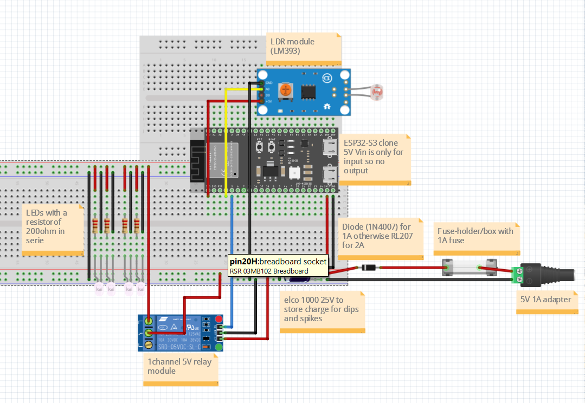

# Smart Cities Learning group goal: Design

- Naam: Gurpreet Singh
- Datum: 11-2-2026

## Table of Contents
- [Smart Cities Learning group goal: Design](#smart-cities-learning-group-goal-design)
  - [Table of Contents](#table-of-contents)
  - [What is a breadboard?](#what-is-a-breadboard)
  - [What is Fritzing?](#what-is-fritzing)
  - [My current goal: Designing the Smart Streetlight Prototype](#my-current-goal-designing-the-smart-streetlight-prototype)
  - [Findings during design research](#findings-during-design-research)
  - [Created Fritzing schematics](#created-fritzing-schematics)
    - [Breadboard view](#breadboard-view)
  - [Sources (used scribbr)](#sources-used-scribbr)

## What is a breadboard?

According to (How To Use A Breadboard - SparkFun Learn, z.d.), a breadboard is a solderless component used during prototyping. This makes it useful for beginners like me, because nothing has to be soldered and components can easily be changed or moved if something is connected incorrectly.

The most important thing for my design is understanding how the internal connections of the breadboard work. Each horizontal row has 5 connected clips on the left side and 5 connected clips on the right side of the ravine in the middle of the breadboard. The left and right side are not connected to each other. This is important for me to understand before making a Fritzing design.

The red + and blue/black - power rails run vertically on the sides of the breadboard. This means I can connect the power supply to these rails and then distribute voltage and ground more easily to the LEDs, LDR module and relay module.

Rules I need to remember:

- Left and right side of the ravine are separate, which is useful for placing the ESP32-S3.
- Power rails may need jumper wires if I want to use both sides of the breadboard.
- I should always check for short circuits before powering the circuit.
- I should use clear wire colors during wiring, for example red for 5V or 3.3V, black for GND, and other colors for signal wires, so that it stays understandable for the team as described in the discussion on (Miniika, n.d.).

Because I use many LEDs, the breadboard is useful because I can connect them in parallel using the power rails, while each LED still has its own 220ohm resistor.

## What is Fritzing?

According to (Wikipedia contributors, 2026),Fritzing is an open-source software tool used to design electronic circuits. It is mainly intended for makers, hobbyists and beginners, which makes it suitable for me in this project.

According to (Instructables, 2017), Fritzing has three main views:

- Breadboard-view: This looks like a real breadboard, where components are placed physically.
- Schematic-view: This shows the electronic circuit using symbols and lines.
- PCB-view: This is used to design a printed circuit board, which is not needed for my prototype.

For my Smart Streetlight, Fritzing is useful because it allows me to design my wiring in a visual way before physically building it. This helps me understand the connections better and also makes it easier for my teammates to copy the same setup on their own tile.

## My current goal: Designing the Smart Streetlight Prototype

In this design phase of the Smart Cities: Learning Group project, my goal is to translate my earlier analysis into a clear and reproducible wiring design. I want to create a Fritzing diagram that shows exactly how the ESP32-S3, LDR module, relay module and LEDs must be connected on the breadboard.

Because I am still a beginner in Embedded Systems & Robotics, it is important for me that the design stays simple and understandable. The design should not only work for me, but also be easy to follow for the rest of the team.

## Findings during design research

When I started designing in Fritzing, I first needed to better understand how the breadboard should be used. That is why I looked up how a breadboard works and how the internal connections are arranged. This helped me understand why the power rails are useful for distributing voltage and ground to multiple components.

I also looked into Fritzing itself, because I had never really used it before for a project like this. What I learned is that Fritzing is especially useful for visually translating a physical breadboard setup into a digital design. This is useful for me as a beginner because I can compare the software design directly with my real prototype.

While working with the Fritzing parts library, I noticed that the exact LDR module and relay module that I physically use were not available. Because of this, I searched for alternatives and found matching modules on the web. 

## Created Fritzing schematics

### Breadboard view

In the breadboard-view, I recreated the prototype as it should be physically wired. This view is especially useful because it looks the most like the real breadboard setup.

In this view, I can clearly see:

- where the ESP32-S3 is placed,
- how the adapter is connected with de fuse-box/holder and then the diode
- where the elco is placed
- how the LDR module is connected,
- how the relay module is connected,
- and how the LEDs and resistors are placed on the breadboard.

## Sources (used scribbr)

1. How to Use a Breadboard - SparkFun Learn. (z.d.). https://learn.sparkfun.com/tutorials/how-to-use-a-breadboard/all#introduction
2. Miniika. (n.d.). Color conventions for breadboard wires? : r/AskElectronics. https://www.reddit.com/r/AskElectronics/comments/llitd8/color_conventions_for_breadboard_wires/
3. Wikipedia contributors. (2026, 28 februari). Fritzing. Wikipedia. https://en.wikipedia.org/wiki/Fritzing
4. Instructables. (2017, 15 oktober). Fritzing - a Tutorial. Instructables. https://www.instructables.com/Fritzing-A-Tutorial/