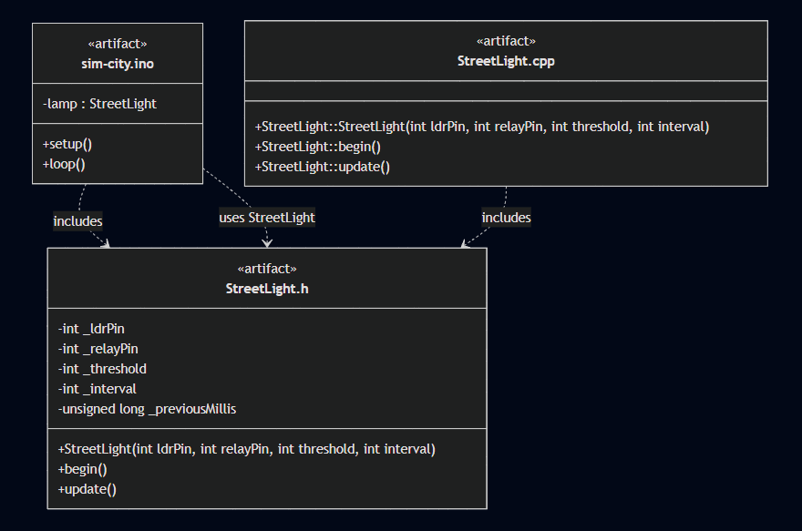
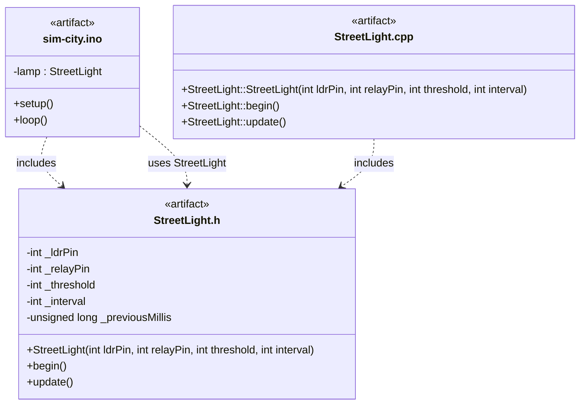

# Smart cities learning group goal: Design

- Name: Gurpreet Singh  
- Date: 27-03-2026  

## Table of Contents

## 1. Introduction

This design report is part of the Smart Cities Learning Group project. In the previous analysis phase, it was concluded that the original standalone smart streetlight code was no longer suitable for the Sprint 2 context, because the ESP32-S3 boards now have to function as shared City Hubs within one larger project. This means that the smart streetlight functionality must no longer remain only a local sketch, but must be translated into a clearer and more reusable software structure.

The purpose of this design phase is therefore to translate the results of the analysis into a structured software design for the smart streetlight functionality. The design must show which files, classes, and relations are needed, how responsibilities are divided, and how the smart streetlight fits into the wider shared project. To make this clear and reproducible, the software structure is visualised in a UML design.

## 2. Methodology

For this design report, several methods were used:

- translating the results of the analysis phase into software design choices;
- identifying which files and components are needed in the new structure;
- defining the responsibilities of the main `.ino` file, the header file, and the implementation file;
- analysing how the smart streetlight fits into the wider City Hub project;
- visualising the software structure and relations in a UML diagram.

This approach was chosen because the Sprint 2 design phase is not about physical hardware placement, but about structuring the smart streetlight functionality into a software design that is clear, reusable, and suitable for integration.

## 3. Working method

The design process was carried out step by step. First, the most important results of the analysis phase were reviewed. These included the conclusion that the standalone sketch should be replaced with a library-like structure and that the code should be separated into clearer responsibilities.

After that, the required software components were identified. This included the shared main `.ino` file as the central integration point, a header file to declare the smart streetlight component, and an implementation file to contain its internal behaviour.

Next, the responsibilities of each part were described. Special attention was given to the relation between the shared main project and the smart streetlight component, because the design must support maintainability, reusability, and merging with other modules.

Finally, the structure and relations were visualised in a UML diagram. In this way, the design phase translated the results of the analysis into a clear software structure that can be used in the realisation phase.

## 4. Main design question and subquestions

The main design question of this report is:

How can the results of the analysis phase be translated into a clear and structured software design for the smart streetlight functionality within one shared ESP32-S3 City Hub project?

To answer this main design question, the following subquestions were formulated:

1. Which files, classes, or components are needed for the new software structure?
2. What responsibilities should each part of the software design have?
3. How should the smart streetlight functionality relate to the shared main project?
4. How does the design support maintainability, reusability, and integration?
5. How can the software structure be visualised clearly in a UML design?

## 5. Tools used

For this design report, the following tools were used:

- the Sprint 2 analysis document as the basis for the design;
- the current smart streetlight implementation as design input;
- Mermaid for creating the UML diagram;
- Scribbr for formatting references correctly;
- ChatGPT for support with language use, phrasing, spelling, and grammar.

## 6. Design goal and design requirements

Before presenting the software design, it is important to describe what the design must achieve.

### 6.1 Design goal

The goal of this design phase is to create a clear and structured software design for the smart streetlight functionality inside the shared ESP32-S3 City Hub project. This design must show how the smart streetlight should be separated into reusable software parts and how those parts should work together.

### 6.2 Functional design requirements

The design must support the following functional requirements:

1. The smart streetlight functionality must be callable from the shared main project.
2. The design must separate declaration and implementation.
3. The smart streetlight behaviour must remain reusable as one component.
4. The design must support the same main behaviour as the original standalone version.

### 6.3 Non-functional design requirements

The design must also support the following non-functional requirements:

1. The design must be clear and understandable.
2. The design must support maintainability.
3. The design must reduce the risk of merge conflicts.
4. The design must fit the City Hub idea of one shared ESP32-S3 project.
5. The design must be reproducible in the next phase.

### 6.4 Subconclusion

The design phase is aimed at creating a software structure that is not only functional, but also clear, maintainable, reusable, and suitable for integration. These requirements define the basis of the software design.

## 7. Design choices for the smart streetlight structure

This chapter explains how the software design was built from the results of the analysis phase.

### 7.1 Main project file as central integration point

The file `sim-city.ino` is designed as the central entry point of the shared City Hub project. Its role is not to contain the full smart streetlight logic, but to initialise and update the smart streetlight component as part of the wider project.

This means that the main file acts as the project-level controller and not as the place where all detailed smart streetlight behaviour is implemented.

### 7.2 Header file as component declaration

The file `StreetLight.h` is designed as the declaration file of the smart streetlight component. In this file, the class structure is defined, including the attributes and the public methods that the main project can use.

This file provides the interface of the component. It tells the rest of the project what the smart streetlight offers, without exposing all implementation details.

### 7.3 Implementation file as behavioural logic

The file `StreetLight.cpp` is designed as the implementation file of the smart streetlight component. In this file, the actual working behaviour is placed, such as initialisation, sensor reading, threshold comparison, timed updates, and relay control.

This means that the detailed internal logic remains grouped together inside one dedicated file instead of being mixed directly into the shared main project.

### 7.4 Relation between the files

The design uses a clear relation between the files. The shared main file includes the header file and uses the `StreetLight` component. The implementation file also includes the header file so that it can provide the behaviour that belongs to the declared class.

This creates a structure in which the main file depends on the interface of the smart streetlight component, while the detailed logic remains inside the component itself.

### 7.5 Subconclusion

The design choices divide the smart streetlight into three clear levels: the shared main file for integration, the header file for declaration, and the cpp file for implementation. This makes the structure easier to understand, maintain, and reuse inside the City Hub project.

## 8. UML design of the software structure

To make the software structure understandable and reproducible, it was visualised in a UML diagram.

### 8.1 UML diagram

### 8.2 What is visible in the UML design

The UML diagram shows three main software artifacts. The first is `sim-city.ino`, which contains the `lamp` object and the standard Arduino functions `setup()` and `loop()`. The second is `StreetLight.h`, which contains the attributes and public methods of the smart streetlight component. The third is `StreetLight.cpp`, which contains the implementation of the constructor and methods.

The relations in the diagram show that the shared main file includes the header file and uses the `StreetLight` component, while the implementation file also includes the header file to provide the actual behaviour.

### 8.3 Why this UML design fits the project

This UML design fits the project because it shows a software structure that supports the City Hub idea. The smart streetlight is no longer represented as one isolated sketch, but as one component inside a wider shared system. The structure is therefore clearer than the original standalone version and better suited for reuse and integration.

### 8.4 Subconclusion

The UML design gives a clear visual representation of the chosen software structure. It makes the relations between the main file, the declaration file, and the implementation file explicit and supports reproducibility in the next phase.

## 9. Evaluation of the software design

The software design is stronger than the original standalone structure because it separates responsibilities more clearly.

A strong point of the design is that the main project is no longer overloaded with detailed streetlight logic. Another strong point is that the smart streetlight is now represented as a reusable component with a clearly defined interface and implementation.

At the same time, the design remains simple enough for the current project. It does not introduce unnecessary complexity, but it does create a structure that is much more suitable for shared development than one single sketch.

Overall, the design can be considered successful because it translates the analysis into a clear software structure that supports maintainability, reusability, and integration.

## 10. Final conclusion

This design report translated the results of the analysis phase into a clear and structured software design for the smart streetlight functionality within one shared ESP32-S3 City Hub project.

First, it was established that the design must support a project in which the smart streetlight no longer remains a standalone sketch, but functions as one reusable module inside a wider shared system.

Second, the design defined three main software parts: the shared main `.ino` file as the integration point, the header file as the declaration of the smart streetlight component, and the cpp file as the implementation of its behaviour.

Third, these parts and their relations were visualised in a UML diagram. This design makes the structure understandable, reproducible, and suitable for implementation and evaluation.

Based on this design report, it can be concluded that the most suitable design for the Sprint 2 smart streetlight functionality is a three-level software structure in which the shared main file handles project integration, the header file defines the reusable component, and the cpp file contains the actual working logic.

## 11. Recommendations

Based on this design report, the following recommendations are made for the next phase of the project:

1. Use this software design as the direct basis for implementation and evaluation.
2. Keep the smart streetlight logic grouped inside its own files during implementation.
3. Ensure that the main `.ino` file only handles integration and not detailed internal behaviour.
4. Use the UML diagram as the reference when implementing the software structure.
5. Verify during implementation whether the structured version still preserves the behaviour of the original standalone version.

## 12. Sources

*Reference formatting was made using Scribbr APA Generator.*

1. Sprint 2 [analysis document]().