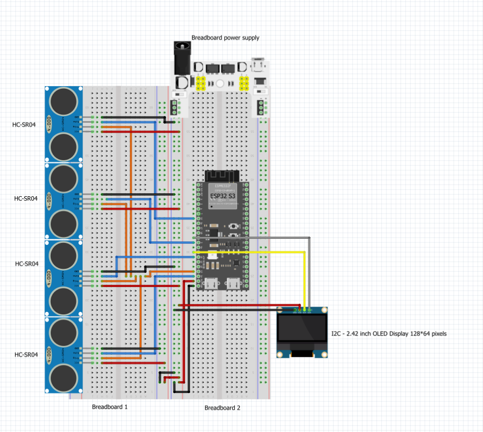
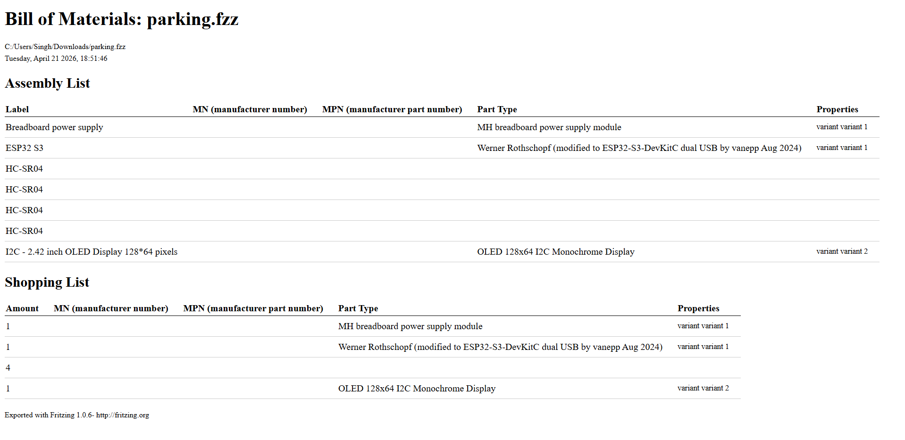

# Design: Smart parking occupancy detection using ESP32-S3 (4 Parking Spaces)

- **Author:** Gurpreet Singh  
- **Date:** 21-04-2026  
- **Version:** 1.0  
- **Classification:** Internal  
- **Client:** Mayor Mats Otten  
- **Company:** The Embedded Alliance  

## Table of Contents
- [Table of Contents](#table-of-contents)
- [1. Introduction](#1-introduction)
- [2. Main question and subquestions](#2-main-question-and-subquestions)
- [3. Methodology](#3-methodology)
- [4. Chapter 1: Hardware layout and wiring design](#4-chapter-1-hardware-layout-and-wiring-design)
    - [4.1 Introduction](#41-introduction)
    - [4.2 Fritzing diagram](#42-fritzing-diagram)
    - [4.3 Pin allocation](#43-pin-allocation)
    - [4.4 Subconclusion](#44-subconclusion)
- [5. Chapter 2: Component selection and bill of materials](#5-chapter-2-component-selection-and-bill-of-materials)
    - [5.1 Introduction](#51-introduction)
    - [5.2 Selected components](#52-selected-components)
    - [5.3 BOM overview](#53-bom-overview)
    - [5.4 Subconclusion](#54-subconclusion)
- [6. Chapter 3: Physical placement and reliable measurement design](#6-chapter-3-physical-placement-and-reliable-measurement-design)
    - [6.1 Introduction](#61-introduction)
    - [6.2 Sensor placement](#62-sensor-placement)
    - [6.3 Preventing measurement interference](#63-preventing-measurement-interference)
    - [6.4 Subconclusion](#64-subconclusion)
- [7. Final conclusion](#7-final-conclusion)
- [8. Recommendations](#8-recommendations)
- [9. Previous work](#9-previous-work)

---

## 1. Introduction

This document is written for The Embedded Alliance and Mayor Mats Otten.  
The context of this document is the smart parking prototype for four parking spaces within the Smart City project.

This design document translates the results of the previous analysis phase into a concrete hardware design. The focus is on creating a clear and buildable prototype using one ESP32-S3, four HC-SR04 sensors, and an OLED display.

This document is written for the internal project team and project client. It assumes that the reader has basic prior knowledge of ESP32 boards, sensors, and prototype wiring.

---

## 2. Main question and subquestions

The main design question of this document is:

**How can the smart parking prototype be designed in a clear, reliable, and practical way using one ESP32-S3?**

To answer this question, the following subquestions were formulated:

1. How should the hardware wiring be designed?
2. Which components are required for the prototype?
3. How should sensors be physically placed?
4. How can measurement reliability be improved?
5. How can the design remain clear for future expansion?

---

## 3. Methodology

This document is created using the following methods:

- translating conclusions from the analysis phase into design choices;
- creating a Fritzing hardware diagram;
- creating a Bill of Materials;
- selecting practical pin assignments;
- evaluating sensor placement for stable measurements.

These methods were chosen because the goal of this phase is not research anymore, but turning research into a working design.

---

## 4. Chapter 1: Hardware layout and wiring design

### 4.1 Introduction

This chapter answers the following subquestion:

**How should the hardware wiring be designed?**

To answer this, the chapter discusses the full wiring layout and selected pin mapping.

### 4.2 Fritzing diagram

A complete Fritzing diagram is created for the prototype. The diagram includes:

  
*Fritzing schematic of the smart parking prototype. Source: created by me.*

- 1 ESP32-S3 microcontroller  
- 4 HC-SR04 ultrasonic sensors  
- 1 OLED display  
- 1x breadboard power distribution
- 2x breadboards  

### 4.3 Pin allocation

The design uses one controller with clear pin separation.

Example:

- Shared Trigger Pin = GPIO13
- Echo Sensor 1 = GPIO14
- Echo Sensor 2 = GPIO15
- Echo Sensor 3 = GPIO16
- Echo Sensor 4 = GPIO17
- OLED SDA = GPIO8
- OLED SCL → GPIO9

This structure keeps the wiring readable and easier to troubleshoot.

### 4.4 Subconclusion

Based on this chapter, it can be concluded that the hardware layout is clear, practical, and suitable for prototype development.

---

## 5. Chapter 2: Component selection and bill of materials

### 5.1 Introduction

This chapter answers the following subquestion:

**Which components are required for the prototype?**

### 5.2 Selected components

The following components are selected:

- 1x ESP32-S3  
- 4x HC-SR04 ultrasonic sensor  
- 1x OLED display  
- 1x Breadboard power module  
- Jumper wires  
- Breadboard

These components are low-cost, available, and suitable for fast prototyping.

### 5.3 BOM overview

A Bill of Materials is created to support building and replacement of parts.

  
*Bill of Materials of the smart parking prototype. Source: generated in Fritzing.*

### 5.4 Subconclusion

Based on this chapter, it can be concluded that the selected components are sufficient for a complete first prototype.

---

## 6. Chapter 3: Physical placement and reliable measurement design

### 6.1 Introduction

This chapter answers the following subquestion:

**How should sensors be physically placed and how can reliability be improved?**

### 6.2 Sensor placement

Each ultrasonic sensor should be placed above one parking space and pointed downward toward the vehicle area.

This ensures:

- one sensor per parking space  
- clear distance readings  
- easier logic for occupied or free status

### 6.3 Preventing measurement interference

To reduce interference between sensors:

- sensors should be spaced properly  
- sensors should face only their own parking space  
- readings should happen one by one in software  
- unstable values should be filtered

This improves reliability during live demonstrations.

### 6.4 Subconclusion

Based on this chapter, it can be concluded that correct placement and sequential readings improve system stability.

---

## 7. Final conclusion

This document examined how the smart parking prototype can be designed using one ESP32-S3.

First, a clear wiring design is created.  
Second, the required hardware components were selected.  
Third, sensor placement is designed for accurate readings.  
Fourth, reliability improvements were included in the design.

Based on the full design, it can be concluded that **the prototype is ready for the build phase using one ESP32-S3, four HC-SR04 sensors, and an OLED display.**

---

## 8. Recommendations

Based on this design, the following recommendations are made:

1. Build one parking space first for testing.
2. Validate each sensor before full assembly.
3. Keep wiring short and organized.
4. clear code library structure for the team
5. Expand after stable first version.

---

## 9. Previous work

This design document is based on:

- [Analysis Document](https://gitlab.fdmci.hva.nl/studio/smart-cities/projecten/2025-2026-semester-2/city-sim-learning-group/city-the-embedded-alliance-city-sim-learning-group/-/blob/Gurpreet/docs/Gurpreet/Learning%20goals/Analysis/Sprint%203/analysis%20smart%20parking%20occupancy%20detection%20using%20ESP32-S3.md?ref_type=heads#analysis-smart-parking-occupancy-detection-using-esp32-s3-4-parking-spaces)