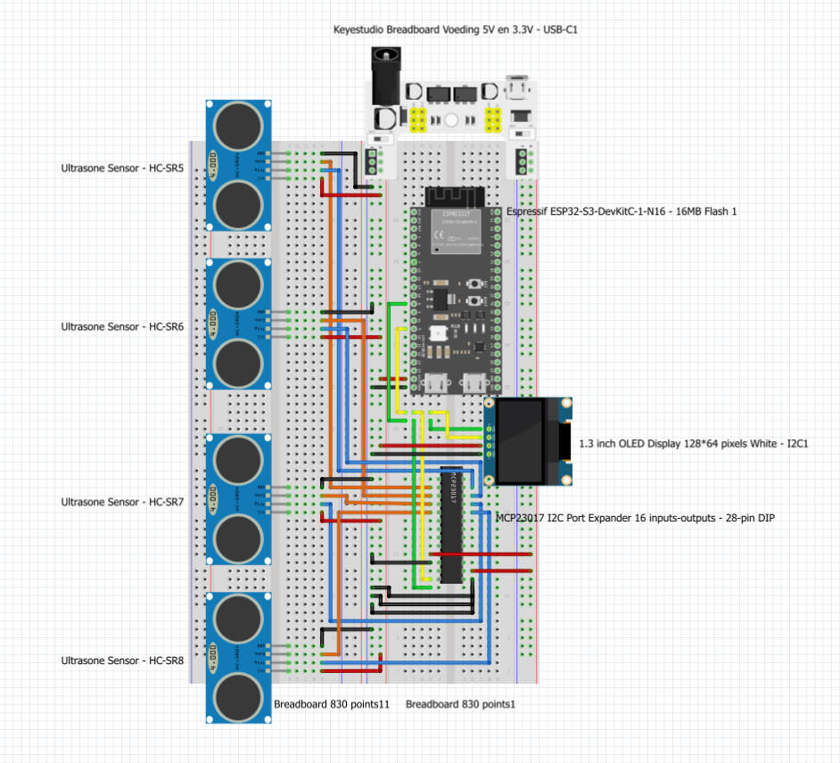

# Design: Reducing ESP32-S3 pin usage for scalable smart parking sensors

- *Author:* Gurpreet Singh  
- *Date:* 26-05-2026  
- *Version:* 1.0  
- *Classification:* Internal  
- *Client:* Mayor Mats Otten  
- *Company:* The Embedded Alliance 

---

## Table of Contents

- [Table of Contents](#table-of-contents)
- [1. Introduction](#1-introduction)
- [2. Main design question and subquestions](#2-main-design-question-and-subquestions)
- [3. Methodology](#3-methodology)
- [4. Chapter 1: Hardware layout and wiring design](#4-chapter-1-hardware-layout-and-wiring-design)
    - [4.1 Introduction](#41-introduction)
    - [4.2 Fritzing breadboard overview](#42-fritzing-breadboard-overview)
    - [4.3 Hardware wiring overview](#43-hardware-wiring-overview)
    - [4.4 Pin allocation](#44-pin-allocation)
      - [ESP32-S3 pin allocation](#esp32-s3-pin-allocation)
      - [MCP23017 pin allocation](#mcp23017-pin-allocation)
      - [OLED pin allocation](#oled-pin-allocation)
    - [4.5 Subconclusion](#45-subconclusion)
- [5. Chapter 2: Component selection and bill of materials](#5-chapter-2-component-selection-and-bill-of-materials)
    - [5.1 Introduction](#51-introduction)
    - [5.2 Selected components](#52-selected-components)
    - [5.3 Bill of Materials](#53-bill-of-materials)
    - [5.4 Subconclusion](#54-subconclusion)
- [6. Chapter 3: Design choices and scalable setup](#6-chapter-3-design-choices-and-scalable-setup)
    - [6.1 Introduction](#61-introduction)
    - [6.2 Why the MCP23017 is used in the design](#62-why-the-mcp23017-is-used-in-the-design)
    - [6.3 Individual parking space detection](#63-individual-parking-space-detection)
    - [6.4 Sequential measurement design](#64-sequential-measurement-design)
    - [6.5 Power and wiring design choices](#65-power-and-wiring-design-choices)
    - [6.6 Subconclusion](#66-subconclusion)
- [7. Chapter 4: Design risks and validation points](#7-chapter-4-design-risks-and-validation-points)
    - [7.1 Introduction](#71-introduction)
    - [7.2 Echo timing risk](#72-echo-timing-risk)
    - [7.3 I2C communication risk](#73-i2c-communication-risk)
    - [7.4 Wiring and power risk](#74-wiring-and-power-risk)
    - [7.5 Validation points](#75-validation-points)
    - [7.6 Subconclusion](#76-subconclusion)
- [8. Final conclusion](#8-final-conclusion)
- [9. Recommendations](#9-recommendations)
- [10. Previous work](#10-previous-work)
- [11. References](#11-references)

---

## 1. Introduction

This design document is written for The Embedded Alliance and Mayor Mats Otten. The context of this document is the Smart City project, where the smart parking prototype must be made more scalable by reducing the direct ESP32-S3 pin usage of the ultrasonic sensors.

In the previous version of the smart parking prototype, four ultrasonic sensors were used to detect whether four parking spaces were occupied or free. That setup worked, but the ultrasonic sensors used several ESP32-S3 GPIO pins. Because the Smart City project contains multiple prototypes, such as the smart streetlight, speed camera and other city functions, the available ESP32-S3 pins must be used carefully.

The ESP32-S3 is suitable as the main controller for this prototype because it has programmable GPIO pins and communication interfaces that can be used in embedded and IoT prototypes [(Espressif Systems, z.d.)](https://documentation.espressif.com/esp32-s3_datasheet_en.pdf).

The current design uses an MCP23017 I/O expander to reduce the number of direct ESP32-S3 pins needed for the smart parking setup. The MCP23017 provides 16-bit general purpose I/O expansion through I2C communication, which means extra digital input and output pins can be added without connecting every sensor signal directly to the ESP32-S3 [(Microchip Technology Inc., 2005)](https://ww1.microchip.com/downloads/en/devicedoc/20001952c.pdf).

The goal of this design is not to redesign the full parking system. The goal is to keep the current smart parking logic working while making the hardware setup more scalable. Each parking space must still have its own occupied/free status, and the four ultrasonic sensors must still be measured individually.

The HC-SR04 ultrasonic sensor uses a trigger signal and an echo signal for distance measurement. Because the distance is based on the echo pulse, the echo timing must be considered carefully in the design [(Tech Support, z.d.)](https://cdn.sparkfun.com/datasheets/Sensors/Proximity/HCSR04.pdf).

This document describes the hardware layout, Fritzing overview, pin allocation, selected components, design choices and validation points for the updated smart parking design.

---

## 2. Main design question and subquestions

The main design question of this document is:

*How can the smart parking prototype be designed with an MCP23017 I/O expander to reduce ESP32-S3 pin usage while keeping the current parking logic working?*

To answer this design question, the following subquestions are used:

1. How should the MCP23017 be connected to the ESP32-S3 and the ultrasonic sensors?

2. Which components are needed for the updated smart parking design?

3. How should the pin allocation be structured?

4. How can each parking space still be detected individually?

5. Which design choices are needed to keep the setup scalable and reliable?

6. Which risks must be checked before and during building and testing?

---

## 3. Methodology

This design document is based on the previous analysis and advice documents. The analysis compared possible solutions for reducing ESP32-S3 pin usage. The [advice document](https://gitlab.fdmci.hva.nl/studio/smart-cities/projecten/2025-2026-semester-2/city-sim-learning-group/city-the-embedded-alliance-city-sim-learning-group/-/blob/844b76b0da4364ffa6f031dbf46a10000ab0a44f/docs/Gurpreet/Learning%20goals/Advise/Sprint%204/advise%20Reducing%20ESP32-S3%20pin%20usage%20for%20scalable%20smart%20parking%20sensors.md) selected the MCP23017 as the best overall component for this prototype because it supports general digital I/O expansion and allows the current parking logic to remain mostly unchanged.

The design phase translates that choice into a concrete hardware design. The following methods are used:

- creating a Fritzing breadboard overview;
- defining the hardware wiring layout;
- creating a pin allocation table;
- selecting the required hardware components;
- creating a Bill of Materials;
- describing the design choices;
- identifying risks and validation points.

These methods are used because the goal of the design phase is to make the selected solution clear, buildable and testable before the realise phase.

---

## 4. Chapter 1: Hardware layout and wiring design

### 4.1 Introduction

This chapter answers the following subquestion:

*How should the MCP23017 be connected to the ESP32-S3 and the ultrasonic sensors?*

The chapter describes the Fritzing overview, the hardware wiring and the pin allocation of the updated smart parking prototype.

---

### 4.2 Fritzing breadboard overview

A Fritzing breadboard overview was created for the updated smart parking prototype.

  
Fritzing breadboard overview of the smart parking prototype with ESP32-S3, MCP23017, four ultrasonic sensors, OLED display and breadboard power supply. Source: created by me.

The Fritzing overview contains:

- 1x ESP32-S3-DevKitC-1-N16;
- 1x MCP23017 I2C port expander;
- 4x HC-SR04 ultrasonic sensors;
- 1x 1.3 inch OLED display 128×64 I2C;
- 1x Keyestudio breadboard power supply;
- 2x 830-point breadboards;
- jumper wires for power, ground, I2C and sensor signals.

The diagram shows that the ESP32-S3 is still the main controller. The MCP23017 is added as an I/O expansion component. The OLED display and MCP23017 both use I2C communication. The ultrasonic sensors are connected through the prototype wiring so that each parking space can still be measured separately.

---

### 4.3 Hardware wiring overview

The updated hardware design uses the ESP32-S3 as the main controller and the MCP23017 as the I/O expansion component.

The main wiring groups are:

| Wiring group             | Description                                                               |
| ------------------------ | ------------------------------------------------------------------------- |
| Power wiring             | Provides 5V and 3.3V to the breadboard setup.                             |
| Ground wiring            | Connects all modules to the same common ground.                           |
| I2C wiring               | Connects the ESP32-S3 to the OLED display and MCP23017 using SDA and SCL. |
| Ultrasonic sensor wiring | Connects each HC-SR04 sensor to the parking detection circuit.            |
| OLED wiring              | Connects the display to the I2C bus for showing parking status.           |

A common ground is important because the ESP32-S3, MCP23017, OLED display and ultrasonic sensors must share the same electrical reference. Without a shared ground, the signals can become unstable or unreadable.

The OLED display is connected through I2C. The MCP23017 also uses I2C. I2C uses a serial data line and a serial clock line, which allows multiple compatible devices to share the same bus when their addresses are different [(NXP Semiconductors, 2021)](https://www.nxp.com/docs/en/user-guide/UM10204.pdf).

---

### 4.4 Pin allocation

The design uses the ESP32-S3 mainly for I2C communication and system control. The MCP23017 handles the expanded digital I/O for the parking sensor setup.

#### ESP32-S3 pin allocation

| ESP32-S3 pin         | Connected component               | Function                  |
| -------------------- | --------------------------------- | ------------------------- |
| GPIO3                | OLED + MCP23017                   | I2C SDA                   |
| GPIO10               | OLED + MCP23017                   | I2C SCL                   |
| 3.3V                 | MCP23017 / I2C logic              | Logic supply where needed |
| 5V / external supply | HC-SR04 sensors / breadboard rail | Sensor power supply       |
| GND                  | All components                    | Common ground             |

#### MCP23017 pin allocation

The MCP23017 provides 16 digital I/O pins. In this design, the MCP23017 is used for the ultrasonic sensor trigger and echo connections [(Microchip Technology Inc., 2005)](https://ww1.microchip.com/downloads/en/devicedoc/20001952c.pdf).

| Parking space | Ultrasonic sensor | MCP23017 trigger pin | MCP23017 echo pin | Purpose                                         |
| ------------- | ----------------- | -------------------- | ----------------- | ----------------------------------------------- |
| P1            | HC-SR04 sensor 1  | GPA0                 | GPB0              | Detect occupied/free status for parking space 1 |
| P2            | HC-SR04 sensor 2  | GPA1                 | GPB1              | Detect occupied/free status for parking space 2 |
| P3            | HC-SR04 sensor 3  | GPA2                 | GPB2              | Detect occupied/free status for parking space 3 |
| P4            | HC-SR04 sensor 4  | GPA3                 | GPB3              | Detect occupied/free status for parking space 4 |

This setup keeps the trigger and echo signals structured. The GPA side can be used for trigger outputs and the GPB side can be used for echo inputs. This makes the wiring easier to understand and easier to document.

#### OLED pin allocation

| OLED pin | Connected to    | Function       |
| -------- | --------------- | -------------- |
| VCC      | Power rail      | Display power  |
| GND      | Ground rail     | Display ground |
| SDA      | ESP32-S3 GPIO3  | I2C data       |
| SCL      | ESP32-S3 GPIO10 | I2C clock      |

---

### 4.5 Subconclusion

Based on this chapter, the updated hardware layout is clear and suitable for the current prototype. The ESP32-S3 uses fewer direct GPIO pins for the parking sensor setup because the MCP23017 provides additional digital I/O through I2C. The four ultrasonic sensors can still be handled separately, which keeps the individual occupied/free status for each parking space.

---

## 5. Chapter 2: Component selection and bill of materials

### 5.1 Introduction

This chapter answers the following subquestion:

*Which components are needed for the updated smart parking design?*

The chapter describes the selected components and gives a Bill of Materials for the updated setup.

---

### 5.2 Selected components

The following components are selected for the updated smart parking prototype:

| Component                          | Reason for selection                                                        |
| ---------------------------------- | --------------------------------------------------------------------------- |
| ESP32-S3-DevKitC-1-N16             | Main controller for the smart parking logic and I2C communication.          |
| MCP23017 I/O expander              | Adds 16 digital I/O pins through I2C and reduces direct ESP32-S3 pin usage. |
| 4x HC-SR04 ultrasonic sensor       | Measures distance for each parking space to determine occupied/free status. |
| 1.3 inch OLED display 128×64 I2C   | Shows the parking status and number of free spaces.                         |
| Keyestudio breadboard power supply | Provides stable breadboard power during prototyping.                        |
| 2x 830-point breadboards           | Gives enough space for the ESP32-S3, MCP23017, OLED and sensor wiring.      |
| Jumper wires                       | Used to connect the modules and power rails.                                |

The ESP32-S3 remains the main controller because it supports embedded control and GPIO-based prototyping [(Espressif Systems, z.d.)](https://documentation.espressif.com/esp32-s3_datasheet_en.pdf). The MCP23017 is added because it provides 16-bit I/O expansion through I2C communication [(Microchip Technology Inc., 2005)](https://ww1.microchip.com/downloads/en/devicedoc/20001952c.pdf). The HC-SR04 sensors are used because they support ultrasonic distance measurement with a trigger and echo signal [(Tech Support, z.d.)](https://cdn.sparkfun.com/datasheets/Sensors/Proximity/HCSR04.pdf).

These components are selected because they match the advised solution and make the updated prototype buildable. The ESP32-S3 remains the main controller, while the MCP23017 makes the parking setup more scalable.

---

### 5.3 Bill of Materials

A Bill of Materials is created to support building, ordering and replacing parts.

| Component                                                                                                                                                                                                             | Specification / purpose                                                      | Amount | Supplier    | Estimated unit price | Estimated total |
| --------------------------------------------------------------------------------------------------------------------------------------------------------------------------------------------------------------------- | ---------------------------------------------------------------------------- | -----: | ----------- | -------------------: | --------------: |
| [ESP32-S3-DevKitC-1-N16 – 16MB Flash](https://www.tinytronics.nl/en/espressif-esp32-s3-devkitc-1-n16-16mb-flash)                                                                                                      | Main microcontroller used for the smart parking logic and I2C communication. |     1x | TinyTronics |                €6.59 |           €6.59 |
| [MCP23017 I2C Port Expander 16 inputs-outputs - 28-pin DIP](https://www.tinytronics.nl/en/components/ics-and-microcontroller-chips/ics/mcp23017-i2c-port-expander-16-inputs-outputs-28-pin-dip)                       | I/O expander used to reduce direct ESP32-S3 pin usage.                       |     1x | TinyTronics |                €4.00 |           €4.00 |
| [HC-SR04 Ultrasonic Distance Sensor](https://www.tinytronics.nl/en/sensors/distance/ultrasonic-sensor-hc-sr04)                                                                                                        | Distance sensor used to detect whether a parking space is occupied.          |     4x | TinyTronics |                €3.00 |          €12.00 |
| [1.3 inch OLED Display 128×64 pixels White – I2C](https://www.tinytronics.nl/en/displays/oled/1.3-inch-oled-display-128*64-pixels-white-i2c)                                                                          | Display used to show parking space status and available spaces.              |     1x | TinyTronics |               €14.00 |          €14.00 |
| [Keyestudio Breadboard Power Supply 5V and 3.3V – USB-C](https://www.tinytronics.nl/en/power/voltage-converters/voltage-regulators/keyestudio-breadboard-power-supply-5v-and-3.3v-usb-c)                              | Breadboard power supply used during prototyping.                             |     1x | TinyTronics |                €3.25 |           €3.25 |
| [Breadboard 830 points](https://www.tinytronics.nl/en/tools-and-mounting/prototyping-accessories/breadboards/breadboard-830-points)                                                                                   | Breadboards used to build the circuit without soldering.                     |     2x | TinyTronics |                €3.00 |           €6.00 |
| [DuPont Jumper Wire Male-Female 10cm – 10 wires](https://www.tinytronics.nl/en/cables-and-connectors/cables-and-adapters/prototyping-wires/dupont-compatible-and-jumper/dupont-jumper-wire-male-female-10cm-10-wires) | Jumper wires used for sensor and module connections.                         | 1x set | TinyTronics |                €0.50 |           €0.50 |
| [DuPont Jumper Wire Male-Male 10cm – 10 wires](https://www.tinytronics.nl/en/cables-and-connectors/cables-and-adapters/prototyping-wires/dupont-compatible-and-jumper/dupont-jumper-wire-male-male-10cm-10-wires)     | Jumper wires used for breadboard and power rail connections.                 | 1x set | TinyTronics |                €0.50 |           €0.50 |

*Estimated total cost:* *€46.84*

The prices are estimated prototype prices and can change depending on supplier availability. The supplier links in the table are used as practical ordering references for the prototype components.

---

### 5.4 Subconclusion

Based on this chapter, the selected components are sufficient for building the updated smart parking prototype. The main addition compared with the previous design is the MCP23017 I/O expander. This component supports the goal of reducing ESP32-S3 pin usage while keeping the parking prototype buildable.

---

## 6. Chapter 3: Design choices and scalable setup

### 6.1 Introduction

This chapter answers the following subquestion:

*Which design choices are needed to keep the setup scalable and reliable?*

The chapter explains why the MCP23017 is used, how individual parking space detection is maintained and how the ultrasonic sensors are measured.

---

### 6.2 Why the MCP23017 is used in the design

The MCP23017 is used because the smart parking setup needs more digital I/O capacity without using many direct ESP32-S3 pins. The MCP23017 provides 16 additional digital I/O pins through I2C communication [(Microchip Technology Inc., 2005)](https://ww1.microchip.com/downloads/en/devicedoc/20001952c.pdf).

The Adafruit MCP23017 Arduino library supports practical Arduino-style development with the MCP23017, which makes the component easier to use in this prototype environment [(Adafruit, z.d.)](https://github.com/adafruit/Adafruit-MCP23017-Arduino-Library).

This design choice gives the prototype several advantages:

- fewer direct ESP32-S3 pins are needed;
- the parking setup becomes easier to expand;
- the current software structure can remain mostly the same;
- the trigger and echo signals can be grouped more clearly;
- other Smart City components can use more of the remaining ESP32-S3 pins.

The MCP23017 is therefore used as the main I/O expansion component in the updated design.

---

### 6.3 Individual parking space detection

Each ultrasonic sensor must still work individually. This means that every parking space must keep its own status:

| Parking space | Sensor           | Status           |
| ------------- | ---------------- | ---------------- |
| P1            | HC-SR04 sensor 1 | Occupied or free |
| P2            | HC-SR04 sensor 2 | Occupied or free |
| P3            | HC-SR04 sensor 3 | Occupied or free |
| P4            | HC-SR04 sensor 4 | Occupied or free |

The sensors do not need to measure at the exact same time. In this design, each sensor is measured separately and the result is stored for that parking space. This keeps the logic clear and prevents the sensors from interfering with each other.

The system flow is:

1. Measure parking sensor 1.
2. Store the result for parking space 1.
3. Measure parking sensor 2.
4. Store the result for parking space 2.
5. Measure parking sensor 3.
6. Store the result for parking space 3.
7. Measure parking sensor 4.
8. Store the result for parking space 4.
9. Repeat the cycle.

This keeps all four parking spaces individually detectable while still using a scalable hardware setup.

---

### 6.4 Sequential measurement design

The ultrasonic sensors are designed to be measured sequentially. This means that only one sensor sends and receives a measurement at a time.

Sequential measurement is used because ultrasonic sensors work with sound pulses. The HC-SR04 starts a measurement with a trigger signal and then uses the echo signal to determine the returned pulse, which makes timing important for distance measurement [(Tech Support, z.d.)](https://cdn.sparkfun.com/datasheets/Sensors/Proximity/HCSR04.pdf).

If multiple ultrasonic sensors send pulses at the same time, one sensor can receive the reflected pulse from another sensor. This can create incorrect distance values. The sequential measurement design reduces this risk. It also fits the current software logic, where one active sensor is measured before moving to the next sensor.

The measurement cycle is:

| Step | Action                        |
| ---- | ----------------------------- |
| 1    | Select current parking sensor |
| 2    | Send trigger signal           |
| 3    | Read echo signal              |
| 4    | Calculate distance            |
| 5    | Update occupied/free status   |
| 6    | Move to next sensor           |

This keeps the system predictable and easier to debug.

---

### 6.5 Power and wiring design choices

The design uses a breadboard power supply to provide stable power during prototyping. The HC-SR04 sensors are powered from the 5V rail. The ESP32-S3 and MCP23017 use logic-level wiring according to the prototype setup.

Important wiring choices:

- all grounds are connected together;
- power rails are kept clear and separated;
- I2C wiring is kept short where possible;
- SDA and SCL are shared between the OLED and MCP23017;
- trigger and echo wiring is grouped per parking sensor;
- the MCP23017 is placed close to the ESP32-S3 and OLED to keep the I2C wiring readable;
- the ultrasonic sensors are placed on the side of the breadboard to represent the four parking spaces.

The wiring should stay organised because the prototype uses multiple sensors and many jumper wires. Messy wiring makes testing harder and increases the chance of wrong connections.

---

### 6.6 Subconclusion

Based on this chapter, the MCP23017 is a suitable design choice for making the smart parking setup more scalable. The design still supports individual parking space detection, uses sequential measurement to reduce interference and keeps the wiring structured for the realise phase.

---

## 7. Chapter 4: Design risks and validation points

### 7.1 Introduction

This chapter answers the following subquestion:

*Which risks must be checked before and during building and testing?*

The chapter describes the most important risks in the design and the validation points needed before the prototype can be accepted.

---

### 7.2 Echo timing risk

The main technical risk is the ultrasonic echo signal. The HC-SR04 uses a trigger signal and an echo signal for distance measurement, so the duration of the echo pulse is important for reliable distance readings [(Tech Support, z.d.)](https://cdn.sparkfun.com/datasheets/Sensors/Proximity/HCSR04.pdf).

Because the MCP23017 communicates through I2C, the echo measurement must be tested carefully. I2C uses a serial data line and serial clock line, which means communication happens through the bus instead of through a direct ESP32-S3 GPIO read [(NXP Semiconductors, 2021)](https://www.nxp.com/docs/en/user-guide/UM10204.pdf).

The design is acceptable only if the system can still make stable occupied/free decisions for each parking space.

The validation should check:

- whether each sensor gives a usable distance value;
- whether each parking space changes correctly between free and occupied;
- whether the parking state remains stable;
- whether invalid readings are handled correctly.

---

### 7.3 I2C communication risk

The OLED display and MCP23017 both use I2C communication. This means the I2C bus must be stable.

I2C allows multiple compatible devices to share the same serial data and serial clock lines when their addresses are different [(NXP Semiconductors, 2021)](https://www.nxp.com/docs/en/user-guide/UM10204.pdf). This is useful for this design because both the OLED display and MCP23017 can use the same SDA and SCL lines.

Possible I2C risks are:

- wrong SDA/SCL wiring;
- wrong I2C address;
- unstable power;
- loose jumper wires;
- too much delay during measurements.

The design should be tested by checking whether both the OLED and MCP23017 start correctly during setup.

---

### 7.4 Wiring and power risk

The prototype uses multiple modules, two breadboards and many jumper wires. This creates a risk of wiring mistakes.

The most important wiring checks are:

- all grounds must be connected;
- VCC and GND must not be swapped;
- SDA and SCL must be connected correctly;
- each trigger and echo wire must match the pin allocation;
- the power supply must provide stable voltage;
- the HC-SR04 sensors must receive the correct power.

A wiring mistake can cause unstable readings or prevent the prototype from working.

---

### 7.5 Validation points

The design should be accepted only after the following validation points are completed:

| Validation point          | Expected result                                              |
| ------------------------- | ------------------------------------------------------------ |
| MCP23017 starts correctly | Serial monitor confirms that the MCP23017 is found.          |
| OLED starts correctly     | OLED shows the parking status screen.                        |
| Sensor 1 test             | Parking space 1 changes between free and occupied correctly. |
| Sensor 2 test             | Parking space 2 changes between free and occupied correctly. |
| Sensor 3 test             | Parking space 3 changes between free and occupied correctly. |
| Sensor 4 test             | Parking space 4 changes between free and occupied correctly. |
| Free counter test         | The number of free spaces updates correctly.                 |
| Stability test            | The state does not switch randomly during normal use.        |
| Wiring check              | Pin allocation matches the Fritzing diagram.                 |
| Power check               | All modules stay powered during testing.                     |

---

### 7.6 Subconclusion

Based on this chapter, the main risks are echo timing, I2C communication and wiring complexity. These risks can be managed by testing each sensor separately, checking the MCP23017 and OLED startup, validating the occupied/free logic and keeping the wiring clearly documented.

---

## 8. Final conclusion

This design document described how the updated smart parking prototype can be designed with an MCP23017 I/O expander.

The design keeps the ESP32-S3 as the main controller and adds the MCP23017 to reduce direct ESP32-S3 pin usage. The four HC-SR04 ultrasonic sensors are still used to detect whether each parking space is occupied or free. Each parking space keeps its own individual status, and the sensors are measured sequentially to reduce interference.

The Fritzing overview shows how the ESP32-S3, MCP23017, OLED display, breadboard power supply and ultrasonic sensors are connected. The pin allocation explains how the ESP32-S3 and MCP23017 are used in the design. The Bill of Materials shows the required components and estimated cost.

The final design direction is:

*Use the MCP23017 I/O expander to reduce ESP32-S3 pin usage while keeping the current smart parking prototype logic working.*

Before the design is accepted in the build and testing phase, the echo timing, I2C communication, wiring and occupied/free logic must be tested carefully.

---

## 9. Recommendations

Based on this design, the following recommendations are made:

1. Build and test one ultrasonic sensor through the MCP23017 first.

2. Test the MCP23017 connection before connecting all sensors.

3. Test the OLED and MCP23017 on the same I2C bus.

4. Keep the trigger and echo wiring grouped per parking space.

5. Measure the ultrasonic sensors sequentially, not all at the same time.

6. Validate each parking space separately.

7. Check whether the free parking counter updates correctly.

8. Keep the wiring short and organised.

9. Use the Fritzing diagram during building and testing to avoid wiring mistakes.

10. Document any pin changes immediately if the real wiring differs from the design.

11. Mention the echo timing limitation during testing, because the ultrasonic measurement depends on a stable echo signal.

12. Keep the design scalable so that more parking spaces or other Smart City components can be added later.

---

## 10. Previous work

This design document is based on the earlier analysis and advice documents:

- [Analysis: Reducing ESP32-S3 pin usage for scalable smart parking sensors](https://gitlab.fdmci.hva.nl/studio/smart-cities/projecten/2025-2026-semester-2/city-sim-learning-group/city-the-embedded-alliance-city-sim-learning-group/-/blob/f1468907568a7099e80ed96108f3eeabdb348dc0/docs/Gurpreet/Learning%20goals/Analysis/Sprint%204/analysis%20Reducing%20ESP32-S3%20pin%20usage%20for%20scalable%20smart%20parking%20sensors.md)

- [Advice: Reducing ESP32-S3 pin usage for scalable smart parking sensors](https://gitlab.fdmci.hva.nl/studio/smart-cities/projecten/2025-2026-semester-2/city-sim-learning-group/city-the-embedded-alliance-city-sim-learning-group/-/blob/844b76b0da4364ffa6f031dbf46a10000ab0a44f/docs/Gurpreet/Learning%20goals/Advise/Sprint%204/advise%20Reducing%20ESP32-S3%20pin%20usage%20for%20scalable%20smart%20parking%20sensors.md)

The analysis document explains the pin usage problem and compares possible component options. The advice document selects the MCP23017 as the best overall component for the current prototype. This design document translates that selected solution into a concrete hardware design.

---

## 11. References

1. Adafruit. (z.d.). Adafruit MCP23017 Arduino Library. [https://github.com/adafruit/Adafruit-MCP23017-Arduino-Library](https://github.com/adafruit/Adafruit-MCP23017-Arduino-Library) viewed on 22 May 2026

2. Espressif Systems. (z.d.). ESP32-S3 Series datasheet. [https://documentation.espressif.com/esp32-s3_datasheet_en.pdf](https://documentation.espressif.com/esp32-s3_datasheet_en.pdf) viewed on 11 May 2026

3. Microchip Technology Inc. (2005). MCP23017/MCP23S17 (pp. 1–6). [https://ww1.microchip.com/downloads/en/devicedoc/20001952c.pdf](https://ww1.microchip.com/downloads/en/devicedoc/20001952c.pdf) viewed on 11 May 2026

4. NXP Semiconductors. (2021). I²C-bus specification and user manual (UM10204 Rev. 7.0). [https://www.nxp.com/docs/en/user-guide/UM10204.pdf](https://www.nxp.com/docs/en/user-guide/UM10204.pdf) viewed on 14 May 2026

5. Tech Support. (z.d.). Ultrasonic Ranging Module HC - SR04. [https://cdn.sparkfun.com/datasheets/Sensors/Proximity/HCSR04.pdf](https://cdn.sparkfun.com/datasheets/Sensors/Proximity/HCSR04.pdf) viewed on 17 April 2026

6. TinyTronics. (z.d.-a). ESP32-S3-DevKitC-1-N16 - 16MB Flash. [https://www.tinytronics.nl/en/espressif-esp32-s3-devkitc-1-n16-16mb-flash](https://www.tinytronics.nl/en/espressif-esp32-s3-devkitc-1-n16-16mb-flash) viewed on 22 May 2026

7. TinyTronics. (z.d.-b). MCP23017 I2C Port Expander 16 inputs-outputs - 28-pin DIP. [https://www.tinytronics.nl/en/components/ics-and-microcontroller-chips/ics/mcp23017-i2c-port-expander-16-inputs-outputs-28-pin-dip](https://www.tinytronics.nl/en/components/ics-and-microcontroller-chips/ics/mcp23017-i2c-port-expander-16-inputs-outputs-28-pin-dip) viewed on 22 May 2026

8. TinyTronics. (z.d.-c). HC-SR04 Ultrasonic Distance Sensor. [https://www.tinytronics.nl/en/sensors/distance/ultrasonic-sensor-hc-sr04](https://www.tinytronics.nl/en/sensors/distance/ultrasonic-sensor-hc-sr04) viewed on 22 May 2026

9. TinyTronics. (z.d.-d). 1.3 inch OLED Display 128×64 pixels White - I2C. [https://www.tinytronics.nl/en/displays/oled/1.3-inch-oled-display-128*64-pixels-white-i2c](https://www.tinytronics.nl/en/displays/oled/1.3-inch-oled-display-128*64-pixels-white-i2c) viewed on 22 May 2026

10. TinyTronics. (z.d.-e). Keyestudio Breadboard Power Supply 5V and 3.3V - USB-C. [https://www.tinytronics.nl/en/power/voltage-converters/voltage-regulators/keyestudio-breadboard-power-supply-5v-and-3.3v-usb-c](https://www.tinytronics.nl/en/power/voltage-converters/voltage-regulators/keyestudio-breadboard-power-supply-5v-and-3.3v-usb-c) viewed on 22 May 2026

11. TinyTronics. (z.d.-f). Breadboard 830 points. [https://www.tinytronics.nl/en/tools-and-mounting/prototyping-accessories/breadboards/breadboard-830-points](https://www.tinytronics.nl/en/tools-and-mounting/prototyping-accessories/breadboards/breadboard-830-points) viewed on 22 May 2026

12. TinyTronics. (z.d.-g). DuPont Jumper Wire Male-Female 10cm - 10 wires. [https://www.tinytronics.nl/en/cables-and-connectors/cables-and-adapters/prototyping-wires/dupont-compatible-and-jumper/dupont-jumper-wire-male-female-10cm-10-wires](https://www.tinytronics.nl/en/cables-and-connectors/cables-and-adapters/prototyping-wires/dupont-compatible-and-jumper/dupont-jumper-wire-male-female-10cm-10-wires) viewed on 22 May 2026

13. TinyTronics. (z.d.-h). DuPont Jumper Wire Male-Male 10cm - 10 wires. [https://www.tinytronics.nl/en/cables-and-connectors/cables-and-adapters/prototyping-wires/dupont-compatible-and-jumper/dupont-jumper-wire-male-male-10cm-10-wires](https://www.tinytronics.nl/en/cables-and-connectors/cables-and-adapters/prototyping-wires/dupont-compatible-and-jumper/dupont-jumper-wire-male-male-10cm-10-wires) viewed on 22 May 2026