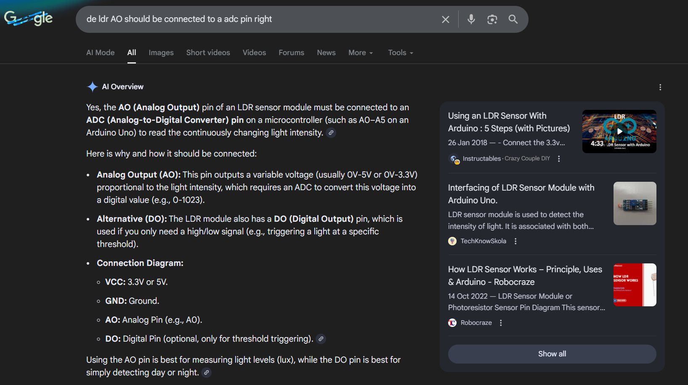
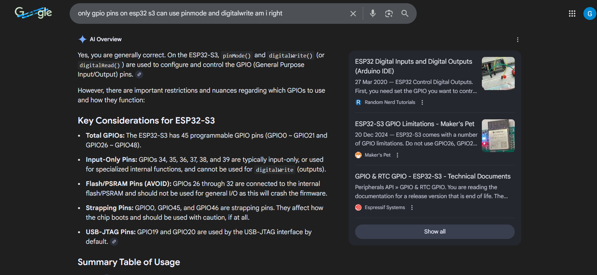
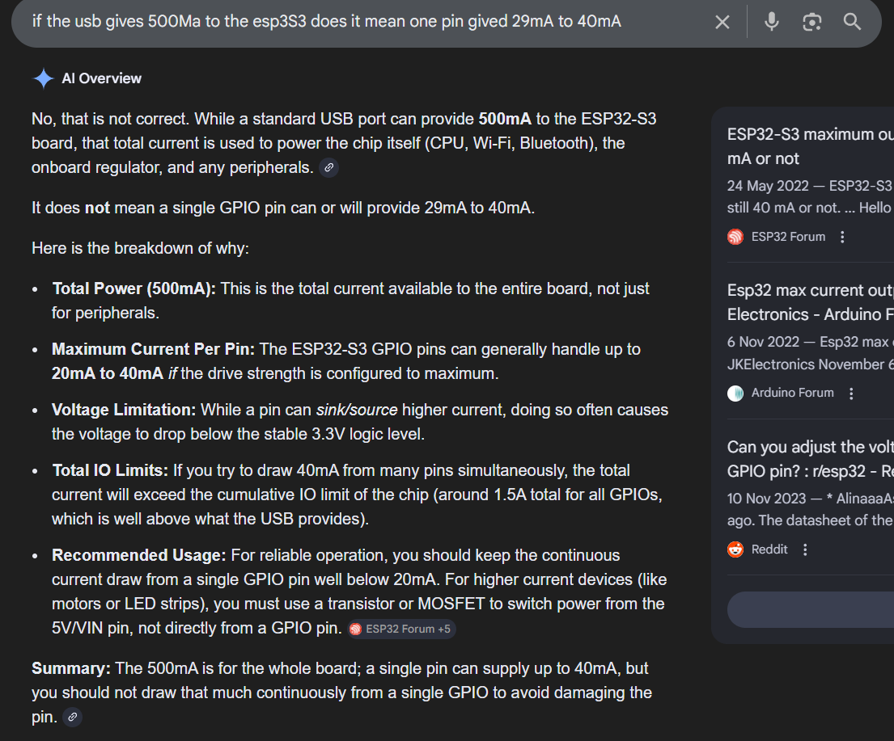
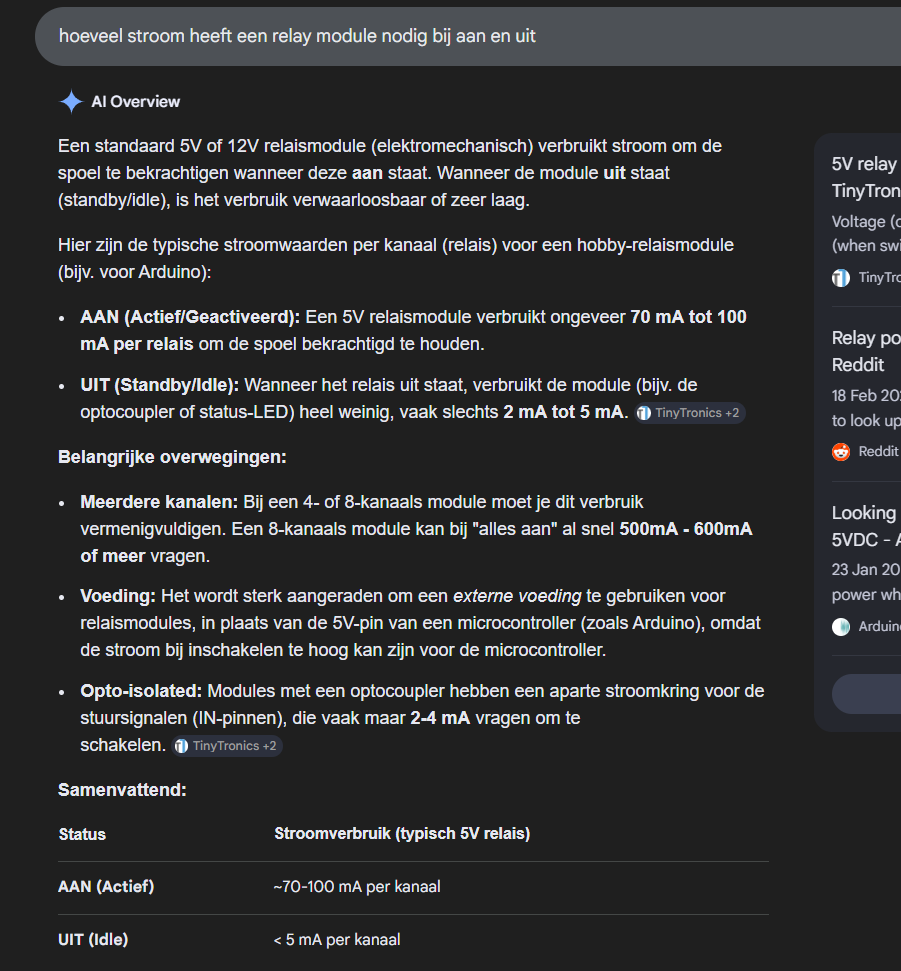
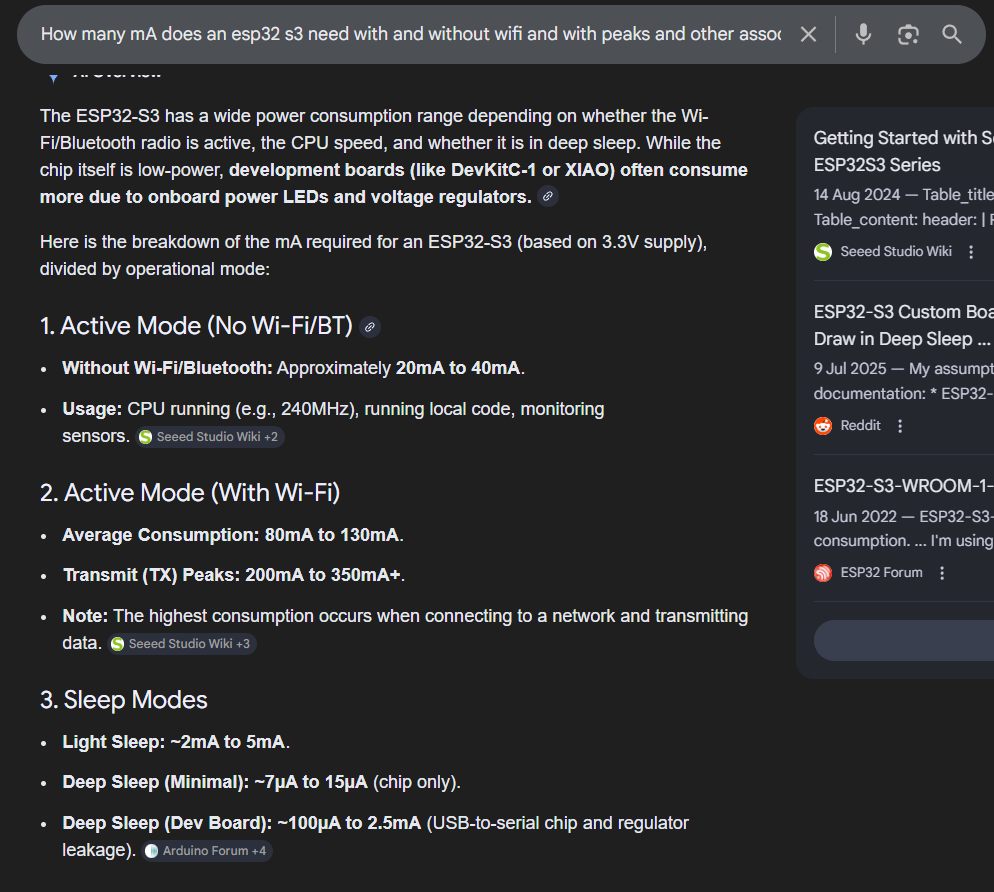
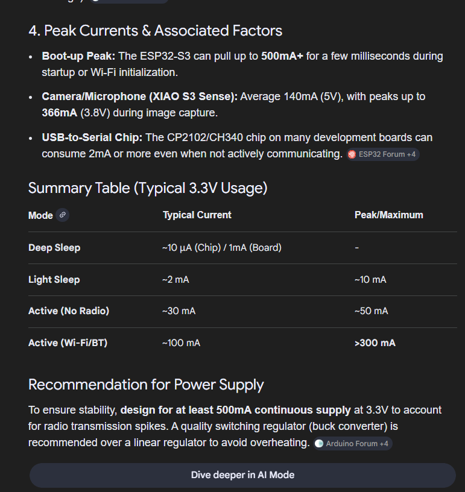
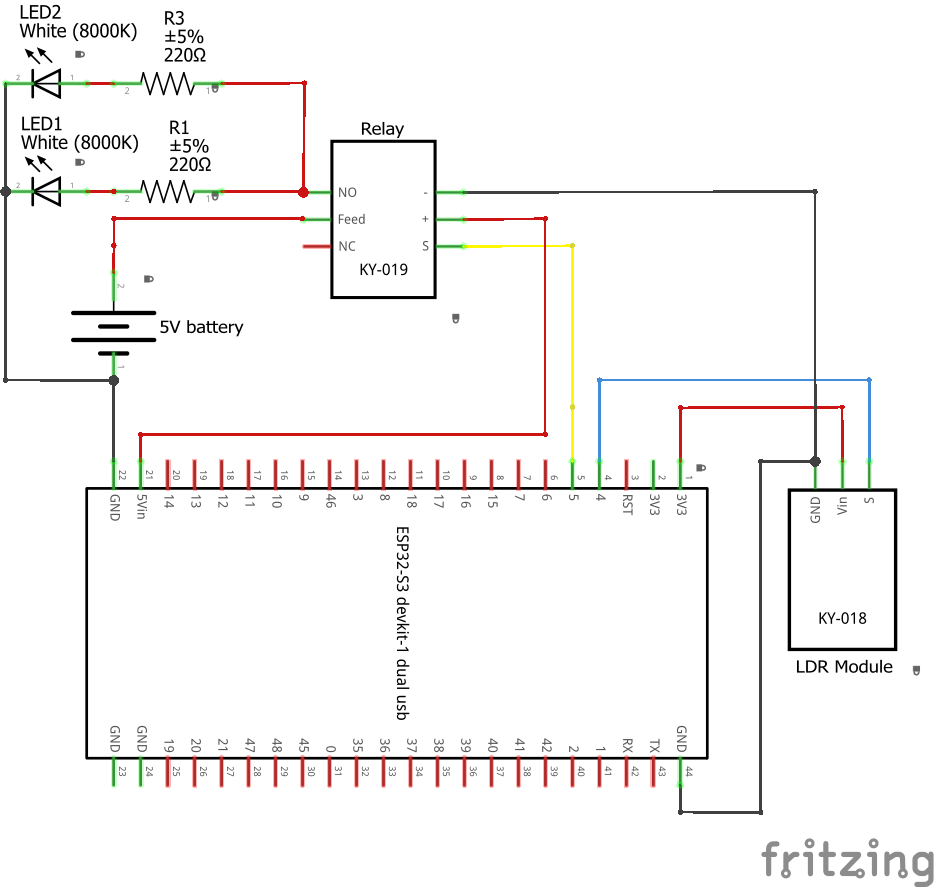
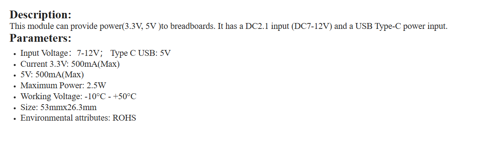
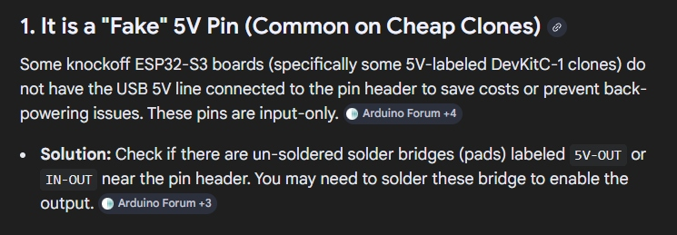

# Learning journey

- Name: Gurpreet Singh
- Date: 11-2-2026

## Table of Contents
- [Table of Contents](#table-of-contents)
- [What is a smart streetlight?](#what-is-a-smart-streetlight)
- [My current goal: Automatic Smart Streetlight](#my-current-goal-automatic-smart-streetlight)
  - [Functional requirements](#functional-requirements)
  - [Non-functional requirements](#non-functional-requirements)
- [Findings during research](#findings-during-research)
- [Total power consumption](#total-power-consumption)
  - [LEDs](#leds)
  - [Relay module](#relay-module)
  - [LDR-module](#ldr-module)
  - [ESP32-S3](#esp32-s3)
  - [Total current (without Wi-Fi and 20 LEDs)](#total-current-without-wi-fi-and-20-leds)
- [Power supply decision](#power-supply-decision)
- [Conclusion](#conclusion)
- [Sources (used scribbr)](#sources-used-scribbr)

## What is a smart streetlight?

A smart streetlight is a street lamp that not only provides light but can also automatically adjust its lighting and other functions to its surroundings via sensors or and  network connectivity. Instead of always being on according to a fixed schedule, a smart streetlight can dim or brighten its light based on factors such as sunset, presence of people or traffic, and weather conditions, saving energy by not burning brightly all the time. As described in (D66jeroen, 2026)

Many smart streetlights have additional technology, such as a remote management system and IoT modules, allowing each streetlight to be controlled and monitored remotely. They can also perform other functions, such as measuring air quality or noise, providing Wi-Fi, or even serving as a charging station for electric vehicles, turning the lamppost into a multifunctional data collector within the smart city as described in (AAA ECO B.V., 2024)

## My current goal: Automatic Smart Streetlight

In this Smart Cities: Learning Group team project, I'm going to develop a smart streetlight prototype that automatically switches on and off based on the ambient light level. Because I'm a beginner with not much experience in Embedded Systems & Robotics, so I'm keeping it simple.

During my research, I specifically started by searching for "ESP32-S3 smart streetlight." Because I find visual explanations easier and understand them better with little prior knowledge, I watched these YouTube videos:

- [(sm Tronics, 2025)](https://www.youtube.com/watch?v=V28G_EmqRHg)
- [(Arduino Titan, 2024)](https://www.youtube.com/watch?v=mHjWOMrVsTE&t=1008s) 
- [(Arduino Titan, 2024a)](https://www.youtube.com/watch?v=YhuIzQ6_liw&t=815s)
- [(hash include electronics, 2021)](https://www.youtube.com/watch?v=YNVfPrFtTno)

What I immediately saw was that all the videos used an LDR module, some also a relay module, and as is usually jumper wires and LEDs. This made me want to first understand what exactly an LDR module and a relay module do and the logic behind it.

### Functional requirements 

1. Automatic switching: The streetlight turns on when the measured light value falls below a threshold durning darknees and turns off when the value rises above the threshold durning light.
2. Adjustable threshold: The threshold must be easily adjustable, for example thru a variable in the code.
3. Testable behavior: The system must respond quickly to clear difference between light and dark and must not flicker

### Non-functional requirements

1. Electrical correct: Each LED has its own resistor to prevent overheating or damage.
2. Reliability: The system must switch on en and off without resets etc.
3. Beginner friendly: Coponents and code must be kepot simple for beginner knowledge. 
4. Clarity: Wiring must be logical and reproducible and must have the same structure for each tile, so that troubleshooting remains easy to solve and to expand it.

## Findings during research

As I mentioned before, I started my research by specifically searching for "ESP32-S3 smart streetlight." Because I find visual explanations easier and more enjoyable as a beginner with not much knowledge, I started watched YouTube videos. What I immediately saw was that all the videos used an LDR module, so my first priority was to understand what an LDR module is and what it does.

Next, I specifically searched for "Arduino LDR module" and found many websites. The source (Arduino - LDR Module | Arduino Getting Started, n.d.) was the clearest for me because it explains the connections step by step.

What I understood is that LDR stands for Light Dependent Resistor and is used to track the amount of light in other words to measure the ambient light level. Because the LDR module has several connections, I also needed to know what each pin does. This was also explained at (Arduino - LDR Module | Arduino Getting Started, n.d.). The LDR light sensor module has 4 pins:

- VCC: VCC stands for "Voltage at the Common Collector" and represents the positive power supply voltage. This should be connected to VCC (3.3V to 5V)
- GND: This should be connected to GND (0V)
- DO pin: This is the digital output pin. It is "High" when it is dark and "Low" when it is light. The threshold between dark and light can be adjusted using a potentiometer. You can also use the potentiometer to set the sensitivity.
- AO: This is an analog output pin. The output value decreases as the light becomes brighter and increases as the light becomes stronger.

Then I ofcource noticed that in every YouTube video a LED was used. I understood that LED stands for Light Emitting Diode. Because an LED has two connections, I also needed to know what each pin does. This was clearly explained at (Arduino - LED - Fade | Arduino Getting Started, n.d.). The LED has two pins:

- Cathode (-) short: Connects to GND (0V)
- Anode (+) long: Used to control the pin's state

What I also noticed when I scrolled down a bit is that most LEDs require a resistor between the anode and VCC; the value of the resistor depends on the LED.

Then I looked into why a resistor is necessary needed for LEDs. The source (Gotron | LED’s Beschermen: Zo Bereken Je De Juiste Serieweerstand! | Elektronicaspecialist, n.d.). explains this clearly. So, as soon as current flows through the LED, the current rises because an LED has no internal resistance. This can lead to overheating and permanent damage to the LED itself.

Also important to know:
- Forward voltage (Vf): This is the voltage the LED requires to operate and varies by LED type.
    
Some typical values:

- Red LED: approximately 2.0V
- Green LED: approximately 2.2V to 3.0V
- Blue and white LED: approximately 3.0V to 3.5V

- Current (If): This value can also be found in the LED's datasheet. Typical current values ​​for LEDs are between 10mA and 30mA (0.01A to 0.03A). 
- Supply voltage (V_in): This is the voltage of the source you're using to power the LED. For example, if you're using a 9V battery, then V_in=9V.

With this information, you can calculate the resistance using Ohm's Law. Ohm's law states that resistance is equal to the supply voltage (V in) minus the forward voltage (V f), divided by the current (I f).


To measure the resistor's power, you can use the following formula:


It is recommended to choose a resistor with a Power rating that is higher than the calculated power to prevent overheating. 

If you want to connect multiple LEDs in series, you must use the following formula:


At the bottom of the FAQ, there was also the question "Can I connect multiple LEDs in parallel to a single resistor?" and the answer was "That is possible, but we recommend using a series resistor per LED to avoid uneven currents and differences in brightness."

During my research, I noticed that all the YouTube videos also used a relay module. What I understand is that a relay module is a small electrical switch that allows the ESP32 to safely switch a lamp on and off with a higher voltage or current for example 12V. This was clearly explained in (Instructables, 2025).

The relay has two types of connections:

In my case power and control pins:

- VCC: This should be connected to VCC (5V)
- GND: GND: This should be connected to GND (0V)
- IN: Control signal that the ESP32 sets HIGH or LOW.

Relay Output Connections:

- COM (Common Terminal): The common contact for the relay, usually connected to the power source (for example 3V, 3V, 5V, or an external 12V battery).
- NO (Normally Open Terminal): When the relay is inactive, this terminal is disconnected from COM. When the relay is activated, it connects to COM.
- NC (Normally Closed Terminal): When the relay is inactive, this terminal remains connected to COM. When the relay is activated, it disconnects from COM.

For the team setup we use 4 streetlights per tile so 20 in total.

I didn't realize it at first, but the videos used a different ESP32 variant than my ESP32-S3. For example in (sm Tronics, 2025), the LDR's AO went to pin 34 and the relay's IN went to pin 12. I don't have these pins on my ESP32-S3.

So, I checked the official Espressif documentation and a GitHub repository:

- ESP32 from (ESP32-DevKitC V4 - ESP32 -  — Esp-dev-kits Latest Documentation, n.d.)

- ESP32 S3 from (ESP32-S3-DevKitC-1 v1.1 - ESP32-S3 -  — Esp-dev-kits Latest Documentation, n.d.)

- ESP32 S3 clone from (Rtek, n.d.)


I see that ADCX_CH means: “Analog to Digital Converter”.

Because the LDR module provides an analog voltages thru the AO pin, I connected it to an ADC pin on the ESP32-S3. In my setup, I selected GPIO4 for this so I could read the light value. For the relay module, I connected the IN pin to GPIO5 pin 5, because pin 4 was already being used for the LDR module. The relay's IN pin only expects a digital HIGH/LOW control signal, so it needs to be connected to a GPIO that I can set as an output. The other connections corresponded to their pins, though they were in different locations.





The necessary components to run everything are:

- 1x ESP32 S3 that we got from school in the box
- 1x LDR module from [AliExpress](https://www.aliexpress.com/item/1005006205379253.html?spm=a2g0o.order_list.order_list_main.11.21ef79d2wK6ViM) or just ask our teachers to borrow one
- 1x Relay module from [AliExpress](https://www.aliexpress.com/item/1005010329414583.html?spm=a2g0o.order_list.order_list_main.17.21ef79d2wK6ViM) or just ask our teachers to borrow one
- 20x 220ohm resistors that we got from school in the box
- 20x White LEDs that we got from school in the box
- Some jumper wires M2M and F2M that we got from school in the box

## Total power consumption

While discussing my schematic with my teacher Gerald.


Gerald suggested that it's important not to just think about which components to use, but also to calculate the system's total power consumption. My design uses 20 white LEDs, a relay module, an LDR module, and an ESP32-S3. Gerald told me to analyze the power consumption of each component and calculate the total amount of consumtion.



### LEDs

According to (pro-SIGNAL, 2022) he forward voltage (Vf) used with a 5mm white LED is 3.0-3.4 V at a current of 20 mA.

```txt
    5V - 3V= 2V
    2V / 0,02A = 100ohm 
```

of

```txt
    5V - 3,4V= 1,6V
    1,6V / 0,02A = 80ohm
```

With a supply voltage of 5V, the required resistance for 20 mA should be between 80 ohm and 100 ohm. Because I only have 220 ohm resistors available, I'm using them per LED. This makes the current per LED lower than 20 mA.

I also need to know how much current I'm using for 20 LEDs because I need to think about the whole teams implementation.

```txt
    5V - 3V= 2V
    2V / 220 ohm = 0,0090909090909091 A
    0,0090909090909091 A x 1000 = 9,090909090909091 mA
    9,090909090909091 mA x 20 LEDs = 181,82 mA
```

of

```txt
    5V - 3,4V = 1,6V
    1,6V / 220 ohm = 0,0072727272727273 A
    0,0072727272727273 A x 1000 = 7,272727272727273 mA
    7,272727272727273 mA x 20 LEDs = 145,45 mA
```

De 20LEDs consume approximately 145–182 mA.

### Relay module

For a standard 5V relay module, the following applies:

- OFF (idle): approximately 2–5 mA
- ON (coil energized): approximately 70–100 mA

The ON state is relevant for the calculation. I assume an average of 80 mA.



### LDR-module

According to (Electronics, 2024), the LM393 LDR module used consumes approximately 15 mA.

### ESP32-S3

The ESP32-S3 has a current consumption that depending on the mode.

- Without WiFi/Bluetooth: approximately 20–40 mA
- With WiFi active: average 80–130 mA, with transmit peaks exceeding 200 mA

My current application does not use WiFi, but maybe in the future it could be used. For now I assume a value of approximately 40 mA.





### Total current (without Wi-Fi and 20 LEDs)

Lowest estimate:

- LEDs: 145 mA
- Relais: 80 mA
- LDR: 15 mA
- ESP32: 40 mA

Total = 280 mA

Higher estimate:

- LEDs: 182 mA
- Relais: 100 mA
- LDR: 15 mA
- ESP32: 50 mA

Total = 347 mA

The total continuous current consumption is 280-350 mA.

## Power supply decision

In my first schematic I planned to power the LEDs using a separate 5V battery.



During feedback, Gerald advised against using a separate battery and recommended the breadboard power supply provided by school. The reason is that the breadboard power supply provides a stable 3.3V or 5V output directly on the breadboard rails and is easier to integrate safely and consistently in a prototype setup. This reduces wiring mistakes and makes the setup more reproducible.

After receiving this feedback, I looked up the specifications of the breadboard power supply:



It supports 3.3V or 5V output and is specified up to 500 mA. This is sufficient for my current Sprint 1 prototype. However, I noticed that the 500 mA limit could become a problem in later sprints when more additional modules are added.

Because of this, I considered powering the breadboard rails directly from a 5V 1A adapter. Gerald indicated this can be an option, but only if I address the safety risk in case of a wiring mistake or short circuit. With a 1A or 2A supply, a short circuit could cause excessive current through wires and components.

I use a 1A or a 2A fuse later in series with the +5V line. This stops too much current if there's a wiring mistake or short circuit matching the adapter's 1A limit exactly (Panguloori & Texas Instruments Incorporated, 2018).

Next, a 1N4007 diode for 1A or a RL207 diode for 2A wrong way plug safety. If you swap plus and minus by accident, it blocks the current so the ESP32-S3 stays safe (Panguloori & Texas Instruments Incorporated, 2018).

And I think to use a 1000µF/25V elco across 5V and GND at the input. It power supply that stores charge to smooth out voltage dips and spikes when relays or LEDs switch on/off (Tutorial: Breadboard Power Supply | Learn With Edwin Robotics, z.d.). But I need to do some more research on this.

And whats I have found out is that the 5V Vin on my school provided clone only accepts input, not output to power breadboard rails or components, requiring external 5V adapter.



## Conclusion 

My analysis for Sprint 1 confirms that the smart streetlight prototype fits within the 500 mA limit of the school's breadboard power supply, but an external 5V/1A or 2A adapter with fuse is needed to make it future proof. When investigating I found out that the 5V Vin of the school provided ESP32-S3 clone only accepts input, not output, to power the breadboard rails, making a direct adapter connection necessary. I will implement a 1A fuse expandable to 2A + 1N4007 diode for 1A or RL207 for 2A current, matching the adapter's short circuit and reverse polarity protection capacity. For voltage stability while switching relays + 20 LEDs, I will use a 1000 µF 25 V elco, but I need to do some more investigation to find out which is the correct one to use and why. This beginner friendly way prevents the ESP32 from resetting due to a voltage dip, ensures reproducibility across the team on different city tiles, and is scalable for Sprint 2. Next, I will create a design with Fritzing based on the analysis I have done and also to make sure the rest of the team understands how to implement it on their own tile.

## Sources (used scribbr)

1. D66jeroen. (2026, January 30). 3. Slimme straatverlichting: licht waar je het nodig hebt. D66 Goes. https://d66.nl/goes/nieuws/3-slimme-straatverlichting-licht-op-maat/
2. AAA ECO B.V. (2024, December 9). Slimme LED lantaarnpalen en 5G: innovatie of inbreuk op privacy? aaaeco.nl. https://aaaeco.nl/slimme-led-lantaarnpalen-en-5g-innovatie-of-inbreuk-op-privacy/
3. sm Tronics. (2025, January 12). ESP32 Light Sensor Relay Control - Smart Automation with Wokwi! [Video]. YouTube. https://www.youtube.com/watch?v=V28G_EmqRHg
4. Arduino Titan. (2024, October 30). ESP32 Auto Light Control | Esp32 full tutorial [Video]. YouTube. https://www.youtube.com/watch?v=mHjWOMrVsTE
5. Arduino Titan. (2024a, October 28). ESP32 Light Sensor with LED Control | Smart Light Automation Tutorial [Video]. YouTube. https://www.youtube.com/watch?v=YhuIzQ6_liwy
6. hash include electronics. (2021, July 31). How to use LDR Sensor with Arduino | Make Automatic street light 💡 [Video]. YouTube. https://www.youtube.com/watch?v=YNVfPrFtTno
7. Arduino - LDR Module | Arduino Getting Started. (n.d.). Arduino Getting Started. https://arduinogetstarted.com/tutorials/arduino-ldr-module
8. Arduino - LED - Fade | Arduino Getting started. (n.d.). Arduino Getting Started. https://arduinogetstarted.com/tutorials/arduino-led-fade
9. Gotron | LED’s beschermen: zo bereken je de juiste serieweerstand! | Elektronicaspecialist. (n.d.). NL. https://www.gotron.be/leds
10. Instructables. (2025, February 11). 5V 4-Channel relay module with Arduino. Instructables. https://www.instructables.com/5V-4-Channel-Relay-Module-With-Arduino
11. ESP32-DevKitC V4 - ESP32 -  — esp-dev-kits latest documentation. (n.d.). https://docs.espressif.com/projects/esp-dev-kits/en/latest/esp32/esp32-devkitc/user_guide.html#what-you-need
12. ESP32-S3-DevKitC-1 v1.1 - ESP32-S3 -  — esp-dev-kits latest documentation. (n.d.). https://docs.espressif.com/projects/esp-dev-kits/en/latest/esp32s3/esp32-s3-devkitc-1/user_guide_v1.1.html#getting-started
13. Rtek. (n.d.). GitHub - rtek1000/YD-ESP32-23: The device uses the ESP32-S3 chip, which can be used for the test prototype of the Internet of Things application and can also be used for practical applications. It is equipped with two USBs, one is a hardware USB-to-serial port (CH343P WCH Qinheng), and the other is ESP32-S3 usb port. GitHub. https://github.com/rtek1000/YD-ESP32-23?tab=readme-ov-file
14. pro-SIGNAL. (2022). TECHNICAL DATA SHEET. https://www.farnell.com/datasheets/3811080.pdf
15. Electronics, P. (2024, April 9). Using The LDR LM393 Module with Arduino. Phipps Electronics. https://www.phippselectronics.com/using-the-ldr-lm393-module-with-arduino/
16. Panguloori, R. & Texas Instruments Incorporated. (2018). Basics of eFuses. In Application Report.
17. Tutorial: Breadboard Power Supply | Learn with Edwin Robotics. (z.d.). https://learn.edwinrobotics.com/tutorial-breadboard-power-supply/