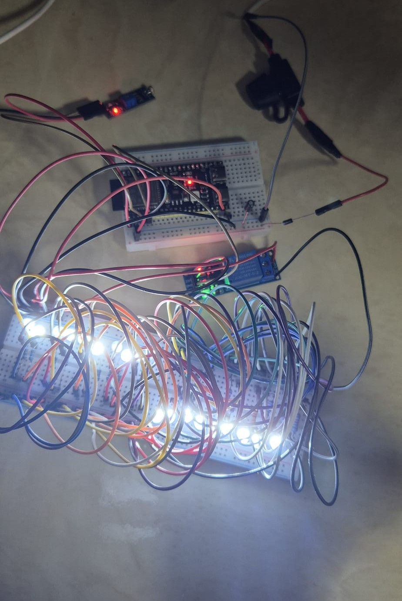

# Smart cities learning group goal: Realise

- Name: Gurpreet Singh
- Date: 16-03-2026

## Table of Contents
- [Smart cities learning group goal: Realise](#smart-cities-learning-group-goal-realise)
  - [Table of Contents](#table-of-contents)
  - [1. Introduction](#1-introduction)
  - [2. Methodology](#2-methodology)
  - [3. Working method](#3-working-method)
  - [4. Main realisation question and subquestions](#4-main-realisation-question-and-subquestions)
  - [5. Tools used](#5-tools-used)
  - [6. Goal of the realisation phase](#6-goal-of-the-realisation-phase)
  - [7. Starting point from the previous phases](#7-starting-point-from-the-previous-phases)
  - [8. Components and setup used](#8-components-and-setup-used)
  - [9. Implementation process](#9-implementation-process)
    - [9.1 Building the breadboard setup](#91-building-the-breadboard-setup)
    - [9.2 Connecting the LDR module](#92-connecting-the-ldr-module)
    - [9.3 Connecting the relay module](#93-connecting-the-relay-module)
    - [9.4 Connecting the LEDs and resistors](#94-connecting-the-leds-and-resistors)
    - [9.5 Adding the fuse holder, diode, and capacitor](#95-adding-the-fuse-holder-diode-and-capacitor)
    - [9.6 Uploading and testing the code](#96-uploading-and-testing-the-code)
    - [9.7 Subconclusion](#97-subconclusion)
  - [10. Problems encountered and solutions](#10-problems-encountered-and-solutions)
  - [11. Result of the realisation](#11-result-of-the-realisation)
  - [12. Evaluation of the prototype](#12-evaluation-of-the-prototype)
  - [13. Final conclusion](#13-final-conclusion)
  - [14. Recommendations](#14-recommendations)
  - [15. Sources](#15-sources)

## 1. Introduction

This realise report is part of the Smart Cities Learning Group project. In this phase, the design from the previous phase was physically built and tested as a working Sprint 1 prototype. The purpose of this phase was to realise the automatic smart streetlight in practice and to evaluate whether the prototype works as intended.

After the analysis and design phases, it was already clear which components had to be used, which GPIO connections were suitable, and how the power supply path should be structured. The next step was to translate that design into a physical breadboard setup and to verify whether the prototype would function correctly in practice.

This report therefore focuses on the implementation of the prototype, the code that was used, the realised result, and the practical evaluation of the working system.

## 2. Methodology

For this realise report, several methods were used:

- building the prototype physically on a breadboard based on the earlier design;
- connecting the selected components according to the intended wiring structure;
- uploading and running the Arduino code on the ESP32-S3;
- testing the behaviour of the prototype under light and dark conditions;
- observing whether the LDR module, relay module, and LED circuit worked together correctly;
- evaluating the realised setup based on both functionality and practical build quality.

This approach was chosen because the realisation phase had to show whether the conclusions from the analysis and design phases could actually be implemented in a working prototype.

## 3. Working method

The realisation process was carried out step by step. First, the design from the previous phase was used as the starting point for the breadboard setup. The ESP32-S3, the LDR module, the relay module, the LEDs, the resistors, and the protected power input section were then connected in a logical order.

After the hardware was built, the code was uploaded to the ESP32-S3. The prototype was then tested by changing the amount of light reaching the LDR module. During these tests, it was checked whether the light value changed correctly, whether the relay switched as expected, and whether the LED circuit turned on and off in response to light and dark conditions.

By working in this way, the realisation phase followed the same logic as the previous phases: first using the earlier conclusions, then implementing them physically, and finally evaluating the result in practice.

## 4. Main realisation question and subquestions

The main realisation question of this report is:

How can the designed automatic smart streetlight prototype with the ESP32-S3 be physically built and tested as a working Sprint 1 prototype?

To answer this main realisation question, the following subquestions were formulated:

1. How can the design from the previous phase be translated into a physical breadboard setup?
2. How should the ESP32-S3, LDR module, relay module, LEDs, resistors, and protected power input be connected in practice?
3. Does the uploaded code allow the prototype to switch automatically based on ambient light?
4. What practical problems occurred during the implementation?
5. To what extent does the realised prototype meet the intended Sprint 1 goal?

## 5. Tools used

For this realise report, the following tools were used:

- the components and setup described in the report;
- VScode with Arduino CLI and Arduino Maker Workshop extension for uploading the code to the ESP32-S3;
- the earlier analysis and design reports as implementation references;
- Scribbr for formatting references correctly;
- ChatGPT for support with language use, phrasing, spelling, and grammar.

## 6. Goal of the realisation phase

The goal of this realisation phase was to physically build the automatic smart streetlight prototype on a breadboard based on the earlier analysis and design. The prototype had to measure ambient light with the LDR module and switch the LED circuit on and off through the relay module.

## 7. Starting point from the previous phases

The realisation phase was based on the conclusions from the analysis and design phases. From those phases, it was already clear which components were needed, which GPIO pins should be used, and how the circuit should be structured on the breadboard.

The prototype was built using:

- ESP32-S3 as the controller;
- LDR module as the light sensor input;
- relay module as the switching component;
- white LEDs with individual 220 ohm resistors as the light output;
- an external power setup with additional protection and stability components.

## 8. Components and setup used

For this prototype, the following components were used:

- 1x ESP32-S3
- 1x LDR module
- 1x relay module
- 20x white LEDs
- 20x 220 ohm resistors
- jumper wires (M2M and F2M)
- 1x breadboard
- 1x adapter with 5 V / 1 A output
- 1x fuse holder with 1 A fuse
- 1x 1N4007 diode
- 1x 1000 µF / 25 V electrolytic capacitor

## 9. Implementation process

This chapter describes how the prototype was built in practice.

### 9.1 Building the breadboard setup

The first step was to place the ESP32-S3 on the breadboard and prepare the breadboard rails for power and ground. After that, the LEDs, resistors, relay module, and LDR module were placed according to the design.

Because the circuit contains many LEDs and jumper wires, it was important to build the setup step by step instead of connecting everything at once.

### 9.2 Connecting the LDR module

The LDR module was connected to the ESP32-S3 so that the light level could be read through the analog signal. In this prototype, the LDR module was connected to GPIO4.

The LDR module was used as the input component of the system. Its task was to detect whether the environment was light or dark enough for the streetlight to switch.

### 9.3 Connecting the relay module

The relay module was connected to the ESP32-S3 as the switching component of the prototype. In this setup, the relay input was connected to GPIO5.

The purpose of the relay module was to switch the LED circuit on and off without placing the full LED load directly on an ESP32-S3 GPIO pin.

### 9.4 Connecting the LEDs and resistors

The LEDs were connected on the breadboard in a repeated structure. Each LED was combined with its own 220 ohm resistor. This was done to keep the LED circuit electrically safer and more consistent.

The LEDs form the visible light output of the prototype. When the relay is activated, the LED circuit receives power and the streetlight turns on.

### 9.5 Adding the fuse holder, diode, and capacitor

In addition to the main components, the realised prototype also included a fuse holder, a diode, and an electrolytic capacitor in the power setup.

The fuse holder was included as overcurrent protection. The diode was added as reverse polarity protection, so that the circuit would be better protected if the power connection were reversed. The electrolytic capacitor was added to support voltage stability in the power line.

These components were part of the realised setup because the design was not only intended to work for the current Sprint 1 situation, but also to be safer and more future-oriented.

### 9.6 Uploading and testing the code

After the hardware was connected, the code was uploaded to the ESP32-S3. The prototype was then tested by changing the amount of light reaching the LDR module.

The code used in this prototype was based on the logic from the YouTube orientation source that was also discussed earlier in `analysis.md`, namely *ESP32 Light Sensor Relay Control - Smart Automation with Wokwi!* by [(sm Tronics, 2025)](https://www.youtube.com/watch?v=V28G_EmqRHg). That source was used as the practical starting point for the automatic light switching logic. After that, the code was checked against the Arduino Language Reference to better understand and verify the functions and structure that were used, such as `pinMode()`, `digitalWrite()`, `analogRead()`, and `delay()`. [(Language Reference | Arduino Documentation, n.d.)](https://docs.arduino.cc/language-reference/)

The following code was used for the prototype:

```cpp
#include <Arduino.h> // Include the arduino library for basic functions like pinMode, digitalWrite, and analogRead

#define LDR_PIN 4 // Pin that reads the LDR module
#define RELAY_PIN 5 // Pin that controls the relay module

int lightLevel = 0; // lightlevel to store the light level read from the LDR module
int threshold = 650; // threshold value to determine when to turn the light on or off

// setup() is a function that runs once when the system starts/resets. It is used to initialize the system.
void setup() {
  Serial.begin(115200); // Enable Serial (USB to ESP32S3) communication for debugging.
  pinMode(LDR_PIN, INPUT); // Set the LDR module pin as an input
  pinMode(RELAY_PIN, OUTPUT); // Set the relay module pin as an output
  Serial.println("Automatic Street Light System"); // Print to the Serial Monitor when the system starts
}

// loop() is an infinite loop that runs everything inside this function in order then starts again from the top.
void loop() {
  updateStreetLight(); // Update the street light status based on the current light level
  delay(1000); // Wait for 1 second before the next reading
}

/**
 * This function reads the light level from the LDR module and updates the relay status.
 */
void updateStreetLight() {

  // lightLevel reads the analog value from the LDR module
  lightLevel = analogRead(LDR_PIN);

  // Print to the Serial Monitor for debugging
  Serial.print("Light Level: ");
  Serial.println(lightLevel);

  // Compare the lightLevel with the threshold to decide whether to turn the light on or off
  if (lightLevel > threshold) {
    digitalWrite(RELAY_PIN, HIGH); // Turn the relay on (light on)
    Serial.println("It's dark! Turning light on...");
  } else {
    digitalWrite(RELAY_PIN, LOW); // Turn the relay off (light off)
    Serial.println("It's bright! Turning light off...");
  }
}
```
During testing, it was checked whether the measured light value changed when the LDR was covered or exposed to more light, and whether the relay and LED circuit responded correctly to that change.

### 9.7 Subconclusion

The implementation process resulted in a physically built prototype in which the ESP32-S3, LDR module, relay module, LED circuit, and protected power path were all connected and tested together. This means that the design was successfully translated into a working implementation.

## 10. Problems encountered and solutions

During the realisation phase, I did not encounter major technical problems that prevented the prototype from working. The system was realised successfully and the basic functionality worked.

The main practical issue was that the breadboard became crowded because of the large number of jumper wires. As a result, it became harder to immediately see which wire belonged to which connection. This reduced the visual clarity of the setup.

At this stage, I did not fully redesign the wiring, because the prototype was already functioning correctly. However, this is an important improvement point for a later version. A cleaner wire layout would make the prototype easier to understand, troubleshoot, and reproduce.

## 11. Result of the realisation

The result of this phase is a working Sprint 1 prototype of the automatic smart streetlight.

The prototype is able to:

- detect ambient light through the LDR module;
- process the measured value with the ESP32-S3;
- switch the relay module on and off;
- turn the LED circuit on in darker conditions and off in lighter conditions.


*Working smart streetlight prototype with ESP32-S3, LDR module, relay module, LED circuit, and protected power input section. Source: created by me.*

## 12. Evaluation of the prototype

The prototype works as a first realised version of the Sprint 1 smart streetlight. The most important result is that the system is able to detect light and automatically switch the LED circuit through the relay module.

A strong point of the realised prototype is that it follows the logic developed in the analysis and design phases. This means that the earlier choices about the components, GPIO use, power setup, and switching logic were realistic enough to apply in practice.

At the same time, the realisation phase also showed that physical implementation can become visually unclear when many jumper wires are used. Even if the prototype works, the wire layout can still be improved. For a later version, it would be better to make the power and signal wiring more structured so that the setup becomes easier to read and maintain.

Overall, the realisation phase can be considered successful, because the prototype demonstrates the intended Sprint 1 behaviour. At the same time, the realised version can still be improved further in clarity and build quality.

## 13. Final conclusion

This realise report described how the Sprint 1 automatic smart streetlight prototype was physically built and tested based on the results of the earlier analysis and design phases.

First, the selected components and the designed breadboard layout were used as the basis for implementation. The ESP32-S3 was used as the controller, the LDR module as the light sensor input, the relay module as the switching component, and the white LEDs with separate 220 ohm resistors as the light output. In addition, the realised setup included a protected power input section consisting of an adapter, a fuse holder with fuse, a 1N4007 diode, and a 1000 µF / 25 V electrolytic capacitor.

Second, the code was uploaded to the ESP32-S3 and the working behaviour of the prototype was tested in practice. These tests showed that the system is able to measure the ambient light level, compare that value with the threshold in the code, and switch the relay and LED circuit automatically between light and dark conditions.

Third, the realisation phase showed that the design from the previous phase could be translated into a working breadboard prototype. This means that the earlier design choices were not only theoretically justified, but also practically applicable.

At the same time, the implementation also showed that the physical setup becomes visually crowded when many jumper wires are used. Although this did not prevent the prototype from working, it does show that the build quality and readability of the wiring can still be improved in a later version.

Based on this realise report, it can be concluded that the Sprint 1 goal was achieved: the automatic smart streetlight prototype was successfully realised as a working breadboard system that responds to ambient light and switches the LED circuit automatically.

This realisation phase also provides the practical basis for the next phase: the advising phase. Because the prototype now works in practice, it becomes possible to evaluate not only whether the chosen relay-based solution functions, but also whether it is the most suitable solution for further development. In the advising phase, the realised prototype will therefore be used as input for comparing the current relay-based design with possible alternatives such as a transistor-based or MOSFET-based switching design, in order to determine which solution should be recommended for a next version of the smart streetlight.

## 14. Recommendations

Based on this realise report, the following recommendations are made for the next phase of the project:

1. Keep this working prototype as the practical basis for further development.

2. Improve the jumper wire layout in a later version to make the circuit clearer, easier to troubleshoot, and easier to reproduce.

3. Test the threshold value further in practice to determine the most stable switching point under different light conditions.

4. Check whether the protected power input section continues to work reliably during longer testing.

5. Use the results of this realisation phase as direct input for the advising phase. In that phase, the current relay-based design should be evaluated against possible alternatives, such as my current relay or a MOSFET-based switching design, in order to determine which solution is the most suitable recommendation for a future version of the smart streetlight.

## 15. Sources

1. [analysis.md](https://gitlab.fdmci.hva.nl/studio/smart-cities/projecten/2025-2026-semester-2/city-sim-learning-group/city-the-embedded-alliance-city-sim-learning-group/-/blob/main/docs/Gurpreet/Learning%20goals/Analysis/Sprint%201/analysis.md?ref_type=heads#smart-cities-learning-group-goal-analysis)

2. [design.md](https://gitlab.fdmci.hva.nl/studio/smart-cities/projecten/2025-2026-semester-2/city-sim-learning-group/city-the-embedded-alliance-city-sim-learning-group/-/blob/main/docs/Gurpreet/Learning%20goals/Design/Sprint%201/design.md?ref_type=heads#smart-cities-learning-group-goal-design)

3. sm Tronics. (2025, 12 January). ESP32 Light Sensor Relay Control - Smart Automation with Wokwi! [Video]. YouTube. [https://www.youtube.com/watch?v=V28G_EmqRHg](https://www.youtube.com/watch?v=V28G_EmqRHg) viewed on 11 February 2026

4. Language reference | Arduino documentation. (n.d.). [https://docs.arduino.cc/language-reference/](https://docs.arduino.cc/language-reference/) viewed on 11 February 2026