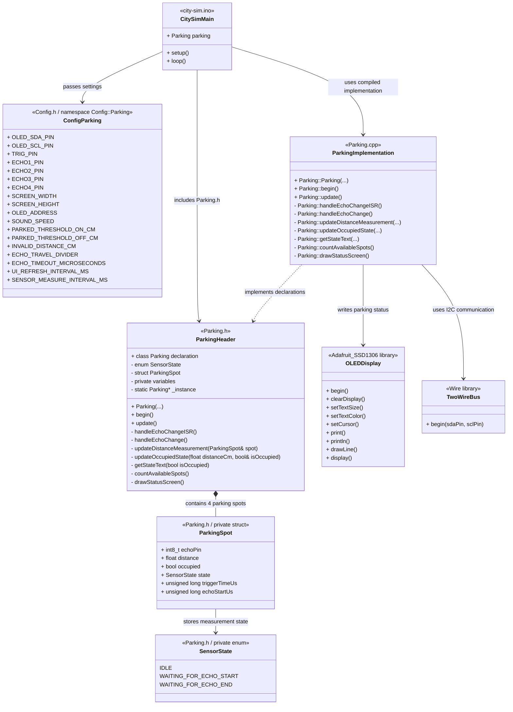

# Realise: Smart parking occupancy detection using ESP32-S3 (4 Parking Spaces)

- **Author:** Gurpreet Singh  
- **Date:** 29-04-2026  
- **Version:** 2.0  
- **Classification:** Internal  
- **Client:** Mayor Mats Otten  
- **Company:** The Embedded Alliance  

## Table of Contents

- [1. Introduction](#1-introduction)
- [2. Main question and subquestions](#2-main-question-and-subquestions)
- [3. Methodology](#3-methodology)
- [4. Chapter 1: Working implementation](#4-chapter-1-working-implementation)
    - [4.1 Introduction](#41-introduction)
      - [4.2 GitLab source code](#42-gitlab-source-code)
        - [4.2.1 File-based class diagram](#421-file-based-class-diagram)
        - [4.2.2 Scalability and future expansion](#422-scalability-and-future-expansion)
    - [4.3 Integration in the shared project](#43-integration-in-the-shared-project)
    - [4.4 Subconclusion](#44-subconclusion)
- [5. Chapter 2: Important technical choices](#5-chapter-2-important-technical-choices)
    - [5.1 Introduction](#51-introduction)
    - [5.2 Avoiding blocking `pulseIn()` logic](#52-avoiding-blocking-pulsein-logic)
    - [5.3 My non-blocking measurement structure](#53-my-non-blocking-measurement-structure)
    - [5.4 Interrupt-based echo handling](#54-interrupt-based-echo-handling)
    - [5.5 Static instance and custom interrupt function](#55-static-instance-and-custom-interrupt-function)
    - [5.6 IRAM\_ATTR and short interrupt logic](#56-iram_attr-and-short-interrupt-logic)
    - [5.7 Sequential sensor reading](#57-sequential-sensor-reading)
    - [5.8 Subconclusion](#58-subconclusion)
- [6. Chapter 3: Parking status logic and output](#6-chapter-3-parking-status-logic-and-output)
    - [6.1 Introduction](#61-introduction)
    - [6.2 Occupied and free detection](#62-occupied-and-free-detection)
    - [6.3 OLED display output](#63-oled-display-output)
    - [6.4 Subconclusion](#64-subconclusion)
- [7. Final conclusion](#7-final-conclusion)
- [8. Recommendations](#8-recommendations)
- [9. References](#9-references)

---

## 1. Introduction

This document is written for The Embedded Alliance and Mayor Mats Otten.  
The context of this document is the realisation phase of the smart parking prototype for four parking spaces.

The purpose of this document is to show that the parking system has been built and works in practice using one ESP32-S3, four ultrasonic sensors, and an OLED display.

This document is written for the internal project team and project client. It assumes that the reader has basic prior knowledge of embedded systems and prototype development.

---

## 2. Main question and subquestions

The main question of this document is:

**How was the smart parking prototype successfully realised into a working system?**

To answer this question, the following subquestions were formulated:

1. How was the system implemented in code?
2. Which technical choices were important during development?
3. How does the system detect occupied and free parking spaces?
4. How is the result shown to the user?
5. Why is this implementation suitable for future expansion?

---

## 3. Methodology

This document was created using the following methods:

- building and testing the smart parking prototype in hardware
- programming the ESP32-S3 in VS Code using Arduino CLI
- implementing the parking system inside the existing library-like project structure
- creating a separate `Parking.h` and `Parking.cpp` component so the code fits the shared project setup
- replacing blocking ultrasonic measurement logic with non-blocking logic
- using interrupts to read the echo signal without stopping the rest of the program
- validating the parking status on the OLED display during testing.

These methods were chosen because the parking system had to work inside the existing shared Smart City project. The code could not be written as one loose `.ino` file, because it had to fit together with the streetlight, speed camera, and train signal components. The ultrasonic measurement also had to be non-blocking, because blocking logic such as `pulseIn()` would stop the main loop while waiting for an echo result.

---

## 4. Chapter 1: Working implementation

### 4.1 Introduction

This chapter answers the following subquestion:

**How was the system implemented in code?**

To answer this, the chapter shows where the working code is stored and how the parking component is integrated into the shared Smart City project.

### 4.2 GitLab source code

The complete working implementation is stored in GitLab using fixed commit permalinks. This is important because the linked code version will not change when the branch is updated later.

The relevant files are:

- [Parking.h](https://gitlab.fdmci.hva.nl/studio/smart-cities/projecten/2025-2026-semester-2/city-sim-learning-group/city-the-embedded-alliance-city-sim-learning-group/-/blob/3bd744e54a93ced2f31e8c30764443104ea6423e/embedded/city-sim/lib/Parking/Parking.h)  
- [Parking.cpp](https://gitlab.fdmci.hva.nl/studio/smart-cities/projecten/2025-2026-semester-2/city-sim-learning-group/city-the-embedded-alliance-city-sim-learning-group/-/blob/3bd744e54a93ced2f31e8c30764443104ea6423e/embedded/city-sim/lib/Parking/Parking.cpp)  
- [Config.h](https://gitlab.fdmci.hva.nl/studio/smart-cities/projecten/2025-2026-semester-2/city-sim-learning-group/city-the-embedded-alliance-city-sim-learning-group/-/blob/3bd744e54a93ced2f31e8c30764443104ea6423e/embedded/city-sim/lib/Config/Config.h)  
- [city-sim.ino](https://gitlab.fdmci.hva.nl/studio/smart-cities/projecten/2025-2026-semester-2/city-sim-learning-group/city-the-embedded-alliance-city-sim-learning-group/-/blob/3bd744e54a93ced2f31e8c30764443104ea6423e/embedded/city-sim/city-sim.ino)  

`Parking.h` contains the class definition, method declarations, sensor state structure, and private variables.  
`Parking.cpp` contains the working logic for measuring distance, handling interrupts, updating occupied status, and drawing the OLED screen.  
`Config.h` contains the pin numbers, threshold values, timeout settings, and OLED settings for the parking system.  
`city-sim.ino` creates the `Parking` object, calls `parking.begin()` in `setup()`, and calls `parking.update()` in `loop()` together with the other Smart City components.

In the following chapters, only the most relevant code snippets are included. The full implementation can be checked through the GitLab links above.

#### 4.2.1 File-based class diagram

To make the software structure clear, the class diagram below shows how the parking component is divided over the different project files. This is a file-based class diagram, because it shows both the software structure and the files where the code is placed. This was added to make the GitLab source code easier to understand.



The diagram shows that the parking system is divided over four important files: `city-sim.ino`, `Config.h`, `Parking.h` and `Parking.cpp`.

`city-sim.ino` is the main project file. This file creates the `Parking` object and passes the required values from `Config::Parking` into the constructor. In `setup()`, it starts the parking component by calling `parking.begin()`. In `loop()`, it keeps the parking component active by calling `parking.update()`. This keeps the main file clean, because the detailed parking logic is not written directly inside `city-sim.ino`.

`Config.h` contains the namespace `Config::Parking`. This namespace stores the configuration values for the parking system, such as the trigger pin, echo pins, OLED pins, screen size, threshold values and timing values. These values are placed in `Config.h` so they are not hardcoded inside the parking logic. This makes the code easier to adjust during testing, because pin numbers and threshold values can be changed in one clear place.

`Parking.h` defines the structure of the parking component. It contains the `Parking` class declaration, the private `ParkingSpot` struct, the private `SensorState` enum, the member variables and the method declarations. This file shows what the parking component contains and which functions belong to it.

`Parking.cpp` contains the implementation of the methods declared in `Parking.h`. This includes the constructor, hardware setup, update loop, interrupt handling, non-blocking distance measurement, occupied/free detection and OLED output. This separation makes the code easier to maintain, because the header file shows the structure and the `.cpp` file shows how the logic works.

Although `Parking.h` and `Parking.cpp` are shown separately in the diagram, together they form the complete `Parking` component.

The `ParkingSpot` struct is placed inside the `Parking` class because it is only used by the parking component. Each parking spot needs to store the same type of data: the echo pin, the last measured distance, the occupied state, the current measurement state and timing values. This is cleaner than creating separate variables for each sensor.

The `SensorState` enum is also placed inside the `Parking` class because it only belongs to the ultrasonic measurement process. It divides the measurement into three steps: `IDLE`, `WAITING_FOR_ECHO_START` and `WAITING_FOR_ECHO_END`. This makes the measurement easier to follow and supports the non-blocking structure of the code.

The `TwoWire` and `Adafruit_SSD1306` library objects are included in the diagram because the parking component uses them to communicate with the OLED display. The `TwoWire` object is used for I2C communication, while the `Adafruit_SSD1306` object is used to draw the parking status on the display.

Overall, this structure was chosen to keep the parking functionality separated from the rest of the Smart City project. The main file only starts and updates the component, the configuration file stores adjustable values, the header file defines the structure, and the implementation file contains the working logic.

The access modifiers in the `Parking` class were also chosen deliberately. Only the constructor, `begin()` and `update()` are public, because these are the only functions that the main project file needs to use. The main file creates the parking object, starts it once with `begin()`, and keeps it running with `update()`.

The detailed functions, such as `updateDistanceMeasurement()`, `updateOccupiedState()`, `countAvailableSpots()` and `drawStatusScreen()`, are private because they are internal implementation details. They should not be called directly from `city-sim.ino` or from other components. This protects the parking logic from being used in the wrong way and keeps the component easier to maintain.

The `ParkingSpot` struct and `SensorState` enum are also private because they only belong to the internal parking measurement process. Other components do not need to know how one ultrasonic measurement is stored or which measurement state is currently active. They only need to start and update the parking component.

This structure follows encapsulation. The outside of the component stays simple, while the internal measurement logic remains hidden inside the `Parking` class.

The data types were also chosen with embedded development in mind. For GPIO pins, `uint8_t` is used instead of `int`, because pin numbers are small positive values and do not need a full integer type. On the ESP32-S3, an `int` normally uses 32 bits, while `uint8_t` uses 8 bits. This makes `uint8_t` a more precise type for pin numbers.

For the echo pin inside `ParkingSpot`, `int8_t` is used because the echo pin values are small. A smaller integer type matches the actual range of the stored data better than a full `int`. This does not make a large memory difference in this small prototype, but it shows that the data type was chosen based on the purpose of the value.

In the current code, `_activeEchoPin` is still stored as an `int`, because it can temporarily use `-1` when no echo pin is active. This is different from the fixed pin values, which are stored as `uint8_t`. In a future version, this could also be changed to `int8_t`, because the value only needs to store small GPIO pin numbers and `-1`.

Examples from the code are:

```cpp
uint8_t _trigPin;
uint8_t _oledSdaPin;
uint8_t _oledSclPin;
volatile int _activeEchoPin;
```

and:

```cpp
struct ParkingSpot {
  int8_t echoPin;
  float distance;
  bool occupied;
  SensorState state;
  unsigned long triggerTimeUs;
  unsigned long echoStartUs;
};
```

The other data types also match their purpose. `float` is used for distance values because the measured distance can include decimal values. `bool` is used for true/false states such as `occupied`, `_echoRiseDetected` and `_echoMeasurementDone`. `unsigned long` is used for timing values from `micros()` and `millis()`, because these Arduino timing functions return unsigned long values.

This makes the code more explicit. Small pin values are stored in small integer types, decimal measurements are stored as `float`, true/false states are stored as `bool`, and timing values are stored in the same type as the Arduino timing functions return.

#### 4.2.2 Scalability and future expansion

The current implementation is made for four parking spaces. This can be seen in `Parking.h`, where the parking spots are stored in a fixed-size array.

```cpp
ParkingSpot _parkingSpots[4];
```

The implementation is partly scalable because several parts of the code already work with the size of this array instead of manually repeating the same logic for each parking spot. For example, the total number of parking spots is calculated using the size of the array.

```cpp
const int8_t TOTAL_SPOTS = sizeof(_parkingSpots) / sizeof(_parkingSpots[0]);
```

This approach is used in functions such as `begin()`, `update()`, `countAvailableSpots()` and `drawStatusScreen()`. Because of this, the code can loop through the available parking spots instead of using separate code for parking spot 1, parking spot 2, parking spot 3 and parking spot 4. This makes the current implementation easier to maintain.

However, the current version is not fully scalable yet. The number of parking spaces is still fixed to four in the array, and the constructor also receives four echo pins separately.

```cpp
Parking(uint8_t trigPin, uint8_t echo1Pin, uint8_t echo2Pin,
        uint8_t echo3Pin, uint8_t echo4Pin, ...);
```

This means that scaling the system from four parking spaces to, for example, eight or twelve parking spaces would still require changes in multiple places. The array size in `Parking.h` would need to be changed, extra echo pins would need to be added in `Config.h`, the constructor would need to be adjusted, and the OLED layout would need to be redesigned.

The current OLED display is also a limitation for scaling. A 128×64 OLED display is suitable for showing four parking spaces and a free-space counter, but it does not have much room for a larger parking area. If more parking spaces are added, the output may need to be moved to a larger display, a dashboard, or a web interface.

The current design is therefore scalable at a structural level, but not yet fully scalable at a configuration level. The logic is already grouped inside one reusable component and uses an array-based structure, but the amount of parking spaces is still hardcoded.

For a future version, the echo pins could be passed as an array instead of four separate constructor arguments. The number of parking spaces could also be stored as a configurable value. This would make it easier to expand the system without changing the class definition every time an extra parking space is added.

A possible future structure could look like this:

```cpp
Parking(uint8_t trigPin,
        const uint8_t echoPins[],
        int numberOfParkingSpots,
        ...);
```

With this structure, the parking component would receive a list of echo pins and the number of parking spots. That would make the component more flexible for larger parking areas.

Another point for scaling is ultrasonic interference. The current system measures the sensors one by one, which reduces the chance that the echo from one sensor is detected by another sensor. This sequential measurement approach should be kept when scaling the system, because measuring multiple ultrasonic sensors at the same time can cause unreliable distance readings.

In conclusion, the current implementation is a good base for future expansion, but extra refactoring would be needed before it can support a larger number of parking spaces in a clean and flexible way.


### 4.3 Integration in the shared project

The parking system is not written as one loose `.ino` file. It is implemented as a separate component inside the existing library-like project structure.

This means the parking functionality can run next to the other components in the same project, such as:

- streetlight.
- speed camera.
- train signal.

The main file only starts and updates the component. The detailed parking logic stays inside `Parking.h` and `Parking.cpp`. This keeps the shared project cleaner and makes the parking system easier to maintain or extend later.

```cpp
Parking parking(Config::Parking::TRIG_PIN, Config::Parking::ECHO1_PIN, Config::Parking::ECHO2_PIN,
                Config::Parking::ECHO3_PIN, Config::Parking::ECHO4_PIN,
                Config::Parking::OLED_SDA_PIN, Config::Parking::OLED_SCL_PIN,
                Config::Parking::SCREEN_WIDTH, Config::Parking::SCREEN_HEIGHT,
                Config::Parking::OLED_ADDRESS, Config::Parking::SOUND_SPEED,
                Config::Parking::PARKED_THRESHOLD_ON_CM, Config::Parking::PARKED_THRESHOLD_OFF_CM,
                Config::Parking::INVALID_DISTANCE_CM, Config::Parking::ECHO_TRAVEL_DIVIDER,
                Config::Parking::ECHO_TIMEOUT_MICROSECONDS, Config::Parking::UI_REFRESH_INTERVAL_MS,
                Config::Parking::SENSOR_MEASURE_INTERVAL_MS);
```

This snippet shows that the parking component is created in the main project file using values from `Config.h`. This keeps the parking settings separated from the main program logic.

```cpp
void setup() {
  lamp.begin();
  eink.begin();
  eink.startSyncTask();
  trainSignal.begin();
  speedCamera.begin();
  parking.begin();
}

void loop() {
  lamp.update();
  trainSignal.update();
  speedCamera.update();
  parking.update();
}
```
This snippet shows that the parking component is initialized once in `setup()` and updated continuously in `loop()`. The main loop stays simple, because the detailed parking logic is handled inside the `Parking` class.

### 4.4 Subconclusion

Based on this chapter, it can be concluded that the parking system was implemented as a working component inside the shared Smart City project structure. The code is stored with fixed GitLab permalinks and can be checked directly in the linked files.

---

## 5. Chapter 2: Important technical choices

### 5.1 Introduction

This chapter answers the following subquestion:

**Which technical choices were important during development?**

To answer this, this chapter explains the most important implementation choices in the parking system. The focus is on why `pulseIn()` was not used, how the echo signal is handled with interrupts, how the static instance structure was implemented, and how the four sensors are measured one by one.

### 5.2 Avoiding blocking `pulseIn()` logic

The first important technical choice was not using `pulseIn()` for the ultrasonic measurements.

`pulseIn()` can block the program while it waits for a pulse to start or end. The Robotics Back-End explains that with a timeout, `pulseIn()` can block the full program for a certain amount of time, depending on the signal and timeout value. It also explains that this can be avoided by using interrupts to store the start and end time of a pulse instead of waiting inside `pulseIn()` [(Ed, 2021)](https://roboticsbackend.com/arduino-pulsein-with-interrupts/#The_interrupt_function_%E2%80%93_detect_the_pulse).

This was important for my implementation because the parking system is not the only component in the project. The same `city-sim.ino` file also runs other components, such as the streetlight, speed camera, and train signal. If the parking code blocks while waiting for one ultrasonic echo, the other components can also be delayed. That would not fit the shared Smart City project.

Therefore, I used a non-blocking approach. The parking system does not wait inside one blocking function until the ultrasonic measurement is done. Instead, the measurement is checked step by step inside `parking.update()`.

### 5.3 My non-blocking measurement structure

The non-blocking structure in my code is built around the function:

`updateDistanceMeasurement(ParkingSpot& spot)`

This function does not finish the full measurement in one blocking call. Instead, it checks which step the current parking sensor is in and returns `false` when the measurement is still running. It returns `true` when the measurement is finished or when a timeout happens.

For this, I created my own measurement states:

- `IDLE`
- `WAITING_FOR_ECHO_START`
- `WAITING_FOR_ECHO_END`

```cpp
enum SensorState { IDLE, WAITING_FOR_ECHO_START, WAITING_FOR_ECHO_END };

struct ParkingSpot {
  int8_t echoPin;
  float distance;
  bool occupied;
  SensorState state;
  unsigned long triggerTimeUs;
  unsigned long echoStartUs;
};
```
This snippet shows that each parking spot stores its own echo pin, measured distance, occupied state and current measurement state. This makes it possible to continue a measurement step by step instead of blocking the full program.

These state names are my own implementation choice. They are not copied from the source. I used them to make the measurement flow clear in my own `Parking` component.

The flow works like this:

1. In `IDLE`, the code selects the active echo pin, resets the interrupt flags, attaches the interrupt, and sends the 10 microsecond trigger pulse.
2. In `WAITING_FOR_ECHO_START`, the code waits until the interrupt detects that the echo signal has gone HIGH.
3. In `WAITING_FOR_ECHO_END`, the code waits until the interrupt detects that the echo signal has gone LOW.
4. When the measurement is finished, the distance is calculated and the sensor state is reset to `IDLE`.

The following shortened snippet shows the first measurement step:
```cpp
bool Parking::updateDistanceMeasurement(ParkingSpot& spot) {
  unsigned long currentMicros = micros();

  switch (spot.state) {

    case IDLE:
      _activeEchoPin = spot.echoPin;

      _echoRiseDetected = false;
      _echoMeasurementDone = false;
      _echoStartUsInterrupt = 0;
      _echoEndUsInterrupt = 0;

      attachInterrupt(digitalPinToInterrupt(_activeEchoPin),
                      handleEchoChangeISR,
                      CHANGE);

      digitalWrite(_trigPin, LOW);
      delayMicroseconds(2);
      digitalWrite(_trigPin, HIGH);
      delayMicroseconds(10);
      digitalWrite(_trigPin, LOW);

      spot.triggerTimeUs = micros();
      spot.state = WAITING_FOR_ECHO_START;

      return false;
```
This snippet shows the first measurement step. The active echo pin is selected, the interrupt values are reset, the interrupt is attached and the ultrasonic trigger pulse is sent. The function then returns `false`, because the measurement has started but is not finished yet.
Only the `IDLE` part of the function is shown here, because this part shows how the measurement is started without blocking the full program.

This approach lets the rest of the program continue running between measurement steps. That is the important part. The source gave me the idea of measuring an ultrasonic sensor without blocking the main loop, but the state structure itself was made for my own parking code [(Instructables, 2017)](https://www.instructables.com/Non-blocking-Ultrasonic-Sensor-for-Arduino/).

### 5.4 Interrupt-based echo handling

The echo signal is measured with interrupts.[(AttachInterrupt() | Arduino Documentation, n.d.)](https://docs.arduino.cc/language-reference/en/functions/external-interrupts/attachInterrupt/) and [(DigitalPinToInterrupt() | Arduino Documentation, n.d.)](https://docs.arduino.cc/language-reference/en/functions/external-interrupts/digitalPinToInterrupt/) explains that `attachInterrupt()` can attach an interrupt service routine to a pin and that the recommended syntax is to use `digitalPinToInterrupt(pin)` as the first argument. It also explains that `CHANGE` can be used when the interrupt should react to both HIGH and LOW changes [(AttachInterrupt() | Arduino Documentation, n.d.)](https://docs.arduino.cc/language-reference/en/functions/external-interrupts/attachInterrupt/). The separate Arduino page for `digitalPinToInterrupt()` explains that this function checks whether a pin can be used as an interrupt pin and returns the interrupt value for that pin [(DigitalPinToInterrupt() | Arduino Documentation, n.d.)](https://docs.arduino.cc/language-reference/en/functions/external-interrupts/digitalPinToInterrupt/).

In my code, this is used here:

```cpp
attachInterrupt(digitalPinToInterrupt(_activeEchoPin), handleEchoChangeISR, CHANGE);
```

```cpp
void IRAM_ATTR Parking::handleEchoChangeISR() {
  if (_instance != NULL) {
    _instance->handleEchoChange();
  }
}
```
This snippet shows that the active echo pin is connected to an interrupt. The interrupt service routine does not contain the full logic itself, but forwards the pin change to the active `Parking` object.


This means the active echo pin is watched for both changes:

- LOW to HIGH = echo started
- HIGH to LOW = echo ended.

Inside `handleEchoChange()`, the code reads the active echo pin. When the pin becomes HIGH, it stores the start time with `micros()`. When the pin becomes LOW, it stores the end time and marks the measurement as finished.

This matches the interrupt idea from [(Ed, 2021)](https://roboticsbackend.com/arduino-pulsein-with-interrupts/#The_interrupt_function_%E2%80%93_detect_the_pulse), where the pulse start and pulse end are stored using an interrupt and the pulse duration is calculated later.

After the measurement is finished or a timeout happens, my code calls:

`detachInterrupt(digitalPinToInterrupt(_activeEchoPin));`

The Arduino documentation explains that `detachInterrupt()` turns off a previously attached interrupt [(DetachInterrupt() | Arduino Documentation, n.d.)](https://docs.arduino.cc/language-reference/en/functions/external-interrupts/detachInterrupt/). I use this so that only the active sensor is listened to during its measurement.

### 5.5 Static instance and custom interrupt function

A specific challenge was that the interrupt service routine cannot directly call a normal class method in the same way as regular code.

The [(Instructables, 2017)](https://www.instructables.com/Non-blocking-Ultrasonic-Sensor-for-Arduino/) example uses a static instance pointer in the `HC_SR04` class. In that example, the class stores a static `_instance`, and the interrupt function retrieves that instance to access the object data.

I used the same idea, but adapted it to my own `Parking` class.

In `Parking.h`, I declared:

```cpp
static Parking* _instance;
```

In `Parking.cpp`, I start with no active object:

```cpp
Parking* Parking::_instance = NULL;
```

In `begin()`, the current object is connected to the static pointer. The snippet below only shows the relevant line from the full `begin()` function.

```cpp
void Parking::begin() {
  _instance = this;
}
```

Then the static interrupt function forwards the interrupt to the active object:

```cpp
void IRAM_ATTR Parking::handleEchoChangeISR() {
  if (_instance != NULL) {
    _instance->handleEchoChange();
  }
}
```
These snippets show how the static instance connects the interrupt function to the active `Parking` object. This allows the interrupt to call `handleEchoChange()` while the rest of the parking logic remains inside the class.

This is important because the detailed logic still stays inside the `Parking` class. Without this static instance structure, the interrupt logic would have to be placed outside the class, which would make the code less clean and less reusable. Since the project already uses a library-like structure, keeping the parking logic inside `Parking.h` and `Parking.cpp` was the better choice.

### 5.6 IRAM_ATTR and short interrupt logic

Because this runs on an ESP32-S3, the interrupt functions use `IRAM_ATTR`.

The Last Minute Engineers source explains that ESP32 interrupt service routines should be short and fast, should avoid slow operations such as `delay()` and `Serial.print()`, and should mainly set flags or store values for the main program to process later. It also explains that `IRAM_ATTR` is used so the interrupt routine is stored in internal RAM instead of flash memory [(Prabhu, 2026)](https://lastminuteengineers.com/handling-esp32-gpio-interrupts-tutorial/).

That is why my interrupt logic does not calculate the distance directly inside the interrupt. It only stores:

```cpp
void IRAM_ATTR Parking::handleEchoChange() {
  if (_activeEchoPin < 0) {
    return;
  }

  int pinState = digitalRead(_activeEchoPin);
  unsigned long nowUs = micros();

  if (!_echoRiseDetected && pinState == HIGH) {
    _echoStartUsInterrupt = nowUs;
    _echoRiseDetected = true;
  }

  else if (_echoRiseDetected && pinState == LOW) {
    _echoEndUsInterrupt = nowUs;
    _echoMeasurementDone = true;
  }
}
```
This snippet shows that the interrupt only stores timing values and flags. The distance calculation is not done inside the interrupt. This keeps the interrupt routine short and suitable for the ESP32-S3.

The actual distance calculation happens later in `updateDistanceMeasurement()`. This keeps the interrupt short and makes the code safer for the ESP32-S3.

### 5.7 Sequential sensor reading

The parking system uses four ultrasonic sensors, but they are not measured at the same time.

In my code, `_currentSensorIndex` decides which parking sensor is currently active. The system measures one sensor, updates the occupied state when the measurement is finished, and then moves to the next sensor.

The flow is:

1. measure current sensor
2. wait until the measurement is finished or timed out
3. update occupied/free status
4. increase `_currentSensorIndex`
5. return to sensor 1 after sensor 4.
   
```cpp
bool measurementFinished = updateDistanceMeasurement(_parkingSpots[_currentSensorIndex]);

if (measurementFinished) {
  updateOccupiedState(_parkingSpots[_currentSensorIndex].distance,
                      _parkingSpots[_currentSensorIndex].occupied);

  _currentSensorIndex++;

  if (_currentSensorIndex >= TOTAL_SPOTS) {
    _currentSensorIndex = 0;
  }
}
```
This snippet shows that only one sensor is measured at a time. The system only moves to the next sensor when the current measurement is finished. After the fourth sensor, the index is reset to zero.

This fits the design choice from the previous document. It keeps the measurement flow controlled and reduces the chance that the echo signal from one ultrasonic sensor is mixed with another sensor.

### 5.8 Subconclusion

Based on this chapter, it can be concluded that the most important technical choices were avoiding `pulseIn()`, using interrupts for the echo signal, adapting the static instance structure from the non-blocking ultrasonic sensor example, using `IRAM_ATTR` for ESP32 interrupt safety, and measuring the sensors one by one. These choices made the parking system fit better inside the existing shared Smart City project structure.

---

## 6. Chapter 3: Parking status logic and output

### 6.1 Introduction

This chapter answers the following subquestion:

**How does the system detect occupied and free parking spaces?**

To answer this, the chapter discusses the threshold logic and the OLED output.

### 6.2 Occupied and free detection

The system uses distance thresholds to decide whether a parking space is occupied or free.

In the current configuration, the parking logic uses these values:

```cpp
namespace Parking {
  constexpr float PARKED_THRESHOLD_ON_CM = 5.0f;
  constexpr float PARKED_THRESHOLD_OFF_CM = 10.0f;
  constexpr float INVALID_DISTANCE_CM = -1.0f;
}
```

```cpp
void Parking::updateOccupiedState(float distanceCm, bool& isOccupied) {
  if (distanceCm < 0) {
    return;
  }

  if (!isOccupied && distanceCm < _parkedThresholdOnCm) {
    isOccupied = true;
  }
  else if (isOccupied && distanceCm > _parkedThresholdOffCm) {
    isOccupied = false;
  }
}
```
This snippet shows that invalid measurements are ignored. A free spot becomes occupied when the distance is below 5 cm. An occupied spot becomes free again when the distance is above 10 cm. The two thresholds prevent unstable switching when the measured distance is close to one limit.

Invalid measurements are stored as `-1.0`. When a measurement is invalid, the occupied state is not changed. This prevents one failed sensor reading from immediately changing the parking status.

### 6.3 OLED display output

The OLED display shows:

- parking spot 1 to 4
- `OCCUPIED` or `FREE`
- `NO DATA` when measurement fails
- total number of free spaces.

```cpp
for (int i = 0; i < TOTAL_SPOTS; i++) {
  _display.print("P");
  _display.print(i + 1);
  _display.print(": ");

  if (_parkingSpots[i].distance < 0) {
    _display.println("NO DATA");
  } else {
    _display.println(getStateText(_parkingSpots[i].occupied));
  }
}
```
```cpp
int availableSpots = countAvailableSpots();

_display.drawLine(78, 0, 78, 63, SSD1306_WHITE);
_display.setCursor(88, 4);
_display.println("Free");

_display.setTextSize(3);
_display.setCursor(95, 24);
_display.print(availableSpots);

_display.display();
```
These snippets show how the OLED output is created. The left side of the screen shows the state of each parking spot. The right side shows the total number of free spots.

This output is shown during the live demonstration.

### 6.4 Subconclusion

Based on this chapter, it can be concluded that the system correctly translates sensor measurements into clear parking status output.

---

## 7. Final conclusion

This document examined how the smart parking prototype was realised into a working system.

First, the parking system was successfully implemented inside the shared project structure.  
Second, the blocking `pulseIn()` approach was avoided because it would not fit well inside a shared project with multiple active components.  
Third, interrupt-based echo handling made it possible to store the echo start and end time without stopping the rest of the program.  
Fourth, the static instance structure made it possible to keep interrupt handling inside the `Parking` class structure.  
Fifth, parking status is clearly shown on the OLED display.

Based on the full implementation, it can be concluded that **the smart parking prototype was successfully realised and is ready for demonstration and future expansion.**

---

## 8. Recommendations

Based on this implementation, the following recommendations are made:

1. Test with real model vehicles for final calibration.
2. Fine-tune threshold values if needed.
3. Keep the non-blocking structure when adding new features.
4. Reuse the class structure for other Smart City systems.

---

## 9. References

1. Ed. (2021, September 28). Arduino PulseIn() with interrupts. The Robotics Back-End. [https://roboticsbackend.com/arduino-pulsein-with-interrupts/](https://roboticsbackend.com/arduino-pulsein-with-interrupts/) viewed on 21 April 2026.

2. Instructables. (2017a, oktober 10). Non-blocking Ultrasonic Sensor for Arduino. Instructables. [https://www.instructables.com/Non-blocking-Ultrasonic-Sensor-for-Arduino/](https://www.instructables.com/Non-blocking-Ultrasonic-Sensor-for-Arduino/) viewed on 17 April 2026.

3. AttachInterrupt() | Arduino Documentation. (n.d.). [https://docs.arduino.cc/language-reference/en/functions/external-interrupts/attachInterrupt/](https://docs.arduino.cc/language-reference/en/functions/external-interrupts/attachInterrupt/) viewed on 23 April 2026.

4. DigitalPinToInterrupt() | Arduino Documentation. (n.d.). [https://docs.arduino.cc/language-reference/en/functions/external-interrupts/digitalPinToInterrupt/](https://docs.arduino.cc/language-reference/en/functions/external-interrupts/digitalPinToInterrupt/) viewed on 23 April 2026.

5. DetachInterrupt() | Arduino Documentation. (n.d.). [https://docs.arduino.cc/language-reference/en/functions/external-interrupts/detachInterrupt/](https://docs.arduino.cc/language-reference/en/functions/external-interrupts/detachInterrupt/) viewed on 23 April 2026.

6. Prabhu, A. (2026, 20 januari). Configuring & handling ESP32 GPIO interrupts in Arduino IDE. Last Minute Engineers. [https://lastminuteengineers.com/handling-esp32-gpio-interrupts-tutorial/](https://lastminuteengineers.com/handling-esp32-gpio-interrupts-tutorial/) viewed on 23 April 2026.