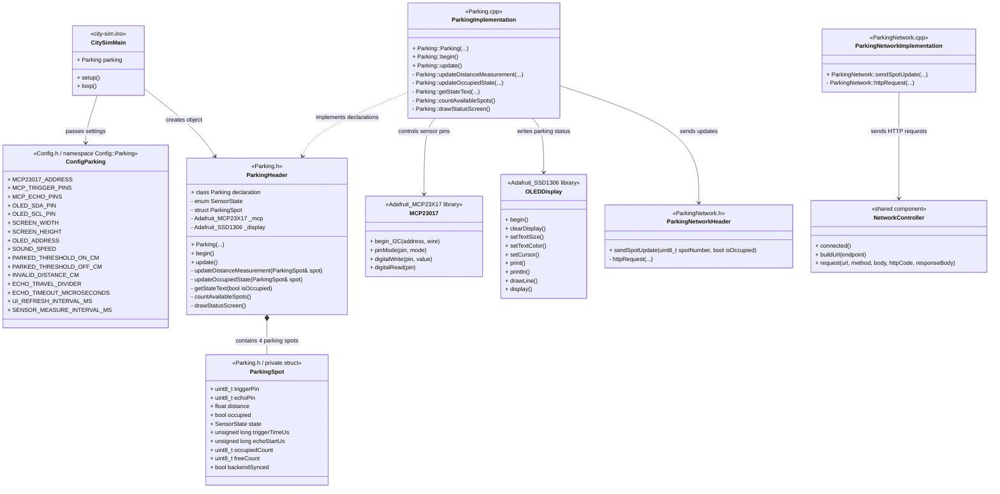

# Realise: Reducing ESP32-S3 pin usage for scalable smart parking sensors

- **Author:** Gurpreet Singh  
- **Date:** 01-06-2026  
- **Version:** 1.0  
- **Classification:** Internal  
- **Client:** Mayor Mats Otten  
- **Company:** The Embedded Alliance  

---

## Table of Contents

- [1. Introduction](#1-introduction)
- [2. Main question and subquestions](#2-main-question-and-subquestions)
- [3. Methodology](#3-methodology)
- [4. Chapter 1: Working implementation](#4-chapter-1-working-implementation)
    - [4.1 Introduction](#41-introduction)
    - [4.2 Difference compared with the previous implementation](#42-difference-compared-with-the-previous-implementation)
    - [4.3 GitLab source code](#43-gitlab-source-code)
    - [4.4 File-based class diagram](#44-file-based-class-diagram)
    - [4.5 Integration in the shared project](#45-integration-in-the-shared-project)
    - [4.6 Subconclusion](#46-subconclusion)
- [5. Chapter 2: MCP23017 hardware and software realisation](#5-chapter-2-mcp23017-hardware-and-software-realisation)
    - [5.1 Introduction](#51-introduction)
    - [5.2 MCP23017 setup](#52-mcp23017-setup)
    - [5.3 Trigger and echo pin setup](#53-trigger-and-echo-pin-setup)
    - [5.4 I2C bus with OLED and MCP23017](#54-i2c-bus-with-oled-and-mcp23017)
    - [5.5 Subconclusion](#55-subconclusion)
- [6. Chapter 3: Sensor measurement and parking logic](#6-chapter-3-sensor-measurement-and-parking-logic)
    - [6.1 Introduction](#61-introduction)
    - [6.2 Sequential sensor measurement](#62-sequential-sensor-measurement)
    - [6.3 Echo measurement through MCP23017](#63-echo-measurement-through-mcp23017)
    - [6.4 Stable occupied/free decision](#64-stable-occupiedfree-decision)
    - [6.5 OLED output](#65-oled-output)
    - [6.6 Subconclusion](#66-subconclusion)
- [7. Chapter 4: Backend communication](#7-chapter-4-backend-communication)
    - [7.1 Introduction](#71-introduction)
    - [7.2 ParkingNetwork component](#72-parkingnetwork-component)
    - [7.3 Sending only first state and changes](#73-sending-only-first-state-and-changes)
    - [7.4 Subconclusion](#74-subconclusion)
- [8. Chapter 5: Testing and validation](#8-chapter-5-testing-and-validation)
    - [8.1 Introduction](#81-introduction)
    - [8.2 Validation results](#82-validation-results)
    - [8.3 Limitations and technical attention points](#83-limitations-and-technical-attention-points)
    - [8.4 Subconclusion](#84-subconclusion)
- [9. Final conclusion](#9-final-conclusion)
- [10. Recommendations](#10-recommendations)
- [11. References](#11-references)

---

## 1. Introduction

This document is written for The Embedded Alliance and Mayor Mats Otten. The context of this document is the realisation phase of the updated smart parking prototype.

In the previous parking implementation, the ultrasonic sensors were connected directly to the ESP32-S3 GPIO pins. That implementation worked, but it used several direct ESP32-S3 pins. The earlier analysis identified this as the main pin usage problem, because the parking setup is part of a shared Smart City system where other components also need ESP32-S3 pins [(Singh, 2026a)](https://gitlab.fdmci.hva.nl/studio/smart-cities/projecten/2025-2026-semester-2/city-sim-learning-group/city-the-embedded-alliance-city-sim-learning-group/-/blob/9e0a5f72ec61dbd52f7dc2a742bc9ccd10cf0dce/docs/Gurpreet/Learning%20goals/Analysis/Sprint%204/analysis%20Reducing%20ESP32-S3%20pin%20usage%20for%20scalable%20smart%20parking%20sensors.md). The advice document then selected the MCP23017 as the best fitting component because it gives extra digital I/O through I2C, supports scalable expansion and allows the current parking logic to remain mostly the same [(Singh, 2026b)](https://gitlab.fdmci.hva.nl/studio/smart-cities/projecten/2025-2026-semester-2/city-sim-learning-group/city-the-embedded-alliance-city-sim-learning-group/-/blob/9e0a5f72ec61dbd52f7dc2a742bc9ccd10cf0dce/docs/Gurpreet/Learning%20goals/Advise/Sprint%204/advise%20Reducing%20ESP32-S3%20pin%20usage%20for%20scalable%20smart%20parking%20sensors.md). The design document translated this advised direction into a concrete hardware layout, pin allocation and validation plan [(Singh, 2026c)](https://gitlab.fdmci.hva.nl/studio/smart-cities/projecten/2025-2026-semester-2/city-sim-learning-group/city-the-embedded-alliance-city-sim-learning-group/-/blob/9e0a5f72ec61dbd52f7dc2a742bc9ccd10cf0dce/docs/Gurpreet/Learning%20goals/Design/Sprint%204/design%20Reducing%20ESP32-S3%20pin%20usage%20for%20scalable%20smart%20parking%20sensors.md).

The goal of this realisation is to show how the design was translated into working embedded code. The updated implementation uses the ESP32-S3 as the main controller, the MCP23017 as an I/O expander for the ultrasonic sensor pins, an OLED display for local output and a backend update component for sending parking status changes. The ESP32-S3 is suitable for this role because it supports programmable GPIO pins and communication interfaces [(Espressif Systems, z.d.)](https://documentation.espressif.com/esp32-s3_datasheet_en.pdf). The MCP23017 is suitable as the I/O expander because it provides 16-bit general purpose I/O expansion through I2C communication [(Microchip Technology Inc., 2005)](https://ww1.microchip.com/downloads/en/devicedoc/20001952c.pdf).

This document focuses on what was actually realised in code: the MCP23017 setup, the changed sensor pin handling, the sequential measurement structure, the occupied/free logic, the OLED output and the backend communication.

---

## 2. Main question and subquestions

The main question of this document is:

**How was the MCP23017-based smart parking prototype realised while keeping the current parking logic working?**

To answer this question, the following subquestions are used:

1. What changed compared with the previous direct ESP32-S3 GPIO implementation?
2. How was the MCP23017 integrated into the parking software?
3. How are the ultrasonic sensors measured through the MCP23017?
4. How does the system keep the occupied/free state stable?
5. How is the parking status shown locally and sent to the backend?
6. Which validation points were checked to confirm that the realisation matches the design?

---

## 3. Methodology

This realise document is based on the earlier analysis document, advice document, updated design document and the current parking code. The analysis compared possible ways to reduce ESP32-S3 pin usage, the advice document selected the MCP23017 as the best fitting component, and the design translated that advised direction into a concrete hardware layout, pin allocation and validation plan [(Singh, 2026a)](https://gitlab.fdmci.hva.nl/studio/smart-cities/projecten/2025-2026-semester-2/city-sim-learning-group/city-the-embedded-alliance-city-sim-learning-group/-/blob/9e0a5f72ec61dbd52f7dc2a742bc9ccd10cf0dce/docs/Gurpreet/Learning%20goals/Analysis/Sprint%204/analysis%20Reducing%20ESP32-S3%20pin%20usage%20for%20scalable%20smart%20parking%20sensors.md) [(Singh, 2026b)](https://gitlab.fdmci.hva.nl/studio/smart-cities/projecten/2025-2026-semester-2/city-sim-learning-group/city-the-embedded-alliance-city-sim-learning-group/-/blob/9e0a5f72ec61dbd52f7dc2a742bc9ccd10cf0dce/docs/Gurpreet/Learning%20goals/Advise/Sprint%204/advise%20Reducing%20ESP32-S3%20pin%20usage%20for%20scalable%20smart%20parking%20sensors.md) [(Singh, 2026c)](https://gitlab.fdmci.hva.nl/studio/smart-cities/projecten/2025-2026-semester-2/city-sim-learning-group/city-the-embedded-alliance-city-sim-learning-group/-/blob/9e0a5f72ec61dbd52f7dc2a742bc9ccd10cf0dce/docs/Gurpreet/Learning%20goals/Design/Sprint%204/design%20Reducing%20ESP32-S3%20pin%20usage%20for%20scalable%20smart%20parking%20sensors.md).

The following methods were used:

- reusing the existing `Parking` class structure from the previous implementation;
- adding the `Adafruit_MCP23X17` library for MCP23017 communication;
- moving the ultrasonic trigger and echo pin handling to the MCP23017;
- using the same I2C bus for the OLED display and the MCP23017;
- lowering the I2C clock to improve stability during prototype testing;
- keeping the sequential measurement structure so only one ultrasonic sensor is measured at a time;
- adding multiple-measurement confirmation before a spot changes between occupied and free;
- adding `ParkingNetwork` to send parking state changes to the backend;
- validating the implementation through startup messages, OLED output, sensor behaviour and backend requests.

These methods were chosen because the updated design had to reduce direct ESP32-S3 pin usage without completely changing the parking logic. The previous implementation already had a useful class structure, OLED output and threshold logic. The main realisation work was therefore to replace direct ESP32-S3 pin access with MCP23017-based I/O and to check the risks that were described in the design phase.

---

## 4. Chapter 1: Working implementation

### 4.1 Introduction

This chapter answers the following subquestion:

**What changed compared with the previous direct ESP32-S3 GPIO implementation?**

The chapter explains the main code changes and shows how the updated parking system is structured.

---

### 4.2 Difference compared with the previous implementation

The previous implementation used one shared trigger pin and four direct ESP32-S3 echo pins. The echo signals were handled with interrupts because the echo pins were connected directly to the ESP32-S3.

In the current implementation, the hardware layer changed. The MCP23017 is now used for the ultrasonic sensor pins. This follows from the earlier analysis and advice. The analysis showed that an I/O expander was one of the most relevant directions for reducing ESP32-S3 pin usage, and the advice selected the MCP23017 as the best fitting component for the current prototype [(Singh, 2026a)](https://gitlab.fdmci.hva.nl/studio/smart-cities/projecten/2025-2026-semester-2/city-sim-learning-group/city-the-embedded-alliance-city-sim-learning-group/-/blob/9e0a5f72ec61dbd52f7dc2a742bc9ccd10cf0dce/docs/Gurpreet/Learning%20goals/Analysis/Sprint%204/analysis%20Reducing%20ESP32-S3%20pin%20usage%20for%20scalable%20smart%20parking%20sensors.md) [(Singh, 2026b)](https://gitlab.fdmci.hva.nl/studio/smart-cities/projecten/2025-2026-semester-2/city-sim-learning-group/city-the-embedded-alliance-city-sim-learning-group/-/blob/9e0a5f72ec61dbd52f7dc2a742bc9ccd10cf0dce/docs/Gurpreet/Learning%20goals/Advise/Sprint%204/advise%20Reducing%20ESP32-S3%20pin%20usage%20for%20scalable%20smart%20parking%20sensors.md). This means the ESP32-S3 no longer controls every ultrasonic trigger and echo line directly. Instead, the ESP32-S3 communicates with the MCP23017 through I2C, and the MCP23017 handles the digital sensor pins.

The most important software changes are:

| Part                  | Previous implementation              | Current implementation                      |
| --------------------- | ------------------------------------ | -------------------------------------------- |
| Sensor pin handling   | Direct ESP32-S3 GPIO                 | MCP23017 I/O pins through I2C                |
| Trigger pins          | One shared trigger pin               | One trigger pin per sensor on MCP23017       |
| Echo pins             | Direct ESP32-S3 pins with interrupts | MCP23017 inputs read through I2C             |
| Echo handling         | `attachInterrupt()` and ISR flags    | State machine with `_mcp.digitalRead()`      |
| I2C devices           | OLED display                         | OLED display and MCP23017                    |
| Backend communication | Not part of the parking component    | `ParkingNetwork` sends spot updates          |
| State stability       | Threshold-based switching            | Thresholds plus repeated confirmation counts |

This change is important because MCP23017 pins are not the same as direct ESP32-S3 GPIO pins. The old interrupt structure could not simply be copied, because the echo pins are now read through the I2C expander. Therefore, the current implementation uses a polling-based state machine for the echo signal.

---

### 4.3 GitLab source code

The complete implementation should be stored in GitLab using fixed commit permalinks. Fixed commit permalinks are important because the linked version does not change when the branch is updated later.

The relevant files are:

- [Parking.h](https://gitlab.fdmci.hva.nl/studio/smart-cities/projecten/2025-2026-semester-2/city-sim-learning-group/city-the-embedded-alliance-city-sim-learning-group/-/blob/9e0a5f72ec61dbd52f7dc2a742bc9ccd10cf0dce/embedded/city-sim/lib/Parking/Parking.h)
- [Parking.cpp](https://gitlab.fdmci.hva.nl/studio/smart-cities/projecten/2025-2026-semester-2/city-sim-learning-group/city-the-embedded-alliance-city-sim-learning-group/-/blob/9e0a5f72ec61dbd52f7dc2a742bc9ccd10cf0dce/embedded/city-sim/lib/Parking/Parking.cpp)
- [ParkingNetwork.h](https://gitlab.fdmci.hva.nl/studio/smart-cities/projecten/2025-2026-semester-2/city-sim-learning-group/city-the-embedded-alliance-city-sim-learning-group/-/blob/9e0a5f72ec61dbd52f7dc2a742bc9ccd10cf0dce/embedded/city-sim/lib/Parking/ParkingNetwork.h)
- [ParkingNetwork.cpp](https://gitlab.fdmci.hva.nl/studio/smart-cities/projecten/2025-2026-semester-2/city-sim-learning-group/city-the-embedded-alliance-city-sim-learning-group/-/blob/9e0a5f72ec61dbd52f7dc2a742bc9ccd10cf0dce/embedded/city-sim/lib/Parking/ParkingNetwork.cpp)
- [Config.h](https://gitlab.fdmci.hva.nl/studio/smart-cities/projecten/2025-2026-semester-2/city-sim-learning-group/city-the-embedded-alliance-city-sim-learning-group/-/blob/9e0a5f72ec61dbd52f7dc2a742bc9ccd10cf0dce/embedded/city-sim/lib/Config/Config.h)
- [city-sim.ino](https://gitlab.fdmci.hva.nl/studio/smart-cities/projecten/2025-2026-semester-2/city-sim-learning-group/city-the-embedded-alliance-city-sim-learning-group/-/blob/9e0a5f72ec61dbd52f7dc2a742bc9ccd10cf0dce/embedded/city-sim/city-sim.ino)

`Parking.h` contains the parking class definition, the `ParkingSpot` structure, the MCP23017 address, the OLED settings and the private helper functions.

`Parking.cpp` contains the implementation for starting the MCP23017, setting the trigger and echo pins, measuring the sensors, updating the occupied/free status, drawing the OLED screen and calling the backend update logic.

`ParkingNetwork.h` contains the declaration of the backend communication function for parking updates.

`ParkingNetwork.cpp` contains the HTTP request logic. It uses the shared `NetworkController` to send the occupied/free state of a parking spot to the backend.

`Config.h` contains the configuration values, such as the MCP23017 address, sensor pin numbers, OLED pins, threshold values and timing settings.

`city-sim.ino` creates the `Parking` object, calls `parking.begin()` in `setup()` and calls `parking.update()` in `loop()` together with the other Smart City components.

In the following chapters, only the most relevant code snippets are included. The full implementation can be checked through the GitLab links above.

---

### 4.4 File-based class diagram

The diagram below shows how the updated parking implementation is divided over the main files.



This diagram shows that the parking component is still separated from the main project file. The main project only starts and updates the component, while the detailed hardware and logic are inside `Parking.h` and `Parking.cpp`.

The new part is the `Adafruit_MCP23X17` object. This object is used to communicate with the MCP23017 and replaces the direct ESP32-S3 GPIO handling from the previous implementation.

The `ParkingNetwork` component is also added. This keeps backend communication separate from the measurement logic. The parking class decides when a spot status must be sent, while the network class handles the HTTP request.

---

### 4.5 Integration in the shared project

The parking system remains a separate component inside the shared Smart City project. It is not written as one loose `.ino` file.

This is important because the same project also runs other components, such as:

- streetlight;
- speed camera;
- train signal.

The main project file only needs to create the `Parking` object, call `parking.begin()` once in `setup()` and call `parking.update()` continuously in `loop()`.

This keeps the shared project cleaner. The parking component contains the parking-specific logic, while the shared main loop only coordinates all components.

---

### 4.6 Subconclusion

Based on this chapter, the current implementation is not just a small pin change. The parking system was changed from direct ESP32-S3 GPIO handling to MCP23017-based I/O handling. The previous class structure could be reused, but the hardware access layer, echo handling and backend communication were updated.

---

## 5. Chapter 2: MCP23017 hardware and software realisation

### 5.1 Introduction

This chapter answers the following subquestion:

**How was the MCP23017 integrated into the parking software?**

The chapter explains how the MCP23017 is started, how the trigger and echo pins are configured and how it shares the I2C bus with the OLED display.

---

### 5.2 MCP23017 setup

The MCP23017 is added in `Parking.h` by including the Adafruit MCP23017 library. This library provides Arduino-style functions for starting the MCP23017 over I2C and using its pins as digital inputs and outputs [(Adafruit, z.d.)](https://github.com/adafruit/Adafruit-MCP23017-Arduino-Library):

```cpp
#include <Adafruit_MCP23X17.h>
```

The parking class stores the MCP23017 as a private object:

```cpp
Adafruit_MCP23X17 _mcp;
```

The constructor receives the MCP23017 I2C address. This matches the MCP23017 addressing structure described in the datasheet [(Microchip Technology Inc., 2005)](https://ww1.microchip.com/downloads/en/devicedoc/20001952c.pdf):

```cpp
uint8_t _mcpAddress;
```

This makes the MCP23017 address configurable instead of hardcoding it inside the parking logic.

In `begin()`, the I2C bus is started first:

```cpp
_parkingWire.begin(_oledSdaPin, _oledSclPin);
_parkingWire.setClock(50000);
```

After that, the MCP23017 is started on the same I2C bus:

```cpp
if (!_mcp.begin_I2C(_mcpAddress, &_parkingWire)) {
  Serial.println("MCP23017 not found");
} else {
  Serial.println("MCP23017 started");
}
```

This is an important validation point. If the serial monitor prints `MCP23017 not found`, the hardware setup or I2C address must be checked before testing the sensors.

The I2C clock is set to 50 kHz. This is slower than the standard 100 kHz I2C speed. In this prototype, the lower clock speed is used to improve stability while testing the breadboard wiring and multiple I2C devices.

---

### 5.3 Trigger and echo pin setup

In the updated implementation, each parking sensor has its own trigger and echo pin stored in the `ParkingSpot` struct:

```cpp
struct ParkingSpot {
  uint8_t triggerPin;
  uint8_t echoPin;
  float distance;
  bool occupied;
  SensorState state;
  unsigned long triggerTimeUs;
  unsigned long echoStartUs;
  uint8_t occupiedCount;
  uint8_t freeCount;
  bool backendSynced;
};
```

This is different from the previous implementation, where one shared ESP32-S3 trigger pin was used and the echo pins were direct ESP32-S3 GPIO pins.

The constructor stores the trigger and echo pins for all four parking spots:

```cpp
_parkingSpots[0] = {trig1Pin, echo1Pin, _invalidDistanceCm, false, IDLE, 0, 0, 0, 0, false};
_parkingSpots[1] = {trig2Pin, echo2Pin, _invalidDistanceCm, false, IDLE, 0, 0, 0, 0, false};
_parkingSpots[2] = {trig3Pin, echo3Pin, _invalidDistanceCm, false, IDLE, 0, 0, 0, 0, false};
_parkingSpots[3] = {trig4Pin, echo4Pin, _invalidDistanceCm, false, IDLE, 0, 0, 0, 0, false};
```

In `begin()`, the MCP23017 pins are configured:

```cpp
for (int i = 0; i < TOTAL_SPOTS; i++) {
  _mcp.pinMode(_parkingSpots[i].triggerPin, OUTPUT);
  _mcp.digitalWrite(_parkingSpots[i].triggerPin, LOW);
  _mcp.pinMode(_parkingSpots[i].echoPin, INPUT);
}
```

This shows that the MCP23017 is used as the pin expansion component for the parking sensors. The trigger pins are configured as outputs, and the echo pins are configured as inputs.

---

### 5.4 I2C bus with OLED and MCP23017

The OLED display and MCP23017 both use I2C communication. I2C uses a serial data line and a serial clock line, and devices on the bus are addressed through their own device address [(NXP Semiconductors, 2021)](https://www.nxp.com/docs/en/user-guide/UM10204.pdf). In the implementation, they are connected to the same `TwoWire` object:

```cpp
TwoWire _parkingWire;
Adafruit_SSD1306 _display;
Adafruit_MCP23X17 _mcp;
```

The same I2C bus is used to start both components. In the code, this is done with the Arduino `Wire`/`TwoWire` communication structure, which is used for I2C communication on Arduino-compatible platforms [(Arduino, n.d.)](https://docs.arduino.cc/language-reference/en/functions/communication/wire/):

```cpp
_parkingWire.begin(_oledSdaPin, _oledSclPin);
_mcp.begin_I2C(_mcpAddress, &_parkingWire);
_display.begin(SSD1306_SWITCHCAPVCC, _oledAddr);
```

This matches the design choice where the OLED display and MCP23017 share SDA and SCL. This reduces direct ESP32-S3 pin usage because both components can communicate through the same two I2C lines.

The addresses must be different, because devices on the same I2C bus are selected by address [(NXP Semiconductors, 2021)](https://www.nxp.com/docs/en/user-guide/UM10204.pdf). In this setup, the OLED display uses address `0x3C`, while the MCP23017 uses address `0x20` when A0, A1 and A2 are connected to GND. During testing, this was checked with serial output by confirming that both the OLED display and MCP23017 started correctly on the shared I2C bus.

---

### 5.5 Subconclusion

Based on this chapter, the MCP23017 was integrated into the parking software as the I/O expansion component. The ESP32-S3 communicates with the MCP23017 through I2C, and the MCP23017 handles the parking sensor trigger and echo pins. The OLED display and MCP23017 share the same I2C bus, which supports the goal of reducing direct ESP32-S3 pin usage.

---

## 6. Chapter 3: Sensor measurement and parking logic

### 6.1 Introduction

This chapter answers the following subquestion:

**How are the ultrasonic sensors measured through the MCP23017?**

The chapter explains the sequential measurement structure, the echo measurement logic and the occupied/free decision logic.

---

### 6.2 Sequential sensor measurement

The parking system still measures one ultrasonic sensor at a time. This is important because ultrasonic sensors can interfere with each other when multiple sensors send sound pulses at the same time.

The active sensor is selected with `_currentSensorIndex`:

```cpp
bool measurementFinished = updateDistanceMeasurement(_parkingSpots[_currentSensorIndex]);
```

When a measurement is finished, the system updates the parking state and moves to the next sensor:

```cpp
_currentSensorIndex++;

if (_currentSensorIndex >= TOTAL_SPOTS) {
  _currentSensorIndex = 0;
}
```

This means the system measures parking spot 1, then parking spot 2, then parking spot 3, then parking spot 4, and then repeats the cycle.

This structure was kept from the previous implementation because it is clear, predictable and useful for ultrasonic sensors.

---

### 6.3 Echo measurement through MCP23017

The most important technical change is that the echo signal is now read through the MCP23017. This matters because the HC-SR04 distance measurement is based on a trigger signal and the returned echo signal [(Tech Support, z.d.)](https://cdn.sparkfun.com/datasheets/Sensors/Proximity/HCSR04.pdf).

In the previous implementation, the ESP32-S3 used interrupts to detect the echo start and echo end. In this current implementation, the code reads the echo pin through the MCP23017 using:

```cpp
_mcp.digitalRead(spot.echoPin)
```

The measurement function still uses the same three measurement states:

- `IDLE`
- `WAITING_FOR_ECHO_START`
- `WAITING_FOR_ECHO_END`

In `IDLE`, the trigger pulse is sent through the MCP23017. The HC-SR04 datasheet explains that a trigger pulse starts the ultrasonic measurement [(Tech Support, z.d.)](https://cdn.sparkfun.com/datasheets/Sensors/Proximity/HCSR04.pdf):

```cpp
_mcp.digitalWrite(spot.triggerPin, LOW);
delayMicroseconds(2);
_mcp.digitalWrite(spot.triggerPin, HIGH);
delayMicroseconds(10);
_mcp.digitalWrite(spot.triggerPin, LOW);

spot.triggerTimeUs = micros();
spot.state = WAITING_FOR_ECHO_START;
```

In `WAITING_FOR_ECHO_START`, the code waits until the echo pin becomes HIGH:

```cpp
if (_mcp.digitalRead(spot.echoPin) == HIGH) {
  spot.echoStartUs = currentMicros;
  spot.state = WAITING_FOR_ECHO_END;
}
```

In `WAITING_FOR_ECHO_END`, the code waits until the echo pin becomes LOW:

```cpp
if (_mcp.digitalRead(spot.echoPin) == LOW) {
  unsigned long localEchoEndUs = currentMicros;

  if (localEchoEndUs > spot.echoStartUs) {
    unsigned long duration = localEchoEndUs - spot.echoStartUs;
    spot.distance = (duration * _soundSpeed) / _echoTravelDivider;
  } else {
    spot.distance = _invalidDistanceCm;
  }

  spot.state = IDLE;
  return true;
}
```

This implementation keeps the non-blocking state structure, but the echo timing is no longer captured by a direct ESP32-S3 interrupt. Instead, the echo pin is checked through the MCP23017 over I2C. This is the main technical risk of this realisation, because the HC-SR04 echo signal is timing-sensitive [(Tech Support, z.d.)](https://cdn.sparkfun.com/datasheets/Sensors/Proximity/HCSR04.pdf). This risk was already identified in the analysis and design phase, because the selected I/O expander solution adds an extra I2C communication step between the ESP32-S3 and the echo signal [(Singh, 2026a)](https://gitlab.fdmci.hva.nl/studio/smart-cities/projecten/2025-2026-semester-2/city-sim-learning-group/city-the-embedded-alliance-city-sim-learning-group/-/blob/9e0a5f72ec61dbd52f7dc2a742bc9ccd10cf0dce/docs/Gurpreet/Learning%20goals/Analysis/Sprint%204/analysis%20Reducing%20ESP32-S3%20pin%20usage%20for%20scalable%20smart%20parking%20sensors.md) [(Singh, 2026c)](https://gitlab.fdmci.hva.nl/studio/smart-cities/projecten/2025-2026-semester-2/city-sim-learning-group/city-the-embedded-alliance-city-sim-learning-group/-/blob/9e0a5f72ec61dbd52f7dc2a742bc9ccd10cf0dce/docs/Gurpreet/Learning%20goals/Design/Sprint%204/design%20Reducing%20ESP32-S3%20pin%20usage%20for%20scalable%20smart%20parking%20sensors.md).

This means the result must be validated carefully. The code can work for the prototype if the occupied/free decision remains stable, but the MCP23017 echo reading must not be treated as automatically equal to direct ESP32-S3 interrupt timing.

Timeouts are used to prevent the measurement from getting stuck:

```cpp
else if (currentMicros - spot.triggerTimeUs >= _echoTimeoutMicroseconds) {
  spot.distance = _invalidDistanceCm;
  spot.state = IDLE;
  return true;
}
```

and:

```cpp
else if (currentMicros - spot.echoStartUs >= _echoTimeoutMicroseconds) {
  spot.distance = _invalidDistanceCm;
  spot.state = IDLE;
  return true;
}
```

These timeouts make sure that the system continues running even when a sensor does not return a usable echo signal.

---

### 6.4 Stable occupied/free decision

The occupied/free decision is no longer changed after only one measurement. Instead, the code uses confirmation counters.

In `ParkingSpot`, two counters are stored:

```cpp
uint8_t occupiedCount;
uint8_t freeCount;
```

The function `updateOccupiedState(ParkingSpot& spot)` uses:

```cpp
const uint8_t REQUIRED_COUNT = 3;
```

This means the spot only changes state after three matching measurements.

When the measurement is invalid or below the occupied threshold, the occupied counter increases:

```cpp
if (spot.distance < 0) {
  spot.occupiedCount++;
  spot.freeCount = 0;
}
else if (spot.distance < _parkedThresholdOnCm) {
  spot.occupiedCount++;
  spot.freeCount = 0;
}
```

When the measured distance is above the free threshold, the free counter increases:

```cpp
else if (spot.distance > _parkedThresholdOffCm) {
  spot.freeCount++;
  spot.occupiedCount = 0;
}
```

When enough matching measurements are received, the state changes:

```cpp
if (spot.occupiedCount >= REQUIRED_COUNT) {
  spot.occupied = true;
  spot.occupiedCount = REQUIRED_COUNT;
}

if (spot.freeCount >= REQUIRED_COUNT) {
  spot.occupied = false;
  spot.freeCount = REQUIRED_COUNT;
}
```

This is an important improvement compared with changing the state immediately. Because the echo signal is now read through the MCP23017, one unstable measurement should not immediately change the parking status. The confirmation counters make the output more stable.

One point must be explained clearly: in this implementation, an invalid distance is treated as probably occupied. This was done to avoid showing a parking space as free when the sensor data is not reliable. That is safer for the prototype because a failed measurement should not create a false available parking spot.

---

### 6.5 OLED output

The OLED display still shows the local parking status.

The display shows:

- parking space 1 to 4;
- `OCCUPIED` or `FREE`;
- the total number of free spaces.

The status text is generated by:

```cpp
const char* Parking::getStateText(bool isOccupied) {
  return isOccupied ? "OCCUPIED" : "FREE";
}
```

The number of free spaces is counted with:

```cpp
if (!_parkingSpots[i].occupied) {
  availableSpots++;
}
```

This is different from the previous implementation, where invalid measurements were not counted as free. In the updated implementation, the free counter is based on the confirmed occupied/free state. This matches the new confirmation logic.

The OLED output is drawn in `drawStatusScreen()`:

```cpp
_display.println("Parking");
...
_display.print("P");
_display.print(i + 1);
_display.print(": ");
_display.println(getStateText(_parkingSpots[i].occupied));
```

The right side of the OLED shows the number of free spaces:

```cpp
_display.println("Free");
_display.setTextSize(3);
_display.print(availableSpots);
```

This keeps the local user output similar to the previous prototype, while the internal measurement logic has been changed for the MCP23017 setup.

---

### 6.6 Subconclusion

Based on this chapter, the updated parking logic keeps the same general measurement flow as the previous implementation, but the hardware access is changed to MCP23017 I/O. The sensors are still measured sequentially, the system still uses timeout protection, and the OLED output still shows the parking status. The main improvement is the added confirmation logic, which makes the occupied/free state more stable.

---

## 7. Chapter 4: Backend communication

### 7.1 Introduction

This chapter answers the following subquestion:

**How is the parking status sent to the backend?**

The chapter explains the new `ParkingNetwork` component and how the parking system decides when to send updates.

---

### 7.2 ParkingNetwork component

The current implementation adds a separate `ParkingNetwork` class for backend communication.

`ParkingNetwork.h` declares:

```cpp
class ParkingNetwork {
public:
  static bool sendSpotUpdate(uint8_t spotNumber, bool isOccupied);

private:
  static bool httpRequest(const String& method, const String& endpoint, const String& body,
                          int& httpCode, String& responseBody);
};
```

This separates backend communication from the measurement logic. The parking class does not build the full HTTP request itself. It only calls:

```cpp
ParkingNetwork::sendSpotUpdate(spotNumber, currentSpot.occupied);
```

Inside `ParkingNetwork.cpp`, the request is sent through the shared `NetworkController`:

```cpp
bool ok = NetworkController::request(url, method, body, httpCode, responseBody);
```

This keeps the network logic consistent with the rest of the shared Smart City project.

Before sending an update, the code checks whether WiFi is connected:

```cpp
if (!NetworkController::connected()) {
  Serial.println("ParkingNetwork skipped: WiFi offline.");
  return false;
}
```

This prevents the parking system from trying to send backend updates when the network is unavailable.

---

### 7.3 Sending only first state and changes

The parking system does not send a backend request on every measurement. That would create unnecessary network traffic.

Each parking spot stores:

```cpp
bool backendSynced;
```

In `update()`, the old occupied state is stored first:

```cpp
bool previousOccupied = currentSpot.occupied;
```

After the new state is calculated, the code checks whether the state changed:

```cpp
bool stateChanged = previousOccupied != currentSpot.occupied;
```

The backend update is sent when the state changed or when the first state has not yet been sent:

```cpp
if (stateChanged || !currentSpot.backendSynced) {
  uint8_t spotNumber = _currentSensorIndex + 1;
  ParkingNetwork::sendSpotUpdate(spotNumber, currentSpot.occupied);
  currentSpot.backendSynced = true;
}
```

This is a practical design choice. The backend receives the first known state of each parking spot. After that, it only receives updates when the status changes between occupied and free.

The backend endpoint is built like this:

```cpp
String endpoint = "/api/v1/parking/update/";
endpoint += String(spotNumber);
endpoint += "?is_occupied=";
endpoint += isOccupied ? "true" : "false";
```

The request is sent as a `POST` request:

```cpp
bool ok = httpRequest("POST", endpoint, "", httpCode, responseBody);
```

This means the embedded system sends the final occupied/free status to the backend, and the backend can store or show this state for the frontend.

---

### 7.4 Subconclusion

Based on this chapter, the current implementation also realises backend communication for the parking system. The backend communication is separated into its own class, uses the shared `NetworkController`, checks WiFi availability and sends updates only when needed.

---

## 8. Chapter 5: Testing and validation

### 8.1 Introduction

This chapter answers the following subquestion:

**Which validation points were checked to confirm that the realisation matches the design?**

The design document already identified important risks: MCP23017 base wiring, I2C communication, echo timing, voltage levels and wiring complexity [(Singh, 2026c)](https://gitlab.fdmci.hva.nl/studio/smart-cities/projecten/2025-2026-semester-2/city-sim-learning-group/city-the-embedded-alliance-city-sim-learning-group/-/blob/9e0a5f72ec61dbd52f7dc2a742bc9ccd10cf0dce/docs/Gurpreet/Learning%20goals/Design/Sprint%204/design%20Reducing%20ESP32-S3%20pin%20usage%20for%20scalable%20smart%20parking%20sensors.md). In the realise phase, these points were checked by building the setup and testing whether the parking status remained stable in practice.

---

### 8.2 Validation results

The following validation points were used to check the current realisation after the hardware and code were built:

| Validation point                 | Result in the current realisation                                                                                                                           |
| -------------------------------- | ------------------------------------------------------------------------------------------------------------------------------------------------------------ |
| MCP23017 startup check           | The serial monitor confirms that the MCP23017 starts with the configured I2C address.                                                                        |
| OLED startup check               | The OLED display starts and shows the parking status screen.                                                                                                 |
| Shared I2C bus check             | The OLED display and MCP23017 work on the same SDA/SCL lines.                                                                                                |
| Trigger pin check                | The MCP23017 trigger pins send the trigger pulse to the ultrasonic sensors.                                                                                  |
| Echo pin check                   | The MCP23017 echo pins are read through `_mcp.digitalRead()` and the system receives usable sensor responses.                                                |
| Sequential measurement check     | The system measures one parking sensor at a time using `_currentSensorIndex`.                                                                                |
| Timeout check                    | Missing or unstable echo readings do not freeze the system because the measurement state is reset after a timeout.                                           |
| Occupied/free confirmation check | A parking state only changes after repeated matching measurements.                                                                                           |
| Free counter check               | The OLED free counter updates based on the confirmed occupied/free states.                                                                                   |
| Backend first sync check         | Each parking spot sends its first known state to the backend.                                                                                                |
| Backend change check             | A backend request is sent when a parking spot changes between occupied and free.                                                                             |
| WiFi offline check               | Backend sending is skipped when WiFi is not connected.                                                                                                       |
| Voltage-level check              | The realised setup works with the current wiring. The voltage level remains an important point to document and control if the wiring or sensor type changes. |

---

### 8.3 Limitations and technical attention points

The main technical attention point remains the echo signal. The HC-SR04 uses the echo signal to determine the returned pulse duration for the distance measurement [(Tech Support, z.d.)](https://cdn.sparkfun.com/datasheets/Sensors/Proximity/HCSR04.pdf). In the previous implementation, echo timing was measured directly on ESP32-S3 GPIO pins with interrupts. In the current implementation, echo is read through the MCP23017 using I2C. This point was already discussed in the analysis and design because the echo timing can become less direct when the signal is read through an I/O expander instead of through a direct ESP32-S3 GPIO pin [(Singh, 2026a)](https://gitlab.fdmci.hva.nl/studio/smart-cities/projecten/2025-2026-semester-2/city-sim-learning-group/city-the-embedded-alliance-city-sim-learning-group/-/blob/9e0a5f72ec61dbd52f7dc2a742bc9ccd10cf0dce/docs/Gurpreet/Learning%20goals/Analysis/Sprint%204/analysis%20Reducing%20ESP32-S3%20pin%20usage%20for%20scalable%20smart%20parking%20sensors.md) [(Singh, 2026c)](https://gitlab.fdmci.hva.nl/studio/smart-cities/projecten/2025-2026-semester-2/city-sim-learning-group/city-the-embedded-alliance-city-sim-learning-group/-/blob/9e0a5f72ec61dbd52f7dc2a742bc9ccd10cf0dce/docs/Gurpreet/Learning%20goals/Design/Sprint%204/design%20Reducing%20ESP32-S3%20pin%20usage%20for%20scalable%20smart%20parking%20sensors.md).

The realised setup works for the prototype, because the system can still create stable occupied/free decisions for the four parking spaces. However, the timing is still less direct than the previous interrupt-based implementation. I2C communication takes extra time, and the code checks the echo signal by reading the expander. Therefore, this implementation is suitable for occupancy detection, but it should not be presented as a precision distance measurement solution.

For this prototype, the most important requirement is not millimeter-level distance accuracy. The main requirement is stable occupied/free detection. That is why the code uses threshold values, timeouts and repeated confirmation counts.

Another technical attention point is the voltage level of the HC-SR04 echo signal. The HC-SR04 is powered from 5V in this prototype setup, so the echo signal must be checked before it is treated as safe for the MCP23017 logic input [(Tech Support, z.d.)](https://cdn.sparkfun.com/datasheets/Sensors/Proximity/HCSR04.pdf). The current realised setup works, but this point must still be documented because the MCP23017 and ESP32-S3 logic side should not be exposed to unsafe input voltages. If the wiring or sensor type changes, a voltage divider or logic level shifter must be added when needed.

These points do not prevent the realisation from working. They define the boundary of the solution: the current setup is suitable for this smart parking prototype, but future versions should still control echo timing and voltage levels carefully.

---

### 8.4 Subconclusion

Based on this chapter, the current realisation can be accepted as a working prototype implementation. The MCP23017 starts correctly, the OLED output works, the sensor readings are processed through the MCP23017, the backend update logic is included and the parking states remain stable enough for occupied/free detection. The main technical attention points for future improvement are still echo timing and voltage-level control.

---

## 9. Final conclusion

This document examined how the MCP23017-based smart parking prototype was realised into a working system.

First, the parking system was successfully updated from direct ESP32-S3 pin usage to an MCP23017-based setup. The ESP32-S3 still works as the main controller, but the trigger and echo pins of the ultrasonic sensors are now handled through the MCP23017 I/O expander.

Second, the OLED display and MCP23017 were connected through the same I2C bus. This reduced the number of direct ESP32-S3 pins needed by the parking setup, while still keeping the OLED output available for showing the parking status.

Third, the existing parking structure from the previous implementation was reused where it still made sense. The class structure, sequential sensor measurement, threshold-based occupied/free logic and OLED output were kept. The main change was that the hardware access layer was adjusted, because the sensor pins are now controlled and read through the MCP23017 instead of direct ESP32-S3 GPIO pins.

Fourth, the parking status logic was improved by using repeated confirmation counts. A parking spot only changes to occupied or free after multiple matching measurements. This makes the output more stable when a measurement is invalid or temporarily unstable.

Fifth, backend communication was added through `ParkingNetwork`. The system sends the parking status to the backend when the first known state is available or when the occupied/free state changes. This makes the parking prototype more useful for the full Smart City system, because the backend and frontend can use the live parking status.

Based on this implementation, it can be concluded that the current smart parking prototype was successfully realised with the MCP23017 I/O expander. The setup reduces direct ESP32-S3 pin usage while keeping the parking logic, OLED output and backend status updates working.


---

## 10. Recommendations

Based on this realisation, the following recommendations are made:

1. It is recommended to keep checking the MCP23017 startup message in the serial monitor. This makes it easier to see whether the I/O expander is found correctly before the parking sensors are tested.

2. The OLED display and MCP23017 should stay connected to the same I2C bus. This worked in the realised prototype and helps reduce the number of direct ESP32-S3 pins used by the parking setup.

3. The parking sensors should continue to be measured one by one. This keeps the measurement process clear and reduces the chance that the ultrasonic sensors interfere with each other.

4. The timeout logic should remain in the measurement process. If an echo signal is missing or unstable, the system should reset the measurement instead of getting stuck.

5. The repeated confirmation logic should also be kept. A parking spot should only change to occupied or free after multiple matching measurements, because this makes the parking status more stable.

6. Backend updates should only be sent when the first parking status is known or when a parking space changes state. This keeps the backend communication useful and prevents unnecessary requests.

7. The WiFi check before sending backend updates should remain in the code. If the network is offline, the parking system can still continue working locally and skip the backend request.

8. The OLED should keep showing the confirmed occupied/free status. This makes the local output clear and matches the confirmation logic that is used in the code.

9. The echo timing limitation should stay documented. The prototype works for occupied/free detection, but the echo signal is read through the MCP23017 over I2C instead of directly through an ESP32-S3 interrupt pin.

10. The voltage-level point should also stay documented. The HC-SR04 echo signal can be related to the 5V sensor supply, so this should still be checked carefully if the wiring or sensor type changes.


---

## 11. References

1. Adafruit. (z.d.). *Adafruit MCP23017 Arduino Library*. Retrieved on 22 May 2026, from [https://github.com/adafruit/Adafruit-MCP23017-Arduino-Library](https://github.com/adafruit/Adafruit-MCP23017-Arduino-Library)

2. Arduino. (n.d.). *Wire*. Retrieved on 01 June 2026, from [https://docs.arduino.cc/language-reference/en/functions/communication/wire/](https://docs.arduino.cc/language-reference/en/functions/communication/wire/)

3. Espressif Systems. (z.d.). *ESP32-S3 Series datasheet*. Retrieved on 11 May 2026, from [https://documentation.espressif.com/esp32-s3_datasheet_en.pdf](https://documentation.espressif.com/esp32-s3_datasheet_en.pdf)

4. Microchip Technology Inc. (2005). *MCP23017/MCP23S17*. Retrieved on 11 May 2026, from [https://ww1.microchip.com/downloads/en/devicedoc/20001952c.pdf](https://ww1.microchip.com/downloads/en/devicedoc/20001952c.pdf)

5. NXP Semiconductors. (2021). *I²C-bus specification and user manual (UM10204 Rev. 7.0)*. Retrieved on 14 May 2026, from [https://www.nxp.com/docs/en/user-guide/UM10204.pdf](https://www.nxp.com/docs/en/user-guide/UM10204.pdf)

6. Singh, G. (2026a). *Analysis: Reducing ESP32-S3 pin usage for scalable smart parking sensors* [Internal project document]. The Embedded Alliance. Retrieved on 01 June 2026, from [https://gitlab.fdmci.hva.nl/studio/smart-cities/projecten/2025-2026-semester-2/city-sim-learning-group/city-the-embedded-alliance-city-sim-learning-group/-/blob/9e0a5f72ec61dbd52f7dc2a742bc9ccd10cf0dce/docs/Gurpreet/Learning%20goals/Analysis/Sprint%204/analysis%20Reducing%20ESP32-S3%20pin%20usage%20for%20scalable%20smart%20parking%20sensors.md](https://gitlab.fdmci.hva.nl/studio/smart-cities/projecten/2025-2026-semester-2/city-sim-learning-group/city-the-embedded-alliance-city-sim-learning-group/-/blob/9e0a5f72ec61dbd52f7dc2a742bc9ccd10cf0dce/docs/Gurpreet/Learning%20goals/Analysis/Sprint%204/analysis%20Reducing%20ESP32-S3%20pin%20usage%20for%20scalable%20smart%20parking%20sensors.md)

7. Singh, G. (2026b). *Advice: Reducing ESP32-S3 pin usage for scalable smart parking sensors* [Internal project document]. The Embedded Alliance. Retrieved on 01 June 2026, from [https://gitlab.fdmci.hva.nl/studio/smart-cities/projecten/2025-2026-semester-2/city-sim-learning-group/city-the-embedded-alliance-city-sim-learning-group/-/blob/9e0a5f72ec61dbd52f7dc2a742bc9ccd10cf0dce/docs/Gurpreet/Learning%20goals/Advise/Sprint%204/advise%20Reducing%20ESP32-S3%20pin%20usage%20for%20scalable%20smart%20parking%20sensors.md](https://gitlab.fdmci.hva.nl/studio/smart-cities/projecten/2025-2026-semester-2/city-sim-learning-group/city-the-embedded-alliance-city-sim-learning-group/-/blob/9e0a5f72ec61dbd52f7dc2a742bc9ccd10cf0dce/docs/Gurpreet/Learning%20goals/Advise/Sprint%204/advise%20Reducing%20ESP32-S3%20pin%20usage%20for%20scalable%20smart%20parking%20sensors.md)

8. Singh, G. (2026c). *Design: Reducing ESP32-S3 pin usage for scalable smart parking sensors* [Internal project document]. The Embedded Alliance. Retrieved on 01 June 2026, from [https://gitlab.fdmci.hva.nl/studio/smart-cities/projecten/2025-2026-semester-2/city-sim-learning-group/city-the-embedded-alliance-city-sim-learning-group/-/blob/9e0a5f72ec61dbd52f7dc2a742bc9ccd10cf0dce/docs/Gurpreet/Learning%20goals/Design/Sprint%204/design%20Reducing%20ESP32-S3%20pin%20usage%20for%20scalable%20smart%20parking%20sensors.md](https://gitlab.fdmci.hva.nl/studio/smart-cities/projecten/2025-2026-semester-2/city-sim-learning-group/city-the-embedded-alliance-city-sim-learning-group/-/blob/9e0a5f72ec61dbd52f7dc2a742bc9ccd10cf0dce/docs/Gurpreet/Learning%20goals/Design/Sprint%204/design%20Reducing%20ESP32-S3%20pin%20usage%20for%20scalable%20smart%20parking%20sensors.md)

9. Tech Support. (z.d.). *Ultrasonic Ranging Module HC-SR04*. Retrieved on 17 April 2026, from [https://cdn.sparkfun.com/datasheets/Sensors/Proximity/HCSR04.pdf](https://cdn.sparkfun.com/datasheets/Sensors/Proximity/HCSR04.pdf)
