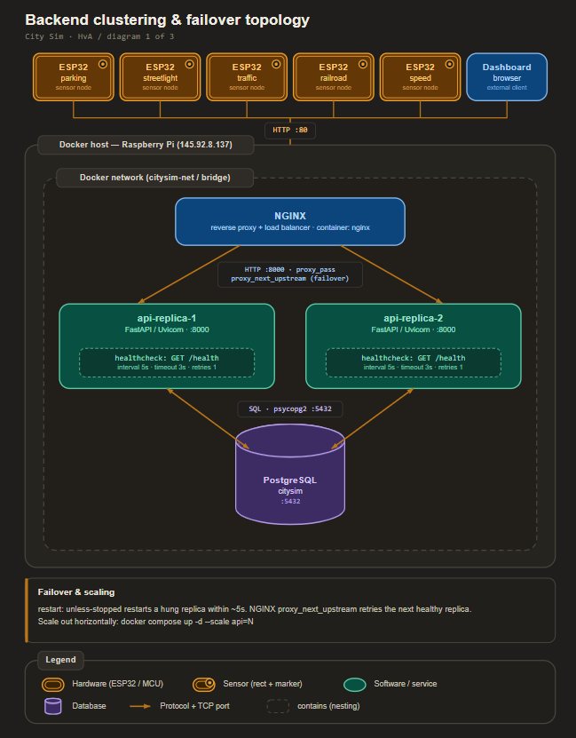

# Design - Backend clustering and failover architecture

| | |
|---|---|
| **Author** | Matin Khajehfard, Backend Developer (junior) |
| **Client** | Gemeente Amsterdam, afdeling Verkeer & Openbare Ruimte (V&OR), represented by the mayor (Mats Otten) |
| **Target audience** | Technical readers: the City Sim development team (embedded and backend engineers) and the technical lead at the client side |
| **Date** | May 2026 |
| **Version** | 0.1 |
| **Classification** | Internal |
| **Company** | The Embedded Alliance |
| **Learning outcome** | Design (third of the four outcomes: Analysis, Advise, Design, Realise) |

---

## Table of contents

1. Introduction
2. Chapter 1 - How do we design the container topology and entry point
3. Chapter 2 - How do we design detection and recovery
4. Chapter 3 - How do we design the configuration for the remaining requirements
5. Conclusion
6. Recommendation
7. References
8. Appendix

---

## Introduction

### Context

City Sim is a miniature smart city built by our team, The Embedded Alliance, for the Studio Smart Cities semester at the Hogeschool van Amsterdam (HvA). Five students each build one physical tile, and every tile sends its sensor data to one shared backend that I maintain. The backend is a FastAPI application with a PostgreSQL database, packaged in Docker, running on one Raspberry Pi on the HvA network (145.92.8.137, port 80). When that backend stops, every tile and the dashboard stop with it.

This is the **Design** outcome for Learning Goal 1. It is the third step in our order Analysis, Advise, Design, Realise. The Analysis researched the seven failure modes. The Advise chose the technologies and weighed the alternatives. This Design takes those chosen technologies and turns them into one concrete architecture: the container topology, the NGINX entry point, the healthcheck and restart loop, and the configuration for memory, database connections, overload, and disk. The Realise document then builds and tests it.

A design document answers design questions, not research questions. So this document does not ask whether to use a healthcheck (the Advise already settled that). It asks how we lay the pieces out so they meet the requirements.

### Requirements translated into the design

Gerald asked us to carry the requirements through and translate them into the design. The table below maps each requirement to the design element that satisfies it. We come back to this table in the conclusion.

| Source | Requirement | Design element |
|--------|-------------|----------------|
| HvA | Shared backend serves all five tiles at once | One NGINX entry on port 80 in front of multiple API replicas |
| HvA | The city works as a whole | Single stack defined in one docker-compose.yml |
| Mats (Sprint 3) | Auto-recover within 5 seconds | Docker healthcheck on /health (interval 5s, timeout 3s, retries 1) plus restart policy |
| Mats (Sprint 3) | Sustainable, not a one-off | Only native Docker, NGINX, and SQLAlchemy features |
| Gerald (Sprint 3) | Load balancing | NGINX upstream across the API replicas |
| Gerald (Sprint 3) | Failover | NGINX routes around an unhealthy replica; the healthy replica serves traffic |
| Gerald (Sprint 3) | Upscale and downscale | docker compose up with the scale flag on the api service |

### Main question

How do we design a clustering and failover architecture for the City Sim backend that meets the 5 second recovery requirement and the load balancing, failover, and scaling the mayor asked for?

### Sub-questions

1. How do we design the container topology and the entry point?
2. How do we design detection and recovery?
3. How do we design the configuration for the remaining requirements (memory, database, overload, disk)?

### Method

For each sub-question we present the design as a diagram or a configuration fragment, then explain how the design satisfies the matching requirement. The configuration fragments are the design artifact; the working, tested version lives in the Realise document.

---

## Chapter 1 - How do we design the container topology and entry point

### Context

Today there is one api container bound directly to port 80. That single container is the single point of failure. The Advise chose NGINX replicas, so the topology has to change so that traffic enters through NGINX and spreads over several API replicas.

### Design

The new topology has three layers. The ESP32 tiles and the dashboard talk to NGINX on port 80. NGINX balances over the API replicas. The replicas share the one PostgreSQL database.



NGINX now owns port 80. The api service no longer publishes a port; it is only reachable inside the Docker network, which NGINX reaches by the service name. PostgreSQL stays internal as before.

The NGINX upstream lists the api service. Docker resolves the service name to all of its replicas, so NGINX balances over them and skips one that does not answer. The relevant fragment:

```nginx
upstream citysim_api {
    server api:8000 max_fails=1 fail_timeout=5s;
}

server {
    listen 80;
    location / {
        proxy_pass http://citysim_api;
        proxy_next_upstream error timeout http_502 http_503 http_504;
    }
}
```

The `proxy_next_upstream` line is what gives failover: if one replica returns an error or times out, NGINX retries the request on another replica, so the user does not see the failure.

### Sub-conclusion

The topology becomes NGINX on port 80 in front of two or more internal API replicas that share one database. This satisfies the shared-backend, load balancing, and failover requirements.

---

## Chapter 2 - How do we design detection and recovery

### Context

Failover keeps the city online during a problem, but we still have to detect a hung replica and bring it back, inside 5 seconds. This is the healthcheck and restart loop from the Advise.

### Design

Each api replica gets a Docker healthcheck that calls its own /health endpoint. The endpoint already exists in main.py and returns a simple status. The design fragment for the api service:

```yaml
  api:
    build: .
    expose:
      - "8000"
    depends_on:
      db:
        condition: service_healthy
    restart: unless-stopped
    deploy:
      replicas: 2
    healthcheck:
      test: [ "CMD-SHELL", "curl -f http://localhost:8000/health || exit 1" ]
      interval: 5s
      timeout: 3s
      retries: 1
      start_period: 10s
```

The recovery loop works like this:

1. Docker calls /health every 5 seconds.
2. If a reply does not arrive within the 3 second timeout, and the single retry also fails, Docker marks the replica unhealthy.
3. `restart: unless-stopped` restarts the unhealthy replica.
4. While it restarts, NGINX sends traffic to the healthy replica, so the city stays online.
5. When the replica passes /health again, it rejoins the pool.

The `start_period` of 10 seconds gives a replica time to boot without being marked unhealthy too early. The timing of one interval plus the restart stays inside the 5 second target; the Realise document measures the real number.

### Sub-conclusion

A per-replica Docker healthcheck on /health, with a 5 second interval and a single retry, plus `restart: unless-stopped`, detects a hung replica and restarts it within the target, while NGINX keeps the city online.

---

## Chapter 3 - How do we design the configuration for the remaining requirements

### Context

The Analysis and Advise also covered memory pressure, a dropped database connection, overload, and a full disk. Each one becomes a small piece of configuration in this design.

### Design

**Memory limits.** Both services get a memory limit so one cannot starve the other on the Pi.

```yaml
    deploy:
      resources:
        limits:
          memory: 256M
```

The exact numbers are tuned in the Realise; the design point is that every container has a cap.

**Database connection resilience.** The SQLAlchemy engine in database.py is configured to check and recycle connections.

```python
engine = create_engine(
    DATABASE_URL,
    pool_pre_ping=True,
    pool_recycle=1800,
)
```

`pool_pre_ping` tests a connection before use and reconnects a dead one. `pool_recycle` drops a connection after 30 minutes so it never goes stale.

**Overload protection.** NGINX limits how fast one client can post, so a misbehaving ESP32 cannot flood the database the way it did before.

```nginx
limit_req_zone $binary_remote_addr zone=tiles:10m rate=10r/s;

location / {
    limit_req zone=tiles burst=20 nodelay;
    proxy_pass http://citysim_api;
}
```

**Disk cleanup.** A small scheduled job deletes sensor_readings older than a set age, so the pgdata volume on the SD card does not grow forever. The design keeps this as a priority-2 element.

### Sub-conclusion

Memory limits, `pool_pre_ping` with `pool_recycle`, NGINX `limit_req`, and a scheduled cleanup each translate one remaining requirement into native configuration.

---

## Conclusion

This design answers the main question. The backend becomes an NGINX entry point on port 80 in front of two or more API replicas that share one PostgreSQL database. Detection and recovery come from a per-replica Docker healthcheck on /health with `restart: unless-stopped`, which restarts a hung replica within 5 seconds while NGINX routes around it for failover. The remaining requirements become small native settings: memory limits, `pool_pre_ping` with `pool_recycle`, NGINX `limit_req`, and a scheduled cleanup. Every row in the requirements table from the introduction now maps to a concrete design element, so the design is traceable to the HvA brief and to both mayor deliveries.

---

## Recommendation

We recommend the Realise document build this design in three steps:

1. Add the NGINX service and move port 80 from the api service to NGINX, then confirm the dashboard and all tile endpoints still work through NGINX.
2. Add the healthcheck, replicas, and `restart: unless-stopped`, then run a stress, load, and soak test to verify recovery stays inside 5 seconds and to catch any memory leak.
3. Add the memory limits, the SQLAlchemy settings, and the priority-2 items (rate limiting and cleanup) if time allows, then end with a user test and hand the stack over to the team for maintenance.

The full docker-compose.yml is sketched in Appendix A as the starting point for the build.

---

## References

- Docker Inc. (2024a). *Dockerfile reference: HEALTHCHECK* [Online]. Retrieved May 2026, from https://docs.docker.com/reference/dockerfile/#healthcheck
- Docker Inc. (2024b). *Compose file reference: restart and deploy.resources* [Online]. Retrieved May 2026, from https://docs.docker.com/reference/compose-file/
- NGINX. (2024). *Using nginx as HTTP load balancer* [Online]. Retrieved May 2026, from https://nginx.org/en/docs/http/load_balancing.html
- Nygard, M. T. (2018). *Release It! Design and deploy production-ready software* (2nd ed.) [Print]. Pragmatic Bookshelf.
- Otten, M. (2026). *Sprint 3 mayor delivery feedback* [Verbal feedback, offline]. Hogeschool van Amsterdam.
- SQLAlchemy. (2024). *Engine configuration: pool_pre_ping* [Online]. Retrieved May 2026, from https://docs.sqlalchemy.org/en/20/core/pooling.html
- Stap, G. (2026). *Sprint 4 feedback on Smart City deliverables* [Verbal feedback, offline]. Hogeschool van Amsterdam.

---

## Appendix

### Appendix A - Target docker-compose.yml (design sketch)

```yaml
services:
  nginx:
    image: nginx:alpine
    container_name: citysim_nginx
    ports:
      - "80:80"
    volumes:
      - ./nginx.conf:/etc/nginx/nginx.conf:ro
    depends_on:
      - api
    restart: unless-stopped

  api:
    build: .
    expose:
      - "8000"
    depends_on:
      db:
        condition: service_healthy
    restart: unless-stopped
    deploy:
      replicas: 2
      resources:
        limits:
          memory: 256M
    healthcheck:
      test: [ "CMD-SHELL", "curl -f http://localhost:8000/health || exit 1" ]
      interval: 5s
      timeout: 3s
      retries: 1
      start_period: 10s

  db:
    image: postgres:16-alpine
    volumes:
      - pgdata:/var/lib/postgresql/data
    healthcheck:
      test: [ "CMD-SHELL", "pg_isready -U citysim" ]
      interval: 5s
      timeout: 3s
      retries: 5
    deploy:
      resources:
        limits:
          memory: 256M
    restart: unless-stopped

volumes:
  pgdata:
```

### Appendix B - Requirement to design traceability

| Requirement | Design element | Document section |
|-------------|----------------|------------------|
| Serve all five tiles | NGINX on port 80 in front of replicas | Chapter 1 |
| Auto-recover within 5s | Healthcheck on /health plus restart | Chapter 2 |
| Load balancing | NGINX upstream | Chapter 1 |
| Failover | proxy_next_upstream | Chapter 1 |
| Upscale and downscale | compose scale flag | Chapter 1 |
| No out-of-memory | memory limits | Chapter 3 |
| Survive DB drop | pool_pre_ping, pool_recycle | Chapter 3 |
| Survive overload | NGINX limit_req | Chapter 3 |
| Survive full disk | scheduled cleanup | Chapter 3 |
