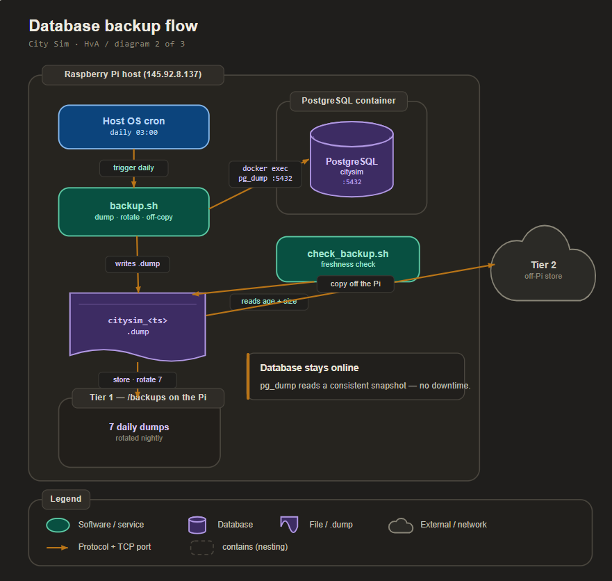

# Design - Backup and restore architecture

| | |
|---|---|
| **Author** | Matin Khajehfard, Backend Developer (junior) |
| **Client** | Gemeente Amsterdam, afdeling Verkeer & Openbare Ruimte (V&OR), represented by the mayor (Mats Otten) |
| **Target audience** | Technical readers: the City Sim development team (embedded and backend engineers) and the technical lead at the client side |
| **Date** | May 2026 |
| **Version** | 0.1 |
| **Classification** | Internal |
| **Company** | The Embedded Alliance |
| **Learning outcome** | Design (third of the four outcomes: Analysis > Advise > Design > Realise) |

---

## Table of contents

1. Introduction
2. Chapter 1 - The backup flow
3. Chapter 2 - Retention and storage
4. Chapter 3 - The restore and upgrade procedure
5. Conclusion
6. Recommendation
7. References
8. Appendix

---

## Introduction

### Context

This is the **Design** outcome for Learning Goal 2 (database backup and data persistence). The Analysis found six data loss scenarios and the Advise chose the tools: scheduled `pg_dump`, a two-tier store with every dump copied off the Pi, `cron` scheduling, and a dump-restore-verify-switch upgrade path. This document turns those choices into a concrete architecture the Realise can build: the backup flow, the retention and storage layout, the restore procedure, and the upgrade procedure.

The backend is FastAPI plus PostgreSQL 16 in Docker on one Raspberry Pi (145.92.8.137, port 80). The database stores its data in a named volume (`pgdata`) on the SD card, with no backup today.

### Design question

How should the backup, restore, and upgrade be laid out so City Sim never loses data, the restore is proven, and the team can keep it running?

### Sub-questions

1. What does the backup flow look like, step by step?
2. How are backups retained and stored across the two tiers?
3. What are the exact restore and upgrade procedures?

### Method

We translate each Advise choice into a component, show how the components connect, and keep every requirement traceable from the Analysis through to this design (see the traceability table below and in Appendix C). The design uses only PostgreSQL and Docker built-ins plus `cron`, as the Advise settled.

### Requirements traceability

| Requirement (source) | Design answer |
|----------------------|---------------|
| Never lose data (Gerald) | Scheduled `pg_dump` + off-Pi copy of every dump |
| Survives SD card failure (Analysis 1) | Tier 2: every dump copied off the Pi |
| Catch a silent backup failure (Mats) | Freshness check on the latest dump |
| Safe database upgrade (Gerald) | Dump, restore on new version, verify, switch |
| Sustainable, no extra service (Mats) | `pg_dump` + `cron`, both built in |
| Normalized data with meta-data kept (HvA brief) | Full-database dump preserves every table and its meta-data columns |

---

## Chapter 1 - The backup flow

### Context

The core of the design is a single scheduled job that produces one consistent, portable backup file per run without taking the city offline.

### Method

We lay out the flow as a sequence of steps, each one a thing the Realise script will do, and we map it to the `db` container that already exists.

### The flow

```
cron (on the Pi, daily)
   |
   v
backup script
   |  1. pg_dump the citysim database from the running db container
   |     (custom format, compressed) -> /backups/citysim_<timestamp>.dump
   |
   |  2. copy the new dump off the Pi (tier 2)
   |
   |  3. delete local dumps older than the retention window (tier 1)
   |
   v
result: one fresh dump on the Pi + one copy off the Pi
```

Step 1 runs `pg_dump` against the existing `db` container, so no second database or extra service is needed. The custom, compressed format keeps the file small on the SD card and restores cleanly with `pg_restore`. Step 2 is the off-Pi copy that removes the SD card single point of failure. Step 3 keeps the SD card from filling up, which is the disk-full risk the design must not reintroduce.

### Design choice: dump the whole database

We dump the entire `citysim` database, not selected tables. This guarantees the normalized schema and the meta-data columns (date/time, device, IP, location) the HvA brief requires are all captured together, and it keeps the restore simple: one file rebuilds everything.

### Sub-conclusion

The backup flow is one `cron`-driven script doing three steps: dump, copy off the Pi, prune locally. It runs against the existing `db` container and produces one portable file per run.

---

## Chapter 2 - Retention and storage

### Context

The Advise chose a two-tier store. This chapter fixes how many backups we keep and where, so the SD card never fills and a card failure never erases the safety net.

### Method

We define a retention window for each tier, balancing recovery reach against the limited SD card space.

### The layout

| Tier | Location | Retention | Purpose |
|------|----------|-----------|---------|
| Tier 1 | `/backups` on the Pi | Last 7 daily dumps | Fast local restore |
| Tier 2 | Off-Pi (team machine / share) | Longer history | Survives SD card failure |

Tier 1 gives a one-week window for a quick restore directly on the Pi, which covers the common case of an accidental deletion noticed within days. Tier 2 holds the longer history off the card, so even a total SD card loss leaves the city's data recoverable. The retention numbers are a starting point the team can tune; the design fixes the shape, not unchangeable values.

### Storage note

The dumps live in a dedicated `/backups` directory mounted into the backup process, kept separate from the `pgdata` volume so a problem with the database volume does not touch the backups. The off-Pi destination is a configuration value, not hard-coded, so the team can point it at whatever HvA infrastructure is available.

### Sub-conclusion

Seven daily dumps on the Pi for speed, a longer history off the Pi for safety, in a directory separate from the database volume. This keeps the SD card from filling while removing it as a single point of failure.

---

## Chapter 3 - The restore and upgrade procedure

### Context

A backup only counts once it is restored. This chapter fixes the exact restore procedure and the upgrade procedure that depends on it, both of which the Realise will run and record.

### Method

We write the procedures as ordered steps a team member can follow, using `pg_restore` and the existing Docker setup.

### Restore procedure

1. Pick the dump to restore (latest, or a specific timestamp before a mistake).
2. Create an empty target database (a throwaway one for a test restore, or the real one for a real recovery).
3. Run `pg_restore` to load the dump into the target.
4. Verify: check that the key tables exist and the row counts match what we expect.
5. For a real recovery, point the API at the restored database and confirm the dashboard reads correctly.

The test version of this, run on a throwaway database, is what proves the backup is usable. The Realise document runs it and records the row counts so the team has evidence the safety net holds.

### Upgrade procedure (Gerald's database upgrade)

1. Run the backup script to produce a full, current dump.
2. Confirm the dump copied off the Pi (tier 2).
3. Bring up the new PostgreSQL major version against a fresh, empty volume.
4. Restore the dump into the new version and verify the row counts (the restore procedure above).
5. Switch the city over to the new version only after the verify passes.
6. Keep the old volume and the dump until the new version has run cleanly for a while.

If any step fails, the old data is untouched in both the dump and the old volume, so the upgrade can never lose data.

### Freshness check

A small check reports the age and size of the newest dump in `/backups`. If the newest dump is older than expected or unexpectedly small, the schedule has silently failed and the team is alerted. This is the detection step Mats asked for, applied to backups.

### Sub-conclusion

The restore is a five-step `pg_restore` procedure that is proven on a throwaway database; the upgrade wraps that restore in a dump-first, switch-last sequence that keeps the old data safe; and a freshness check catches a silently failed backup.

---

## Conclusion

This answers the design question. City Sim gets a single `cron`-driven backup script that dumps the whole database, copies the dump off the Pi, and prunes old local dumps; a two-tier store of seven daily dumps on the Pi and a longer history off it; a five-step, tested restore procedure; a dump-restore-verify-switch upgrade procedure for Gerald's PostgreSQL upgrade; and a freshness check that catches a silent backup failure. Every requirement from the Analysis is traceable to a component here, and the whole design uses only `pg_dump`, `pg_restore`, `cron`, and Docker, which keeps it sustainable for the team. The Realise document builds these artifacts and tests the restore against real data.

---

## Recommendation

For the Realise outcome we recommend building, in this order:

1. The backup script (`pg_dump` of the whole database, custom compressed format, timestamped).
2. The `cron` entry that runs it daily and the `/backups` directory with 7-day local retention.
3. The off-Pi copy step (tier 2), with the destination as configuration.
4. The restore procedure as a documented, runnable script, and a test restore into a throwaway database with row-count verification.
5. The freshness check on the latest dump.

Build these next to the live setup, the same way Learning Goal 1 did, so the running city is never at risk while we test.

---

## References

- Docker Inc. (2024). *Manage data in Docker: volumes* [Online]. Retrieved May 2026, from https://docs.docker.com/storage/volumes/
- PostgreSQL Global Development Group. (2024a). *PostgreSQL documentation: backup and restore* [Online]. Retrieved May 2026, from https://www.postgresql.org/docs/16/backup.html
- PostgreSQL Global Development Group. (2024b). *PostgreSQL documentation: pg_dump and pg_restore* [Online]. Retrieved May 2026, from https://www.postgresql.org/docs/16/app-pgdump.html
- Stap, G. (2026). *Sprint 4 feedback on Smart City deliverables* [Verbal feedback, offline]. Hogeschool van Amsterdam.

---

## Appendix

### Appendix A - Backup directory layout (target)

```
backend/
  backups/                         # tier 1, on the Pi (7 daily dumps)
    citysim_2026-05-30_0300.dump
    citysim_2026-05-29_0300.dump
    ...
  scripts/
    backup.sh                      # pg_dump + copy off Pi + prune
    restore.sh                     # pg_restore + row-count verify
    check_backup.sh                # freshness check on latest dump
```

### Appendix B - Example cron entry (target)

```
# Daily database backup at 03:00
0 3 * * * /home/pi/citysim/backend/scripts/backup.sh >> /var/log/citysim_backup.log 2>&1
```

### Appendix C - Requirement to component traceability

| Requirement | Component in this design |
|-------------|--------------------------|
| Never lose data | backup.sh + off-Pi copy |
| Survives SD card failure | tier 2 off-Pi store |
| Proven restore | restore.sh + test restore with row counts |
| Safe upgrade | upgrade procedure (Chapter 3) |
| Catch silent failure | check_backup.sh freshness check |
| Sustainable | only pg_dump, pg_restore, cron, Docker |
| Keep normalized data + meta-data | full-database dump |
