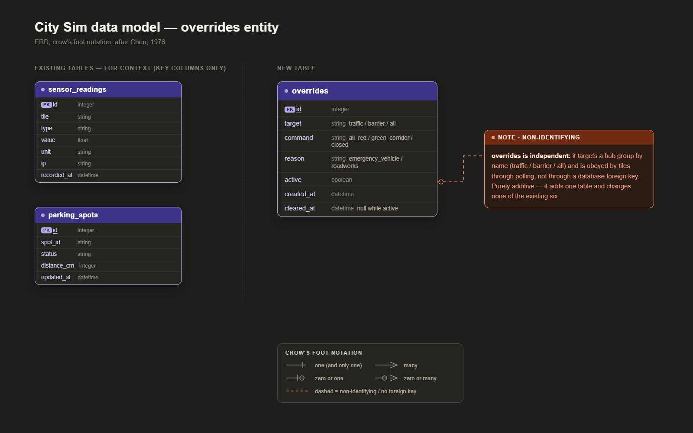

# Design - Surprise feature concept

| | |
|---|---|
| **Author** | Matin Khajehfard, Backend Developer (junior) |
| **Client** | Gemeente Amsterdam, afdeling Verkeer & Openbare Ruimte (V&OR), represented by the mayor (Mats Otten) |
| **Target audience** | Technical readers: the City Sim development team (embedded and backend engineers) and the technical lead at the client side |
| **Date** | June 2026 |
| **Version** | 1.1 |
| **Classification** | Internal |
| **Company** | The Embedded Alliance |
| **Learning outcome** | Design (third of the four outcomes: Analysis > Advise > Design > Realise) |

---

## Table of contents

1. Introduction
2. Chapter 1 - The backend override and why it is the right surprise
3. Chapter 2 - The override fits the existing architecture as a pure addition
4. Chapter 3 - The data model and endpoints
5. Conclusion
6. Recommendation
7. References
8. Appendix

---

## Introduction

### Context

City Sim is a miniature smart city that our team, The Embedded Alliance, builds for the Studio Smart Cities semester at the Hogeschool van Amsterdam (HvA). Five students each build one physical tile, and every tile sends its sensor data to one shared backend that we maintain. The backend is a FastAPI application with a PostgreSQL 16 database, in Docker, on one Raspberry Pi on the HvA network (145.92.8.137, port 80). The author of this document is Matin Khajehfard, the backend developer (junior) on the team, so the design of a backend feature is his to own and to defend.

This is the **Design** outcome for Learning Goal 3 (the surprise feature), the third step in our Analysis > Advise > Design > Realise order. At the Sprint 3 mayor delivery Mats Otten, who represents the client at the mayor delivery, asked for "one surprise in the backend". His Sprint 4 feedback sharpened it: decide what the surprise is, write it down, and explain why we chose it (Otten, 2026). This document does exactly that, then designs the feature so the Realise can build it. Because the surprise is a feature that has to integrate with the running city, not a piece of infrastructure, we design it to slot into the existing backend, unlike the separate cluster and backup work of the other two learning goals.

We write this document for a technical audience: the City Sim development team, meaning the embedded engineers who build the tiles and the backend engineers who maintain the API, plus the technical lead on the client side who has to sign off on a new backend capability. That audience is the reason for a detailed, internal engineering document. The people reading it implement and maintain the override, so they need the data model, the endpoints, and the integration points, not a high-level pitch. The public and the assessors are not the audience, which is why the form is deep rather than broad. The client is Gemeente Amsterdam, afdeling Verkeer & Openbare Ruimte (V&OR), and the client is not the same group as the audience: the client owns the traffic policy and asks for the capability, while the audience builds it. We classify the document Internal because it describes how our own backend works and is meant to circulate inside the team and the client's technical staff, not outside it. The version is 1.1 because this is a revision after a second round of writing feedback from mister mayor Gerald Stap (Stap, 2026).

### Design question

How do we design a surprise backend feature that adds real value to the City Sim and fits the existing architecture without breaking it?

### Sub-questions

1. Why is the backend override the right surprise for the City Sim backend?
2. How does the override fit the architecture the city already has?
3. How do we model the data and the endpoints the override needs?

We picked the feature from the project's own requirements, so the surprise is grounded in something the client actually needs rather than a gimmick. We then designed the data model and the endpoints to match the existing router pattern in the backend, so the feature is consistent with the rest of the code. Each chapter below answers one sub-question and ends with a short sub-conclusion.

---

## Chapter 1 - The backend override and why it is the right surprise

The first sub-question asks why the backend override is the right surprise. Mats Otten set a sharp test for the surprise: he wanted something he does not expect but immediately sees the point of (Otten, 2026). A surprise that is only unexpected is a trick, and a surprise that is only useful is just a normal feature, so the candidate had to be unexpected and useful at the same time. We screened the project's own requirements for a capability that met both, instead of inventing a gimmick from scratch.

The feature we landed on is a backend override: the backend can overrule the decision of an individual tile. The headline case is an emergency vehicle corridor, where one call from the backend forces every traffic light in the city to red so an ambulance or a fire truck can pass safely. Three reasons made the override win, and each one is a justification Mats asked us to give. First, the override is a real requirement we had not built yet. The HvA back-end brief states, word for word, that it must be possible to override the decisions of individual hubs from the back-end, for example to set all traffic lights on a road to red for an emergency vehicle (Hogeschool van Amsterdam, 2026). Until now every tile decided for itself based on its own sensors and the backend only collected data, so nothing let the brain overrule a hub. The override closes a genuine gap in the requirements, which makes it more than a trick. Second, the override flips the data direction, and the reversal is the unexpected part. The whole city so far is one-way, with tiles pushing data up to the backend, while the override sends a command back down from the backend to the tiles. The mayor expects a backend that listens, and instead he gets a backend that can also command. Third, the override has obvious value to the client. For Gemeente Amsterdam an emergency corridor is a concrete public-safety feature, not a demo toy, and the department that owns traffic policy can see at once why a city would want central control for emergency vehicles. That match is the "immediately sees the point of" Mats described.

### Sub-conclusion

The right surprise is the backend override, shown through an emergency vehicle corridor. The override is unexpected because it reverses the city's data flow, and it is valuable because it answers a stated back-end requirement we had not built and a real public-safety need.

---

## Chapter 2 - The override fits the existing architecture as a pure addition

The second sub-question asks how the override fits the architecture the city already has. The constraint here is hard: the live backend runs the whole demo city, so the surprise has to integrate without breaking anything that already works. We start from the current shape of the backend and show where the override sits in it.

The backend already has seven routers, six tables, and a dashboard, all behind the `/api/v1` prefix. The override is an eighth router (`/api/v1/override`) and a seventh table (`overrides`), added the same way every other feature was added, following the multiple-files router pattern that FastAPI documents for bigger applications (FastAPI, 2024). The override changes none of the existing endpoints or tables, so nothing that works today can break. The command flow itself is a question of message order between two parties, the backend and a tile, so we model it as a UML sequence diagram, the notation the Object Management Group defines for ordered interactions between participants (Object Management Group, 2017). The diagram below reads top to bottom: a tile polls the backend for any active override on its target, and the backend answers.

*Figure 1. UML sequence diagram of the override command flow. A tile polls the backend for an active override; if one is in force the tile obeys the command, otherwise it falls back to its own sensor logic.*

The diagram shows the override as opt-in per tile. A tile polls the backend for any active override for its target, and if there is one it obeys the forced command, while if there is none it runs its own sensor logic as before. That loop is the "brain overrules the hub" behaviour the requirement asks for (Hogeschool van Amsterdam, 2026). Because a tile only obeys when it chooses to poll, a tile that does not poll yet is simply unaffected, so the feature is safe to add before every tile supports it. The design therefore meets the override requirement and the no-regression constraint at the same time.

### Sub-conclusion

The override fits as one more router and one more table on the existing `/api/v1` backend, and the UML sequence diagram shows the command flow it adds. The feature is purely additive and opt-in per tile, so it integrates without touching anything that already works.

---

## Chapter 3 - The data model and endpoints

The third sub-question asks how we model the data and the endpoints the override needs. The goal of this chapter is to fix the table and the endpoints precisely enough that the Realise can build them directly. We design the data model as an entity-relationship model, the approach Chen introduced for describing data in terms of entities and their attributes (Chen, 1976), and we draw it as an entity-relationship diagram (ERD) in crow's foot notation.

The override needs a single new entity, the `overrides` table. The diagram below shows that table and how it sits next to the six tables the schema already has.

*Figure 2. Entity-relationship diagram of the `overrides` table in crow's foot notation. The override is a standalone entity that records central-control events; it does not require a foreign key into the per-tile tables, because it targets a hub group rather than a single sensor row.*

The fields of the entity are listed below.

| Field | Type | Meaning |
|-------|------|---------|
| id | int | primary key |
| target | string | which hub group to override (`traffic`, `barrier`, `all`) |
| command | string | the forced command (`all_red`, `green_corridor`, `closed`) |
| reason | string | why it was set (`emergency_vehicle`, `roadworks`) |
| active | bool | whether the override is currently in force |
| created_at | datetime | when it was set |
| cleared_at | datetime | when it was cleared (null while active) |

The table reads as one auditable record per central-control event. The `target`, `command`, and `reason` columns say which hub group was forced, what it was forced to, and why, while `active`, `created_at`, and `cleared_at` track the lifetime of the override from the moment it was set to the moment it was cleared. The override is a standalone entity rather than a child of the per-tile tables: it targets a hub group such as `traffic`, not one sensor reading, so it carries no foreign key into the existing six tables and adds itself cleanly as the seventh. Keeping the full history in the table fits the HvA requirement to store city data with meta-data for later analysis (Hogeschool van Amsterdam, 2026), because every row is a timestamped, auditable record of when the city took central control and why.

The endpoints expose this entity through the same router pattern the rest of the backend uses (FastAPI, 2024). The five routes are listed below.

| Method | Path | Purpose |
|--------|------|---------|
| POST | `/api/v1/override` | Set a generic override on a target |
| GET | `/api/v1/override/active` | Tiles poll this to learn the forced command |
| POST | `/api/v1/override/{id}/clear` | Clear one override, tile returns to its own logic |
| GET | `/api/v1/override` | Override history for the dashboard and audit |
| POST | `/api/v1/override/emergency` | One call: force all traffic lights to red |

The five routes cover the whole lifecycle of an override: one to set a generic override, one for tiles to poll the active command, one to clear an override so a tile returns to its own logic, one to read the history for the dashboard and audit, and one shortcut for the emergency case. The `emergency` route is the surprise made into a single button, because it clears any earlier traffic override and sets one city-wide `all_red`, so the demo is one request and every traffic light obeys.

### Sub-conclusion

We model the override as a single `overrides` entity, drawn as an ERD, and expose it through five endpoints on the existing router pattern. The entity adds itself as the seventh table without a foreign key into the per-tile data, and the `emergency` shortcut turns the requirement into a one-call demo.

---

## Conclusion

We set out to answer how we design a surprise backend feature that adds real value to the City Sim and fits the existing architecture without breaking it. First, the right surprise is the backend override, shown through an emergency vehicle corridor, because the override is both unexpected, as it reverses the city's data flow, and valuable, as it answers a stated back-end requirement we had not built and a real public-safety need. Second, the override fits the architecture as a pure addition: one more router and one more table on the existing `/api/v1` backend, opt-in per tile through the polling loop the UML sequence diagram shows, so nothing that works today can break. Third, we model the feature as a single `overrides` entity drawn as an ERD and expose it through five endpoints on the existing router pattern, with the `emergency` shortcut turning the requirement into a one-call demo. Together these three answers show a design that is at once a genuine surprise and a clean fit. So the answer to the design question is the backend override: a brain-overrules-the-hub feature, designed as one additive router and one `overrides` table, that delivers an emergency vehicle corridor on a single call. The Realise document builds the table and the five endpoints and shows the emergency corridor working end to end.

---

## Recommendation

For the Realise outcome we recommend building, in this order:

1. The `overrides` table and its Pydantic schemas, following the existing model pattern.
2. The five override endpoints in a new `override` router, registered like the others.
3. The `emergency` shortcut as the demo button.
4. A short test that sets the emergency override, polls the active overrides as a tile would, clears it, and confirms the state each step.
5. A note in the handover that tile firmware has to poll the active overrides to obey them, since the backend side is additive and does not force any tile to change.

---

## References

- Chen, P. P. (1976). The entity-relationship model: Toward a unified view of data. *ACM Transactions on Database Systems, 1*(1), 9-36. https://doi.org/10.1145/320434.320440 [Online].
- FastAPI. (2024). *Bigger applications: Multiple files* [Online]. Retrieved June 5, 2026, from https://fastapi.tiangolo.com/tutorial/bigger-applications/
- Hogeschool van Amsterdam. (2026). *City Sim project brief: base requirements (General, Embedded, Back-end)* [Print]. Studio Smart Cities, HvA.
- Object Management Group. (2017). *OMG Unified Modeling Language (OMG UML), version 2.5.1* [Online]. Retrieved June 5, 2026, from https://www.omg.org/spec/UML/2.5.1/
- Otten, M. (2026, May 20). *Sprint 4 mayor delivery feedback (Mats)* [Verbal, offline]. Hogeschool van Amsterdam.
- Stap, G. (2026, May 20). *Sprint 4 feedback on Smart City deliverables (mister mayor Gerald Stap)* [Verbal, offline]. Hogeschool van Amsterdam.

---

## Appendix

### Appendix A - Why not the other surprise ideas

We considered a few alternatives and rejected them. A live monitoring dashboard for the cluster was useful, but a monitoring dashboard overlaps with Learning Goal 1 and does not add a new capability to the city. A statistics or prediction endpoint was nice, but such an endpoint is still the backend listening, not the unexpected reversal of control the surprise needed. The override won because the override is the only candidate that is both a stated requirement and a genuine surprise in how the city behaves.

### Appendix B - Use of AI

We used an AI assistant (Claude) as a writing aid for this document. It helped restructure the text to the agreed feedback standard, check the APA formatting and the in-text citations, and rephrase passages for clarity. It did not produce the engineering work or the design choices: the architecture, the data model, the endpoints, and the override decision are our own and were reviewed by the author, who is responsible for the content.
