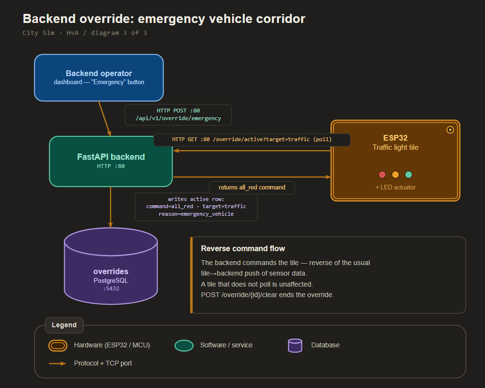

# Design - Surprise feature concept

| | |
|---|---|
| **Author** | Matin Khajehfard, Backend Developer (junior) |
| **Client** | Gemeente Amsterdam, afdeling Verkeer & Openbare Ruimte (V&OR), represented by the mayor (Mats Otten) |
| **Target audience** | Technical readers: the City Sim development team (embedded and backend engineers) and the technical lead at the client side |
| **Date** | May 2026 |
| **Version** | 0.1 |
| **Classification** | Internal |
| **Company** | The Embedded Alliance |
| **Learning outcome** | Design (third of the four outcomes: Analysis > Advise > Design > Realise) |

---

## Table of contents

1. Introduction
2. Chapter 1 - What the surprise is and why we chose it
3. Chapter 2 - How it fits the existing architecture
4. Chapter 3 - The data model and endpoints
5. Conclusion
6. Recommendation
7. References
8. Appendix

---

## Introduction

### Context

City Sim is a miniature smart city that our team, The Embedded Alliance, builds for the Studio Smart Cities semester at the Hogeschool van Amsterdam (HvA). Five students each build one physical tile, and every tile sends its sensor data to one shared backend that I maintain. The backend is a FastAPI application with a PostgreSQL 16 database, in Docker, on one Raspberry Pi on the HvA network (145.92.8.137, port 80).

This is the **Design** outcome for Learning Goal 3 (the surprise feature). At the Sprint 3 mayor delivery Mats asked for "one surprise in the backend". His Sprint 4 feedback sharpened it: decide what the surprise is, write it down, and explain why you chose it. This document does exactly that, then designs the feature so the Realise can build it. Because the surprise is a feature that has to integrate with the running city, not a piece of infrastructure, we design it to slot into the existing backend, unlike the separate cluster and backup work of the other two learning goals.

### Design question

What surprise feature adds real value to the City Sim backend, and how does it fit the existing architecture without breaking anything?

### Sub-questions

1. What is the feature and why is it the right choice?
2. How does it fit the architecture the city already has?
3. What data model and endpoints does it need?

### Method

We picked the feature from the project's own requirements, so the surprise is grounded in something the client actually needs rather than a gimmick. We then designed the data model and endpoints to match the existing router pattern in the backend, so the feature is consistent with the rest of the code.

---

## Chapter 1 - What the surprise is and why we chose it

### Context

Mats asked for a surprise that he does not expect but immediately sees the point of. So it has to be unexpected and useful at the same time.

### The choice

The surprise is a **backend override**: the backend can overrule the decision of an individual tile. The headline case is an **emergency vehicle corridor**, where one call from the backend forces every traffic light in the city to red so an ambulance or fire truck can pass safely.

### Why we chose it

We chose the override for three reasons, each one a justification Mats asked for.

1. **It is a real requirement we had not built yet.** The HvA back-end brief states, word for word, that it "must be possible to override the decisions of individual hubs from the back-end (e.g. set all traffic lights on a road to red for an emergency vehicle)". Until now every tile decided for itself based on its own sensors; the backend only collected data. Nothing let the brain overrule a hub. So this closes a genuine gap in the requirements, which makes it more than a trick.

2. **It flips the data direction, which is the unexpected part.** The whole city so far is one-way: tiles push data up to the backend. An override sends a command back down, from the backend to the tiles. That reversal is the surprise. The mayor expects a backend that listens; he gets a backend that can also command.

3. **It has obvious value to the client.** For Gemeente Amsterdam, an emergency corridor is a concrete public-safety feature, not a demo toy. The department that owns traffic policy can immediately see why a city would want central control for emergency vehicles. That is the "immediately sees the point of" Mats described.

### Sub-conclusion

The surprise is the backend override, shown through an emergency vehicle corridor. It is unexpected because it reverses the data flow, and valuable because it answers a stated requirement and a real public-safety need.

---

## Chapter 2 - How it fits the existing architecture

### Context

The feature must integrate without breaking anything. This chapter shows where it sits in the current backend.

### The fit

The backend already has seven routers, six tables, and a dashboard, all behind the `/api/v1` prefix. The override is an eighth router (`/api/v1/override`) and a seventh table (`overrides`), added the same way every other feature was added. It changes none of the existing endpoints or tables, so nothing that works today can break.

The flow is:

A tile polls the backend for any active override for its target. If there is one, it obeys the forced command; if there is none, it runs its own sensor logic as before. This is the "brain overrules the hub" behaviour the requirement asks for, and it is opt-in per tile: a tile that does not poll is simply unaffected, so the feature is safe to add before every tile supports it.

### Sub-conclusion

The override is one more router and one more table on the existing `/api/v1` backend. It is purely additive, so it integrates without touching anything that already works.

---

## Chapter 3 - The data model and endpoints

### Context

This chapter fixes the table and the endpoints so the Realise can build them directly.

### The data model

One table, `overrides`, with these fields:

| Field | Type | Meaning |
|-------|------|---------|
| id | int | primary key |
| target | string | which hub group to override (`traffic`, `barrier`, `all`) |
| command | string | the forced command (`all_red`, `green_corridor`, `closed`) |
| reason | string | why it was set (`emergency_vehicle`, `roadworks`) |
| active | bool | whether the override is currently in force |
| created_at | datetime | when it was set |
| cleared_at | datetime | when it was cleared (null while active) |

The history of overrides stays in the table, which fits the HvA requirement to keep city data with meta-data for later analysis: every override is a timestamped, auditable record of when the city took central control and why.

### The endpoints

| Method | Path | Purpose |
|--------|------|---------|
| POST | `/api/v1/override` | Set a generic override on a target |
| GET | `/api/v1/override/active` | Tiles poll this to learn the forced command |
| POST | `/api/v1/override/{id}/clear` | Clear one override, tile returns to its own logic |
| GET | `/api/v1/override` | Override history for the dashboard and audit |
| POST | `/api/v1/override/emergency` | One call: force all traffic lights to red |

The `emergency` endpoint is the surprise made into a single button: it clears any earlier traffic override and sets one city-wide `all_red`, so the demo is one request and every traffic light obeys.

### Sub-conclusion

The feature needs one `overrides` table and five endpoints, all following the existing router pattern. The `emergency` shortcut turns the requirement into a one-call demo.

---

## Conclusion

This answers the design question. The surprise is a backend override that lets the brain overrule a tile, shown through a one-call emergency vehicle corridor that forces every traffic light to red. We chose it because it closes a stated back-end requirement we had not built, because it reverses the city's data flow in a way the mayor does not expect, and because it is a real public-safety feature for the client. It fits the architecture as one additive router and one table on the existing `/api/v1` backend, so it breaks nothing. The Realise document builds the table and the five endpoints and shows the emergency corridor working end to end.

---

## Recommendation

For the Realise outcome we recommend building, in this order:

1. The `overrides` table and its Pydantic schemas, following the existing model pattern.
2. The five override endpoints in a new `override` router, registered like the others.
3. The `emergency` shortcut as the demo button.
4. A short test that sets the emergency override, polls the active overrides as a tile would, clears it, and confirms the state each step.
5. A note in the handover that tile firmware has to poll the active overrides to obey them, since the backend side is additive and does not force any tile to change.

---

## References

- Hogeschool van Amsterdam. (2026). *City Sim project brief: back-end requirements* [Print]. Studio Smart Cities, HvA.
- Otten, M. (2026). *Sprint 3 and Sprint 4 mayor delivery feedback* [Verbal feedback, offline]. Hogeschool van Amsterdam.
- tiangolo. (2024). *FastAPI documentation: bigger applications, multiple files* [Online]. Retrieved May 2026, from https://fastapi.tiangolo.com/tutorial/bigger-applications/

---

## Appendix

### Appendix A - Why not the other surprise ideas

We considered a few alternatives and rejected them:

- A live monitoring dashboard for the cluster: useful, but it overlaps with Learning Goal 1 and does not add a new capability to the city.
- A statistics or prediction endpoint: nice, but it is still the backend listening, not the unexpected reversal of control.

The override won because it is the only candidate that is both a stated requirement and a genuine surprise in how the city behaves.
