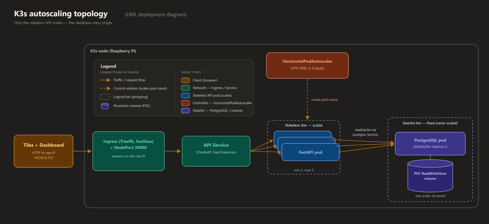

# Revision guide - Gerald round-2 feedback (Sprint 4)

> Working document, not a graded deliverable. It captures the second round of
> feedback from mister mayor Gerald Stap, divides it across the four outcomes
> (Analysis, Advise, Design, Realise), and sets one fixed standard so every
> Sprint 4 document is revised the same way. It doubles as the brief for the
> revision agents. Matin keeps it as evidence that the feedback was processed,
> or deletes it after the revision is done.

---

## 1. How to read this guide

- Section 2 is the feedback itself, in plain words, split per outcome. That is
  the part Matin asked for ("schrijf ze duidelijk voor me en verdeel ze").
- Section 3 is the universal checklist (applies to every document).
- Sections 4-7 are the extra rules per outcome (Analysis / Advise / Design /
  Realise).
- Section 8 is the approved source list (use only these, add in-text citations).
- Section 9 is the diagram plan (which PNG goes where, and its named notation).
- Section 10 is a before/after example so the wording stays consistent.
- Section 11 is the file ownership table for the revision agents.

---

## 2. Gerald's round-2 feedback, divided per outcome

Gerald gave this while reading the Sprint 3/4 documents. It is about HOW we
write, so it lands on all four outcomes. Below it is grouped so each outcome
owner sees what is theirs.

### Applies to all four outcomes (the writing itself)

1. **Target audience in the introduction story.** Name the audience inside the
   running text of the introduction, not only in the metadata table. Also say
   WHY a document in this form (a technical, detailed, internal engineering
   document) is the best fit for that audience.
2. **Hook the document properties into the intro.** Weave the metadata
   (author and role, client, classification, version) into the introduction so
   the reader understands why the document is set up the way it is, instead of
   leaving the table to speak alone.
3. **Main question and sub-questions start with "how" or "why", never "what".**
   A choice never sits in the question; the why-yes / why-no belongs in the body.
4. **Chapter titles are statements, not questions.** A chapter title may not be
   a question and may not repeat the sub-question word for word. It states the
   point of the chapter (declarative / "stellend").
5. **Cite in the text, in APA, not only in the reference list.** Every claim or
   choice that leans on a source gets an in-text citation right next to it.
6. **Sources must be stable and academic.** Use a permalink or a fixed,
   version-pinned source that cannot silently change, or a book or paper.
   Prefer academic or official primary sources over a random web page.
7. **No vague pointer words.** Do not open a sentence with "this", "that",
   "these", or "it" without the noun. Name the thing.
8. **Findings read as a story, not a list.** Each chapter is a small story with
   a beginning, a middle, and an end (three movements). The whole document is
   also a story: introduction and context, body, conclusion. The sub-question
   chapters are clearly three paragraphs (begin, middle, end).
9. **The conclusion builds from the sub-conclusions.** State sub-conclusion 1,
   then 2, then 3, and build from them to the main conclusion, then answer the
   main question. Name the main question again in the conclusion.
10. **Appendix on AI use.** Add an appendix that states an AI assistant was used
    and how, honestly and specifically.
11. **A full date in references.** Not only the month: give the day as well
    (for retrieval dates and for dated feedback).
12. **Call Gerald "mister mayor".** In the running text refer to Gerald Stap as
    "mister mayor Gerald Stap" (then "mister mayor").
13. **An appendix is good as a step-by-step plan.** Where it fits, make an
    appendix a clear stappenplan (numbered steps a colleague can follow).

### Extra for Advise

14. **Advise = choose and convince.** After the Analysis, the Advise must make a
    clear choice and argue for it. Do not stay neutral. Pick the option, then
    convince the reader with reasons tied to the criteria.
15. **Bring the decision table into the text and back it up.** A decision or
    options table may not float on its own. Introduce it, then justify the
    chosen row in prose underneath it.

### Extra for Design

16. **Name the design method and where it comes from.** Say plainly which design
    notation each diagram uses (for example UML deployment diagram, entity-
    relationship diagram, data flow diagram) and cite the method's source. Show
    the UML / ERD / DFD itself, not just a sketch. State that the design meets
    the requirements (map design to requirement).

### Extra for Realise

17. **Show the test scenarios in a table.** Before the results, give a test
    scenario table (scenario, steps, expected result, actual result, pass/fail).
    The measured numbers stay in their own results tables afterwards.

---

## 3. Universal checklist (every document)

Apply all of these to every revised document. Tick each one before you finish a
file.

**Metadata table (keep the existing rows, fix these):**
- [ ] `Date`: set to `June 2026` (the documents are revised on 2026-06-05).
- [ ] `Version`: if it currently starts with `0.`, set it to `1.1`. If it is
      already `1.1`, set it to `1.2`. (Gerald: bump after feedback.)
- [ ] Keep `Author` (Matin Khajehfard, Backend Developer (junior)), `Client`,
      `Target audience`, `Classification`, `Company`, `Learning outcome` rows.

**Introduction (story + properties):**
- [ ] Name the target audience inside the prose: the City Sim development team
      (embedded and backend engineers) and the technical lead on the client
      side. Add a sentence on WHY a detailed, internal, technical document suits
      that audience (they implement and maintain the backend, so they need the
      detail; the public or a teacher is not the audience).
- [ ] Weave the properties in: who the author is and why his role matters here,
      who the client is (Gemeente Amsterdam, V&OR) and that the client differs
      from the audience, why the classification is Internal, and that the
      version reflects a post-feedback revision.
- [ ] Explain who people are the first time they appear (for example
      "Gurpreet Singh, who builds the streetlight and speed-camera tile").
- [ ] Keep the Analysis > Advise > Design > Realise order line.

**Main question and sub-questions:**
- [ ] Main question starts with "How" or "Why". No choice inside the question.
- [ ] Every sub-question starts with "How" or "Why".
- [ ] Design documents: the main question is a design question (How do we design
      ... / How do we demonstrate ...), still starting with How.

**Chapters (story, three movements):**
- [ ] Chapter title is a statement, not a question, and not the sub-question
      verbatim.
- [ ] The chapter reads as three movements in flowing prose:
      1. opening paragraph (the situation and what the sub-question is about),
      2. middle (the work and what we found or decided, as connected sentences,
         not a bare bullet dump),
      3. an `### Sub-conclusion` paragraph that directly answers the sub-question.
- [ ] You may drop a separate `### Method` heading and fold method into the
      opening paragraph. Keep the `### Sub-conclusion` heading so the answer is
      easy to find.
- [ ] Findings are sentences, not a list. A short list is allowed only as
      support, never as the whole finding.

**Tables (no floating tables):**
- [ ] Every table is introduced by a sentence that says what it shows, and
      followed by a sentence (or short paragraph) that interprets or justifies it.

**Language:**
- [ ] Use "we", not "I".
- [ ] No vague pointer words ("this/that/these/it") without a noun.
- [ ] No em dashes, no emojis. Short sentences. Informal but correct English.
- [ ] Refer to Gerald as "mister mayor Gerald Stap" / "mister mayor". Keep Mats
      Otten as the client's representative at the mayor delivery (so there is
      one clear "mister mayor", Gerald, and the client stays separate).

**Conclusion:**
- [ ] Restate the main question.
- [ ] Walk the sub-conclusions in order: "First, ... Second, ... Third, ...".
- [ ] Build to the overall answer and answer the main question explicitly.
- [ ] No new information and no new sources in the conclusion.

**Recommendation:**
- [ ] Keep it as its own section after the conclusion (not merged in).

**References:**
- [ ] APA style, alphabetical.
- [ ] Mark each one `[Online]`, `[Print]`, or `[Verbal, offline]`.
- [ ] Full date on retrieval and on feedback (for example
      `Retrieved June 5, 2026` and `Verbal feedback, 2026-05-20`).
- [ ] Only sources from the approved list in Section 8. Add in-text citations in
      the body for each.

**Appendix:**
- [ ] Add `### Appendix [last] - Use of AI` (wording in Section 3a below).
- [ ] Where it fits (especially Realise and the run/restore procedures), make an
      appendix a numbered step-by-step plan (stappenplan).

### 3a. Standard "Use of AI" appendix (paste, adjust per document)

```
### Appendix [X] - Use of AI

We used an AI assistant (Claude) as a writing aid for this document. It helped
restructure the text to the agreed feedback standard, check the APA formatting
and the in-text citations, and rephrase passages for clarity. It did not produce
the engineering work or the measured results: the architecture, the choices, the
code, and the test numbers are our own and were reviewed by the author, who is
responsible for the content.
```

For documents that report Pi test numbers, keep the sentence that the measured
results are the author's real runs, so the AI note cannot be read as "the
numbers are generated".

---

## 4. Analysis (extra rules)

- Frame the research as Mats asked: how can failures (or data-loss scenarios)
  happen, how do we prevent them, how do we catch them. Keep that arc.
- Cite and translate the requirements (HvA base requirements + the requirements
  added per mayor delivery). Carry them forward to Advise/Design/Realise.
- Show the solution direction is sustainable (durable), not a one-off.
- Make the challenge appear twice across the sprint and show the reuse (name it).
- Do not choose the solution here; the Analysis researches, the Advise chooses.

## 5. Advise (extra rules)

- The Advise exists to CHOOSE and CONVINCE. After weighing options against the
  criteria, state the choice plainly and argue it. No fence-sitting.
- Keep the selection criteria, tie them to the requirements.
- Options tables are allowed, but introduce each one and then justify the chosen
  row in prose right after it. The "why not" of the rejected options goes in the
  body, not in the question.
- End each chapter with the chosen option as the sub-conclusion.

## 6. Design (extra rules)

- The main question is a design question and starts with "How".
- For every diagram, name the notation and cite its origin in-text:
  - infrastructure / topology / deployment -> **UML deployment diagram**
    (OMG, 2017).
  - process or data movement (backup flow, override flow) -> **data flow
    diagram (DFD)**, Gane-Sarson notation (Gane & Sarson, 1979), or a **UML
    sequence diagram** (OMG, 2017) when it is a message order.
  - data model (the `overrides` table and its place in the schema) ->
    **entity-relationship diagram (ERD)**, crow's foot notation, after Chen
    (1976).
- Show the diagram (embed the PNG, see Section 9) and explain it in prose.
- Keep the requirement-to-design table, introduce it, and confirm in the
  conclusion that every requirement maps to a design element.

## 7. Realise (extra rules)

- Keep the real, measured numbers only. Never invent a number. Where a number is
  not measured yet, keep the `[to be filled after Pi test]` placeholder exactly.
- Name the performance tests and what each one is for: a **load test** (normal
  concurrent traffic, throughput and error rate), a **soak test** (long run to
  catch a memory leak), a **stress test** (push past normal load to find the
  breaking point). Say which ones we ran and why.
- Add a **test scenario table** before the results:

  | # | Scenario | Steps | Expected result | Actual result | Pass/Fail |
  |---|----------|-------|-----------------|---------------|-----------|

  Fill it from the real run (`docs/Matin/Sprint 4/test-evidence/`). For numbers
  not yet measured, keep the placeholder in the "Actual result" cell.
- Explain the code conventions and the linter, and reference them in APA (PEP 8;
  the project coding standards).
- End with a user test.
- Put the handover to maintenance (beheer) in the recommendation, as a pilot or
  proof of concept.

---

## 8. Approved sources (use only these; add in-text citations)

Use these exact references. Pick the subset each document actually uses, cite
them in the text in APA, and list them under References with the `[Online]`,
`[Print]`, or `[Verbal, offline]` marker. Retrieval date is `June 5, 2026`.
Do not invent sources or DOIs. If a document needs a source not on this list,
flag it for Matin instead of inventing one.

**Books and papers (stable by edition; no URL needed):**
- Chen, P. P. (1976). The entity-relationship model: Toward a unified view of
  data. *ACM Transactions on Database Systems, 1*(1), 9-36.
  https://doi.org/10.1145/320434.320440 [Online]. (Use as the origin of the ERD
  method. DOI web-verified 2026-06-05.)
- Gane, C., & Sarson, T. (1979). *Structured systems analysis: Tools and
  techniques*. Prentice-Hall. [Print]. (Use as the origin of the DFD method.)
- Kleppmann, M. (2017). *Designing data-intensive applications*. O'Reilly Media.
  [Print]. (Use for single-leader / single-writer, replication, split brain.)
- Nygard, M. T. (2018). *Release It! Design and deploy production-ready
  software* (2nd ed.). Pragmatic Bookshelf. [Print]. (Failure modes, stability.)
- Object Management Group. (2017). *OMG Unified Modeling Language (OMG UML),
  version 2.5.1*. [Online]. Retrieved June 5, 2026, from
  https://www.omg.org/spec/UML/2.5.1/ (Use as the origin of UML deployment and
  sequence diagrams.)

**Official, version-pinned documentation (stable URLs):**
- Docker Inc. (2024). *Dockerfile reference: HEALTHCHECK instruction*. [Online].
  Retrieved June 5, 2026, from
  https://docs.docker.com/reference/dockerfile/#healthcheck
- Docker Inc. (2024). *Compose Deploy Specification: resources*. [Online].
  Retrieved June 5, 2026, from
  https://docs.docker.com/reference/compose-file/deploy/
- FastAPI. (2024). *Bigger applications: Multiple files*. [Online]. Retrieved
  June 5, 2026, from https://fastapi.tiangolo.com/tutorial/bigger-applications/
- Kubernetes. (2024). *Horizontal Pod Autoscaling*. [Online]. Retrieved
  June 5, 2026, from
  https://kubernetes.io/docs/tasks/run-application/horizontal-pod-autoscale/
- Kubernetes. (2024). *StatefulSets*. [Online]. Retrieved June 5, 2026, from
  https://kubernetes.io/docs/concepts/workloads/controllers/statefulset/
- K3s. (2024). *K3s: Lightweight Kubernetes*. [Online]. Retrieved June 5, 2026,
  from https://docs.k3s.io/
- NGINX. (2024). *Using nginx as HTTP load balancer*. [Online]. Retrieved
  June 5, 2026, from https://nginx.org/en/docs/http/load_balancing.html
- NGINX. (2024). *Module ngx_http_limit_req_module*. [Online]. Retrieved
  June 5, 2026, from
  https://nginx.org/en/docs/http/ngx_http_limit_req_module.html
- PostgreSQL Global Development Group. (2024). *PostgreSQL 16 documentation:
  pg_dump*. [Online]. Retrieved June 5, 2026, from
  https://www.postgresql.org/docs/16/app-pgdump.html
- PostgreSQL Global Development Group. (2024). *PostgreSQL 16 documentation:
  pg_restore*. [Online]. Retrieved June 5, 2026, from
  https://www.postgresql.org/docs/16/app-pgrestore.html
- SQLAlchemy. (2024). *Connection pooling: Dealing with disconnects
  (pool_pre_ping)*. [Online]. Retrieved June 5, 2026, from
  https://docs.sqlalchemy.org/en/20/core/pooling.html
- Van Rossum, G., Warsaw, B., & Coghlan, N. (2001). *PEP 8: Style guide for
  Python code*. [Online]. Retrieved June 5, 2026, from
  https://peps.python.org/pep-0008/

**Primary project sources (full dates):**
- Hogeschool van Amsterdam. (2026). *City Sim project brief: base requirements
  (General, Embedded, Back-end)*. Studio Smart Cities, HvA. [Print].
- Otten, M. (2026, May 20). *Sprint 4 mayor delivery feedback (Mats)*.
  Hogeschool van Amsterdam. [Verbal, offline].
- Stap, G. (2026, May 20). *Sprint 4 feedback on Smart City deliverables
  (mister mayor Gerald Stap)*. Hogeschool van Amsterdam. [Verbal, offline].

> Note on stability: official docs are living pages, so APA asks for a retrieval
> date, which is why each one has `Retrieved June 5, 2026`. The PostgreSQL,
> SQLAlchemy, and Kubernetes URLs are version-pinned (16, en/20, stable), so they
> do not silently change. Books and papers are stable by edition. If Matin wants
> Wayback permalinks or DOIs added, that needs an authorized web pass.

> Citation fix to make everywhere: the K3s Design currently lists
> "Gerald, S. (2026)". Gerald's surname is Stap, so it must be
> "Stap, G. (2026, May 20)".

---

## 9. Diagram plan (named notation + filenames)

Each Design document names its diagram's notation and embeds a PNG. Matin
generates the PNGs with Claude design and drops them in the Sprint 4 folder under
the exact filename below, so the embed renders. Captions use the named notation.

| Document | Diagram | Named notation (cite) | Filename | Status |
|----------|---------|------------------------|----------|--------|
| Design - Backend clustering and failover | Topology of NGINX + replicas + db | UML deployment diagram (OMG, 2017) | `failoverTopology.png` | exists, keep, add named caption |
| Design - Backend clustering and failover | Healthcheck/failover loop (optional) | UML sequence diagram (OMG, 2017) | `failoverSequence.png` | optional, new |
| Design - Kubernetes autoscaling | K3s topology: Service, API pods, HPA, single db pod + volume | UML deployment diagram (OMG, 2017) | `k3sAutoscalingTopology.png` | NEW, replaces the placeholder |
| Design - Backup and restore | Backup/restore/upgrade flow | Data flow diagram, Gane-Sarson (Gane & Sarson, 1979) | `backupFlow.png` | exists, keep, add named caption |
| Design - Surprise feature | Override command flow (tile polls, obeys) | UML sequence diagram (OMG, 2017) | `emergencyOverride.png` | exists, keep, add named caption |
| Design - Surprise feature | `overrides` table in the schema | Entity-relationship diagram, crow's foot, after Chen (1976) | `overridesErd.png` | NEW |

Embed format (relative path, mkdocs Material renders PNG):

```

```

Agents insert the embed line and a caption with the named notation even if the
PNG does not exist yet, plus the prose that explains the diagram and names the
method with its citation. When Matin drops the PNG under the same filename, it
renders. For diagrams that already exist, keep the current embed and add the
named-notation caption and the in-text method citation.

---

## 10. Before / after example (match this wording)

**Main question (Analysis), before:**
> What backend failures can take the City Sim down, and how can we prevent and
> catch them within the 5 second recovery target the mayor set?

**after (starts with How):**
> How can the City Sim backend fail, and how can we prevent and catch those
> failures inside the 5 second recovery target mister mayor Gerald Stap and the
> client asked for?

**Sub-questions, before -> after:**
> 1. What types of failures can happen in our current Docker setup?
>    -> How can our current Docker setup fail?
> 2. How do other projects prevent these failures? (keep, already "How")
> 3. How can these failures be caught automatically when they still happen?
>    (keep)

**Chapter title, before -> after:**
> Chapter 1 - What failures can happen in our setup
> -> Chapter 1 - The seven failure modes in our current setup

> Chapter 1 - How should we detect a hung API
> -> Chapter 1 - A native healthcheck detects the hung API

**Findings, before (list) -> after (story):**
> before: a bare 1..7 bullet list of failures.
> after: an opening paragraph ("We walked through our own compose file and code
> and asked, for each line, how it could break."), then connected prose that
> walks the failures and groups them, with the failure-overview table introduced
> and interpreted, then a sub-conclusion paragraph that names the biggest gap.

**Conclusion, shape:**
> "We set out to answer [main question, restated]. First, [sub-conclusion 1].
> Second, [sub-conclusion 2]. Third, [sub-conclusion 3]. Together, [build].
> So the answer to the main question is [explicit answer]." No new sources.

**In-text citation, example:**
> "A process can be up but hung, which a restart policy cannot catch, because
> the process never exits (Nygard, 2018)." ... "Docker can call `/health` on a
> schedule and restart a container that stops answering (Docker Inc., 2024)."

**Mister mayor, example:**
> "At the Sprint 3 mayor delivery, mister mayor Gerald Stap asked for load
> balancing, failover, and the ability to scale up and down."

---

## 11. Revision agents - file ownership

Each agent owns a disjoint set of files, reads this guide first, then revises
only its files. No agent touches another agent's files. Do not touch
`backend/` code, the PNG/SVG files, `test-evidence/`, or other team members'
folders.

| Agent | Owns (in `docs/Matin/Sprint 4/`) |
|-------|----------------------------------|
| A - LG1 core | Analysis - Backend failure modes and prevention strategies.md; Advise - Backend resilience technology choices.md; Design - Backend clustering and failover architecture.md; Realise - Backend clustering implementation.md |
| B - LG1 K3s | Design - Kubernetes autoscaling architecture.md; Realise - Kubernetes autoscaling implementation.md |
| C - LG2 | Analysis - Data persistence risks and backup strategies.md; Advise - Backup and persistence technology choices.md; Design - Backup and restore architecture.md; Realise - Database backup implementation.md |
| D - LG3 | Design - Surprise feature concept.md; Realise - Surprise feature implementation.md |
| E - STARRT + Feedback | Learning Goal 1 - Backend clustering and auto-recovery.md; Learning Goal 2 - Database backup and data persistence.md; Learning Goal 3 - Surprise feature.md; Feedback - Mats and Gerald Sprint 4.md |

Hard rules for every agent:
- Keep all real technical content and every measured number. Never fabricate a
  number, a result, or a source. Keep `[to be filled after Pi test]` exactly.
- Only restructure and reword to the standard in this guide. Do not change the
  engineering decisions or invent new ones.
- Preserve code blocks and YAML/NGINX/Python fragments unchanged.
- Voice: "we", no em dashes, no emojis, informal but correct English.
