# Performance Analysis — Sprints 1, 2, 3

## Sprint 1

### Commits
**DLO target:** 6 commits/day
**DLO result:** Week 5: Thursday green, rest empty. Week 6: entirely empty. Week 7: Wednesday/Thursday partly.

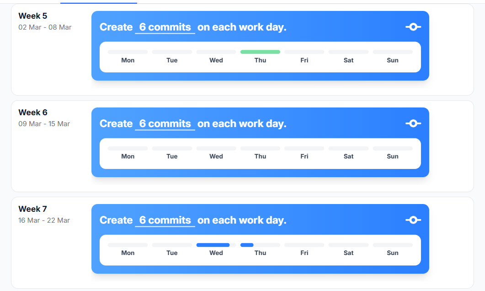

**Total:** 8 meaningful commits on matin branch (excluding CI/mirror setup commits)

Key commits:
- `6b77a87` feat: add shared backend API and parking tile with docs
- `819d51c` feat: add parking dashboard
- `14f3ea4` feat: add city sim dashboard for all tiles
- `0d54767` docs: add initial backend architecture diagram
- `be96ba2` docs: add Sprint 1 Portflow evidence and learning journal

**Reflection:** The DLO data shows I barely hit the daily commit target. Most days are empty, with activity concentrated on 3-4 days total. The 8 commits are real and meaningful, but the distribution is poor. I worked in bursts (March 18-19) instead of consistently throughout the sprint.

**Development plan:** Spread work more evenly across the sprint in Sprint 2. Aim for at least 2 commits per week on separate days.

### Hours spent
**DLO target:** 6 hours/day
**DLO result:** Nothing tracked. Entirely empty for all 3 weeks.

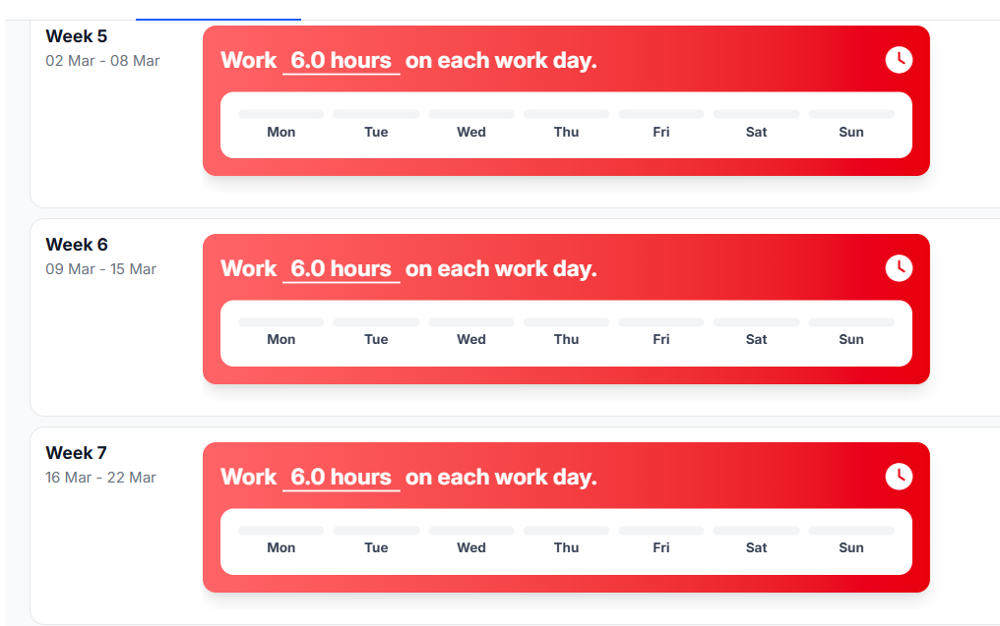

**Estimated (from git timestamps):** 20-25 hours total

Breakdown estimate:
- Research and technology selection: 4 hours
- Backend development (API + database): 8 hours
- Dashboard development: 4 hours
- Documentation writing: 4 hours
- Docker setup and testing: 2 hours

**Reflection:** Zero hours logged in DLO. I did the work but did not track it at all. The estimate above is a guess based on session lengths. This makes it impossible for assessors to verify effort.

**Development plan:** Start using DLO time tracking in Sprint 2. Even rough logging is better than nothing.

### Tasks completed
**DLO target:** 4 tasks/week
**DLO result:** 0/4, 0/4, 0/4. Zero tasks logged across all 3 weeks.

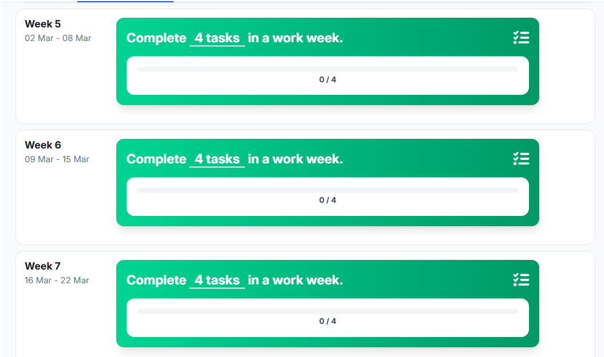

Actual work delivered (not logged in DLO):
- FastAPI application with 7 REST endpoints
- PostgreSQL database with 2 tables (sensor_readings, parking_spots)
- Docker Compose configuration (API + database containers)
- City Sim Dashboard with 4 tile panels and live refresh
- ESP32 parking sensor sketch (placeholder for testing)
- Architecture diagram (SVG)
- API specification document
- Database schema document

**Reflection:** I completed 8 deliverables but logged 0 tasks in DLO. The work was done but invisible in the tracking system. This is the same pattern Mats identified: the work exists but is not visible because I did not use the tools.

**Development plan:** Use GitLab issues or DLO task board to track work in Sprint 2. Log tasks as I complete them, not retroactively.

### Merge Requests made
**DLO target:** 2 MRs/week
**DLO result:** 1/2, 0/2, 1/2. Total: 2 MRs in sprint.

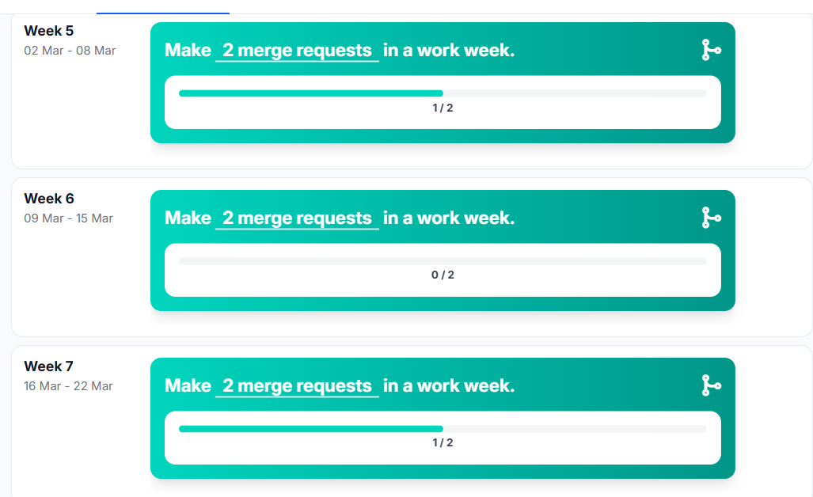

**Reflection:** 2 MRs total against a target of 6 (2/week x 3 weeks). Below target but at least some MR activity is captured. The main MR was one large batch at the end of the sprint.

**Development plan:** Make smaller, more frequent MRs in Sprint 2 (at least 2 per sprint, ideally matching weekly target).

### Merge Requests reviewed
**DLO target:** 2 MRs reviewed/week
**DLO result:** 0/2, 0/2, 0/2. Total: 0 reviews.

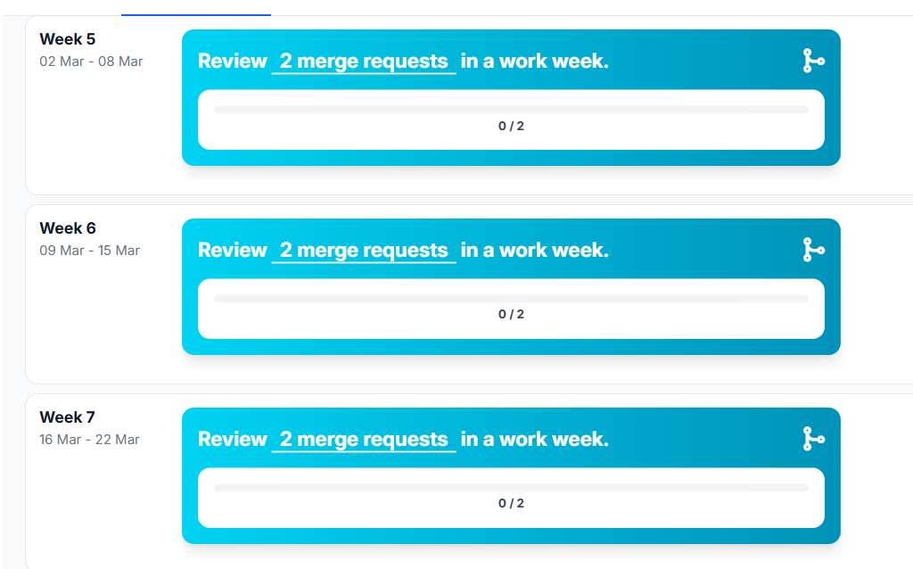

**Reflection:** Zero peer reviews in Sprint 1. The team was not yet doing structured code review, but that is an explanation, not an excuse. I should have initiated review culture.

**Development plan:** Review at least 1 MR from a teammate in Sprint 2 to contribute to team quality.

### Documentation written
**DLO target:** 450 words/day
**DLO result:** Week 5: Thursday green. Week 6: entirely empty. Week 7: Wednesday/Thursday green.

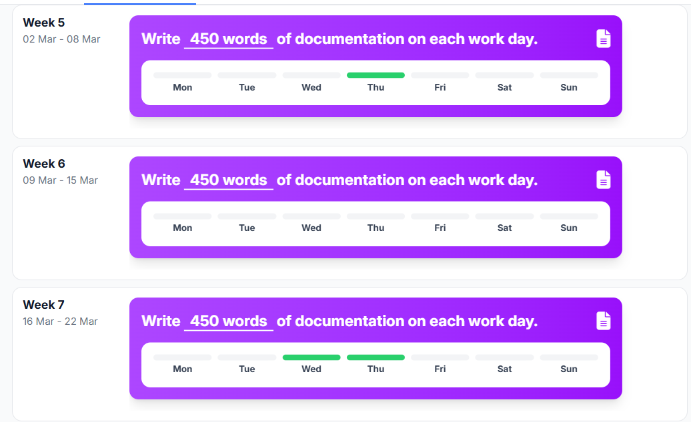

**Total:** 6 documents in docs/Matin/

- system-architecture.md (3-layer architecture overview)
- database-schema.md (table definitions and ER diagram)
- api-specification.md (all endpoints with examples per tile)
- city_sim_backend_architecture_sprint1.svg (visual diagram)
- portflowEvidenceSprint1.md (sprint evidence)
- index.md (documentation homepage)

**Reflection:** Documentation was written alongside code on the days I was active. The DLO shows green on exactly the days I committed code. The days between are empty. Documentation quality is good but consistency is poor.

**Development plan:** Keep documenting alongside development. Try to write at least something every working day, even if it is just updating a section.

---

## Sprint 2

### Commits
**DLO target:** 6 commits/day
**DLO result:** Week 8: nothing. Week 9: Monday/Thursday/Friday partly. Week 10: Wednesday/Thursday partly.

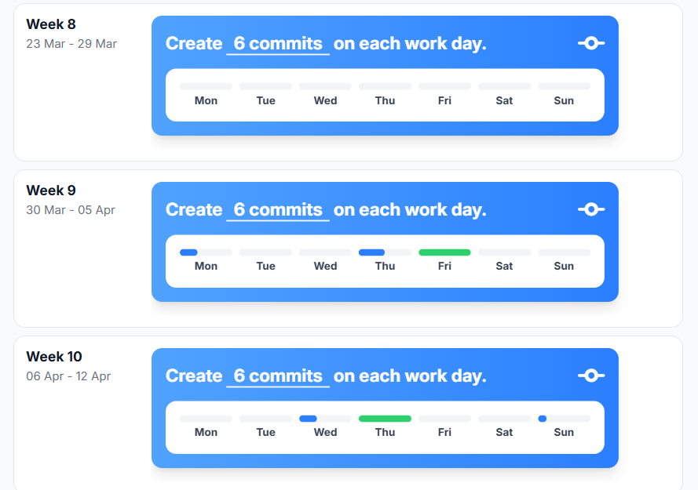

**Total:** 4 own commits on matin branch + 3 merge commits (team branches into main)

Key commits:
- `0e851cc` merge: resolve conflicts merging main into matin (233 commits, 5 file conflicts)
- `ea98332` feat: Docker update, backend ready for Raspberry Pi
- `a441175` docs: Raspberry Pi setup

**Reflection:** Week 8 was completely empty for City Sim because I was focused on Aimee (Group Project). Week 9 was my peak week with actual merge and Docker work. Week 10 tapered off again. The pattern from Sprint 1 repeats: I work in bursts instead of consistently. The DLO shows "partly" on active days, meaning I committed but not at the 6/day target level. Improvement over Sprint 1: at least weeks 9-10 show some activity instead of the 2-day burst pattern.

**Development plan:** In Sprint 3, protect dedicated City Sim time blocks (minimum 2 sessions per week). Do not let Aimee crowd out Learning Group work.

### Hours spent
**DLO target:** 6 hours/day
**DLO result:** Week 8: Thursday partly. Week 9: Wednesday/Thursday partly, Friday green. Week 10: Tuesday green, Friday partly.

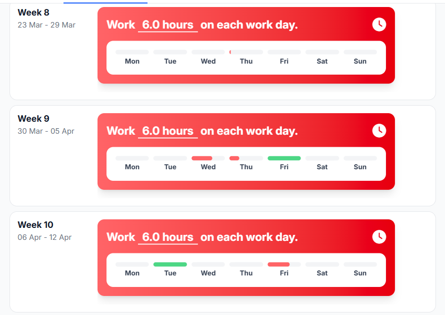

**Reflection:** Better than Sprint 1 (which was entirely empty). I logged some hours in weeks 9-10, with Friday week 9 being a full green day. Week 8 is almost empty, confirming that was my Aimee-focused week. Still far from the 6h/day target, but at least the tracking system is not completely blank anymore.

**Development plan:** Start logging hours on every working day in Sprint 3. The DLO data proves I am doing work in weeks 9-10 but losing visibility in quiet weeks.

### Tasks completed
**DLO target:** 4 tasks/week
**DLO result:** Week 8: 0/4. Week 9: 14/4 (over-target). Week 10: 0/4.

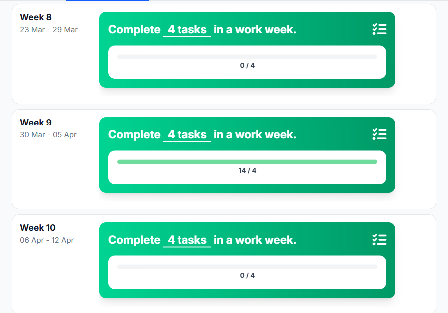

Actual work delivered:
- Merged Thijmen's railroad crossing code (233 commits, 5 conflicts resolved)
- Docker Compose hardened for production (.env, restart policy, no hot-reload)
- deploy.sh created for one-command Pi deployment
- Dashboard URL changed from hardcoded localhost to window.location.origin
- Raspberry Pi deployment guide written
- Challenges overview documented

**Tasks NOT completed (carried to Sprint 3):**
- Port 80 configuration (not done)
- Actual deployment on Pi (prep only, not deployed)
- Parking sensor test on Pi network (not done)

**Reflection:** Week 9 was a massive spike (14 tasks, 3.5x target) followed by nothing in week 10. This confirms the burst pattern. I did all merge and Docker work in one concentrated push. The zero weeks (8 and 10) are the problem. A consistent 4/week would have been healthier and more sustainable than 0-14-0.

**Development plan:** In Sprint 3, aim for 3-5 tasks per week consistently. Break large work into smaller logged tasks instead of batching.

### Merge Requests made
**DLO target:** 2 MRs/week
**DLO result:** Week 8: 0/2. Week 9: 2/2 (target hit). Week 10: 1/2. Total: 3 MRs in sprint.

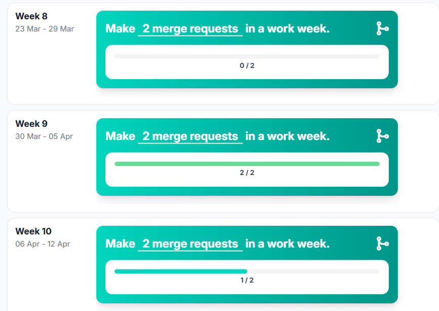

**Reflection:** 3 MRs made in Sprint 2 according to DLO tracking, exceeding my Sprint 1 development plan target of 2/sprint. Most likely related to the railroad crossing merge work which involved multiple integration steps. Week 9 hit the weekly target exactly. This is improvement from Sprint 1 (2 total) and shows the merge work generated multiple MR touchpoints.

**Development plan:** In Sprint 3, maintain this level. Split work into at least 2 MRs: one for carry-over fixes, one for new features.

### Merge Requests reviewed
**DLO target:** 2 MRs reviewed/week
**DLO result:** Week 8: 0/2. Week 9: 1/2. Week 10: 2/2 (target hit). Total: 3 reviews in sprint.

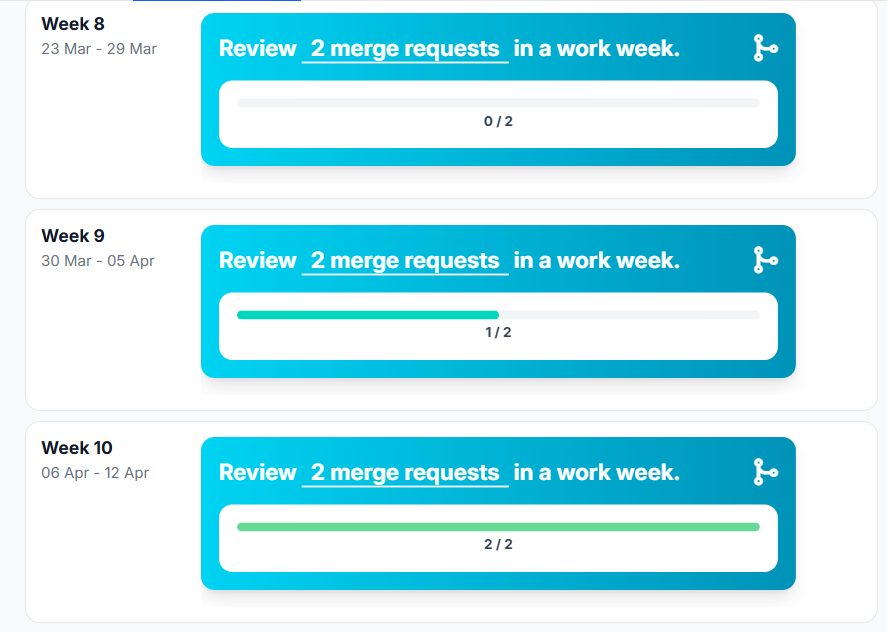

**Reflection:** 3 MRs reviewed in Sprint 2 (week 9: 1, week 10: 2). This is clear improvement from Sprint 1 (0 reviews) and shows my team integration work also included peer review activity. I underestimated this in my earlier self-assessment because I did not track it actively. The DLO data captures it accurately. Week 10 even hit the weekly target of 2.

**Development plan:** In Sprint 3, maintain or increase review activity. Continue reviewing teammates' work as it generates visible peer engagement.

### Documentation written
**DLO target:** 450 words/day
**DLO result:** Week 8: nothing. Week 9: Monday/Thursday/Friday green. Week 10: Wednesday/Thursday/Sunday green.

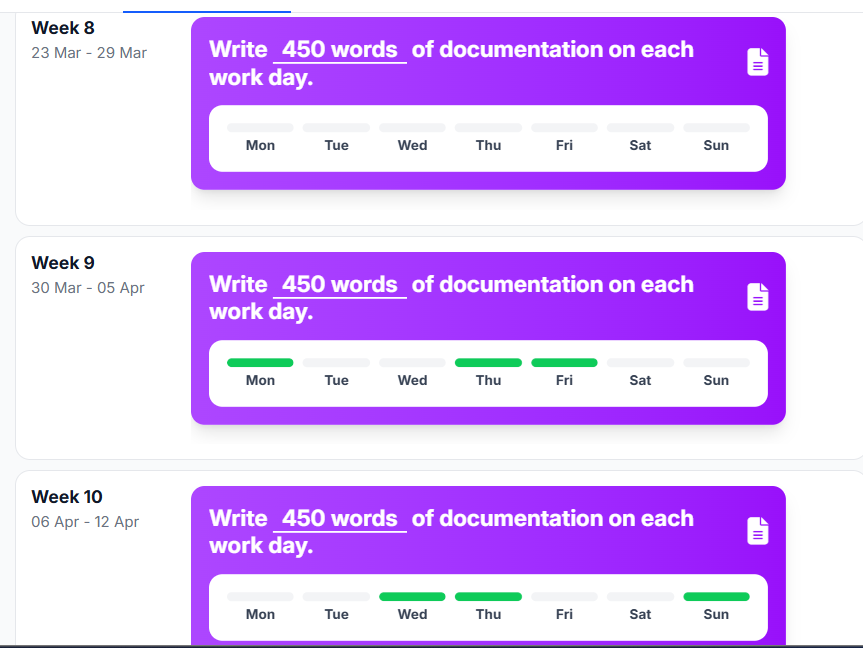

**Total:** 4 documents in docs/Matin/

- raspberry-pi-deployment.md (deployment guide with SSH, Docker, troubleshooting)
- challenges-overview.md (6 technical challenges encountered and resolved)
- portflowEvidenceSprint2.md (sprint evidence)
- index.md (updated with Sprint 2 links)

**Reflection:** Documentation improved over Sprint 1. Weeks 9-10 show 6 green days compared to Sprint 1's 3 green days. Week 8 is empty (Aimee focus), but once I engaged with City Sim in week 9, documentation was consistent alongside the code work. The Pi deployment guide was written before actual deployment, which is backwards. Documentation quality matters more when it reflects verified reality.

**Development plan:** In Sprint 3, write documentation after verifying it works on the actual Pi. Connect all docs to the problem statement.

### Sprint 2 overall assessment

The DLO data tells a clear story: week 8 was lost to Aimee, week 9 was a productive burst, week 10 was partial. Despite the inconsistency, Sprint 2 shows measurable improvement over Sprint 1 in MRs made (3 vs 2), MRs reviewed (3 vs 0), and hours logged (some vs none). The problem was not lack of work but lack of framing: I did not connect any of this to the parking search problem, did not write learning goals, and Mats' Mayor Delivery feedback ("verras me volgende keer") was a warning I did not sufficiently act on. That is what Sprint 3 fixes.

---

## Sprint 3

### Commits
**DLO target:** 6 commits/day
**DLO result:** Week 11: Mon-Tue active, Thu green. Week 12: Wed-Thu active (speed camera built Apr 23). May Holiday: empty. Week 13: Mon-Thu green — most active week of the semester.

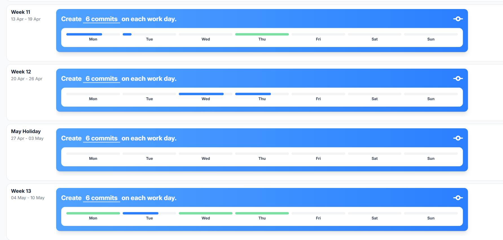

Key commits:
- `3f6b3e5` feat: implement speed camera API, database models, and comprehensive project documentation (Apr 23)
- `dbb1bc8` docs: add human-centered problem statement for parking tile (May 4)
- `42d99bd` fix(docker): expose api on port 80 with dashboard on root (May 4)
- `faf732d` docs: add sprint 0 learning journal STARR reflection (May 5)
- `483abbb` docs: learning goals + performance analysis (May 5)
- Multiple commits week 13: Portflow restructuring, Sprint 3 deliverables, dashboard bug fixes, traffic light integration

**Reflection:** The burst pattern continues but with more spread. Week 11 had light activity, week 12 concentrated on the speed camera, and week 13 was a sustained push across 4 days. That last week is the most consistent I have been all semester. The improvement is visible: Sprint 1 had 2 active days, Sprint 2 had 4-5, Sprint 3 has about 8.

**Development plan:** In Sprint 4, commit at least every other day. Use smaller commits for incremental progress.

### Hours spent
**DLO target:** 6 hours/day
**DLO result:** Week 11: Mon red, Wed green, Thu red. Week 12: Tue/Wed/Fri red, Thu green. May Holiday: Mon red only. Week 13: Mon-Wed green.

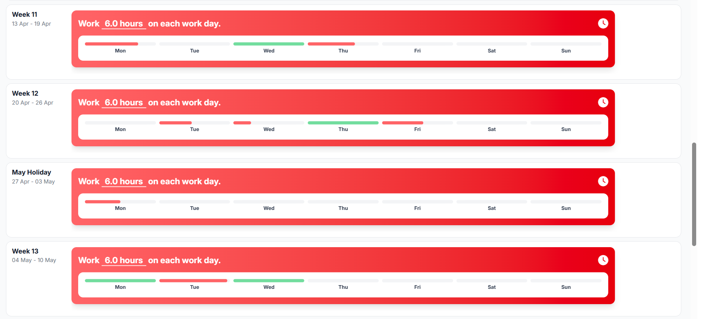

**Reflection:** Mixed results. Some tracking happened (better than Sprint 1 which was empty), but most days are red — meaning I logged hours but below the 6h target. Week 13 Mon-Wed are green, matching the commit data: that was the most productive stretch. The May Holiday week is almost empty. Overall: hours are being tracked now (improvement), but still below target on most days.

**Development plan:** Sprint 4: log hours on every working day. Use a spreadsheet with start/end times if DLO is not convenient enough.

### Tasks completed
**DLO target:** 4 tasks/week
**DLO result:** 0/4 across all 4 weeks. Zero tasks logged in DLO.

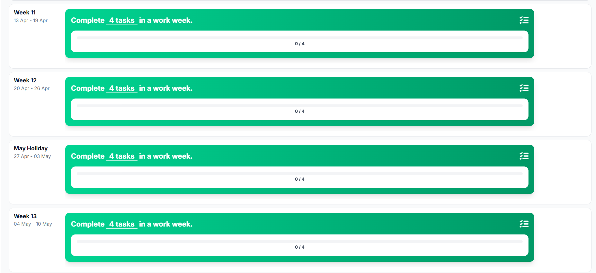

Actual work delivered (not logged in DLO):
- Speed camera API: 5 REST endpoints, SpeedReading model, 3 Pydantic schemas, dashboard panel
- Traffic light integration: GET endpoints, dashboard panel updated for Wesley's dedicated API
- Port 80: Docker port mapping, deploy.sh updated, dashboard moved to root URL
- Dashboard bug fixes: distance_cm crash fix, traffic double prefix fix
- Problem statement: human-centered framing of parking search traffic
- Portflow cleanup: 12 evidence items reframed with descriptions and permalinks
- Sprint 3 deliverable docs: 3 learning goals + 4 deliverable documents (Analysis, Design, Realise, Advise)
- Learning Journal: Sprint 0 STARR, SMART learning goals, performance analysis

**Reflection:** Same problem as Sprint 1: lots of work delivered, zero tasks logged. Three sprints in a row with 0/4 on task tracking. This is a pattern I keep promising to fix but have not fixed. The work is real but invisible in DLO.

**Development plan:** Sprint 4: this is non-negotiable. Log tasks in DLO as I start them. If I fail again, I cannot explain it away.

### Merge Requests made
**DLO target:** 2 MRs/week
**DLO result:** Week 11: 1/2. Week 12: 5/2. May Holiday: 0/2. Week 13: 9/2. Total: 15 MRs.

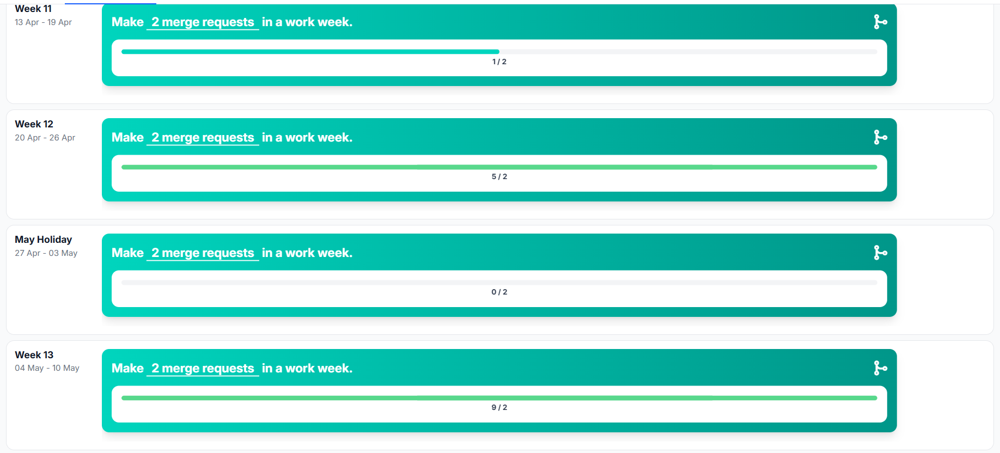

**Reflection:** Massive improvement. Sprint 1: 2 MRs total. Sprint 2: 3 MRs total. Sprint 3: 15 MRs total. Week 12 (5) was the speed camera and docs work. Week 13 (9) was the Portflow restructuring, dashboard fixes, and traffic integration — each pushed and merged separately. This matches my Sprint 2 development plan: "split work into at least 2 MRs." I exceeded that by a lot. The smaller, more frequent MR pattern worked.

**Development plan:** Maintain this in Sprint 4. Keep making small, focused MRs instead of batching.

### Merge Requests reviewed
**DLO target:** 2 MRs reviewed/week
**DLO result:** Week 11: 0/2. Week 12: 0/2. May Holiday: 0/2. Week 13: 3/2. Total: 3 reviews.

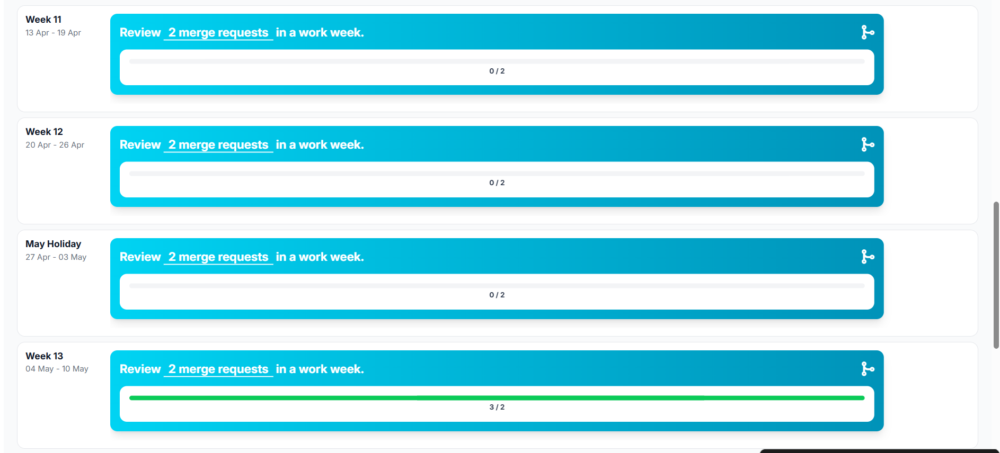

**Reflection:** Same total as Sprint 2 (3 reviews), all concentrated in week 13. Weeks 11-12 and the holiday had zero reviews. The improvement happened late but it happened. Week 13 exceeded the weekly target (3/2). The reviews in week 13 were on Thijmen's eink display merge and Wesley's traffic light code — both directly relevant to the dashboard integration I was doing.

**Development plan:** Sprint 4: review at least 1 MR in the first week. Do not wait until the last week.

### Documentation written
**DLO target:** 450 words/day
**DLO result:** Week 11: Tue and Thu green. Week 12: Wed and Thu green. May Holiday: empty. Week 13: Mon-Wed green. Total: 7 green days.

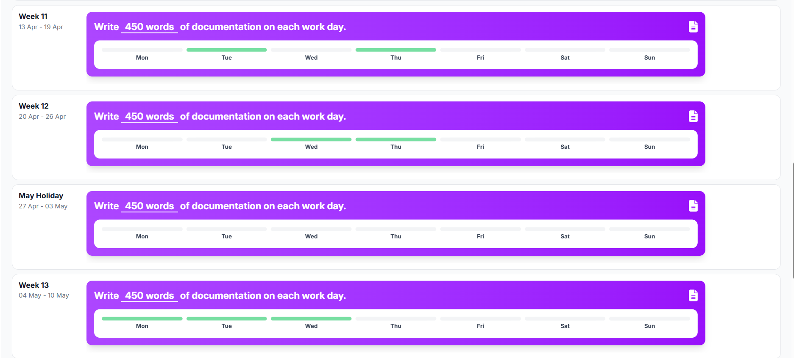

Documents written in Sprint 3:
- problemStatement.md
- portflowEvidenceSprint3.md (restructured)
- portflowEvidenceSprint1.md (restructured)
- learningJournalSprint0.md
- personalLearningGoalsAllSprints.md
- performanceAnalysisAllSprints.md (this document)
- portflowMasterSheet.md
- Sprint 3 folder: 3 learning goal docs + 4 deliverable docs (Analysis, Design, Realise, Advise)

Updated documents:
- api-specification.md (speed camera + traffic endpoints)
- database-schema.md (speed_readings + traffic tables)
- index.md (links to new documents)

**Reflection:** Most documentation-heavy sprint by far. 7 green days compared to Sprint 1 (3 days) and Sprint 2 (6 days). Much of it is catch-up work (problem statement, learning goals, Portflow restructuring). The Sprint 3 deliverable docs are the first time I wrote structured Analysis/Design/Realise/Advise documents per challenge. Documentation was consistent on active days.

**Development plan:** Sprint 4: documentation should be incremental. Write deliverable docs as I work, not after.

### Sprint 3 overall assessment

Sprint 3 was a recovery sprint. The DLO data confirms both improvement and persistent gaps:

**Improved:**
- MRs made: 15 total (vs 2 in S1, 3 in S2) — biggest improvement of the semester
- MRs reviewed: 3 in week 13, hitting the weekly target
- Documentation: 7 green days, most consistent spread yet
- Commits: week 13 had 4 consecutive active days — a first
- Hours: some tracking happened (better than S1 which was blank)

**Still broken:**
- Tasks: 0/4 across all weeks, third sprint in a row
- Hours: most days red, still below target
- Burst pattern: May Holiday week was empty, bulk of work in week 13
- Reviews concentrated in final week instead of throughout

**What changed qualitatively:** For the first time, all work is connected to a defined city problem (parking search traffic). Problem statement exists. Learning goals are written. Evidence is structured per challenge with only relevant outcomes. Expert feedback was requested (Bernardo, Gerald). This addresses Mats' core feedback from Sprint 2.

**Persistent gaps for Sprint 4:** Task tracking (must start logging in DLO), hour tracking (use spreadsheet if DLO fails), review distribution (week 1 not week 4).
