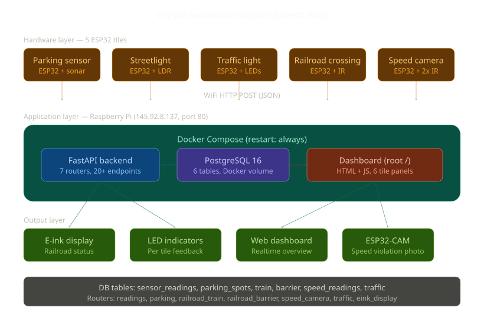

# System architecture

## 1. Overview

The City Sim backend is a shared service that receives sensor data from all tiles in the smart city via WiFi HTTP requests. Each ESP32 microcontroller measures its environment and sends readings to a central FastAPI server running on a Raspberry Pi, which stores them in PostgreSQL.

The system started with a generic endpoint for all tiles. As tiles grew more complex, dedicated tables and routers were added for structured data (parking, railroad, speed camera, traffic light). The generic endpoint still serves simple sensor values.

## 2. Architecture diagram



The system consists of three layers:

**Hardware layer**: 5 ESP32 tiles with sensors. Parking (HC-SR04 sonar), Streetlight (LDR), Traffic light (LEDs + MCP23017), Railroad crossing (IR sensors), Speed camera (2x IR + ESP32-CAM). Each ESP32 connects to HvA WiFi and sends HTTP POST requests.

**Application layer**: Raspberry Pi (145.92.8.137) running Docker Compose on port 80. Two containers: FastAPI (7 routers, 20+ endpoints) and PostgreSQL 16 (6 tables). Containers auto-restart on reboot. Dashboard served on root URL.

**Output layer**: E-ink display (railroad status), LED indicators (per tile), web dashboard (all tiles), ESP32-CAM (speed violation photos, self-contained WiFi AP).

```
ESP32 tiles ──WiFi POST──> Raspberry Pi (port 80)
                              │
                           Docker Compose:
                              ├── FastAPI (7 routers)
                              │     ├── readings (generic)
                              │     ├── parking
                              │     ├── railroad_crossing_train
                              │     ├── railroad_crossing_barrier
                              │     ├── speed_camera
                              │     ├── traffic
                              │     └── eink_display
                              └── PostgreSQL 16 (6 tables)
                                    ├── sensor_readings
                                    ├── parking_spots
                                    ├── train
                                    ├── barrier
                                    ├── speed_readings
                                    └── traffic
```

## 3. Communication protocol

All communication uses HTTP REST over WiFi:

| Direction | Method | Format | Example |
|-----------|--------|--------|---------|
| ESP32 to API | POST | JSON body | `POST /api/v1/traffic` |
| ESP32 to API | POST | Query params | `POST /api/v1/parking/update/1?distance_cm=5.2` |
| Dashboard to API | GET | JSON response | `GET /api/v1/parking/status` |
| Dashboard to API | GET | JSON response | `GET /api/v1/traffic/latest` |

JSON is used because it is easy to parse on both ESP32 (ArduinoJson) and in the browser (native). No authentication is needed for the PoC since the system runs on a local network.

## 4. Technology choices

| Component | Choice | Reason |
|-----------|--------|--------|
| Backend framework | FastAPI (Python) | Fast to develop, auto-generated API docs, Pydantic validation |
| Database | PostgreSQL 16 | Reliable, SQL aggregation for stats endpoints, team familiar |
| Containerization | Docker Compose | Reproducible setup, restart policy for Pi reboot survival |
| Hosting | Raspberry Pi | Always-on, HvA network accessible, port 80 |
| Microcontroller | ESP32-S3 | WiFi built-in, enough GPIO pins, Arduino compatible |
| Parking sensor | HC-SR04 | Affordable, accurate for parking detection (2-400cm range) |
| Speed sensor | 2x IR | Time-of-flight speed calculation between 10cm gap |

## 5. Database evolution

| Sprint | Tables | What was added |
|--------|--------|----------------|
| 1 | 2 | sensor_readings (generic), parking_spots (state) |
| 2 | 4 | train, barrier (railroad crossing) |
| 3 | 5 | speed_readings (speed camera) |
| 4 | 6 | traffic (traffic light) |

Pattern: tiles start on the generic table. When a tile has structured data (multiple fields, state tracking), it gets a dedicated table. The generic table stays for simple readings.

## 6. Design decisions

**Generic + dedicated tables**: All sensor data can go into `sensor_readings` with `{tile, sensor_type, value, unit}`. But when a tile has multiple fields (speed camera: speed, direction, violation, limit) or state tracking (railroad: sensor A timestamp, sensor B timestamp, prediction), a dedicated table is cleaner. This pattern proved itself across 4 sprints.

**Port 80**: ESP32 HTTPClient defaults to port 80. Running on 80 means team members do not need to remember `:8000` in their URLs.

**Dashboard on root**: The dashboard moved from `/dashboard` to `/` so the Pi is accessible at just `http://145.92.8.137/`. Each tile panel fetches its own data independently. A slow or offline tile does not block others.

**No authentication**: The system runs on a trusted campus network. Adding auth would slow down development without adding value for this PoC.

**Distance threshold**: Parking spot is occupied if sonar reads < 10cm. Configurable in backend code.
