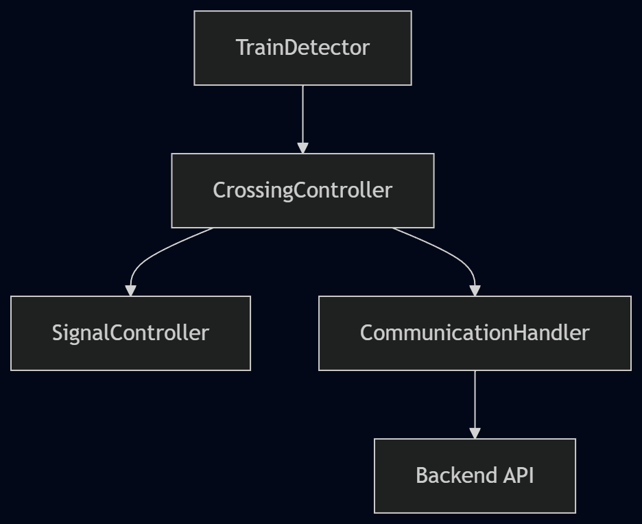

# Design Document

## Table of Contents

1. [Overview](#overview)
2. [Architectural Design](#architectural-design)
3. [Component Interaction](#component-interaction)
4. [UML Class Diagram](#uml-class-diagram)
5. [System Behavior](#system-behavior)
6. [Library Packaging Design](#library-packaging-design)
7. [Multi-Tile Integration](#multi-tile-integration)
8. [Backend Communication Design](#backend-communication-design)
9. [Reusability, Maintainability, and Scalability](#reusability-maintainability-and-scalability)
10. [Integration with City Simulation](#integration-with-city-simulation)
11. [Conclusion](#conclusion)

---

## 1. Overview

This design document translates the results of the analysis phase into a structured and modular software design for the train crossing functionality within the shared ESP32-S3 city simulation project.

The goal of this design is to transform the existing standalone implementation into a reusable, maintainable, and scalable system that can operate alongside other tiles (e.g., streetlights, traffic systems) on the same hardware.

The system is built using a modular architecture, where each component has a clearly defined responsibility and communicates through well-defined interfaces.

---

## 2. Architectural Design

The train crossing functionality is divided into four main components:

### 2.1 TrainDetector

**Responsibility**

Detect train events using sensor input  
Measure time between detection points  
Calculate predicted arrival time  

**Key Functions**

`update()`  
`firstTriggered()`  
`secondTriggered()`  
`trainPassed()`  
`getPredictedTime()`  

**Characteristics**

No hardware output  
No backend communication  
Fully reusable across tiles  

---

### 2.2 SignalController

**Responsibility**
Control hardware outputs:

LEDs  
Buzzer  
Servo (barrier)  

**Key Functions**

`setState(state)`  
`update()`  

**States**

`SIGNAL_IDLE`  
`SIGNAL_WARNING`  
`SIGNAL_ACTIVE`  

**Characteristics**

No knowledge of train logic  
Acts as a hardware abstraction layer  
Reusable for other systems (e.g., traffic lights)  

---

### 2.3 CommunicationHandler

**Responsibility**

Handle all backend communication  
Send train-related data to the API  

**Key Functions**

`createTrain(trainId)`  
`sendPrediction(trainId, seconds)`  
`sendCrossed(trainId)`  

**Characteristics**

Central communication layer  
Reusable across all tiles  
Replaceable with asynchronous implementation  

---

### 2.4 CrossingController

**Responsibility**

Coordinate all components  
Implement system behavior  

**Key Functions**

`update()`  

**Behavior**

First detection -> create train in backend  
Second detection -> send prediction + activate warning  
Train passed -> send completion + reset system  

**Characteristics**

No direct hardware interaction  
No direct sensor handling  
Pure orchestration logic  

---

## 3. Component Interaction

The system follows a controller-based architecture where components interact through a central orchestrator.



**Flow Description**

1. The `TrainDetector` detects a train event
2. The `CrossingController` processes the event
3. Actions are triggered:

   Signals updated via `SignalController`
   Data sent via `CommunicationHandler`

---

## 4. UML Class Diagram


---

## 5. System Behavior


---

## 6. Library Packaging Design

Each component is packaged as an independent library in the `/lib` directory:


**Advantages**

Independent development and testing  
Reusable across projects  
Reduced merge conflicts  
Clear project structure  

---

## 7. Multi-Tile Integration

The system is designed to support multiple tiles running on the same ESP32.


**Key Design Decisions**

No global state  
No hardcoded hardware dependencies  
Each tile uses its own configuration  
Shared communication layer  

---

## 8. Backend Communication Design

### API Workflow

**Train detected (first sensor)**

`POST /train/first` -> Returns `trainId`

**Second sensor triggered**

`PUT /train/{id}/second` -> Sends predicted arrival time

**Train passed**

`PUT /train/{id}/crossed`

### Data Format Example

```json
{
  "predicted_arrival_seconds": 4.25
}
```

### Design Considerations

Lightweight JSON for efficiency  
Stateless communication  
Fault tolerance (system continues if backend fails)  

---

## 9. Reusability, Maintainability, and Scalability

**Reusability**

Components are independent  
Can be reused in different tiles 
Configurable for different hardware setups  

**Maintainability**

Clear separation of concerns  
Small, focused classes  
Easier debugging and updates  

**Scalability**

Supports multiple instances  
Efficient resource usage  
Ready for event-driven extensions  

---

## 10. Integration with City Simulation

This design integrates seamlessly with the broader city simulation by:

Avoiding hardware conflicts  
Supporting shared WiFi and backend  
Enabling modular initialization  
Allowing future inter-tile communication  

---

## 11. Conclusion

The designed architecture transforms the train crossing functionality into a modular, reusable, and scalable system suitable for integration in a shared ESP32-S3 environment.

By separating concerns into distinct components and using a controller-based structure, the system becomes easier to maintain, extend, and integrate with other tiles in the city simulation project.

This design provides a strong foundation for the realization phase and future expansion of the system.

---