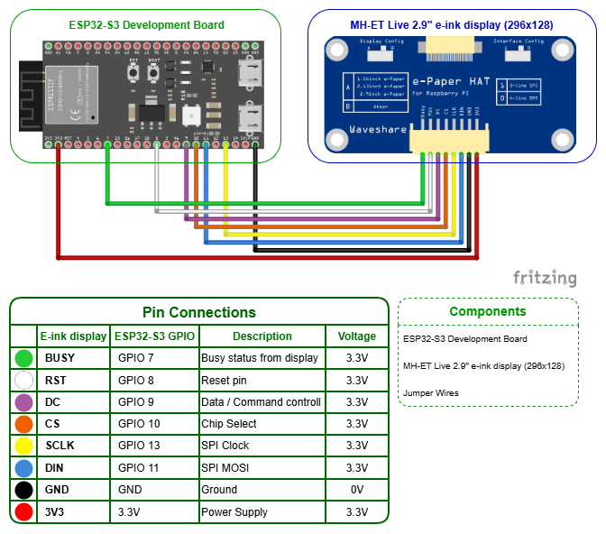

# Design Document

## Table of Contents

1. [Introduction](#1-introduction)
2. [System Overview](#2-system-overview)
3. [Architecture Design](#3-architecture-design)
4. [Bill of Materials (BOM)](#4-bill-of-materials-bom)
5. [Hardware Design](#5-hardware-design)
6. [Circuit Design (Fritzing)](#6-circuit-design-fritzing)
7. [Software Design](#7-software-design)
8. [Data Flow](#8-data-flow)
9. [API Usage](#9-api-usage)
10. [Display Rendering Strategy](#10-display-rendering-strategy)
11. [Update Mechanism](#11-update-mechanism)
12. [Error Handling](#12-error-handling)
13. [Reusability & Scalability](#13-reusability--scalability)
14. [Conclusion](#14-conclusion)
15. [Previous Work](#15-previous-work)

---

## 1. Introduction

This document describes the design and implementation of an ESP32-based system with an e-ink display. The system is part of a smart city simulation in which physical tiles represent cities.

The purpose of this design is to enable each tile to display dynamic information retrieved from a backend system. The displayed content must be remotely configurable without requiring firmware updates.

---

## 2. System Overview

Each tile consists of:

* ESP32 microcontroller
* 2.9-inch e-ink display
* Wi-Fi connection

The ESP32 retrieves text data from a backend API every 10 seconds and updates the display only when the content has changed.

---

## 3. Architecture Design

The system follows a client-server architecture.

### Components

#### ESP32 (Client):

* Connects to Wi-Fi
* Sends HTTP requests
* Processes responses
* Controls the display

#### Backend (Server):

* Provides display data through API endpoints
* Stores and manages the text shown on displays

### Architecture Flow

1. ESP32 connects to Wi-Fi
2. Sends HTTP request to backend
3. Receives response
4. Compares with previous data
5. Updates display if needed

---

## 4. Bill of Materials (BOM)

| Component     | Quantity | Specification                              | Purchase Reference                                                                                                                    |
| ------------- | -------- | ------------------------------------------ | ------------------------------------------------------------------------------------------------------------------------------------- |
| ESP32 Board   | 1        | Espressif ESP32-S3-DevKitC-1-N32R16V       | [TinyTronics]([AZ-Delivery](https://www.az-delivery.de/nl/products/2-9-zoll-epaper-display) )                                         |
| E-ink Display | 1        | MH-ET Live 2.9" (296x128, black/white/red) | [AZ-Delivery](https://www.az-delivery.de/nl/products/2-9-zoll-epaper-display)                                                         |
| Jumper Wires  | 9        | Male-to-female jumper wires                | [AZ-Delivery](https://www.az-delivery.de/nl/products/40-stk-jumper-wire-female-to-male-20-zentimeter?_pos=1&_psq=jumper&_ss=e&_v=1.0) |

---

## 5. Hardware Design

### Components

* ESP32-S3 Development Board
* MH-ET Live 2.9" e-ink display (296x128, black/white/red)
* Jumper wires

### Communication Protocol

The display communicates with the ESP32 using SPI.

#### Pin Connections

* VCC -> 3.3V
* GND -> GND
* DIN -> GPIO 11
* CLK -> GPIO 13
* CS -> GPIO 10
* DC -> GPIO 9
* RST -> GPIO 8
* BUSY -> GPIO 7

---

## 6. Circuit Design (Fritzing)

A Fritzing diagram is included to visualize the wiring between the ESP32 and the e-ink display.



---

## 7. Software Design

The software is modular.

### 7.1 Wi-Fi Module

* Connects to Wi-Fi
* Handles reconnection attempts

### 7.2 API Client

* Sends HTTP GET request every 10 seconds
* Retrieves plain text from backend

### 7.3 Data Manager

* Stores previous text
* Compares old and new values

### 7.4 Display Controller

* Renders text on the e-ink display
* Handles display refresh logic

---

## 8. Data Flow

1. ESP32 sends request:

```http
GET /eink-display/text
```

2. Backend responds:

```text
The Embedded Alliance
```

3. ESP32:

* Reads text
* Compares with previous value
* Updates display if changed

---

## 9. API Usage

The ESP32 uses the following backend endpoints.

### Get Display Text

```http
GET /eink-display/text
```

Response:

```text
The Embedded Alliance
```

This endpoint is used by the ESP32 because plain text responses are lightweight and efficient.

---

### Update Display Text

```http
PUT /eink-display
```

Request:

```json
{
  "text": "New city name"
}
```

This endpoint allows the backend system to update the text shown on the display.

---

## 10. Display Rendering Strategy

Due to e-ink limitations:

* Only update when content changes
* Use simple text layout
* Avoid unnecessary refreshes

### Layout

```bash
+----------------------+
|                      |
|     City Name        |
|                      |
|                      |
+----------------------+
```

---

## 11. Update Mechanism

The ESP32 polls the backend every 10 seconds.

### Logic

```cpp
if (newText != oldText)
{
    updateDisplay();
}
```

### Benefits

* Reduces unnecessary refreshes
* Minimizes ghosting
* Saves power

---

## 12. Error Handling

### Network Errors

* Retry HTTP request
* Attempt Wi-Fi reconnection

### Invalid Data

* Ignore invalid response
* Keep previous display content

### Display Errors

* Reinitialize display
* Reset SPI communication

---

## 13. Reusability & Scalability

The system is designed to be reusable.

* No hardcoded display content
* Same firmware can run on multiple devices
* Backend controls all displayed text

### Scalability Options

* Add unique device identification
* Connect backend to PostgreSQL database
* Support multiple tiles simultaneously

---

## 14. Conclusion

This design provides a practical and scalable solution for displaying dynamic text on an e-ink display using an ESP32.

By using a backend-driven approach and a polling mechanism, the system avoids hardcoded data and allows easy updates without modifying the firmware. The design also accounts for the limitations of e-ink displays by minimizing unnecessary refreshes.

The result is a reusable system that integrates smoothly into the smart city simulation and can be extended in future iterations.

---

## 15. Previous Work

This design document is based on:

* [Analysis Document](https://gitlab.fdmci.hva.nl/studio/smart-cities/projecten/2025-2026-semester-2/city-sim-learning-group/city-the-embedded-alliance-city-sim-learning-group/-/blob/d46fe2c84d66a400dbcb0a60cfd07e5d34edf603/docs/Thijmen/Sprint%203/Analysis.md?utm_source=chatgpt.com)
