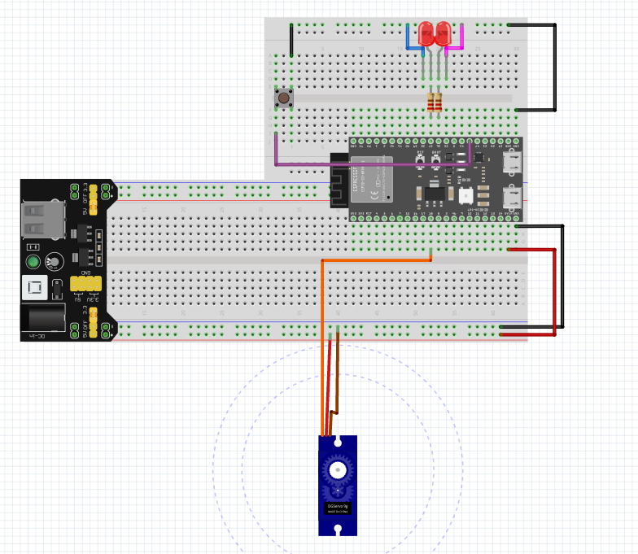

# Train Prediction Signal Demo

## 1. Overview

This demo demonstrates a basic concept used in railway systems to predict a train’s arrival time and control a railway crossing barrier.

This demo is located in the folder ```embedded/Thijmen/train-prediction-signal```

Using:

- A push button (simulating detection points)
- Two LEDs (simulating alternating railway warning lights)
- Passive Buzzer  (simulating railway bells sounds)
- A Servo motor (simulating the railway barrier)
- A Finite State Machine (FSM)
- Time prediction based on measured speed

The system estimates when a train will arrive and activates the warning lights, buzzer and barrier at the correct moment.

### Circuit example



---

# 2. Hardware Components

| Component      | Purpose                            |
| -------------- | ---------------------------------- |
| Push Button    | Simulates detection points A and B |
| LED 1          | Railway warning light              |
| LED 2          | Railway warning light              |
| Passive Buzzer | Railway warning light              |
| Servo Motor    | Simulates the crossing barrier     |
| Power Supply   | Providing power to the servo       |

---

# 3. Pin Configuration

| Function         | GPIO |
| ---------------- | ---- |
| LED 1            | 37   |
| LED 2            | 36   |
| Passive Buzzer   | 42   |
| Button           | 45   |
| Servo            | 18   |

---

# 4. Real-World Inspiration: Railway Crossing Systems

Real railway crossings use multiple detection points.

Typical operation:

1. A train passes detection point A  
2. The train passes detection point B  
3. The system calculates the train's speed  
4. Based on the remaining distance to the crossing (C), it predicts arrival time  
5. Warning lights start flashing
6. The barrier closes before the train arrives  
5. Warning lights start flashing
6. The barrier closes before the train arrives  

This demo simulates that logic in a simplified way.

---

# 5. Distance Model

The code defines two distances:

```cpp
#define A_B_DISTANCE 200
#define B_C_DISTANCE 1000
```

Meaning:

| Distance | Description                                      |
| -------- | ------------------------------------------------ |
| A → B    | Distance between the two detection points        |
| B → C    | Distance from second detection point to crossing |

---

### Speed Calculation

When the button is pressed twice:

* First press → train passes **sensor A**
* Second press → train passes **sensor B**

The system measures the time between the two presses.

```
Time_AB = time between button presses
```

Assuming constant speed:

```
Time_BC = Time_AB × (B_C_DISTANCE / A_B_DISTANCE)
```
| Distance | Description                                      |
| -------- | ------------------------------------------------ |
| A → B    | Distance between the two detection points        |
| B → C    | Distance from second detection point to crossing |

---

# 6. Safety Margin

A **safety margin** is used to activate warning signals before the barrier closes.

```cpp
const unsigned int safetyMargin = 5000;
```

Meaning:

* Warning lights and Buzzer sounds start **5 seconds before barrier closure**

This simulates real railway crossings where lights start flashing and sound starts playing before the barrier moves.

---

# 7. State Machine in Railway Terms

### IDLE
No train detected  
Warning lights are off  
Buzzer off  
Barrier is open  

### MEASURING
Train traveling between sensor A and B  
System measures travel time  

### WAITING

The system predicts when the train will reach the crossing.

During this phase:

- System waits the predicted time
- Warning lights start flashing before arrival
- Buzzer makes sound before arrival
- Barrier closes at the predicted arrival time

---

# 8. Warning Light and Buzzer Behavior

The two LEDs simulate railway crossing warning lights.

The Buzzer simulate the bell sounds.

When the system reaches the safety margin period, the LEDs begin alternating blinking and the buzzer makes sound.

Blink and Tone interval:

```
400 ms
```

Pattern:

```
LED1 ON   LED2 OFF BUZZER_TONE 800
LED1 OFF  LED2 ON  BUZZER_TONE 1200
```

This mimics the typical alternating railway signal lights and bells.

---

# 9. Barrier Control (Servo Motor)

The servo motor represents the railway barrier.

### Barrier Positions

| Position | Angle |
| -------- | ----- |
| Open     | 0°    |
| Closed   | 90°   |

---

### Behavior

| State     | Barrier Position                      |
| --------- | ------------------------------------- |
| IDLE      | Open                                  |
| MEASURING | Open                                  |
| WAITING   | Closes when predicted time is reached |

The barrier closes exactly when the predicted arrival time is reached.

---

# 10. Button Interaction

The button controls the simulation of train movement.

| Press     | Meaning               |
| --------- | --------------------- |
| 1st press | Train passes sensor A |
| 2nd press | Train passes sensor B |
| 3rd press | Reset system          |

Reset returns the system to:

```
IDLE
Barrier open
LEDs off
Buzzer off
```

---

# 11. Timing Behavior

The system relies on **non-blocking timing using `millis()`** instead of delays.

This allows:

* Real-time LED blinking
* Real-time Buzzer sounds
* Servo updates
* Button detection
* Multiple timed events simultaneously

This is a common design pattern in **embedded real-time systems**.

---

# 12. Educational Value

This project demonstrates:

- Finite State Machines (FSM)
- Real-time embedded timing  
- Proportional prediction mathematics 
- Event-driven system design
- Basic industrial automation principles  
- Servo motor control   
  
It provides a strong foundation for understanding:

- Railway automation  
- Industrial safety systems  
- Embedded predictive control  