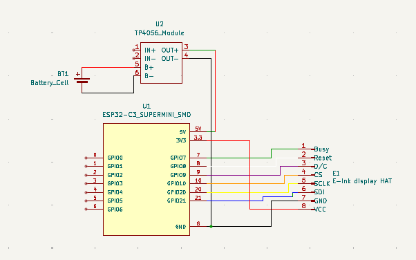
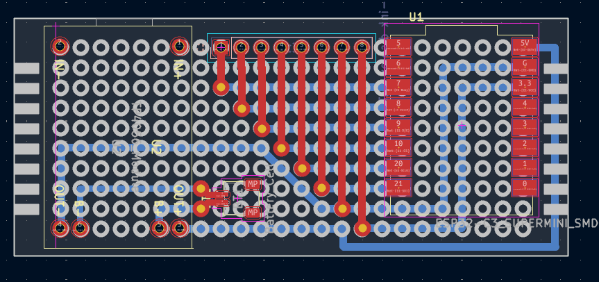
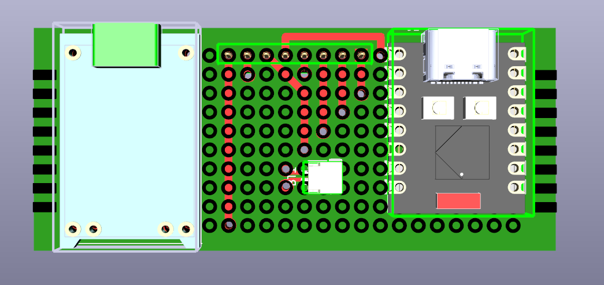
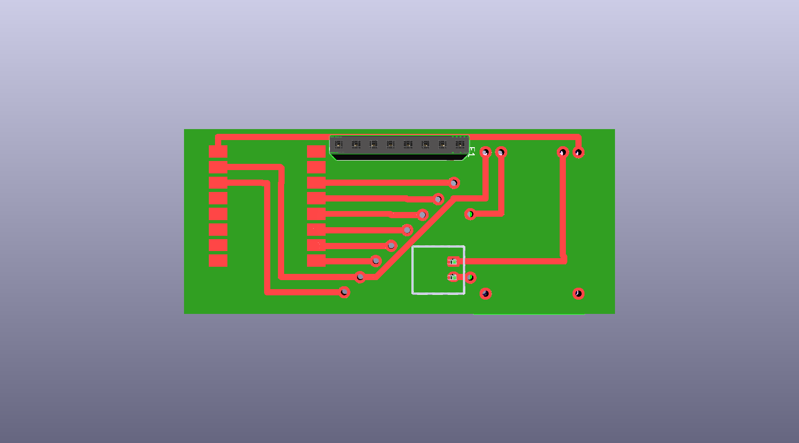
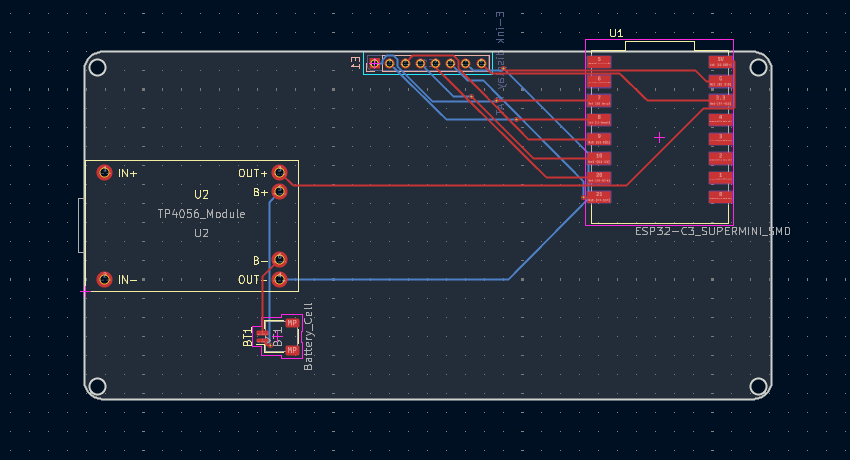
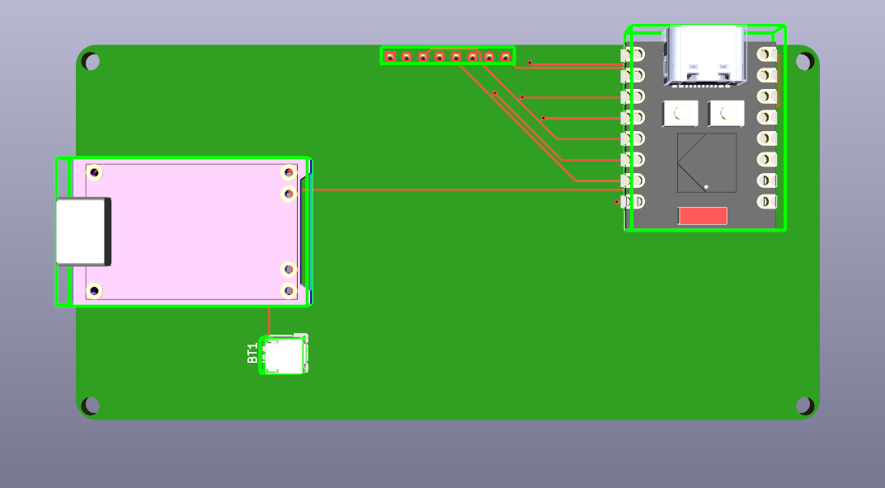
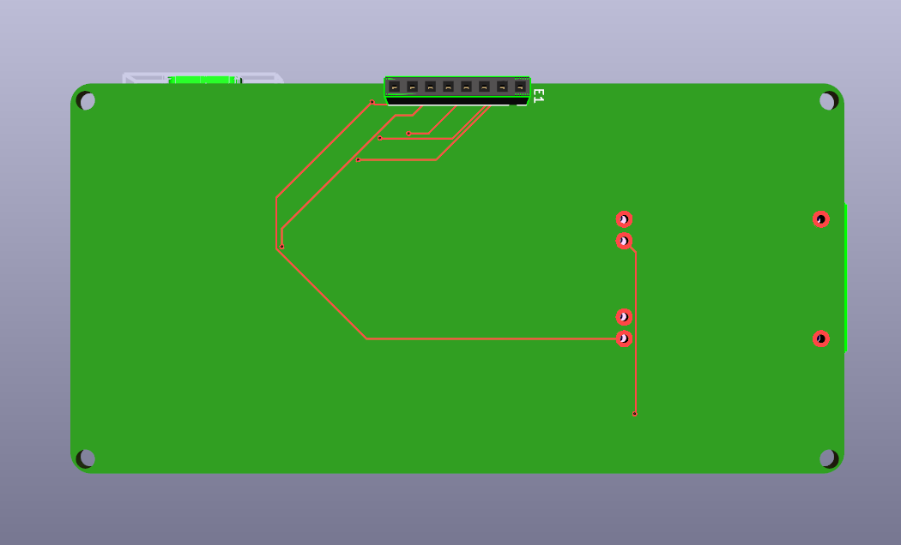

# Professionalization Design E-Ink Display

* **Author:** Thijmen Walter (Embedded & Robotics Engineer Student)
* **Date:** 31-05-2026
* **Version:** 2.0
* **Classification:** Internal
* **Client:** Mayor Mats Otten
* **Company:** The Embedded Alliance

## Table of Contents

- [1. Introduction](#1-introduction)
- [2. Design Objective](#2-design-objective)
- [3. Requirements](#3-requirements)
- [4. Design Evolution](#4-design-evolution)
    - [4.1 Original Architecture](#41-original-architecture)
    - [4.2 Modular Architecture](#42-modular-architecture)
- [5. Hardware Design](#5-hardware-design)
    - [5.1 Schematic Design](#51-schematic-design)
    - [5.2 KiCad Design Workflow](#52-kicad-design-workflow)
- [6. Breadboard Prototype](#6-breadboard-prototype)
    - [6.1 Prototype Goals](#61-prototype-goals)
    - [6.2 Advantages](#62-advantages)
    - [6.3 Limitations](#63-limitations)
- [7. Perfboard Design](#7-perfboard-design)
    - [7.1 Transition from Breadboard](#71-transition-from-breadboard)
    - [7.2 Layout](#72-layout)
    - [7.3 Advantages and Limitations](#73-advantages-and-limitations)
- [8. Bill of Materials](#8-bill-of-materials)
- [9. Future Design Recommendations](#9-future-design-recommendations)
    - [9.1 Future PCB Design](#91-future-pcb-design)
    - [9.2 Expected Improvements](#92-expected-improvements)
- [10. Conclusion](#10-conclusion)
- [11. References](#11-references)
- [12. Appendix](#12-appendix)

---

# 1. Introduction

This document describes the design and professionalization of the City Sim e-ink display module. The project was developed for The Embedded Alliance as part of the Smart Cities learning environment.

The purpose of this document is to describe the transition from a breadboard prototype to a more permanent perfboard implementation and to present a future PCB design. This work builds upon the findings and requirements identified in the Analysis Document (Walter, 2026).

The design process focused on improving reliability, reducing wiring complexity, increasing portability, and preparing the hardware for future manufacturing.

---

# 2. Design Objective

The objective of this assignment is to create a reliable and reusable hardware platform for the City Sim e-ink display system.

The design should:

* Support the existing City Sim architecture.
* Be reusable across multiple tiles.
* Support dynamic data from the backend.
* Improve hardware reliability.
* Reduce wiring complexity.
* Prepare the system for future PCB manufacturing.

The design decisions presented in this document are based on the requirements and system considerations identified during the analysis phase (Walter, 2026).

---

# 3. Requirements

The following requirements were derived from the Analysis Document (Walter, 2026).

## Functional Requirements

The system shall:

1. Display a city name.
2. Display a city logo.
3. Retrieve information from a backend API.
4. Update displayed information when new data becomes available.
5. Use the same firmware on multiple devices.

## Non-Functional Requirements

The system shall:

1. Be reusable.
2. Be scalable.
3. Be reliable.
4. Be maintainable.
5. Minimize unnecessary display updates.
6. Operate within the limitations of the e-ink display.

These requirements formed the basis for the hardware design decisions described in this document.

---

# 4. Design Evolution

## 4.1 Original Architecture

At the beginning of the project, all City Sim functionality was executed on a single ESP32-S3 development board.

The board was responsible for:

* Backend communication
* Data processing
* Display control
* General system logic

While functional, this solution occupied more space than necessary and mixed multiple responsibilities within a single hardware module.

## 4.2 Modular Architecture

Following the analysis phase, the display functionality was separated into a dedicated module using an ESP32-C3 SuperMini (Walter, 2026).

This redesign provided several advantages:

* Reduced hardware size
* Lower power consumption
* Better separation of responsibilities
* Easier integration into City Sim tiles
* Improved scalability

The ESP32-C3 SuperMini became the foundation for all subsequent prototype designs.

---

# 5. Hardware Design

## 5.1 Schematic Design

The schematic was created in KiCad and served as the foundation for all hardware implementations (KiCad, 2025).

The design consists of four main functional blocks.

### ESP32-C3 SuperMini

The ESP32-C3 acts as the primary controller and handles:

* Wi-Fi communication
* Backend communication
* SPI communication
* Display control

### E-Ink Display HAT

The e-ink display is connected using SPI communication, as identified during the analysis phase (Walter, 2026).

The display receives:

* MOSI
* SCK
* CS
* DC
* RST
* BUSY

signals from the ESP32-C3. Compatibility with Waveshare and Seengreat displays was investigated because documentation for the MH-ET Live display was limited (Seengreat, n.d.; Waveshare, n.d.; Kravec, 2025).

### TP4056 Charging Module

The TP4056 charging module manages battery charging and protection.

### Battery System

A rechargeable lithium-ion battery provides portable power for the display module.

The schematic remained unchanged throughout all prototype stages to maintain firmware compatibility and simplify debugging.

### Schematic Diagram

## 5.2 KiCad Design Workflow

KiCad was used throughout the entire design process for schematic design, perfboard planning, PCB layout development, and 3D visualization (KiCad, 2025).

### Schematic Design

KiCad was used to create and maintain the electrical schematic.

### Perfboard Layout Design

The KiCad PCB Editor was used to digitally recreate the perfboard layout before physical assembly.

This helped:

* Reduce wiring errors
* Verify placement
* Optimize routing

### PCB Layout Design

A future PCB design was created using the same schematic.

### 3D Visualization

KiCad's 3D viewer was used to validate:

* Component placement
* Connector accessibility
* Mechanical fit
* Overall appearance

The corresponding KiCad project files are included in the project repository.

---

# 6. Breadboard Prototype

## 6.1 Prototype Goals

The first implementation was built on a breadboard.

The breadboard prototype was used to:

* Verify SPI communication
* Validate power delivery
* Test firmware functionality
* Test component compatibility
* Debug hardware connections

The prototype was created to validate assumptions identified during the analysis phase regarding display communication and hardware compatibility (Walter, 2026).

## 6.2 Advantages

The breadboard provided several advantages:

* Rapid prototyping
* Easy modifications
* Fast troubleshooting
* No soldering required
* Reusable components

These characteristics make breadboards highly suitable during early-stage hardware development (Adafruit, 2024).

## 6.3 Limitations

Several limitations became apparent during testing:

* Loose jumper wire connections
* Large physical footprint
* Difficult cable management
* Limited durability
* Reduced reliability during movement

These limitations motivated the transition to a perfboard design.

---

# 7. Perfboard Design

## 7.1 Transition from Breadboard

After successful testing, the design was transferred to a perfboard.

The goals were:

* Improve reliability
* Reduce loose wiring
* Improve portability
* Create a cleaner design
* Prepare for future PCB development

Perfboards provide a more permanent prototyping solution compared to traditional breadboards while maintaining flexibility during development (MKTPCB, 2023).

The same schematic was reused to ensure consistency throughout the design process.

## 7.2 Layout

The first perfboard layout was designed in KiCad.

Design considerations included:

* Short wire lengths
* Accessible GPIO pins
* Stable power connections
* Compact placement

### 3D Validation

3D renders were generated to validate:

* Physical spacing
* Connector access
* Component placement

## 7.3 Advantages and Limitations

### Advantages

Compared to the breadboard:

* More reliable connections
* Improved durability
* Better portability
* Cleaner appearance
* Reduced wiring complexity

### Limitations

Some limitations remain:

* Manual soldering is required
* Reproducing boards is difficult
* Layout flexibility is limited
* Wiring complexity still exists

These limitations motivated the development of a custom PCB design.

---

# 8. Bill of Materials

| ID | Designator | Component                                                                                                                                                                 | Specification / purpose                                                                                | Amount | Supplier         | Estimated unit price | Estimated total |
| --- | --- | --- | --- | ---: | --- | ---: | ---: |
| 1  | U1         | [ESP32-C3 SuperMini](https://www.tinytronics.nl/en/development-boards/microcontroller-boards/with-wi-fi/esp32-c3-supermini-plus-development-board)                        | Main microcontroller used for Wi-Fi communication, SPI control of the e-ink display, and system logic. |     1x | TinyTronics      |                €4.95 |           €4.95 |
| 2  | U2         | [TP4056 Lithium Battery Charging Module](https://nl.mouser.com/ProductDetail/Soldered/333014?qs=sGAEpiMZZMs5TKDXZEoCqOJ%252BWtJg0exjNv7rV%2FQFNRhneIj2%2FqDp%252BA%3D%3D) | Battery charging and protection module for the 3.7V LiPo battery system.                               |     1x | Mouser           |                € 9.24 |           € 9.24 |
| 3  | BT1        | [JST SM02B-SRSS-TB Battery Connector](https://nl.mouser.com/ProductDetail/JST-Commercial/SM02B-SRSS-TBLFSN?qs=cdbOS8ANM9BWPfwllEYjZw%3D%3D)                              | Connector used to safely interface the LiPo battery with the system.                                   |     1x | Mouser           |                €0.33 |           €0.33 |
| 4  | B1         | [3.7V LiPo Battery (850mAh)](https://nl.mouser.com/ProductDetail/TinyCircuits/ASR00036?qs=byeeYqUIh0Mizxtsp6GM5A%3D%3D)                                                   | Rechargeable battery providing portable power for the entire system.                                   |     1x | Mouser           |                €11.94 |           €11.94 |
| 5  | E1         | [PinSocket 1x08 2.54mm Header](https://nl.mouser.com/ProductDetail/Harwin/M50-3030842?qs=%252BdQmOuGyFcEVh5gBUNIiFA%3D%3D)                                                | Electrical interface between ESP32-C3 and the e-ink display HAT.                                       |     1x | Mouser           |                € 1.32 |           € 1.32 |
| 6  | PCB1       | [3×7 cm Perfboard (2.54mm pitch)](https://www.kiwi-electronics.com/en/prototyping-board-3x7cm-2-54mm-pitch-7428)                                                          | Physical prototyping platform used for soldered assembly of the circuit.                               |     1x | Kiwi Electronics |                €1.68 |           €1.68 |
| 7  | DISP1      | [E-Ink Display HAT 2.9” (296×128)](https://www.bitsandparts.nl/display-e-paper-2-9inch-296x128px-mh-et-live-zwart-rood-met-controller-p1931732)                                                                                                                                          | SPI-based e-ink display used to show city name and logo.                                               |     1x | Bits & Parts         |               €24.95 |          €24.95 |

### Total Cost

**Estimated total cost:** **€55.41**

---

# 9. Future Design Recommendations

## 9.1 Future PCB Design

A custom PCB has been designed as the next stage of development.

The PCB uses the same validated schematic while replacing manual wiring with dedicated copper traces.

Printed circuit boards provide improved reliability, manufacturability, and electrical consistency compared to manually assembled prototypes (SparkFun Electronics, 2025; TechTarget, 2024).

### PCB 3D Validation

## 9.2 Expected Improvements

The PCB design is expected to provide:

* Improved reliability
* Cleaner routing
* Reduced assembly effort
* Easier manufacturing
* Better power distribution
* Dedicated mounting holes
* Smaller overall size

These improvements support the scalability and maintainability goals identified during the analysis phase (Walter, 2026).

---

# 10. Conclusion

This document described the professionalization of the City Sim e-ink display hardware.

The project evolved from a breadboard prototype into a more reliable perfboard implementation while maintaining compatibility with the architecture defined during the analysis phase (Walter, 2026).

The use of KiCad enabled consistent schematic management, perfboard planning, PCB design, and mechanical validation through 3D visualization (KiCad, 2025).

The perfboard implementation successfully improved reliability, portability, and maintainability. The future PCB design builds upon these improvements and provides a pathway toward a more professional and reproducible hardware solution.

The resulting design supports the requirements established during the analysis phase and provides a solid foundation for future development of the City Sim platform.

---

# 11. References

1. Adafruit. (2024). *Perma-Proto Guide*. Retrieved May 31, 2026, from https://learn.adafruit.com/breadboards-for-beginners/perma-protos

2. Espressif Systems. (2025). *ESP32-C3 Series Datasheet*. Retrieved May 31, 2026, from https://www.espressif.com/

3. KiCad. (2025). *KiCad Documentation*. Retrieved May 31, 2026, from https://docs.kicad.org/

4. Kravec, M. (2025, February 23). *Control 4-color MH-ET Live Epaper using Arduino*. Retrieved April 22, 2026, from https://kravemir.org/how-to/control-4-color-mh-et-live-epaper-using-arduino/

5. MKTPCB. (2023). *Perfboard | A Quick Guide | Types, Uses, Techniques, and More*. Retrieved May 31, 2026, from https://www.mktpcb.com/perfboard/

6. Seengreat. (n.d.). *2.9inch SPI e-INK Display Expansion Module HAT 296x128 Wiki*. Retrieved April 22, 2026, from https://seengreat.com/wiki/132/29inch-e-ink-display

7. SparkFun Electronics. (2025). *PCB Basics*. Retrieved May 31, 2026, from https://learn.sparkfun.com/tutorials/pcb-basics/all

8. TechTarget. (2024). *What is a Printed Circuit Board (PCB)?*. Retrieved May 31, 2026, from https://www.techtarget.com/whatis/definition/printed-circuit-board-PCB

9. Walter, T. (2026). *Professionalization of a Breadboard Prototype into a Perfboard or PCB Solution*. The Embedded Alliance.

10. Waveshare. (n.d.). *2.9inch e-Paper Module Manual*. Retrieved April 22, 2026, from https://www.waveshare.com/wiki/2.9inch_e-Paper_Module_Manual

---

# 12. Appendix

## Appendix A – Schematic Diagram

ESP32-C3 e-ink display schematic.

## Appendix B – Perfboard Layout Version 1

KiCad layout and 3D renders.

## Appendix C – Perfboard Layout Version 2

KiCad layout and 3D renders.

## Appendix D – PCB Design

PCB layout and 3D renders.

## Appendix E – Bill of Materials

Detailed supplier and pricing information.

## Appendix F – KiCad Project Files

Schematic, PCB, footprints, and project source files.
