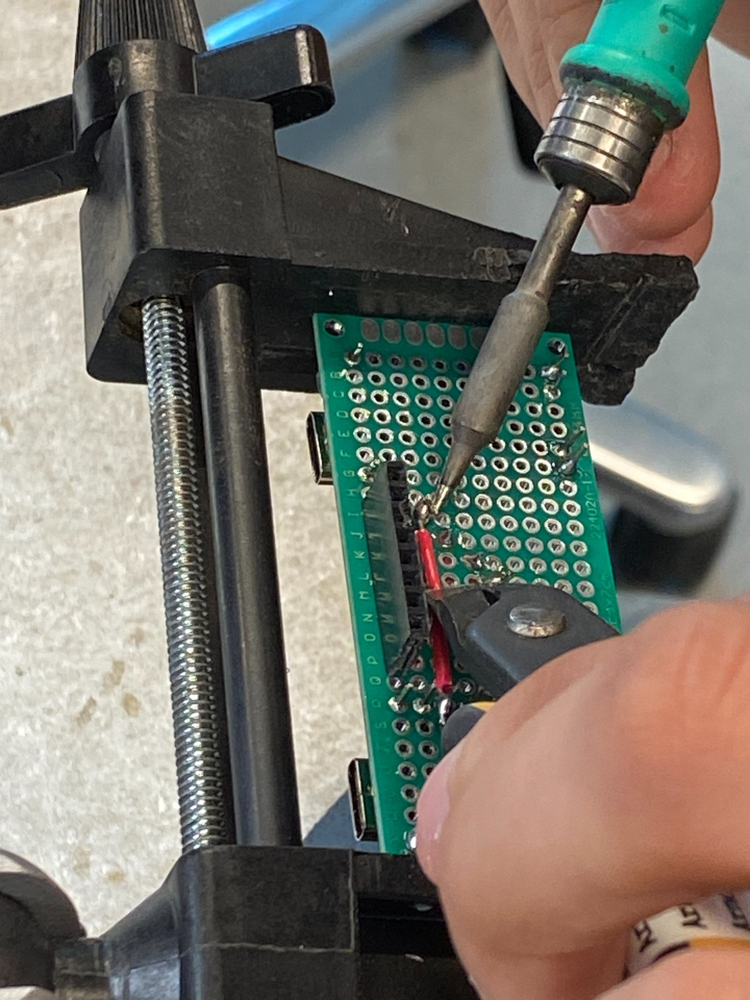
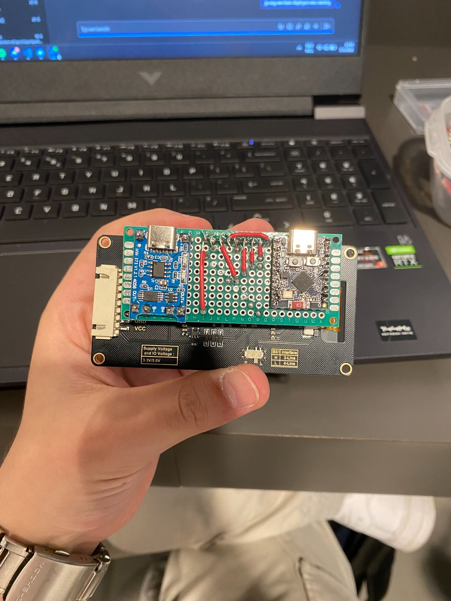
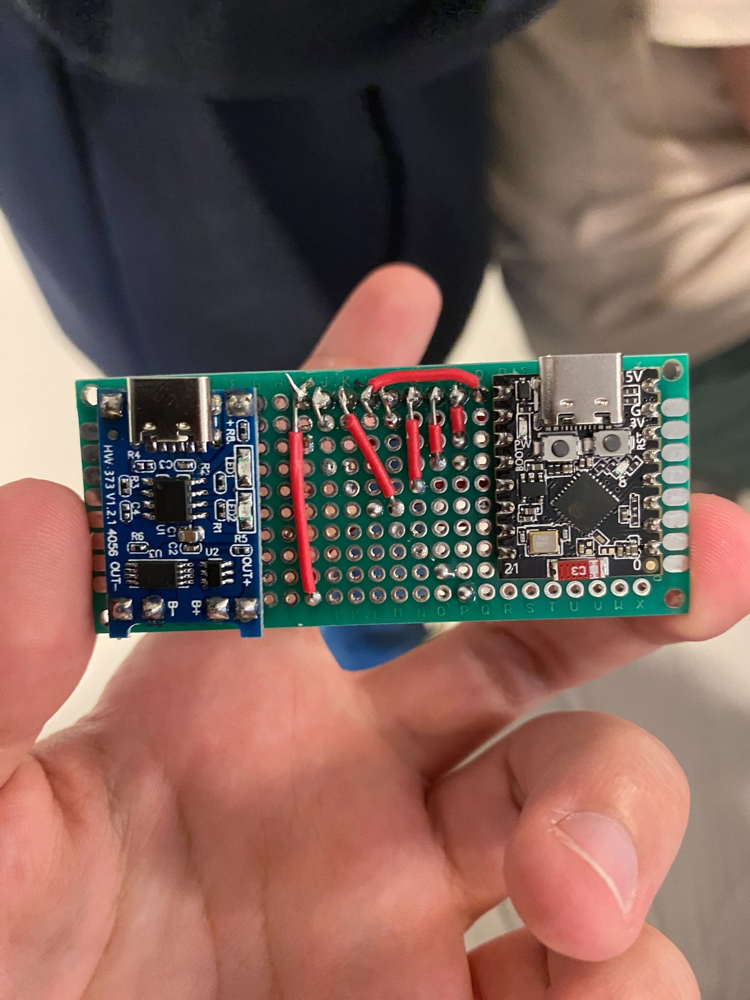
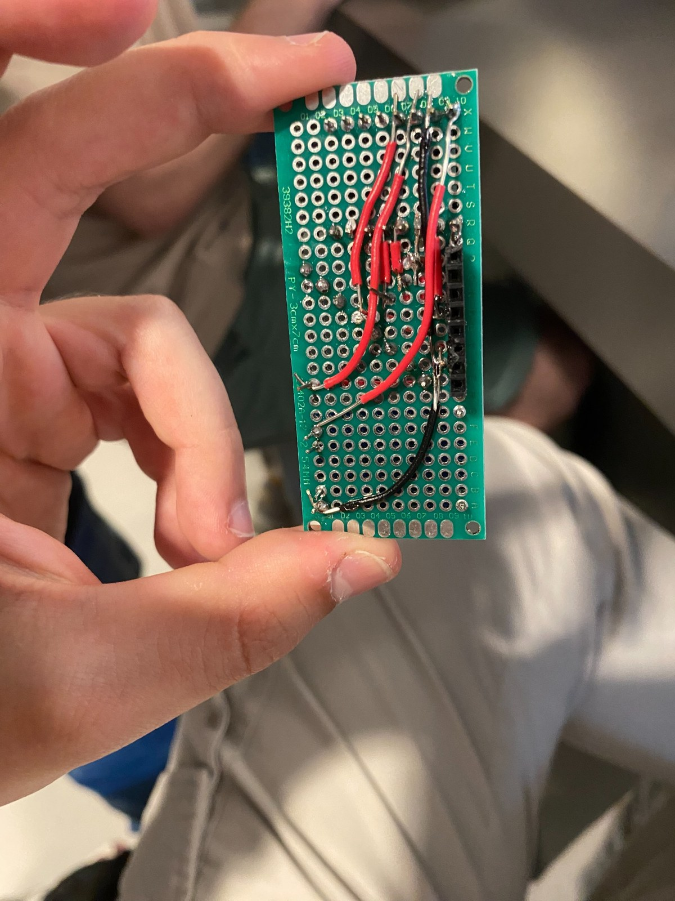
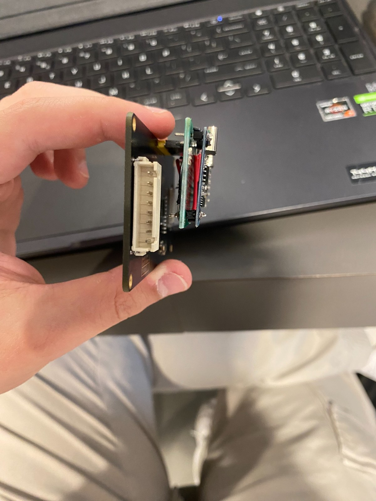

# Realisation - Professionalising the City Sim e-ink display module by transferring the breadboard prototype to perfboard

* **Author:** Thijmen Walter (Embedded & Robotics Engineer Student)
* **Date:** 31-05-2026
* **Version:** 1.0
* **Classification:** Internal
* **Client:** Mayor Mats Otten
* **Company:** The Embedded Alliance

This document describes the current realisation status of the City Sim e-ink display module. The physical perfboard has been soldered and mounted on the e-ink display HAT, but the module is not yet accepted as a fully finished product because the final electrical and display-update tests still need to be completed and documented.

## Summary

In this realisation, I transferred the City Sim e-ink display prototype from a temporary breadboard and loose wiring direction to a more permanent perfboard setup. The goal of this sprint was not to redesign the display logic itself. The goal was to make the physical electronics clearer, more stable, easier to mount on the display HAT, and more suitable as a reusable City Sim module. This direction follows the earlier analysis and design choice to move from breadboard prototyping toward a more professional hardware form (Walter, 2026a; Walter, 2026b).

The realised physical setup is based on the earlier analysis and design. The circuit keeps the same architecture that was defined for the e-ink display module, with the ESP32-C3 acting as the controller and the TP4056 and battery path supporting portable use (Walter, 2026b; Espressif Systems, 2025):

```text
Battery -> TP4056 -> ESP32-C3 SuperMini -> e-ink display HAT
```

For the display signals, the realised structure is based on the SPI-style display connection that was already used in the design research and display documentation (Walter, 2026b; Seengreat, n.d.; Waveshare, n.d.; Kravec, 2025):

```text
ESP32-C3 SuperMini -> SPI and control lines -> e-ink display connector
```

At the time of writing, the soldering work on the perfboard has been completed. The proof images show the soldering process, the component side, the back side, the side profile, and the completed module mounted on the e-ink display HAT. However, I cannot yet honestly claim that the module is fully verified. The final continuity checks, power checks, display communication test, battery-power test, and long-term use test still need to be completed before this realisation can be accepted as finished hardware.

The future PCB design was also made in KiCad. That PCB is useful as a future professionalisation direction, but it has not been manufactured or tested physically yet. Because of that, the PCB is design proof, not final realisation proof. KiCad supports this schematic, layout, and board-visualisation workflow, but a PCB only becomes realisation proof after manufacturing, assembly, and physical testing (KiCad, 2025; SparkFun Electronics, 2025; TechTarget, 2024).

---

## Table of Contents

- [1. Introduction](#1-introduction)
    - [1.1 Project context](#11-project-context)
    - [1.2 Why this is also important in the real world](#12-why-this-is-also-important-in-the-real-world)
    - [1.3 Main question](#13-main-question)
    - [1.4 Sub-questions](#14-sub-questions)
    - [1.5 Current realisation status](#15-current-realisation-status)
    - [1.6 Scope](#16-scope)
- [2. Methodology](#2-methodology)
    - [2.1 Realisation method](#21-realisation-method)
    - [2.2 Evidence method](#22-evidence-method)
    - [2.3 Testing method](#23-testing-method)
- [3. Sub-question 1: Why was the breadboard replaced as the final physical form?](#3-sub-question-1-why-was-the-breadboard-replaced-as-the-final-physical-form)
    - [3.1 Starting point from the breadboard version](#31-starting-point-from-the-breadboard-version)
    - [3.2 Realisation choice](#32-realisation-choice)
    - [3.3 Sub-conclusion](#33-sub-conclusion)
- [4. Sub-question 2: How did I make the perfboard version more professional?](#4-sub-question-2-how-did-i-make-the-perfboard-version-more-professional)
    - [4.1 Component placement](#41-component-placement)
    - [4.2 Power and ground routing](#42-power-and-ground-routing)
    - [4.3 Connector and signal grouping](#43-connector-and-signal-grouping)
    - [4.4 Sub-conclusion](#44-sub-conclusion)
- [5. Sub-question 3: How did I realise the selected perfboard approach?](#5-sub-question-3-how-did-i-realise-the-selected-perfboard-approach)
    - [5.1 Why I did not keep the breadboard](#51-why-i-did-not-keep-the-breadboard)
    - [5.2 Why I did not make the PCB the final proof yet](#52-why-i-did-not-make-the-pcb-the-final-proof-yet)
    - [5.3 How the perfboard was soldered](#53-how-the-perfboard-was-soldered)
    - [5.4 Sub-conclusion](#54-sub-conclusion)
- [6. Sub-question 4: Which technical points did I control during the transfer?](#6-sub-question-4-which-technical-points-did-i-control-during-the-transfer)
    - [6.1 ESP32-C3 and e-ink display connection](#61-esp32-c3-and-e-ink-display-connection)
    - [6.2 TP4056 and battery power path](#62-tp4056-and-battery-power-path)
    - [6.3 Common ground and power routing](#63-common-ground-and-power-routing)
    - [6.4 Mechanical placement and mounting](#64-mechanical-placement-and-mounting)
    - [6.5 Future PCB design](#65-future-pcb-design)
    - [6.6 Sub-conclusion](#66-sub-conclusion)
- [7. Sub-question 5: How far could I verify the perfboard version?](#7-sub-question-5-how-far-could-i-verify-the-perfboard-version)
    - [7.1 Visual inspection before power](#71-visual-inspection-before-power)
    - [7.2 Continuity and short-circuit testing](#72-continuity-and-short-circuit-testing)
    - [7.3 Power-path test](#73-power-path-test)
    - [7.4 Display communication test](#74-display-communication-test)
    - [7.5 Battery and charging test](#75-battery-and-charging-test)
    - [7.6 Sub-conclusion](#76-sub-conclusion)
- [8. Conclusion](#8-conclusion)
- [9. Recommendations](#9-recommendations)
- [10. References](#10-references)
- [Appendix A - Responsible use of ChatGPT](#appendix-a---responsible-use-of-chatgpt)
- [Appendix B - Realisation proof images](#appendix-b---realisation-proof-images)

---

## 1. Introduction

This chapter introduces the context of the realisation. It explains why I transferred the e-ink display module from a temporary prototype direction to a perfboard setup, why that matters for the City Sim project, and why this realisation is currently documented as a partly finished hardware step. The chapter builds on the earlier analysis and design deliverables for this module (Walter, 2026a; Walter, 2026b).

### 1.1 Project context

At the start of this sprint, the City Sim project already had an e-ink display concept that could be used as a separate information display module. The design direction used an ESP32-C3 SuperMini as the display controller, an e-ink display HAT as the visual output, a TP4056 module for battery charging, and a battery connection for portable use. This starting point comes from the earlier City Sim e-ink display design, while the ESP32-C3 choice is supported by the controller features described in Espressif documentation (Walter, 2026b; Espressif Systems, 2025).

The earlier analysis and design already showed why the hardware should move away from a breadboard setup. Breadboards are useful during early testing, but they are less suitable when the project needs to be moved, demonstrated, reused, and mounted inside a city tile or module. This matches the general distinction between temporary breadboard prototyping and more permanent soldered prototyping methods (Adafruit, 2024; MKTPCB, 2023). The display module needs a more stable physical form because e-ink display communication depends on several signal wires, stable power, and a common ground (Seengreat, n.d.; Waveshare, n.d.).

For this reason, I transferred the design to a perfboard. The goal was to keep the prototype flexible enough for a student project, while still making the hardware more permanent than a breadboard. This fits the analysis conclusion that perfboard is a practical middle step before a custom PCB (Walter, 2026a; MKTPCB, 2023).

### 1.2 Why this is also important in the real world

This learning goal is a small version of a real hardware-development problem. A prototype can work on a desk, but that does not automatically make it suitable for use in a product, demo module, or field setup. The physical implementation must also be reliable, readable, and maintainable. These are also reasons why the earlier analysis compared breadboard, perfboard, and PCB implementations instead of only focusing on the firmware (Walter, 2026a; SparkFun Electronics, 2025).

For a display module, loose wires can cause several problems. A weak SPI connection can stop the display from updating. A weak power connection can reset the microcontroller. A confusing battery connection can make troubleshooting harder. SPI displays depend on correct signal wiring and power references, so the wiring must remain traceable and stable (Seengreat, n.d.; Waveshare, n.d.; Kravec, 2025). If the hardware is mounted in a city tile or reused by another student, the circuit must be understandable without rebuilding it from scratch.

By transferring the display module to perfboard, I practised the step between a temporary prototype and a more professional hardware form. This is similar to real embedded development, where hardware often moves from breadboard testing to soldered prototypes and later to a custom PCB (Adafruit, 2024; MKTPCB, 2023; TechTarget, 2024).

### 1.3 Main question

The main question for this realisation is:

**How far did I professionalise the City Sim e-ink display module by transferring the prototype to a perfboard setup, and what still prevents the module from being accepted as finished hardware?**

### 1.4 Sub-questions

To answer the main question, I use these sub-questions:

1. **Why was the breadboard replaced as the final physical form?**
2. **How did I make the perfboard version more professional?**
3. **How did I realise the selected perfboard approach?**
4. **Which technical points did I control during the transfer?**
5. **How far could I verify the perfboard version?**

### 1.5 Current realisation status

At the moment, this realisation is partly finished.

**Table 1 - Current realisation status.**
This table shows which parts of the e-ink display module are already physically completed and which parts still need electrical or functional proof before the module can be accepted. The status is based on my own realisation evidence and on the design requirements from the earlier City Sim e-ink deliverable (Walter, 2026b).

| Part | Status | Explanation |
|---|---|---|
| Perfboard component placement | Completed | The TP4056 module, ESP32-C3 SuperMini, wires, and connector area have been placed on the perfboard. |
| Soldering | Completed | The main soldering work has been done and is shown in the proof images. |
| Mounting on e-ink display HAT | Completed | The soldered perfboard is mounted on the display HAT in the proof images. |
| SPI and control wiring | Built, but not fully verified | The wiring is soldered, but every signal still needs continuity testing against the schematic. |
| Power and ground routing | Built, but not fully verified | The TP4056, battery path, ESP32-C3 power input, and ground routing still need final electrical checks. |
| Display update test | Not accepted yet | No final proof image or serial output has been added that shows the display updating from this soldered board. |
| Battery-power test | Not accepted yet | The portable power path still needs to be checked before the module can be accepted as battery powered. |
| Future PCB design | Digitally completed | The PCB was designed in KiCad, but it has not been manufactured or physically tested. |
| Realisation status | Partly finished | The physical perfboard build is completed, but the electrical and functional verification are not finished yet. |

### 1.6 Scope

This realisation focuses on the physical transfer from the e-ink display prototype to a perfboard module and the current verification status. It uses the previous analysis and design as input instead of changing the module goal during realisation (Walter, 2026a; Walter, 2026b).

This realisation includes:

- Documenting the ESP32-C3, TP4056, battery, and e-ink display connection structure
- Using the KiCad schematic and perfboard layout as a build reference
- Documenting the soldered perfboard with proof images
- Documenting the current limits of the verification
- Explaining which tests still need to be completed before the module can be accepted
- Documenting the future PCB design as a next-step direction

This realisation does not yet prove:

- A fully working display update from the soldered perfboard
- A completed battery runtime test
- A completed charging behaviour test
- A manufactured and working PCB
- A final production-ready e-ink display module

---

## 2. Methodology

This chapter explains how I approached the realisation. Because the module contains both display communication wiring and portable power wiring, I used a staged method instead of treating the board as one large soldering task. This follows the same practical direction as the previous analysis, where reliability, maintainability, and verifiability were important criteria for the hardware transfer (Walter, 2026a).

### 2.1 Realisation method

I used a staged realisation method. I first kept the already designed schematic as the reference, then transferred the most important parts to the perfboard, and then prepared the design for a future PCB. KiCad was used as the schematic, layout, and visualisation tool for this workflow (KiCad, 2025; Walter, 2026b).

The planned and realised stages were:

**Table 2 - Realisation stages.**
This table shows the staged build method that I used to move from the schematic and prototype wiring to the soldered perfboard module.

| Stage | Action | Current status |
|---|---|---|
| 1 | Compare the prototype wiring with the KiCad schematic | Completed |
| 2 | Place the ESP32-C3 SuperMini on the perfboard | Completed |
| 3 | Place the TP4056 module on the perfboard | Completed |
| 4 | Plan the e-ink connector and signal route | Completed |
| 5 | Solder the main signal and power wires | Completed |
| 6 | Mount the perfboard on the e-ink display HAT | Completed |
| 7 | Inspect soldering visually | Started and partly completed |
| 8 | Test continuity of every signal | Still needs to be completed and documented |
| 9 | Test display update from the soldered board | Not accepted yet |
| 10 | Test battery and charging behaviour | Not accepted yet |
| 11 | Keep the PCB design as future proof | Digitally completed, not physically tested |

This staged method made the build process easier to control. It also prevents me from claiming that the whole module works before the separate checks are finished. This is important because soldered prototypes can still contain wiring mistakes, solder bridges, or incorrect signal paths that need inspection and testing (SparkFun Electronics, n.d.; MKTPCB, 2023).

### 2.2 Evidence method

I used visual evidence and planned test evidence. The visual evidence already shows the design, the soldering process, and the finished physical perfboard. The test evidence is not complete yet because the functional display update and battery test still need to be documented. I keep this distinction because KiCad proof and build photos show design and assembly, while only electrical and functional tests can prove that the module works (KiCad, 2025; SparkFun Electronics, n.d.).

**Table 3 - Evidence overview.**
This table lists the proof that is already included in the document and the proof that still needs to be collected during final testing.

| Evidence type | Status |
|---|---|
| KiCad schematic | Added as Figure 1 |
| KiCad perfboard layout | Added as Figure 2 |
| Soldering process photo | Added as Figure 3 |
| Complete mounted module photo | Added as Figure 4 |
| Component-side close-up | Added as Figure 5 |
| Solder-side wiring photo | Added as Figure 6 |
| Side-profile photo | Added as Figure 7 |
| Future PCB design | Added as Figure 8 and Figure 9 |
| Continuity test table | Included as planned verification |
| Display update proof | Not accepted yet |
| Battery-power proof | Not accepted yet |

The image evidence is important because it shows the full transfer path. The KiCad images show the planned layout. The soldering photo shows that the realisation was physically carried out. The component-side, side-view, and solder-side photos show that the module was actually assembled and mounted. These images support the realisation evidence, but they do not replace the electrical checks that are still required before acceptance (SparkFun Electronics, n.d.; Walter, 2026b).

### 2.3 Testing method

The planned testing method is still useful, but it is not finished yet. The original testing plan was:

1. Visual inspection
2. Continuity and short-circuit check
3. Power-path check
4. ESP32-C3 boot test
5. Display communication test
6. E-ink display update test
7. Battery-power test
8. Charging test
9. Repeated-use test

At the moment, the visual proof is the strongest completed evidence. The electrical and functional tests still need to be completed before the board can be accepted as finished. This includes checking the ESP32-C3 power and signal connections against the controller documentation and testing the e-ink display according to the display interface requirements (Espressif Systems, 2025; Seengreat, n.d.; Waveshare, n.d.).

---

## 3. Sub-question 1: Why was the breadboard replaced as the final physical form?

This section explains the reason for transferring the e-ink display module to perfboard. The earlier prototype direction was useful for testing, but the display module needs a more permanent physical build. This argument follows the analysis comparison between breadboard, perfboard, and PCB options (Walter, 2026a).

### 3.1 Starting point from the breadboard version

The breadboard version was useful because it made the display concept easy to test. It allowed the ESP32-C3, e-ink display, and power-related wiring to be changed quickly during development. Breadboards are suitable for this kind of early prototyping because they allow circuits to be changed without soldering (Adafruit, 2024).

However, the breadboard version was not a good final physical form. The e-ink display uses several signals, including SPI and control lines. If one of these lines becomes loose, the display can stop updating or behave unpredictably. The display documentation shows that the module depends on several control and SPI-related pins, so stable wiring is important (Seengreat, n.d.; Waveshare, n.d.). A breadboard also makes the module larger and less suitable for mounting to the back of the display HAT.

For a reusable City Sim module, the wiring should be more compact and more permanent. That is why the breadboard direction was replaced by a soldered perfboard. Perfboard is a practical intermediate step because it creates soldered connections without requiring a manufactured PCB immediately (MKTPCB, 2023; Walter, 2026a).

### 3.2 Realisation choice

I replaced the breadboard with perfboard because perfboard gave me a practical middle step. It allowed me to solder the ESP32-C3, TP4056 module, and display wiring into one more stable physical unit without immediately depending on a manufactured PCB. This matches the project advice that perfboard is more suitable for the current maturity of the prototype, while a PCB remains a later professionalisation step (Walter, 2026a; MKTPCB, 2023).

The chosen direction was:

```text
breadboard prototype -> soldered perfboard module -> future PCB
```

This direction matches the maturity of the project. The perfboard is more professional than a breadboard, but it still leaves room to change the design before manufacturing a PCB. A custom PCB becomes more useful when the schematic and routing have already been validated through testing (SparkFun Electronics, 2025; TechTarget, 2024).


*Figure 1. KiCad schematic of the City Sim e-ink display module. This schematic was used as the reference for the ESP32-C3, e-ink display connector, TP4056 module, and battery connection.*

### 3.3 Sub-conclusion

The breadboard was replaced because it was useful for early testing, but not suitable as the final physical form. The perfboard version is a better short-term direction because it creates a smaller and more permanent module. However, the module still needs final functional testing before it can be accepted as finished (Adafruit, 2024; MKTPCB, 2023; Walter, 2026b).

---

## 4. Sub-question 2: How did I make the perfboard version more professional?

This section explains what changed physically when I moved from a loose prototype to a soldered perfboard module. The improvement is mainly in the component grouping, soldered wiring, smaller form, and mounting on the e-ink display HAT. These points connect to the earlier criteria of reliability, maintainability, and professional appearance (Walter, 2026a; SparkFun Electronics, 2025).

### 4.1 Component placement

I made the perfboard version more professional by grouping the main components into a compact module. The ESP32-C3 SuperMini is placed on one side of the perfboard, the TP4056 charging module is placed on the other side, and the signal and power wires are routed between them. The ESP32-C3 functions as the controller for this module, which matches the earlier design and the capabilities described in the Espressif documentation (Walter, 2026b; Espressif Systems, 2025).

This makes the module easier to understand than a breadboard with loose jumper wires. The parts are placed in a way that matches the function of the module and the KiCad design reference (KiCad, 2025; Walter, 2026b):

**Table 4 - Functional grouping of the module.**
This table groups the realised hardware into functional areas so the module can be inspected as a controller, display, power, wiring, and future manufacturing system.

| Functional group | Parts |
|---|---|
| Controller side | ESP32-C3 SuperMini |
| Display side | E-ink display HAT and connector wiring |
| Power side | TP4056 charging module and battery path |
| Wiring side | Perfboard traces and soldered bridge wires |
| Future manufacturing side | KiCad PCB design |


*Figure 2. KiCad perfboard layout. This layout was used as the digital reference for the planned perfboard placement and routing.*

### 4.2 Power and ground routing

The module has two important power-related areas. I separated these areas because the controller, display, and battery path need predictable power and a shared reference before the module can be accepted (Espressif Systems, 2025; Walter, 2026b):

**Table 5 - Power areas in the module.**
This table separates the main power-related areas of the realised module and explains the role of each area in the final hardware.

| Power area | Function |
|---|---|
| Battery and TP4056 side | Charging and portable-power concept |
| ESP32-C3 side | Controller power and logic reference |
| Display side | E-ink display power and shared ground reference |

The common ground is important because the ESP32-C3 and e-ink display must use the same reference for communication. The TP4056 and battery side also need to be checked carefully because the battery path is not automatically the same as a regulated USB supply. This is why the design separates display signal wiring from power-path validation (Walter, 2026b; Seengreat, n.d.; Waveshare, n.d.).

Because of that, the power routing is built, but it is not fully accepted yet. It still needs to be checked with a multimeter and tested under real load.

### 4.3 Connector and signal grouping

The e-ink display signals are grouped together in the schematic and layout. This makes the firmware-to-hardware relation easier to check. The signal names and SPI-control concept are based on the display documentation and the earlier design mapping (Seengreat, n.d.; Waveshare, n.d.; Kravec, 2025; Walter, 2026b).

The realised signal mapping is:

**Table 6 - Realised e-ink signal mapping.**
This table shows how the e-ink display signals are mapped to the ESP32-C3 SuperMini pins in the soldered perfboard design.

| E-ink display signal | ESP32-C3 connection | Purpose |
|---|---|---|
| BUSY | GPIO7 | Display busy status input |
| RESET | GPIO8 | Display reset control |
| D/C | GPIO9 | Data or command selection |
| CS | GPIO10 | SPI chip select |
| SCLK | GPIO20 | SPI clock |
| SDI | GPIO21 | SPI data to display |
| GND | GND | Common ground |
| VCC | 3V3 | Display logic power |

This mapping must still be checked wire by wire on the actual soldered perfboard. The mapping can only be accepted after the continuity check and display test are completed, because the display documentation only proves the required interface and not my physical soldering result (Seengreat, n.d.; Waveshare, n.d.).

### 4.4 Sub-conclusion

I made the perfboard version more professional by creating one compact soldered module with clear functional areas. The component placement is cleaner than a breadboard, the wiring is more permanent, and the module can be mounted directly on the display HAT. The improvement is visible in the proof images, but the electrical verification still needs to be completed (MKTPCB, 2023; Walter, 2026b).

---

## 5. Sub-question 3: How did I realise the selected perfboard approach?

This section explains how I moved from the designed perfboard layout to the real soldered board. It also explains why the perfboard is the realised proof for this sprint, while the PCB remains a future step. This follows the earlier implementation choice to use perfboard now and keep PCB manufacturing for later (Walter, 2026a; Walter, 2026b).

### 5.1 Why I did not keep the breadboard

I did not keep the breadboard because that would not solve the physical reliability problem. The display module would still depend on loose jumper wires and a larger temporary structure. That does not fit the goal of making the City Sim display module reusable and easier to mount. Breadboards are useful for temporary prototyping, but the analysis already showed that a more permanent form was needed for this project phase (Adafruit, 2024; Walter, 2026a).

### 5.2 Why I did not make the PCB the final proof yet

I also did not use the custom PCB as final realisation proof in this sprint. A PCB would be the strongest long-term solution, but it must be manufactured, assembled, and tested before it can be accepted as realised hardware. PCB design improves reproducibility and layout quality, but the physical board still has to be produced and verified before it counts as realisation proof (SparkFun Electronics, 2025; TechTarget, 2024).

In this sprint, the PCB is therefore included as a future design direction. The perfboard is the actual physical realisation proof. The PCB files are useful because KiCad supports schematic and PCB preparation, but they do not replace hardware testing (KiCad, 2025).

### 5.3 How the perfboard was soldered

I built the perfboard version by following the KiCad design and by checking the physical component placement while soldering. The KiCad schematic and layout were used as my main build references (KiCad, 2025; Walter, 2026b).

First, I placed the ESP32-C3 SuperMini and TP4056 module on the perfboard. These two modules form the controller side and the power side of the design.

Second, I routed the display signal wires from the ESP32-C3 side toward the e-ink display connector area. This was needed because the e-ink display requires several separate SPI and control signals, including busy, reset, data or command, chip select, clock, data, ground, and supply connections (Seengreat, n.d.; Waveshare, n.d.; Kravec, 2025).

Third, I soldered the power and ground connections. This included the route from the TP4056 side, the ESP32-C3 power connection, and the common ground route.

Fourth, I mounted the perfboard onto the back of the e-ink display HAT. This made the result more compact than a breadboard and closer to the final module form.

Fifth, I inspected the front and back sides visually. The soldering work is completed, but the board still needs continuity and functional testing before it can be accepted. Visual inspection is useful after soldering, but it cannot prove every electrical connection by itself (SparkFun Electronics, n.d.).



*Figure 3. Soldering process during the perfboard realisation. This figure proves that the module was physically soldered and not only designed digitally.*



*Figure 4. Complete module mounted on the e-ink display HAT. This figure shows the realised physical module with the TP4056, perfboard wiring, ESP32-C3 SuperMini, and e-ink display HAT together.*



*Figure 5. Component side of the soldered perfboard. This figure shows the completed component side with the ESP32-C3 SuperMini, TP4056 module, and soldered signal and power wiring.*



*Figure 6. Back side of the soldered perfboard. This figure shows the solder-side wiring and the routed red and black wires on the back of the perfboard.*



*Figure 7. Side profile of the realised module. This figure shows the stacked physical structure of the e-ink display HAT, perfboard, TP4056 module, and ESP32-C3 SuperMini.*

### 5.4 Sub-conclusion

I realised the selected approach by soldering the designed circuit onto perfboard and mounting it on the e-ink display HAT. This means the physical transfer has been carried out. The proof images show the soldering process, the component side, the back side, and the mounted result. However, the realisation is not finished as a fully working system yet because the electrical and functional verification still needs to be completed (MKTPCB, 2023; SparkFun Electronics, n.d.; Walter, 2026b).

---

## 6. Sub-question 4: Which technical points did I control during the transfer?

This section describes the technical points that had to be controlled during the transfer. These points are important because the perfboard can only be accepted if the soldered hardware matches the schematic, the display connector, the firmware pin mapping, and the power concept. The technical mapping comes from the earlier design and the display documentation (Walter, 2026b; Seengreat, n.d.; Waveshare, n.d.).

### 6.1 ESP32-C3 and e-ink display connection

The ESP32-C3 to e-ink display connection had to be transferred carefully because it is the main communication path of the module. If one SPI or control signal is connected incorrectly, the display may not update. The ESP32-C3 supports SPI-style external communication, and the e-ink display documentation defines the required display-side control and data signals (Espressif Systems, 2025; Seengreat, n.d.; Waveshare, n.d.).

The intended mapping is:

**Table 7 - Display connector pin mapping.**
This table gives the pin-by-pin display connector mapping that must be used as a checklist during continuity testing.

| E-ink display pin | Signal | ESP32-C3 connection |
|---|---|---|
| 1 | BUSY | GPIO7 |
| 2 | RESET | GPIO8 |
| 3 | D/C | GPIO9 |
| 4 | CS | GPIO10 |
| 5 | SCLK | GPIO20 |
| 6 | SDI | GPIO21 |
| 7 | GND | GND |
| 8 | VCC | 3V3 |

This mapping gives me a clear checklist for continuity testing. Every display pin must be checked from the connector to the correct ESP32-C3 pin before the board can be accepted. The mapping follows the project design, but the soldered implementation must still be verified physically (Walter, 2026b).

### 6.2 TP4056 and battery power path

The TP4056 module was included to support portable use. The intended path follows the earlier design goal of making the display module usable as a compact, battery-supported City Sim module (Walter, 2026b):

**Table 8 - TP4056 and battery power path.**
This table shows the intended battery and charging connections that still need to be checked before battery-powered operation can be accepted.

| Connection | Purpose |
|---|---|
| Battery positive to TP4056 B+ | Battery positive input to the charger module |
| Battery negative to TP4056 B- | Battery negative input to the charger module |
| TP4056 OUT+ to ESP32-C3 power input | Power path for the controller side |
| TP4056 OUT- to common ground | Return path for the power system |

This part still needs careful testing. The TP4056 and battery path must be checked before I can safely claim that the module is battery powered. I still need to measure the voltage, check the polarity, check the common ground, and test whether the ESP32-C3 and display behave correctly under this supply. I keep this as a separate test because the ESP32-C3 and display have defined power requirements and should not be treated as proven only because the wires are soldered (Espressif Systems, 2025; Seengreat, n.d.; Waveshare, n.d.).

### 6.3 Common ground and power routing

The common ground is necessary because the display signals need the same reference as the controller. If the ESP32-C3, display HAT, and power module do not share the correct ground reference, the communication can fail even when the signal wires appear correct. This is why the schematic and display connection both include ground as a required connection, not as an optional wire (Walter, 2026b; Seengreat, n.d.; Waveshare, n.d.).

The checks that still need to be completed are:

**Table 9 - Ground and power checks for the module.**
This table lists the required ground and power checks that must be completed before the display module is powered and tested further.

| Check | Expected result |
|---|---|
| GND on ESP32-C3 to GND on e-ink connector | Continuity |
| GND on TP4056 OUT- to ESP32-C3 GND | Continuity |
| 3V3 to GND | No short circuit |
| Power input to GND | No short circuit |
| Display VCC to expected supply | Correct voltage before display use |

These checks are needed before powering and testing the full module. They also reduce the risk of powering a soldered board with an accidental short or incorrect supply connection (SparkFun Electronics, n.d.).

### 6.4 Mechanical placement and mounting

The mechanical placement was also part of the realisation. The module is now more compact because the perfboard is mounted behind the display HAT. This makes the hardware more realistic as a City Sim module. The compact module approach follows the earlier design goal of making the display unit reusable and easier to mount (Walter, 2026b).

The side profile still needs to be considered. The photos show that the perfboard, TP4056, and ESP32-C3 add thickness to the back of the display. That is acceptable for a prototype, but the thickness should be checked before the module is mounted inside a final tile or housing. This also explains why the future PCB direction remains useful, because a PCB can make the final physical form more reproducible and controlled (SparkFun Electronics, 2025; TechTarget, 2024).

### 6.5 Future PCB design

The future PCB design was made to show the next step after the perfboard. This is not final physical proof, but it is useful because it shows how the design can become more reproducible later. KiCad was used for this future design direction, while PCB sources describe why a PCB can improve repeatability compared with manual wiring (KiCad, 2025; SparkFun Electronics, 2025; TechTarget, 2024).


*Figure 8. Future PCB layout in KiCad. This design shows how the same module could be prepared for a more reproducible PCB version.*


*Figure 9. Future PCB 3D front view. This view was used to inspect component placement and connector access in the future PCB direction.*

The PCB still needs these steps before it can be accepted as final hardware. These steps are necessary because a design file alone does not prove that a manufactured PCB will work in the final module (KiCad, 2025; SparkFun Electronics, 2025):

1. Design-rule check
2. Manufacturing review
3. PCB ordering
4. Assembly
5. Electrical testing
6. Display update testing
7. Battery and charging testing

### 6.6 Sub-conclusion

The most important technical points were the display signal mapping, the TP4056 and battery path, common ground, power routing, mechanical mounting, and future PCB preparation. These points were included in the perfboard build and KiCad design. However, the module still needs electrical and functional verification before it can be accepted as fully working (Walter, 2026b; Seengreat, n.d.; Waveshare, n.d.; KiCad, 2025).

---

## 7. Sub-question 5: How far could I verify the perfboard version?

This section explains how far the verification could go. Because the proof currently consists mainly of build photos and KiCad proof, only the physical build can be accepted as completed. The functional display behaviour still needs to be proven. This distinction is important because design documentation and visual inspection do not replace electrical and functional testing (KiCad, 2025; SparkFun Electronics, n.d.).

### 7.1 Visual inspection before power

Before accepting the module, I visually inspected the perfboard. I checked whether the ESP32-C3 SuperMini, TP4056 module, and display connection area were placed as expected. I also checked whether the solder-side wiring roughly followed the intended routing. This kind of visual inspection is a normal first check after soldering, but it must be followed by measurement (SparkFun Electronics, n.d.).

This inspection is useful because it can reveal obvious mistakes, such as loose wires, large solder bridges, weak joints, or damaged insulation. The inspection does not replace electrical testing, but it is the first step before applying power (SparkFun Electronics, n.d.).

**Table 10 - Visual inspection results.**
This table summarises what could already be visually inspected from the proof images and what still cannot be accepted without electrical tests.

| Visual check | Current result |
|---|---|
| ESP32-C3 placed on perfboard | Completed |
| TP4056 placed on perfboard | Completed |
| Perfboard mounted on display HAT | Completed |
| Solder-side wiring visible | Completed |
| Obvious loose module | Not visible in proof images |
| Final acceptance | Not enough without electrical tests |

### 7.2 Continuity and short-circuit testing

The next verification step is continuity and short-circuit testing with a multimeter. This is the most important next step because a soldered perfboard can have mistakes that are not visible in photos. This fits the reason why soldered prototypes still require systematic checking after assembly (MKTPCB, 2023; SparkFun Electronics, n.d.).

The checks that still need to be completed are:

**Table 11 - Continuity and short-circuit test plan.**
This table lists the multimeter checks that are needed to verify the soldered power, ground, and display-signal paths.

| Check | Expected result |
|---|---|
| 3V3 to GND | No short circuit |
| ESP32-C3 GND to display GND | Continuity |
| TP4056 OUT- to ESP32-C3 GND | Continuity |
| BUSY path | Continuity from display connector to GPIO7 |
| RESET path | Continuity from display connector to GPIO8 |
| D/C path | Continuity from display connector to GPIO9 |
| CS path | Continuity from display connector to GPIO10 |
| SCLK path | Continuity from display connector to GPIO20 |
| SDI path | Continuity from display connector to GPIO21 |
| VCC path | Correct connection to display supply |
| Battery polarity | Positive and negative not reversed |

At the moment, this step is not documented as completed. That means I cannot yet move to final acceptance. The schematic and mapping define what should be connected, but the multimeter test must prove what is actually connected (Walter, 2026b).

### 7.3 Power-path test

The power-path test is planned, but not accepted yet. This test is required because the ESP32-C3, display HAT, and battery path must receive the correct supply before display testing can be trusted (Espressif Systems, 2025; Seengreat, n.d.; Waveshare, n.d.).

The expected result is:

```text
The ESP32-C3 receives the expected supply voltage and starts without overheating, resetting, or losing USB connection.
```

The battery and TP4056 path must be tested carefully because the module includes a charging and battery concept. I need to verify that the voltage and polarity are correct before connecting or charging a battery in the final setup. This follows the design choice to treat the portable-power path as a separate technical risk instead of assuming it works automatically (Walter, 2026b).

### 7.4 Display communication test

The display communication test is also planned, but not completed yet. This test is needed because the final goal of the module is to update the e-ink display. The display documentation and example material describe the display interface, but the soldered board still has to prove that it can drive the display in practice (Seengreat, n.d.; Waveshare, n.d.; Kravec, 2025).

The planned display test order is:

**Table 12 - Display update test order.**
This table shows the planned step-by-step display test that must prove the ESP32-C3 can update the e-ink display from the soldered module.

| Step | Action | Expected result |
|---|---|---|
| 1 | Power the ESP32-C3 from USB first | ESP32-C3 boots safely |
| 2 | Upload simple serial test firmware | Serial monitor confirms the board runs |
| 3 | Upload display test firmware | Firmware starts without errors |
| 4 | Send display initialization command | Display becomes ready |
| 5 | Draw a simple test pattern or text | E-ink display updates visibly |
| 6 | Repeat after reset | Display still updates correctly |

This test must be completed before the module can be accepted as a working e-ink display module. Without a visible display update, the realisation only proves assembly and not working display functionality (Seengreat, n.d.; Waveshare, n.d.).

### 7.5 Battery and charging test

The battery and charging test has not been completed yet. It would be incorrect to claim that the module is a finished portable module until this test is done. This is consistent with the design scope, where the TP4056 and battery path were part of the module but still needed physical validation (Walter, 2026b).

The planned final tests are:

**Table 13 - Final acceptance test overview.**
This table summarises the final tests that are required before the perfboard module and future PCB direction can be accepted as finished hardware.

| Test ID | Test | Expected result | Current status |
|---|---|---|---|
| T1 | Visual inspection | No obvious soldering or mounting problem | Partly completed |
| T2 | Continuity check | All signal paths match the schematic | Not completed |
| T3 | Short-circuit check | No short between power and ground | Not completed |
| T4 | USB boot test | ESP32-C3 starts correctly | Not completed |
| T5 | Display update test | E-ink display shows test content | Not completed |
| T6 | Battery power test | ESP32-C3 and display run from battery path | Not completed |
| T7 | Charging test | TP4056 charges safely and indicator behaviour is checked | Not completed |
| T8 | Repeated-use test | Module still works after movement and reset | Not completed |
| T9 | PCB validation | PCB design is manufactured and tested | Not completed |

The final acceptance test will only be valid after the continuity test, power test, display update test, and battery test have been documented. This keeps the realisation honest by separating design proof, build proof, and working hardware proof (Walter, 2026b; SparkFun Electronics, n.d.).

### 7.6 Sub-conclusion

The perfboard version could only be partly verified. The physical build and soldering are completed, and the visual proof can already be collected. However, the electrical and functional verification are not complete. Because of that, I cannot yet prove that the display communication works from the soldered board or that the battery-powered setup works safely (SparkFun Electronics, n.d.; Seengreat, n.d.; Waveshare, n.d.; Walter, 2026b).

---

## 8. Conclusion

This chapter combines the sub-conclusions and answers the main question. Because this realisation is partly finished, the conclusion does not claim that the final module fully works. It explains what has been achieved and what still blocks final acceptance. This is based on the earlier analysis and design, the visual realisation proof, and the remaining test plan (Walter, 2026a; Walter, 2026b).

The main question was:

**How far did I professionalise the City Sim e-ink display module by transferring the prototype to a perfboard setup, and what still prevents the module from being accepted as finished hardware?**

The first sub-conclusion is that the breadboard had to be replaced because it was only suitable as a temporary prototype. It was useful for testing the concept, but the display module needed a smaller and more stable physical form (Adafruit, 2024; Walter, 2026a).

The second sub-conclusion is that the perfboard version became more professional by grouping the ESP32-C3, TP4056, display wiring, power wiring, and mounting into one compact soldered module. The proof images show that the hardware has moved beyond a loose breadboard setup, which matches the intended role of perfboard as a more permanent prototype form (MKTPCB, 2023).

The third sub-conclusion is that perfboard was the most suitable physical implementation for this sprint. Keeping the breadboard would not solve the physical reliability problem, while treating the PCB as final proof would be too early because it has not been manufactured and tested (Walter, 2026a; SparkFun Electronics, 2025; TechTarget, 2024).

The fourth sub-conclusion is that the most important technical points were the display signal mapping, common ground, power routing, TP4056 and battery path, mechanical mounting, and future PCB preparation. These points were included in the build and the KiCad design (Walter, 2026b; KiCad, 2025; Seengreat, n.d.; Waveshare, n.d.).

The fifth sub-conclusion is that the verification is not finished yet. The soldered board still needs continuity checks, power checks, a display update test, battery-power testing, and repeated-use testing. This is necessary because build photos and design files do not prove final electrical behaviour (SparkFun Electronics, n.d.; KiCad, 2025).

The answer to the main question is therefore that I have partly professionalised the City Sim e-ink display module. I completed the physical transfer to a soldered perfboard and prepared a future PCB design. However, the realisation is not finished yet because the electrical and functional tests still need to be completed before the module can be accepted as fully working (Walter, 2026a; Walter, 2026b; MKTPCB, 2023).

---

## 9. Recommendations

This chapter gives the next steps for finishing the realisation. The recommendations focus on verifying the soldered perfboard first, because the PCB should only be treated as the next step after the perfboard is proven. This follows the staged development direction from the analysis and design (Walter, 2026a; Walter, 2026b).

### 9.1 Do not test the full module first

I should not immediately test everything at once. I should test the board in smaller stages so that problems can be isolated more easily. This is important because soldered prototypes can contain local faults that are easier to find when each subsystem is tested separately (SparkFun Electronics, n.d.; Walter, 2026b).

### 9.2 Check power and ground first

The first electrical checks should be power and ground checks. I should verify that there is no short circuit between power and ground before powering the board. This protects the ESP32-C3, display HAT, and power-path components before functional tests are attempted (Espressif Systems, 2025; Seengreat, n.d.; Waveshare, n.d.).

### 9.3 Check every display signal with a multimeter

Before uploading display firmware, I should check every display signal from the connector to the ESP32-C3 pin. This includes BUSY, RESET, D/C, CS, SCLK, SDI, GND, and VCC. These are the connections required by the display interface and the mapping from my design (Seengreat, n.d.; Waveshare, n.d.; Walter, 2026b).

### 9.4 Test from USB before testing from battery

The first functional test should use USB power. That makes debugging safer because the battery and charging path can be tested separately after the display communication works. This matches the staged verification approach where controller boot, display communication, and battery operation are not treated as one single test (Walter, 2026b).

### 9.5 Test the display with the simplest firmware first

The first display test should only show a simple test pattern or short text. This proves the hardware connection before adding backend communication or more complex display logic. The display documentation and example material are useful references for this first display update test (Seengreat, n.d.; Waveshare, n.d.; Kravec, 2025).

### 9.6 Validate the TP4056 and battery path separately

The TP4056 and battery path should be checked with the correct battery, correct polarity, and measured voltage. I should not assume the portable-power path is correct only because the wiring is soldered. This follows the design decision to treat the battery path as a separate part of the module that still needs verification (Walter, 2026b).

### 9.7 Only manufacture the PCB after the perfboard works

The PCB should only be manufactured after the perfboard has passed the main tests. If the perfboard has a wiring or power mistake, that mistake should be corrected before ordering a PCB. KiCad can support the PCB workflow, but manufacturing should only follow after the design has been validated enough to avoid copying mistakes into a custom board (KiCad, 2025; SparkFun Electronics, 2025).

### 9.8 Add final proof after functional testing

The final version of this realisation should later include a photo or video still of the e-ink display showing test content that was produced by the soldered perfboard module. That would prove the module works, not only that it was built. This final proof should be linked to the display interface test and the earlier design mapping (Seengreat, n.d.; Waveshare, n.d.; Walter, 2026b).

---

## 10. References

Adafruit. (2024). *Perma-Proto guide*. Retrieved May 31, 2026, from https://learn.adafruit.com/breadboards-for-beginners/perma-protos

Espressif Systems. (2025). *ESP32-C3 series datasheet*. Retrieved May 31, 2026, from https://www.espressif.com/

KiCad. (2025). *KiCad documentation*. Retrieved May 31, 2026, from https://docs.kicad.org/

Kravec, M. (2025, February 23). *Control 4-color MH-ET Live Epaper using Arduino*. Retrieved April 22, 2026, from https://kravemir.org/how-to/control-4-color-mh-et-live-epaper-using-arduino/

MKTPCB. (2023). *Perfboard: A quick guide, types, uses, techniques, and more*. Retrieved May 31, 2026, from https://www.mktpcb.com/perfboard/

Seengreat. (n.d.). *2.9inch SPI e-INK display expansion module HAT 296x128 wiki*. Retrieved April 22, 2026, from https://seengreat.com/wiki/132/29inch-e-ink-display

SparkFun Electronics. (n.d.). *How to solder: Through-hole soldering*. Retrieved May 31, 2026, from https://learn.sparkfun.com/tutorials/how-to-solder-through-hole-soldering/all

SparkFun Electronics. (2025). *PCB basics*. Retrieved May 31, 2026, from https://learn.sparkfun.com/tutorials/pcb-basics/all

TechTarget. (2024). *What is a printed circuit board?* Retrieved May 31, 2026, from https://www.techtarget.com/whatis/definition/printed-circuit-board-PCB

Walter. (2026a). *Professionalization of a breadboard prototype into a perfboard or PCB solution* [Analysis deliverable].

Walter. (2026b). *Professionalization of a breadboard prototype into a perfboard and PCB solution for a City Sim e-ink display* [Design deliverable].

Waveshare. (n.d.). *2.9inch e-paper module manual*. Retrieved April 22, 2026, from https://www.waveshare.com/wiki/2.9inch_e-Paper_Module_Manual

---

## Appendix A - Responsible use of ChatGPT

For this deliverable, I used ChatGPT to support the writing process. The support was limited to grammar, spelling, sentence structure, and suggestions for clearer formatting.

---

## Appendix B - Realisation proof images

This appendix collects the most important proof images for the realisation. These images are used as build evidence. They prove that the perfboard module was physically soldered and mounted, but they do not replace electrical and functional testing. This distinction matches the staged evidence method used in the main document (SparkFun Electronics, n.d.; Walter, 2026b).

### Figure B1 - KiCad schematic


*Figure B1 - KiCad schematic. This appendix figure shows the electrical reference for the ESP32-C3, TP4056 module, battery connection, and e-ink display connector.*

### Figure B2 - KiCad perfboard layout


*Figure B2 - KiCad perfboard layout. This appendix figure shows the planned perfboard placement and routing that was used as a reference during the physical build.*

### Figure B3 - KiCad perfboard front 3D view


*Figure B3 - KiCad perfboard front 3D view. This appendix figure shows the expected front-side placement of the ESP32-C3, TP4056 module, connector area, and perfboard layout before soldering.*

### Figure B4 - KiCad perfboard back 3D view


*Figure B4 - KiCad perfboard back 3D view. This appendix figure shows the planned back-side wiring direction and helps compare the digital design with the soldered back side.*

### Figure B5 - Soldering process


*Figure B5 - Soldering process. This appendix figure shows the real soldering work during the perfboard transfer and proves that the module was physically assembled.*

### Figure B6 - Complete mounted module


*Figure B6 - Complete mounted module. This appendix figure shows the soldered perfboard mounted on the e-ink display HAT with the ESP32-C3 and TP4056 in place.*

### Figure B7 - Component-side close-up


*Figure B7 - Component-side close-up. This appendix figure shows the component side of the realised board so the controller, charger module, and soldered wire routing can be inspected.*

### Figure B8 - Side profile


*Figure B8 - Side profile. This appendix figure shows the stacked structure of the e-ink display HAT, perfboard, TP4056 module, and ESP32-C3 SuperMini from the side.*

### Figure B9 - Solder-side wiring


*Figure B9 - Solder-side wiring. This appendix figure shows the back side of the perfboard and documents the soldered red and black wire routing.*

### Figure B10 - Future PCB layout


*Figure B10 - Future PCB layout. This appendix figure shows the KiCad PCB layout that can be used as a future manufacturing direction after the perfboard version is verified.*

### Figure B11 - Future PCB front 3D view


*Figure B11 - Future PCB front 3D view. This appendix figure shows the expected component placement and connector accessibility of the future PCB from the front side.*

### Figure B12 - Future PCB back 3D view


*Figure B12 - Future PCB back 3D view. This appendix figure shows the future PCB from the back side and supports later inspection of the board shape and routing direction.*
