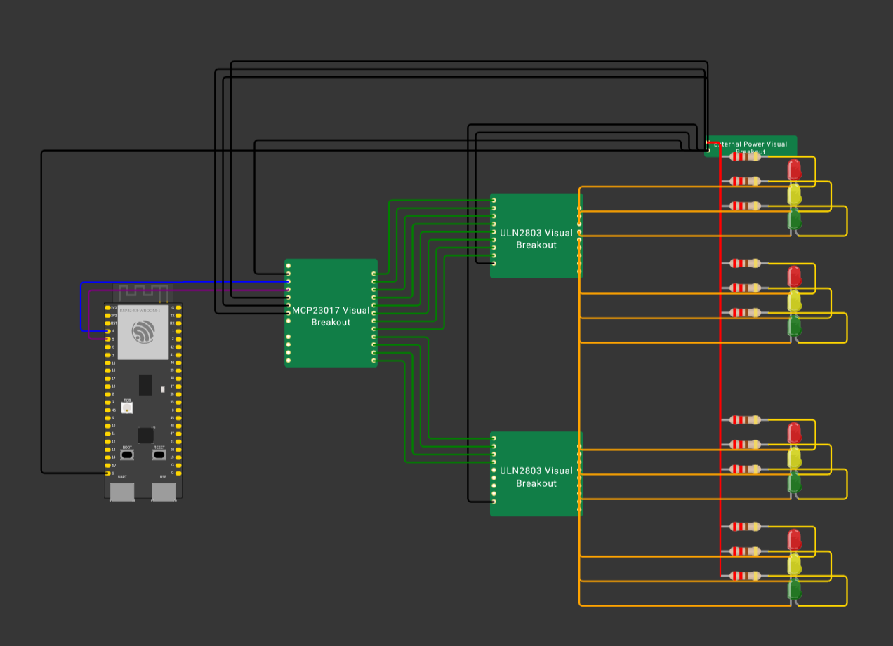

# Design — Four-Way Traffic-Light Crossing with Low Pin Usage and External LED Power

## Introduction

In the first iteration of my project, I built one simple traffic light with an ESP32-S3, three LEDs, and one resistor per LED. That version used direct GPIO outputs and proved that the system could start safely in red, follow the fixed order red → green → yellow → red, and avoid conflicting outputs.

For this second version, I am no longer designing one standalone traffic light. I am designing a small crossroads system with four traffic lights that work together as one coordinated setup. That means the design must do more than add extra LEDs. It must also make the full system understandable, scalable, and safe.

The main design change is that the ESP32-S3 is no longer used to power all traffic-light LEDs directly. Instead, the ESP32-S3 acts as the controller. It decides which channels must be active, while a separate output-expansion layer and a separate driver stage handle the actual switching of the lamp channels.

## Design goal

The goal of this design is to create a hardware and software structure for a four-way traffic-light crossing that:

* controls four traffic lights as one coordinated system;
* uses fewer controller pins than the number of lamp channels;
* avoids multiplexing, so each light remains a stable real output;
* prevents unsafe traffic-light combinations;
* supports future extension with sensors and backend communication;
* uses external power for the lamp side instead of powering all lamp channels directly from the ESP32-S3.

## Starting point from the first iteration

This design builds directly on the first prototype. In that version, the ESP32-S3 controlled one red, one yellow, and one green LED through GPIO 4, 5, and 6, with one 220Ω resistor per LED and a shared ground return. That structure worked well for a basic first iteration because it was simple, clear, and safe.

However, that design is only suitable for one traffic light. A full crossroads system needs twelve lamp channels in total and therefore needs a more scalable structure.

## Selected design architecture

The selected design is:

```text
ESP32-S3 -> MCP23017 -> 2x ULN2803 -> external power supply -> traffic-light LEDs
```

This structure separates the system into clear roles:

* **ESP32-S3**: controller logic
* **MCP23017**: output expansion
* **ULN2803 chips**: load switching
* **external power supply**: lamp power source
* **traffic lights**: visible outputs

I chose this structure because it solves two problems at the same time:

1. the ESP32-S3 does not need to use twelve direct GPIO pins;
2. the ESP32-S3 does not have to provide the LED current for the full crossing.

## Why this setup was chosen

### Why I did not keep direct GPIO per lamp

A direct GPIO-per-lamp setup would require twelve controller outputs for the crossing. That is possible in theory, but it is not a good choice for this project. It uses many pins, leaves less room for future features, and keeps the controller too close to the load side of the design.

### Why I chose an output expander

An output expander makes the design easier to scale. The software can work with logical output channels instead of being tied directly to a large number of ESP32 pins. That also fits the project requirement that the software should remain modular and understandable.

### Why I chose a driver stage

The output expander solves the output-count problem, but not the load-switching problem. The design therefore also needs a driver stage so the externally powered LED channels can be switched safely.

### Why I chose external lamp power

The final multi-light version should treat the ESP32-S3 as the controller only. The traffic-light lamps should be powered by an external supply, while the switching stage decides which channels are active.

## Functional traffic model

The crossing is designed around four directions:

* North
* East
* South
* West

Because this sprint does not yet include turning traffic, the traffic phases are grouped as:

* **North/South**
* **East/West**

This is the clearest design for this sprint because it creates a realistic coordinated crossroads model without making the traffic logic unnecessarily complex.

## Traffic-light grouping

The full setup contains four traffic lights:

* North traffic light
* East traffic light
* South traffic light
* West traffic light

Each traffic light has three lamp channels:

* red
* yellow
* green

That gives a total of twelve lamp channels.

## Channel mapping

I use one logical channel for each lamp. This keeps the software and hardware easy to understand.

| Channel | Function     |
| ------- | ------------ |
| 1       | North red    |
| 2       | North yellow |
| 3       | North green  |
| 4       | East red     |
| 5       | East yellow  |
| 6       | East green   |
| 7       | South red    |
| 8       | South yellow |
| 9       | South green  |
| 10      | West red     |
| 11      | West yellow  |
| 12      | West green   |

This mapping is simple and readable. It also makes later testing easier because every lamp can be traced directly to one logical output.

## Coordinated traffic cycle

The traffic lights are designed to work as one coordinated setup instead of as four independent lights.

| Phase              | North  | East   | South  | West   | Purpose                   |
| ------------------ | ------ | ------ | ------ | ------ | ------------------------- |
| All-red            | Red    | Red    | Red    | Red    | Safe transition           |
| North/South green  | Green  | Red    | Green  | Red    | Allow North/South traffic |
| North/South yellow | Yellow | Red    | Yellow | Red    | Safe warning before stop  |
| All-red            | Red    | Red    | Red    | Red    | Safe transition           |
| East/West green    | Red    | Green  | Red    | Green  | Allow East/West traffic   |
| East/West yellow   | Red    | Yellow | Red    | Yellow | Safe warning before stop  |

This grouping was chosen because it matches a basic crossroads situation clearly. It can also later be adapted to a T-junction by disabling one or more directions without redesigning the whole structure.

## Why this cycle is safe

This design keeps the system safe by following these rules:

* opposite directions may share green together;
* incompatible directions never receive green at the same time;
* every phase change goes through a safe transition;
* all-red is used between incompatible phases;
* each phase is controlled as one coordinated state, not as separate unrelated lamp decisions.

## Hardware setup

### Main components

| Component                | Role in the design   | Why it is used                                                             |
| ------------------------ | -------------------- | -------------------------------------------------------------------------- |
| ESP32-S3                 | Main controller      | Runs the traffic logic and future communication                            |
| MCP23017                 | Output expander      | Provides enough logical channels without many ESP32 pins                   |
| ULN2803 #1               | Driver stage         | Switches the first 8 lamp channels                                         |
| ULN2803 #2               | Driver stage         | Switches the remaining 4 lamp channels and leaves room for later expansion |
| External power supply    | Lamp power source    | Powers the traffic-light LEDs instead of relying on ESP32 output current   |
| 12 LED branches          | Traffic lights       | Represent North, East, South, and West traffic lights                      |
| 12 resistors             | Current limiting     | One resistor per lamp branch                                               |
| Breadboard / tile layout | Physical integration | Used for prototyping and later transfer into the project tile              |

## ESP32-S3 role

The ESP32-S3 remains the main controller in the design. It handles the traffic logic and later can also handle sensors and backend communication. The earlier prototype already proved that GPIO 4, 5, and 6 worked correctly on this board, so I want to reuse that known pin range in this second version as well.

## Pin choice for the controller side

In the first iteration, GPIO 4, 5, and 6 were already used successfully for the traffic-light prototype. In this design, those pins are no longer used as direct lamp outputs, because the lamp channels are now controlled through the MCP23017.

The controller only needs the I2C connection to the output expander, plus power and ground. A practical design choice is therefore:

| ESP32-S3 pin | Connection                     | Purpose                       |
| ------------ | ------------------------------ | ----------------------------- |
| 3V3          | MCP23017 VCC                   | Powers the logic side         |
| GND          | MCP23017 GND and shared ground | Common reference              |
| GPIO 4       | SDA                            | I2C data                      |
| GPIO 5       | SCL                            | I2C clock                     |
| GPIO 6       | reserved                       | Available for later expansion |

I chose this because it reuses pins that already worked in the first iteration, while still matching the new low-pin design. This keeps the transition from the first prototype to the second version more consistent and easier to follow.

## MCP23017 setup

The MCP23017 is used as the output-expansion layer.

Its role is:

* to receive I2C signals from the ESP32-S3;
* to provide enough output channels for the lamp-control signals;
* to separate the logical channel design from the direct ESP32 pin layout.

For the first version of this design, the address pins are tied to GND:

* A0 → GND
* A1 → GND
* A2 → GND

That keeps the addressing simple and is enough for one expander in this setup.

## ULN2803 setup

The two ULN2803 chips form the switching layer.

Their role is:

* to receive the control outputs from the MCP23017;
* to switch the lamp channels on and off;
* to allow the external power supply to provide the actual LED current.

This means the ULN2803 stage forms the connection between logic-level control and the actual lamp branches.

## Output-expander to driver mapping

### ULN2803 #1 input mapping

| MCP23017 output | ULN2803 #1 input | Lamp channel |
| --------------- | ---------------- | ------------ |
| GPA0            | IN1              | North red    |
| GPA1            | IN2              | North yellow |
| GPA2            | IN3              | North green  |
| GPA3            | IN4              | East red     |
| GPA4            | IN5              | East yellow  |
| GPA5            | IN6              | East green   |
| GPA6            | IN7              | South red    |
| GPA7            | IN8              | South yellow |

### ULN2803 #2 input mapping

| MCP23017 output | ULN2803 #2 input | Lamp channel |
| --------------- | ---------------- | ------------ |
| GPB0            | IN1              | South green  |
| GPB1            | IN2              | West red     |
| GPB2            | IN3              | West yellow  |
| GPB3            | IN4              | West green   |

The remaining outputs of the second bank stay available for later expansion.

## Driver output to traffic-light mapping

### ULN2803 #1 outputs

| ULN2803 #1 output | Connected lamp |
| ----------------- | -------------- |
| OUT1              | North red      |
| OUT2              | North yellow   |
| OUT3              | North green    |
| OUT4              | East red       |
| OUT5              | East yellow    |
| OUT6              | East green     |
| OUT7              | South red      |
| OUT8              | South yellow   |

### ULN2803 #2 outputs

| ULN2803 #2 output | Connected lamp |
| ----------------- | -------------- |
| OUT1              | South green    |
| OUT2              | West red       |
| OUT3              | West yellow    |
| OUT4              | West green     |

## Lamp-branch design

Each lamp branch is designed in the same way:

```text
External +V -> resistor -> LED -> ULN2803 output
```

This shows clearly that:

* the external supply powers the lamp branch;
* the ULN2803 switches the branch;
* the ESP32-S3 only controls the logic path.

That is the key difference from the first prototype.

## Why every lamp branch has its own resistor

Each lamp branch keeps its own resistor because:

* it is the clearest and safest way to control current;
* it keeps the lamp channels independent;
* it matches the design choice of one logical channel per lamp.

## Ground design

A common ground is required between:

* ESP32-S3 GND
* MCP23017 GND
* ULN2803 #1 GND
* ULN2803 #2 GND
* external supply GND

This shared ground reference is necessary so the control signals and switching stage work correctly.

## Setup overview diagram

The complete design can be summarized like this:

```text
ESP32-S3
   │
   ├── 3V3 ----------------------> MCP23017 VCC
   ├── GND ----------------------> common ground
   ├── GPIO 4 (SDA) -------------> MCP23017 SDA
   └── GPIO 5 (SCL) -------------> MCP23017 SCL

MCP23017
   ├── GPA0..GPA7 ---------------> ULN2803 #1 inputs
   └── GPB0..GPB3 ---------------> ULN2803 #2 inputs

ULN2803 #1 and #2
   └── switched outputs ---------> traffic-light lamp cathodes

External power supply
   └── +V -> resistor -> LED anodes
```

## Why this setup is better than a direct multi-LED GPIO design

This design is better than direct GPIO control for the multi-light version because:

* it uses fewer controller pins;
* it keeps the ESP32 focused on decision-making instead of lamp current;
* it stays modular and easier to extend later;
* it creates a clearer separation between logic and power;
* it fits future traffic-aware and backend-controlled behavior.

## Relationship to future sprints

This design is meant to support later features without needing a full redesign.

### Future vehicle detection

A later sprint can add detection per direction without changing the full lamp structure.

### Future backend control

A later sprint can add backend commands to the ESP32-S3 without redesigning the traffic-light outputs.

### Future smarter timing

The same crossing layout can later support adaptive timing while keeping the same output-channel structure.

## Correct design result for this step

For this step, I consider the design correct when:

* the full system is documented as one coordinated four-way traffic-light setup;
* the traffic lights are clearly grouped into North, East, South, and West;
* the cycle prevents unsafe combinations;
* the hardware structure clearly separates controller logic, output expansion, and lamp switching;
* the lamp side is externally powered;
* the design is understandable enough to implement first on a breadboard and later in the project tile.

## Limits of this design

This design is still limited in scope:

* it does not yet include turning lanes;
* it does not yet include pedestrian phases;
* it does not yet include emergency priority;
* it does not yet include live adaptive sensing;
* it still needs physical realization to prove the driver stage and externally powered lamp branches in practice.

That means this design is not yet the final smart-traffic version. It is the correct intermediate structure for expanding the prototype into a realistic small crossroads.

## Conclusion

This design translates the earlier single-traffic-light prototype into a four-way crossing system that is more realistic, safer to expand, and more suitable for later smart behavior.

The first version proved the basic traffic-light logic with direct GPIO control on GPIO 4, 5, and 6. In this second version, GPIO 4 and 5 are reused for communication with the output expander, while GPIO 6 remains available for later extension. The ESP32-S3 remains the controller, the MCP23017 expands the outputs, the ULN2803 chips switch the lamp channels, and an external power source supplies the LED current.

The final design for this sprint is therefore:

**ESP32-S3 -> MCP23017 -> 2x ULN2803 -> external power supply -> 4 traffic lights**

This is the clearest and most suitable design basis for realizing the multi-traffic-light crossroads system in the next step.

---

# Appendix A — Proof of Design

This appendix contains the design proof for this deliverable. It is meant to show the documented hardware structure visually, so the written design can be linked directly to the actual schematic and layout.

## A.1 Fritzing schematic view

**Figure A1. Fritzing schematic view of the design**

[Insert Fritzing schematic image here]

This figure should show the logical wiring of the design in Fritzing. It should make clear how the controller side, output-expansion layer, driver stage, and lamp branches are connected.

## A.2 Fritzing breadboard view

**Figure A2. Fritzing breadboard view of the design**

[Insert Fritzing breadboard image here]

This figure should show the practical breadboard layout of the design. It should help explain how the components are placed physically and how the prototype can be built step by step.

## A.3 Short proof note

The appendix figures support the design deliverable because they provide visual proof of:

* the chosen hardware structure;
* the separation between controller logic and lamp power;
* the mapping from ESP32-S3 to MCP23017 to ULN2803 to traffic-light outputs;
* the intended implementation structure for breadboard realization.

Wokwi:
