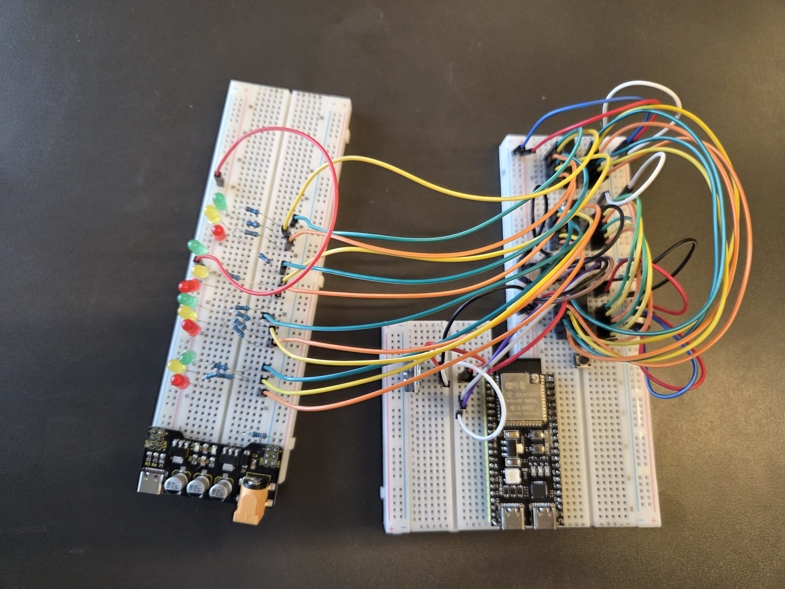
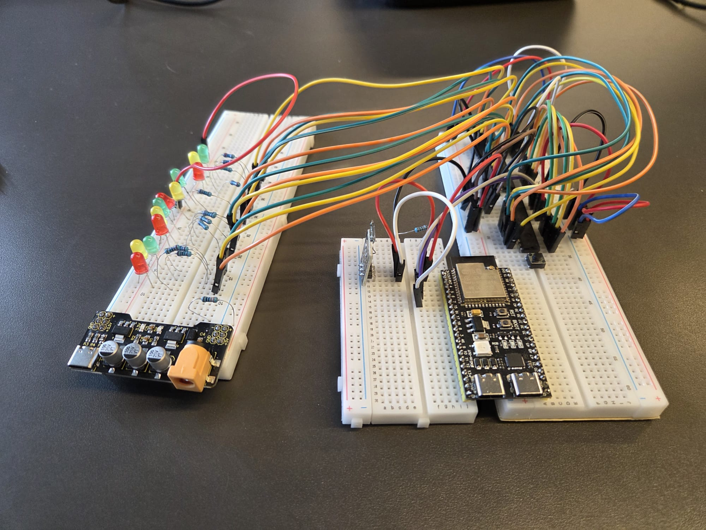
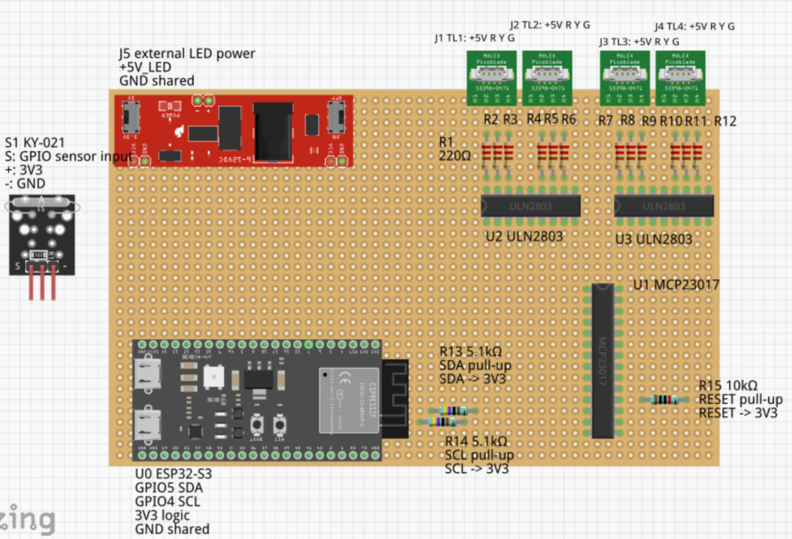
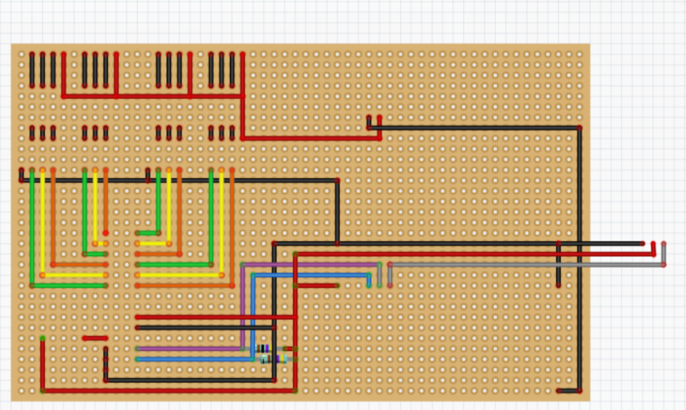
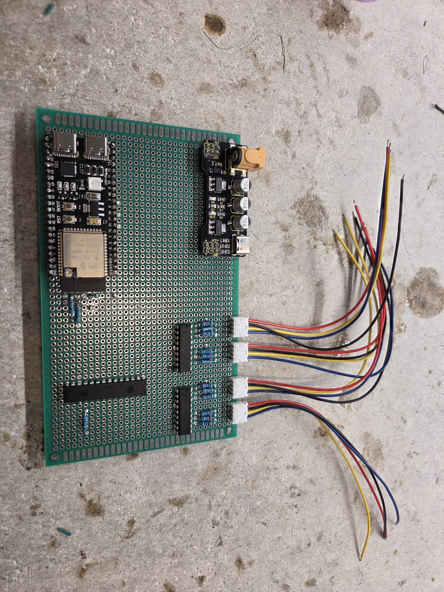
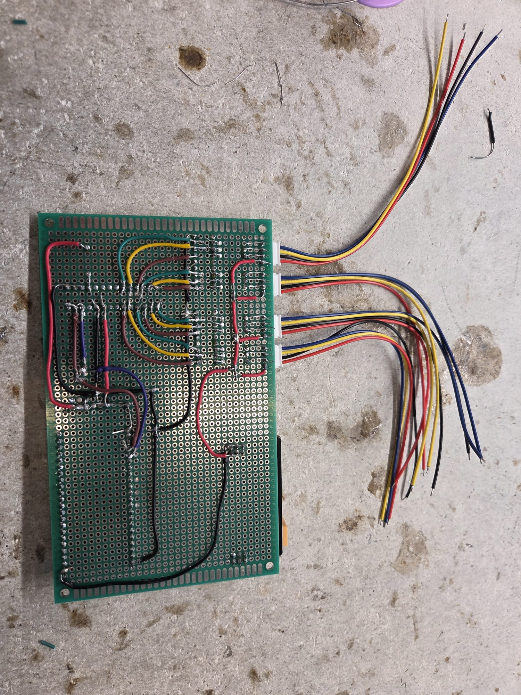

# Realisation - Professionalising the traffic-light tile by transferring the breadboard circuit to perfboard

This document describes the current realisation status of the perfboard transfer. The physical soldering has been completed, but the system is not fully working yet because there is currently a problem starting from the 3.3V side of the circuit.

## Summary

In this realisation, I transferred my working four-way traffic-light circuit from a breadboard setup to a more permanent perfboard setup. The goal of this sprint was not to redesign the traffic-light logic. The goal was to make the physical electronics clearer, more stable, easier to connect to the traffic-light models, and more suitable for mounting in or under the city tile.

At the time of writing, the soldering work on the perfboard has been completed, but the realisation is not fully finished yet. The main reason is that I currently have a problem that starts from the 3.3V side of the circuit. Because of this, I cannot yet honestly prove that the MCP23017 communicates correctly over I2C, that all output channels switch correctly, or that the final traffic-light sequence works from the perfboard.

The realised physical structure is still based on the earlier analysis and design. The circuit keeps the same architecture:

```text
ESP32-S3 -> MCP23017 -> 2x ULN2803 -> LED resistors -> traffic-light connectors
```

The perfboard also includes the external LED power, shared ground, I2C pull-up resistors, MCP23017 reset pull-up resistor, KY-021 sensor connection, and four 4-pin traffic-light connectors. However, because the 3.3V issue is not solved yet, this deliverable must be seen as an unfinished realisation deliverable. It documents what I already built, what I checked, where the realisation is blocked, and what still needs to be done before the circuit can be accepted as working.

---

## Table of Contents

- [1. Introduction](#1-introduction)
  - [1.1 Project context](#11-project-context)
  - [1.2 Why this is also important in the real world](#12-why-this-is-also-important-in-the-real-world)
  - [1.3 Main question](#13-main-question)
  - [1.4 Sub-questions](#14-sub-questions)
  - [1.5 Current realisation status](#15-current-realisation-status)
  - [1.6 Scope](#16-scope)
- [2. Methodology](#2-methodology)
  - [2.1 Realisation method](#21-realisation-method)
  - [2.2 Evidence method](#22-evidence-method)
  - [2.3 Testing method](#23-testing-method)
- [3. Sub-question 1: Why was the breadboard replaced as the final physical form?](#3-sub-question-1-why-was-the-breadboard-replaced-as-the-final-physical-form)
  - [3.1 Starting point from the breadboard version](#31-starting-point-from-the-breadboard-version)
  - [3.2 Realisation choice](#32-realisation-choice)
  - [3.3 Sub-conclusion](#33-sub-conclusion)
- [4. Sub-question 2: How did I make the perfboard version more professional?](#4-sub-question-2-how-did-i-make-the-perfboard-version-more-professional)
  - [4.1 Component placement](#41-component-placement)
  - [4.2 Power and ground routing](#42-power-and-ground-routing)
  - [4.3 Connector grouping](#43-connector-grouping)
  - [4.4 Sub-conclusion](#44-sub-conclusion)
- [5. Sub-question 3: How did I realise the selected perfboard approach?](#5-sub-question-3-how-did-i-realise-the-selected-perfboard-approach)
  - [5.1 Why I did not keep the breadboard](#51-why-i-did-not-keep-the-breadboard)
  - [5.2 Why I did not make a custom PCB](#52-why-i-did-not-make-a-custom-pcb)
  - [5.3 How the perfboard was soldered](#53-how-the-perfboard-was-soldered)
  - [5.4 Sub-conclusion](#54-sub-conclusion)
- [6. Sub-question 4: Which technical points did I control during the transfer?](#6-sub-question-4-which-technical-points-did-i-control-during-the-transfer)
  - [6.1 ESP32-S3 and MCP23017 connection](#61-esp32-s3-and-mcp23017-connection)
  - [6.2 MCP23017 to ULN2803 output mapping](#62-mcp23017-to-uln2803-output-mapping)
  - [6.3 ULN2803 low-side switching](#63-uln2803-low-side-switching)
  - [6.4 LED resistors and traffic-light connectors](#64-led-resistors-and-traffic-light-connectors)
  - [6.5 KY-021 sensor connection](#65-ky-021-sensor-connection)
  - [6.6 Current 3.3V problem](#66-current-33v-problem)
  - [6.7 Sub-conclusion](#67-sub-conclusion)
- [7. Sub-question 5: How far could I verify the perfboard version?](#7-sub-question-5-how-far-could-i-verify-the-perfboard-version)
  - [7.1 Visual inspection before power](#71-visual-inspection-before-power)
  - [7.2 Continuity and short-circuit testing](#72-continuity-and-short-circuit-testing)
  - [7.3 I2C scanner test](#73-i2c-scanner-test)
  - [7.4 Individual output-channel test](#74-individual-output-channel-test)
  - [7.5 Full traffic-light sequence test](#75-full-traffic-light-sequence-test)
  - [7.6 Sub-conclusion](#76-sub-conclusion)
- [8. Conclusion](#8-conclusion)
- [9. Recommendations](#9-recommendations)
- [10. References](#10-references)
- [Appendix A - Responsible use of ChatGPT](#appendix-a---responsible-use-of-chatgpt)

---

## 1. Introduction

This chapter introduces the context of the realisation. It explains why I transferred the circuit from breadboard to perfboard, why that matters for my project, and why this realisation is currently documented as unfinished.

### 1.1 Project context

At the start of this sprint, I already had a working four-way traffic-light setup on a breadboard. The system used an ESP32-S3 as the controller, an MCP23017 as I2C output expander, two ULN2803 driver chips, external LED power, shared ground, and a `millis()` based traffic-light state machine. This structure was already tested earlier, so this sprint did not focus on changing the traffic-light logic itself (Wesley, 2026a).

The problem was the physical form of the circuit. The breadboard version worked, but it was still a temporary prototype. A solderless breadboard is useful because it allows circuits to be built and changed without soldering (SparkFun Electronics, n.d.-a). That was useful during the first tests, but it was not ideal for a traffic-light tile that must be moved, demonstrated, connected to traffic-light models, and extended later.

For this reason, I started transferring the circuit to perfboard. The goal was to make the electronics more stable and more suitable for the city tile while keeping the working behaviour from the breadboard version.

### 1.2 Why this is also important in the real world

This learning goal is a small scale-model version of a real problem. In real traffic systems, the physical reliability of the electronics is just as important as the software logic. A traffic controller can have correct software, but if a wire connection is weak, a signal is connected to the wrong output, or the power routing is unclear, the real output can still behave incorrectly.

This can represent several real-world situations. One example is a traffic-light cabinet where wiring must be traceable so maintenance workers can safely find faults. Another example is a temporary roadwork traffic-light setup, where the system must keep working while it is moved and reconnected. A third example is a smart-city prototype where sensors and traffic lights are added step by step, but the basic safety of the signal outputs must remain stable.

In my project, the same principle applies at a smaller scale. If the model traffic lights are connected incorrectly, the wrong direction or colour can switch on. That would make the traffic situation confusing, even if the code itself is written correctly. By transferring the circuit to perfboard, I practise the same kind of thinking that is needed in real embedded and traffic-control systems: the hardware, software, wiring, power, and test evidence must match each other.

### 1.3 Main question

The main question for this realisation is:

**How far did I professionalise my working four-way traffic-light breadboard circuit by transferring it to a perfboard setup, and what still prevents the perfboard version from being accepted as finished?**

### 1.4 Sub-questions

To answer the main question, I use these sub-questions:

1. **Why was the breadboard replaced as the final physical form?**
2. **How did I make the perfboard version more professional?**
3. **How did I realise the selected perfboard approach?**
4. **Which technical points did I control during the transfer?**
5. **How far could I verify the perfboard version?**

### 1.5 Current realisation status

At the moment, this realisation is unfinished.

| Part | Status | Explanation |
|---|---|---|
| Perfboard component placement | Completed | The main components have been placed on the perfboard. |
| Soldering | Completed | The main soldering work has been done. |
| Power and ground routing | Built, but not fully verified | The routing is soldered, but the current problem starts around the 3.3V side. |
| I2C scanner test | Not accepted yet | I cannot yet use this as proof because the 3.3V problem must be solved first. |
| Individual output test | Not accepted yet | The output channels cannot be trusted until the logic power problem is solved. |
| Final traffic-light sequence | Not completed yet | The final working sequence cannot be proven yet. |
| Realisation status | Unfinished | The physical build is done, but the electrical verification is not complete. |

### 1.6 Scope

This realisation focuses on the physical transfer from breadboard to perfboard and the current unfinished status.

This realisation includes:

- transferring the existing ESP32-S3, MCP23017, ULN2803, external LED power, shared ground, LED resistor, connector, and KY-021 sensor structure to perfboard
- using the Fritzing front-side and back-side design as a build reference
- documenting the soldered circuit
- documenting the current 3.3V problem
- explaining which tests still need to be completed before the realisation can be accepted

This realisation does not yet prove:

- successful MCP23017 I2C communication from the perfboard
- correct operation of all output channels
- correct final software-to-hardware mapping
- a full working traffic-light sequence from the perfboard
- a finished and accepted perfboard controller

---

## 2. Methodology

This chapter explains how I approached the realisation. Because the circuit contains both logic wiring and LED power wiring, I used a staged method instead of trying to test the complete system only at the end.

### 2.1 Realisation method

I used a staged realisation method. I did not treat the perfboard as one large soldering task. Instead, I divided the work into smaller stages so that every important part could be checked before continuing.

The planned stages were:

| Stage | Action | Current status |
|---|---|---|
| 1 | Compare the breadboard circuit with the Fritzing design | Completed |
| 2 | Place the main components on the perfboard | Completed |
| 3 | Solder power, ground, and I2C connections | Completed, but not fully verified |
| 4 | Solder the MCP23017 to ULN2803 signal paths | Completed |
| 5 | Solder LED resistors and traffic-light connectors | Completed |
| 6 | Check for shorts and continuity | Started, still needs more checking |
| 7 | Test I2C communication | Blocked by the 3.3V problem |
| 8 | Test each output channel one by one | Not completed yet |
| 9 | Run the full traffic-light sequence | Not completed yet |

This method follows the same idea as the earlier staged tests for the MCP23017 and ULN2803. Testing each part separately makes debugging easier than building everything at once and only testing at the end (Wesley, 2026d).

### 2.2 Evidence method

I used visual evidence and planned test evidence. The visual evidence can already show the original breadboard setup, the planned Fritzing layout, and the soldered perfboard build. The test evidence is not complete yet, because the current 3.3V problem must be solved before I can honestly claim that the circuit works.

| Evidence type | Status |
|---|---|
| Original breadboard top view | Added as Figure 1 |
| Original breadboard front view | Added as Figure 2 |
| Fritzing front/component-side design | Added as Figure 3 |
| Fritzing back/solder-side design | Added as Figure 4 |
| Component side of soldered perfboard | Added as Figure 5 |
| Back side of soldered perfboard | Added as Figure 6 |
| Serial monitor result | Not accepted yet |
| Output test photo | Not accepted yet |
| Final working sequence | Not accepted yet |

The image evidence is important because it shows the full transfer path. The breadboard photos show the temporary starting point. The Fritzing images show the planned perfboard layout. The perfboard photos show that the circuit was physically soldered. Together, these images support the claim that the physical transfer has been carried out, while the text still remains honest that the electrical verification is not finished yet.

### 2.3 Testing method

The planned testing method is still useful, but it is not finished yet. The original testing plan was:

1. visual inspection
2. continuity and short-circuit check
3. 3.3V logic power check
4. I2C scanner test
5. individual output-channel test
6. full traffic-light sequence test

Because the problem currently starts from the 3.3V side, the testing process stops before the I2C scanner and output tests can be accepted. The Arduino documentation explains that `millis()` returns the number of milliseconds since the board started running the current program (Arduino, 2025). That timing behaviour is still part of the intended final test, but I cannot yet verify the complete `millis()` based traffic-light sequence from the perfboard.

---

## 3. Sub-question 1: Why was the breadboard replaced as the final physical form?

This section explains the reason for transferring the circuit to perfboard. The breadboard version was useful for proving the circuit, but the final tile needs a more permanent physical build.

### 3.1 Starting point from the breadboard version

The breadboard version was useful because it proved that the complete traffic-light structure worked. It showed that the ESP32-S3 could control the MCP23017 over I2C, that the MCP23017 could drive the ULN2803 inputs, and that the ULN2803 chips could switch the externally powered LED channels (Wesley, 2026a).

However, the breadboard version also had clear limitations. It used many jumper wires and temporary contacts. The more the project grew, the harder it became to keep the wiring clear. The circuit no longer only had three LEDs. It included a four-way crossing, an output expander, two driver chips, external LED power, shared ground, pull-up resistors, traffic-light connectors, and sensor wiring.

For a desk prototype, that was acceptable. For a city tile that needs to be moved and demonstrated, it was not professional enough.



*Figure 1. Original breadboard setup from the top. This figure shows the earlier temporary version with the ESP32-S3, breadboards, LEDs, external power module, and many jumper wires.*



*Figure 2. Original breadboard setup from the front. This figure shows the amount of loose wiring in the breadboard version and why a more permanent physical structure was needed.*

### 3.2 Realisation choice

I replaced the breadboard with perfboard because perfboard gave me a more permanent physical form while still being realistic for this project. It did not require a full custom PCB workflow, but it did allow me to solder the connections and group the traffic-light wiring more clearly.

SparkFun describes breadboards as useful for temporary circuits and prototyping (SparkFun Electronics, n.d.-a). This supports the reason why the breadboard was useful earlier, but also why it should not remain the final form. The perfboard version is more suitable because the connections are fixed with solder and the outgoing wires can be grouped more clearly.

### 3.3 Sub-conclusion

The breadboard was replaced because it was a good prototype form, but not a good final physical form for the tile. The perfboard version is a better direction because it gives the circuit a more permanent structure. However, the transfer is not finished yet because the soldered circuit still has a 3.3V-side problem that must be solved before the board can be accepted as working.

---

## 4. Sub-question 2: How did I make the perfboard version more professional?

This section explains what changed physically when I moved from breadboard to perfboard. The improvement is mainly in the structure, soldered connections, component grouping, and connector grouping.

### 4.1 Component placement

I made the perfboard version more professional by grouping the circuit into clear functional areas. The ESP32-S3 remained the controller. The MCP23017 stayed between the controller and the driver stage. The two ULN2803 chips were placed near the traffic-light connector area because they switch the outgoing LED channels.

This placement follows the Fritzing design. The design separates the controller side, the output-expander side, the driver side, and the connector side (Wesley, 2026c). That makes the circuit easier to understand than a layout where all wires and components are mixed together.

The main functional groups are:

| Functional group | Parts |
|---|---|
| Controller side | ESP32-S3, logic power, I2C lines |
| Input side | KY-021 sensor connection |
| Output-expansion side | MCP23017 |
| Driver side | Two ULN2803 chips |
| Lamp connection side | LED resistors and four 4-pin traffic-light connectors |
| Power side | 3.3V logic, external LED power, shared ground |



*Figure 3. Fritzing front/component-side design. This design was used as the build reference for the placement of the ESP32-S3, MCP23017, ULN2803 chips, LED resistors, traffic-light connectors, KY-021 connection, and external LED power connection.*

### 4.2 Power and ground routing

The circuit has two important power areas:

| Power line | Function |
|---|---|
| `3V3 logic` | ESP32-S3 logic side, MCP23017, I2C pull-ups, KY-021 sensor |
| `+5V_LED` | External LED power for the traffic-light LEDs |
| `GND shared` | Common reference for logic and LED switching |

The shared ground is important because the ESP32-S3, MCP23017, ULN2803 chips, and external LED power supply must use the same reference. Without a shared ground, the control signals may not behave correctly. The earlier breadboard setup already used this same principle, so I preserved it in the perfboard version (Wesley, 2026a).

At the moment, this is also the area where the realisation is blocked. The problem starts around the 3.3V side of the circuit. Because the MCP23017 and I2C pull-up resistors depend on the 3.3V logic supply, this problem must be solved before the rest of the board can be tested.



*Figure 4. Fritzing back/solder-side design. This design was used as the reference for the solder-side wiring, including power routing, ground routing, I2C wiring, and output wiring.*

### 4.3 Connector grouping

The traffic-light wires were grouped into four 4-pin connectors:

| Connector | Pin 1 | Pin 2 | Pin 3 | Pin 4 |
|---|---|---|---|
| J1 TL1 | `+5V_LED` | Red return | Yellow return | Green return |
| J2 TL2 | `+5V_LED` | Red return | Yellow return | Green return |
| J3 TL3 | `+5V_LED` | Red return | Yellow return | Green return |
| J4 TL4 | `+5V_LED` | Red return | Yellow return | Green return |

This makes the circuit more professional because every traffic light has one clear connector group. It also makes future testing easier because I can disconnect or inspect one traffic-light model at a time.

### 4.4 Sub-conclusion

I made the perfboard version more professional by grouping the components logically, separating logic power from LED power, keeping a shared ground, and using four labelled traffic-light connector groups. The physical build is more professional than the breadboard version, but the electrical result is not finished yet because the 3.3V problem still prevents full testing.

---

## 5. Sub-question 3: How did I realise the selected perfboard approach?

This section explains how I moved from the designed perfboard layout to the real soldered board. It also explains why perfboard was used instead of keeping the breadboard or moving directly to a custom PCB.

### 5.1 Why I did not keep the breadboard

I did not keep the breadboard because that would only hide the problem instead of solving it. The circuit would still depend on loose contacts, jumper wires, and a temporary prototyping structure. That would not match the goal of professionalising the traffic-light tile.

### 5.2 Why I did not make a custom PCB

I also did not make a custom PCB in this sprint. A custom PCB could be a good future improvement, but it would add a new workflow with schematic design, footprint selection, board layout, design checks, and production steps. KiCad documentation shows that PCB design is a complete workflow in itself (KiCad, 2025). For this sprint, that would make the scope too large.

Perfboard was the best middle step. It made the physical electronics more permanent without forcing a full PCB design process.

### 5.3 How the perfboard was soldered

I built the perfboard version by following the Fritzing design.

First, I placed the main components on the perfboard. This included the ESP32-S3, MCP23017, two ULN2803 chips, LED resistors, pull-up resistors, sensor connection, external LED power input, and traffic-light connectors.

Second, I soldered the logic connections. This included 3.3V, GND, SDA, SCL, the I2C pull-up resistors, and the MCP23017 reset pull-up resistor.

Third, I soldered the output paths from the MCP23017 to the ULN2803 driver inputs. This was an important mapping step because the perfboard layout uses a cleaner physical cable order than the earlier breadboard setup.

Fourth, I soldered the LED resistor and connector section. Each traffic-light LED channel kept its own resistor, because every LED channel needs current limiting.

Fifth, I connected the external LED power and shared ground.

At this point, the soldering itself is complete. However, the board is not finished as a working realisation because the 3.3V-side problem still needs to be found and fixed.



*Figure 5. Component side of the soldered perfboard. This figure shows the ESP32-S3, power module, MCP23017, two ULN2803 chips, LED resistors, and traffic-light connector groups after the physical transfer from breadboard to perfboard.*



*Figure 6. Back side of the soldered perfboard. This figure shows the soldered wiring on the back side of the board, including the power wiring, ground wiring, I2C wiring, MCP23017-to-ULN2803 wiring, and outgoing traffic-light connector wires.*

### 5.4 Sub-conclusion

I realised the selected approach by soldering the designed circuit onto perfboard. This means the physical transfer from breadboard to perfboard has been carried out. The front side shows that the components are placed in a clearer and more permanent structure than on the breadboard. The back side shows that the connections have been soldered instead of using temporary jumper-wire contacts. However, the realisation is not finished as a working system yet because the 3.3V-side problem blocks the verification steps.

---

## 6. Sub-question 4: Which technical points did I control during the transfer?

This section describes the technical points that had to be controlled during the transfer. These points are important because the perfboard can only be accepted if the soldered hardware still matches the intended circuit and software mapping.

### 6.1 ESP32-S3 and MCP23017 connection

The MCP23017 connection had to be transferred carefully because it is the communication link between the ESP32-S3 and the output channels. The MCP23017 is a 16-bit I/O expander with a serial interface, and the MCP23017 version uses I2C communication (Microchip Technology Inc., 2022).

The intended connection is:

| ESP32-S3 connection | MCP23017 connection | Function |
|---|---|---|
| 3.3V | VDD | Logic power |
| GND | VSS | Shared ground |
| GPIO5 | SDA | I2C data |
| GPIO4 | SCL | I2C clock |

The pull-up resistor mapping is:

| Label | Value | Connection | Purpose |
|---|---:|---|---|
| R13 | 5.1 kΩ | SDA to 3.3V | I2C SDA pull-up |
| R14 | 5.1 kΩ | SCL to 3.3V | I2C SCL pull-up |
| R15 | 10 kΩ | RESET to 3.3V | Keeps MCP23017 out of reset |

The MCP23017 address pins A0, A1, and A2 are intended to be connected to ground so that the expander uses address `0x20`. This matches the earlier working breadboard setup and keeps the software simple (Wesley, 2026a).

Because the current issue starts from the 3.3V side, this section still needs extra checking. The MCP23017 cannot be accepted as correctly working until VDD, VSS, RESET, SDA, SCL, and the pull-up resistors have been verified on the actual perfboard.

### 6.2 MCP23017 to ULN2803 output mapping

The new MCP23017 output mapping must be checked carefully. The perfboard design changed the physical cable order to make the connector grouping cleaner. Because of that, the software mapping also has to be checked and updated after the hardware works.

The mapping used in the perfboard design is:

| MCP23017 output | Wire colour / LED channel | Traffic light |
|---|---|---|
| GPB0 | Green | TL2 |
| GPB1 | Yellow | TL2 |
| GPB2 | Orange / Red | TL2 |
| GPB3 | Green | TL1 |
| GPB4 | Yellow | TL1 |
| GPB5 | Orange / Red | TL1 |
| GPA7 | Orange / Red | TL3 |
| GPA6 | Yellow | TL3 |
| GPA5 | Green | TL3 |
| GPA4 | Orange / Red | TL4 |
| GPA3 | Yellow | TL4 |
| GPA2 | Green | TL4 |

The cable colour in this table also represents the LED colour in my realised wiring. Orange is used for the red LED channel, yellow is used for the yellow LED channel, and green is used for the green LED channel. This makes the physical mapping easier to inspect because the wire colour matches the traffic-light function. However, because the 3.3V problem is not solved yet, the mapping still cannot be fully accepted as working. It still needs to be tested output by output after the logic power problem is fixed.

### 6.3 ULN2803 low-side switching

The ULN2803 chips are used as low-side sink drivers. This means they do not provide positive voltage to the LEDs. Instead, they switch the return side of the LED channel to ground. The ULN2803A datasheet describes the component as a Darlington transistor array and includes lamp-driver and display-driver use cases (Texas Instruments, 2004).

The intended LED current path is:

```text
+5V_LED -> traffic-light LED -> LED return wire -> resistor -> ULN2803 output -> GND
```

This point is important because the external LED power must go to the positive side of the traffic-light LEDs, while the ULN2803 controls the return path. If this is misunderstood, the circuit can be wired incorrectly.

### 6.4 LED resistors and traffic-light connectors

The perfboard version includes twelve LED resistors:

```text
4 traffic lights × 3 colours = 12 LED channels
```

Each LED channel needs its own current-limiting resistor. This keeps the current through each LED branch controlled. In the design, these are labelled R1 to R12.

The four traffic-light connectors use the same intended pin order:

```text
+5V_LED, Red return, Yellow return, Green return
```

Using the same connector order for all four traffic lights reduces the chance of connecting one traffic light differently from the others.

### 6.5 KY-021 sensor connection

The KY-021 sensor connection was kept separate from the LED output section. This keeps the input wiring clearer and prevents it from being mixed with the traffic-light output wiring.

The intended sensor connection is:

| Sensor module | Pin | ESP32-S3 connection |
|---|---|---|
| KY-021 | S | GPIO sensor input |
| KY-021 | + | 3.3V |
| KY-021 | - | GND |

The sensor does not directly control the traffic lights. It is only an input to the ESP32-S3. This keeps the traffic-light safety logic separate from the sensor input logic.

Because the KY-021 also depends on the 3.3V logic side, this part cannot be fully accepted yet.

### 6.6 Current 3.3V problem

The current blocking problem starts from the 3.3V side of the circuit. This is important because the 3.3V side powers or supports the logic part of the board. The MCP23017, I2C pull-up resistors, reset pull-up resistor, and KY-021 sensor connection all depend on the 3.3V logic supply.

At the moment, I cannot honestly claim that the problem is solved. Possible causes still need to be checked, such as:

- a solder bridge between 3.3V and another track
- an unintended connection between 3.3V and ground
- a wrong wire on the 3.3V rail
- a reversed or misplaced component connection
- a damaged wire
- an incorrect ESP32-S3 pin connection
- a mistake around the MCP23017 VDD, RESET, SDA, or SCL wiring

The next step must be to isolate the 3.3V rail and test it section by section before continuing with I2C and output tests.

### 6.7 Sub-conclusion

The most important technical points were the I2C connection, MCP23017 address and reset wiring, shared ground, low-side switching through the ULN2803 chips, LED current limiting, connector pin order, sensor connection, and final software mapping. The soldering for these parts has been completed, but the realisation is blocked by the 3.3V-side problem. Because of that, the technical implementation cannot yet be accepted as working.

---

## 7. Sub-question 5: How far could I verify the perfboard version?

This section explains how far the verification could go. Because the circuit currently has a 3.3V-side problem, only the physical build and part of the inspection can be documented as completed.

### 7.1 Visual inspection before power

Before applying full power, I visually inspected the perfboard. I checked whether the components were placed in the expected areas and whether the solder-side wiring followed the planned routing. I also checked for obvious solder bridges, weak solder joints, and loose wires.

SparkFun explains that soldering quality depends on proper heating, good joints, and inspection of the result (SparkFun Electronics, n.d.-b). For my circuit, inspection was necessary before powering the ESP32-S3, MCP23017, ULN2803 chips, and LED power lines.

This visual inspection is started, but it is not finished yet because the 3.3V problem means I need to inspect that area more carefully.

### 7.2 Continuity and short-circuit testing

The next verification step is continuity and short-circuit testing with a multimeter. This is the most important next step because the fault starts from the 3.3V side.

The checks that still need to be completed are:

| Check | Expected result |
|---|---|
| 3.3V to GND | No short circuit |
| +5V_LED to GND | No short circuit |
| SDA path | Continuity from ESP32-S3 GPIO5 to MCP23017 SDA |
| SCL path | Continuity from ESP32-S3 GPIO4 to MCP23017 SCL |
| RESET pull-up | RESET connected to 3.3V through R15 |
| MCP23017 VDD | Correct connection to 3.3V |
| MCP23017 VSS | Correct connection to GND |
| Traffic-light connector pins | Pin order matches `+5V R Y G` |
| Shared ground | ESP32-S3 ground and LED supply ground share the same reference |

At the moment, this step is not finished. This means I cannot yet move to the final acceptance tests.

### 7.3 I2C scanner test

The I2C scanner test is planned, but not accepted yet.

The expected result is:

```text
I2C device found at address 0x20
```

This test would prove that the SDA, SCL, VDD, VSS, address pins, pull-up resistors, and RESET connection are good enough for communication. However, because the 3.3V-side problem is still present, this test cannot be used as final proof yet.

### 7.4 Individual output-channel test

The individual output-channel test is also planned, but not completed yet. This test is needed because the new physical mapping must match the software mapping.

The planned output test order is:

| Step | Action | Expected result |
|---|---|---|
| 1 | Activate GPB0 only | One TL2 channel switches |
| 2 | Activate GPB1 only | One TL2 channel switches |
| 3 | Activate GPB2 only | One TL2 channel switches |
| 4 | Activate GPB3 only | One TL1 channel switches |
| 5 | Activate GPB4 only | One TL1 channel switches |
| 6 | Activate GPB5 only | One TL1 channel switches |
| 7 | Activate GPA7 only | One TL3 channel switches |
| 8 | Activate GPA6 only | One TL3 channel switches |
| 9 | Activate GPA5 only | One TL3 channel switches |
| 10 | Activate GPA4 only | One TL4 channel switches |
| 11 | Activate GPA3 only | One TL4 channel switches |
| 12 | Activate GPA2 only | One TL4 channel switches |

This test must be done after the 3.3V problem is solved and after the MCP23017 is detected over I2C.

### 7.5 Full traffic-light sequence test

The full traffic-light sequence test has not been completed yet. It would be incorrect to include this as finished proof while the 3.3V problem is still open.

The planned final tests are:

| Test ID | Test | Expected result | Current status |
|---|---|---|---|
| T1 | Safe startup | The system starts in a safe traffic-light state | Not completed |
| T2 | Correct phase order | The traffic lights follow the intended sequence | Not completed |
| T3 | No conflicting green states | North/South and East/West do not get unsafe green combinations | Not completed |
| T4 | `millis()` timing | The timing continues without blocking behaviour | Not completed |
| T5 | Stable repeated cycling | The cycle repeats without random output changes | Not completed |
| T6 | Connector reliability | Reconnecting traffic-light connectors does not disturb soldered board connections | Not completed |
| T7 | Sensor input still separate | The KY-021 input does not interfere with LED output behaviour | Not completed |

The final sequence test will only be valid after the 3.3V problem, I2C communication, and individual output mapping have been verified.

### 7.6 Sub-conclusion

The perfboard version could only be partly verified. The physical build and soldering are completed, and the visual proof can already be collected. However, the electrical verification is not complete because the 3.3V problem blocks the logic side of the circuit. Because of that, I cannot yet prove I2C communication, individual output switching, or the final traffic-light sequence.

---

## 8. Conclusion

This chapter combines the sub-conclusions and answers the main question. Because this realisation is unfinished, the conclusion does not claim that the final circuit works. It only explains what has been achieved and what still blocks completion.

The main question was:

**How far did I professionalise my working four-way traffic-light breadboard circuit by transferring it to a perfboard setup, and what still prevents the perfboard version from being accepted as finished?**

The first sub-conclusion is that the breadboard had to be replaced because it was only suitable as a temporary prototype. It proved that the circuit worked, but the traffic-light tile needed a more stable physical form with fewer loose wires and more permanent connections.

The second sub-conclusion is that the perfboard version became more professional by grouping the circuit into clear functional areas. The controller side, sensor input, output expander, driver chips, LED resistors, traffic-light connectors, external LED power, and shared ground were made easier to inspect and understand.

The third sub-conclusion is that perfboard was the most suitable implementation approach for this sprint. Keeping the breadboard would not solve the physical reliability problem, while making a custom PCB would make the scope too large. Perfboard gave a practical middle step that was buildable and more permanent.

The fourth sub-conclusion is that the most important technical points were the I2C wiring, MCP23017 address and reset wiring, ULN2803 low-side switching, shared ground, LED current limiting, traffic-light connector pinout, sensor connection, and final software mapping. These points were included in the soldered perfboard build, but they still need to be fully verified.

The fifth sub-conclusion is that the verification is not finished yet. The circuit has a problem starting from the 3.3V side. Because of this, I cannot yet prove that the MCP23017 is detected over I2C, that the output channels switch correctly, or that the final traffic-light sequence works from the perfboard.

The answer to the main question is therefore that I have partly professionalised the traffic-light tile. I completed the physical transfer from breadboard to perfboard and soldered the circuit into a more permanent form. However, the realisation is not finished yet because the 3.3V-side problem must be solved before the circuit can be accepted as working. The current result is an unfinished but useful realisation step: the physical build is complete, the problem has been identified, and the next work is clear.

---

## 9. Recommendations

This chapter gives the next steps for finishing the realisation. The recommendations focus on debugging the 3.3V side first, because the rest of the circuit cannot be tested reliably until the logic power problem is solved.

### 9.1 Do not connect all parts at once during debugging

The 3.3V side should be tested in smaller sections. I should avoid testing the whole circuit at once until I know where the problem is.

### 9.2 Check 3.3V to ground first

The first electrical check should be whether there is an unwanted connection between 3.3V and ground. If there is a short, I should not power the board until it is found.

### 9.3 Isolate the 3.3V rail

I should follow the 3.3V route step by step and check every branch. This includes the MCP23017 VDD pin, the I2C pull-up resistors, the reset pull-up resistor, and the KY-021 sensor connection.

### 9.4 Check the MCP23017 pins carefully

The MCP23017 should be checked against the datasheet pinout. The most important pins are VDD, VSS, RESET, SDA, SCL, A0, A1, and A2.

### 9.5 Only run the I2C scanner after the 3.3V problem is solved

The I2C scanner should only be used as proof after the logic power is stable. The expected result is that the MCP23017 appears at address `0x20`.

### 9.6 Test the outputs one by one after I2C works

After the MCP23017 is detected, I should test every output channel separately. This is necessary because the perfboard uses a new physical output order.

### 9.7 Add final proof only after the circuit works

I should not add a final working sequence photo until the perfboard actually controls the traffic lights correctly. This keeps the deliverable honest and prevents the documentation from claiming a result that is not finished yet.

---

## 10. References

Adafruit. (2016, September 6). *Perma protos*. Adafruit Learning System. https://learn.adafruit.com/breadboards-for-beginners/perma-protos

Arduino. (2025, June 5). *millis()*. Arduino Documentation. https://www.arduino.cc/en/Reference/Millis

Espressif Systems. (2025). *ESP32-S3 hardware design guidelines*. https://docs.espressif.com/projects/esp-hardware-design-guidelines/en/latest/esp32s3/esp-hardware-design-guidelines-en-master-esp32s3.pdf

Fritzing. (n.d.). *Fritzing*. https://fritzing.org/

KiCad. (2025). *Getting started in KiCad*. KiCad Documentation. https://docs.kicad.org/9.0/en/getting_started_in_kicad/getting_started_in_kicad.html

Microchip Technology Inc. (2022). *MCP23017/MCP23S17: 16-bit I/O expander with serial interface* [Data sheet]. https://ww1.microchip.com/downloads/aemDocuments/documents/APID/ProductDocuments/DataSheets/MCP23017-Data-Sheet-DS20001952.pdf

SparkFun Electronics. (n.d.-a). *How to use a breadboard*. SparkFun Learn. https://learn.sparkfun.com/tutorials/how-to-use-a-breadboard/all

SparkFun Electronics. (n.d.-b). *How to solder: Through-hole soldering*. SparkFun Learn. https://learn.sparkfun.com/tutorials/how-to-solder-through-hole-soldering/all

Texas Instruments. (2004). *ULN2803A Darlington transistor arrays* (Rev. C) [Data sheet]. https://cdn.sparkfun.com/assets/f/0/6/6/5/uln2803a.pdf

Wesley. (2026a). *Realisation - Breadboard realisation of the four-way traffic-light setup* [Realisation deliverable].

Wesley. (2026b). *Analysis - Professionalising the traffic-light tile by transferring the breadboard circuit to perfboard* [Analysis deliverable].

Wesley. (2026c). *Design - Professionalising the traffic-light tile by transferring the breadboard circuit to perfboard* [Design deliverable].

Wesley. (2026d). *Realisation - Developing and using tests during realisation for MCP23017 and ULN2803 integration* [Realisation deliverable].

---

## Appendix A - Responsible use of ChatGPT

For this deliverable, I used ChatGPT to support the writing process. The support was limited to grammar, spelling, sentence structure, and suggestions for clearer formatting.
